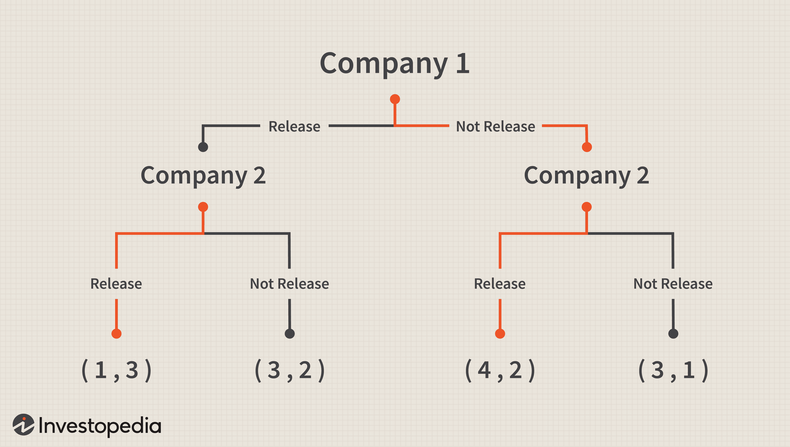

Algorithmic trading, or algo-trading, involves deploying computer algorithms to execute trades with enhanced speed and efficiency. These algorithms are designed to make swift decisions based on predetermined criteria, minimizing human intervention and maximizing the potential for profit. The fast-paced nature of financial markets makes this technology indispensable.

Game theory, offering a comprehensive mathematical framework for strategizing in competitive settings, aligns well with the objectives of algorithmic trading. It provides traders and algorithms with tools to analyze competitive interactions and develop strategies that optimize outcomes. Specifically, game theory helps in understanding the strategic behavior of market participants, enabling the prediction of moves by competitors, and hence, optimizing trading efficiency.

This article examines the application of game theory in algorithmic trading, focusing on enhancing decision-making and optimizing strategies. Critical game-theoretical concepts such as Nash Equilibrium, the prisoner’s dilemma, and zero-sum games are pivotal in creating trading algorithms that can anticipate and react to market dynamics efficiently. These concepts allow for the formulation of strategies in various trading scenarios, including market making, arbitrage, and high-frequency trading, where rapid responses to market changes are crucial.

The integration of game theory with advanced technologies such as artificial intelligence and machine learning is revolutionizing financial trading. AI-driven models incorporate game-theoretic principles to make algorithms smarter and more adaptable, allowing them to predict market movements and competitor actions with greater accuracy. Consequently, this fusion is enhancing the strategic capabilities of traders and improving efficiencies across the financial markets.

The technological advancements in algorithmic trading continue to evolve, offering promising opportunities for more sophisticated and ethical trading strategies. While challenges exist, particularly in terms of regulation and ethical considerations, the strategic insight provided by game theory remains invaluable in navigating the complexities of modern markets.

## Table of Contents

## Core Concepts of Game Theory in Trading

Game theory fundamentally underpins strategic decision-making in competitive environments such as financial markets, where the interactions of multiple players must be considered for optimal outcomes. Key elements of game theory applicable to trading include players, strategies, payoffs, and Nash Equilibrium.

Players in [algorithmic trading](/wiki/algorithmic-trading) encompass a broad spectrum, including individual traders, institutional investors, and sophisticated trading algorithms. Each player operates with the objective of optimizing their financial returns while considering the actions of other market participants. This requires an understanding of complex competitive dynamics and potential strategies employed by others.

Strategies in trading can vary significantly, ranging from straightforward algorithms executing simple buy or sell orders to advanced frameworks employing [machine learning](/wiki/machine-learning) models. These sophisticated models analyze vast datasets and adapt to market conditions in real-time, dynamically adjusting their strategies to maintain a competitive edge. For example, a basic strategy might involve [arbitrage](/wiki/arbitrage) opportunities, whereas more advanced strategies might utilize predictive models to anticipate market movements or competitor actions.

The concept of payoffs in game theory directly relates to the financial returns achieved through these strategic decisions, typically measured by the profit and loss generated from trading activities. The performance of a strategy is frequently assessed by computational simulations and historical [backtesting](/wiki/backtesting) to estimate potential payoffs under various market scenarios.

Central to game theory is the Nash Equilibrium, which provides a solution concept representing stable states in a game where no player benefits by unilaterally changing their strategy if others maintain their current strategies. In the context of trading, this equilibrium can exemplify market conditions where players' strategies have led to a stable balance, minimizing incentives for any single participant to deviate independently. For instance, consider a duopoly in [market making](/wiki/market-making) where two competitors have adjusted their spreads to a level where neither party can profitably alter their position without inciting a less favorable response from the other. Mathematically, if $s_i$ is the strategy of player $i$ and $U_i$ is their payoff, a Nash Equilibrium occurs when $U_i(s_i^*, s_{-i}^*) \geq U_i(s_i, s_{-i}^*)$ for all $i$ and all strategies $s_i$.

These core concepts underline the strategic approaches in algorithmic trading, emphasizing the necessity for models that can predict and respond to competitor strategies, optimize payoff structures, and achieve strategic stabilities such as Nash Equilibrium. This framework not only enhances decision-making but also aids in the creation of more dynamic and robust trading environments.

## Applications in Algorithmic Trading

Algorithmic trading has found a valuable ally in game theory, which offers mathematical strategies designed to succeed in competitive environments. This interplay aids various trading strategies, refining decision-making processes and optimizing outcomes. Here’s how game theory specifically enhances several applications in algorithmic trading:

Market making is inherently a game of anticipation and swift responses, where [liquidity](/wiki/liquidity-risk-premium) providers strive to balance supply and demand efficiently. Game theory assists market makers by modeling competitive dynamics. By predicting competitors' potential actions, market makers can optimize order placements, ensuring liquidity is supplied without undue risk. For instance, if a market maker anticipates a competitor aggressively pricing a bid, adjusting their own bid slightly above can capture trades without entering a price war.

Arbitrage strategies thrive on the identification and exploitation of price discrepancies across different markets or financial instruments. Game theory affords an analytical edge by forecasting market participants' behavior, pinpointing opportunities before they are widely recognized. For example, if two markets represent the same asset, a pricing anomaly might suggest buying in the undervalued market while selling in the overvalued one. Game theory helps predict when conditions are ripe for such interventions, preempting competitive responses.

High-frequency trading ([HFT](/wiki/high-frequency-trading-strategies)) involves executing numerous trades at lightning speed, seeking minute profit margins. Game theory provides HFT algorithms with strategic foresight, essential for negotiating the swift and competitive nature of these trades. Traders adjust strategies in real-time by accounting for others' moves and potential game-theoretic equilibria, thereby optimizing gains from short-term market behavior. A Python-based HFT system might incorporate game-theoretic models to adaptively bid or ask, recalibrating its approach based on the incoming flow of competitor orders.

Predatory trading capitalizes on competitors’ weaknesses, such as overexposure or poor risk management. Here, game theory might model scenarios where traders induce market movements that disadvantage competitors. While effective, this approach raises ethical concerns and potential market manipulation issues, emphasizing the delicate balance between strategic brilliance and moral boundaries.

Algorithmic collusion represents a darker aspect of automated trading, where algorithms implicitly align their actions to manipulate market prices or volumes. Regulators are increasingly alert to this risk, and game theory plays a crucial role in detecting such behaviors. By analyzing trading patterns and identifying non-competitive strategic alignments, game-theoretic models assist in regulatory oversight, ensuring market integrity is preserved.

In sum, the application of game theory in algorithmic trading aids in crafting strategies that are not only well-informed and adaptable but also ethically viable, catering to both competitive edge and regulatory compliance.

## Integration with Technology

The integration of [artificial intelligence](/wiki/ai-artificial-intelligence) (AI) and machine learning with game theory is significantly transforming algorithmic trading by enabling the development of more sophisticated and adaptable algorithms. This synthesis allows for enhanced predictive capabilities where AI systems and machine learning models incorporate game-theoretical principles to more accurately forecast the actions of market competitors and predict market movements. 

Machine learning algorithms, equipped with game-theoretic frameworks, can strategically assess and respond to the dynamic behaviors of various market players. These models employ [reinforcement learning](/wiki/reinforcement-learning) techniques where an algorithm learns optimal strategies through trial and error, continually adjusting based on received feedback. Such algorithms can be expressed through a utility function, $U(a)$, aiming to maximize the expected payoff, $E[P]$:

$$
U(a) = \max E[P]
$$

where $a$ is the set of strategic actions taken by the algorithm.

Quantum computing further extends the application of game theory in trading, offering unprecedented computational power to solve more intricate financial problems. Quantum algorithms have the potential to revolutionize the way game-theoretic models are constructed and used, particularly by handling vast datasets and complex calculations simultaneously. Quantum systems could tackle problems like portfolio optimization and risk assessment with greater efficiency than classical computing systems, using concepts such as superposition and entanglement to consider multiple outcomes at once.

Emerging technologies continually expand the strategic capabilities achieved through game-theoretical approaches in financial markets. Innovations such as blockchain and decentralized finance (DeFi) platforms present new data sources and strategic layers. Python libraries such as TensorFlow and PyTorch allow for the creation of advanced analytical models that integrate game-theory insights to optimize trading strategies.

Overall, the fusion of AI, machine learning, and quantum computing with game theory is not only enhancing the strategic prowess of algorithmic trading but also driving innovations that redefine competitive advantage in financial markets. As these technologies evolve, they promise to offer increasingly nuanced and effective solutions for complex trading scenarios.

## Challenges and Considerations

Regulatory challenges are significant in the context of game theory-influenced trading strategies, primarily due to the possibility of market manipulation. Game theory, with its emphasis on strategic interaction, can lead to behaviors such as collusion and predatory pricing. These behaviors can undermine market fairness and transparency, prompting financial regulators to closely monitor trading algorithms that might exploit these tactics.

Ethical considerations are paramount, particularly with predatory trading tactics that exploit other market participants' weaknesses. Such tactics can erode investor confidence and destabilize markets. Trading strategies based on game theory must, therefore, ensure the maintenance of fair and competitive markets, avoiding actions that could be deemed exploitative or detrimental to the integrity of trading ecosystems.

The implementation of game-theory-based trading algorithms requires substantial computational resources. These algorithms often involve complex simulations and the use of advanced machine learning models, which demand significant processing power and data storage capabilities. This requirement poses a technical challenge, especially for firms with limited computational infrastructure, as they strive to compete in algorithmic trading effectively.

Market unpredictability presents a further challenge to the effective application of game theory in trading. Financial markets are influenced by a multitude of factors, some of which are impossible to predict or adequately model. Game theory models rely on assumptions about player behavior and market conditions, and they may not be fully equipped to handle unexpected events or shifts. As a result, continuous adaptation and recalibration of these models are necessary to ensure their relevance and effectiveness in dynamic market environments.

To summarize, the application of game theory in algorithmic trading introduces challenges related to regulation, ethics, computational resources, and market unpredictability. Addressing these challenges is critical to ensure that game-theory-based strategies contribute positively to the trading landscape, enhancing rather than compromising market stability and fairness.

## Conclusion

Game theory provides a robust framework for developing sophisticated trading strategies in algorithmic trading by modeling competitive environments where [agents](/wiki/agents) make strategic decisions. This mathematical approach offers valuable insights into the interactions between market participants, enabling algorithm designers to create sophisticated models that account for various market conditions and competitor behaviors. By incorporating concepts such as Nash Equilibrium, traders can identify stable strategy profiles where no player has an incentive to deviate unilaterally, fostering a deeper understanding of market dynamics.

As technology advances, the integration of game theory into trading strategies promotes innovations and efficiencies, allowing traders to harness the computational power of modern algorithms. Techniques such as machine learning and artificial intelligence complement game theory by providing the tools to process large datasets and enhance predictive accuracy. For instance, algorithms can be designed to adapt based on historical data and competitor actions, continuously refining strategies to optimize market outcomes.

Understanding strategic interactions among market participants is crucial for developing more ethical and profitable trading algorithms. By acknowledging the potential for predatory practices and market manipulation, traders can employ game-theoretic models to establish fair and transparent trading environments. This ethical dimension not only safeguards market integrity but also enhances reputation and trust among investors.

The continued evolution of game-theoretic methodologies promises to strengthen traders' strategic capabilities in navigating complex market environments. As emerging technologies such as quantum computing become more prevalent, they offer the potential to solve increasingly complex game-theoretic models, paving the way for revolutionary advancements in the field. This ongoing development ensures that traders remain equipped to tackle the challenges of modern financial markets effectively, aligning with both regulatory standards and ethical considerations.

In conclusion, the fusion of game theory with advanced trading technologies holds the key to unlocking new efficiencies and innovations, empowering traders to adapt and thrive in a rapidly changing financial landscape. The strategic use of these methodologies not only promises enhanced profitability but also promotes a more sustainable and equitable trading ecosystem.

## References & Further Reading

[1]: Osborne, M. J., & Rubinstein, A. (1994). ["A Course in Game Theory"](https://sites.math.rutgers.edu/~zeilberg/EM20/OsborneRubinsteinMasterpiece.pdf). MIT Press.

[2]: Narang, R. K. (2013). ["Inside the Black Box: A Simple Guide to Quantitative and High-Frequency Trading"](https://onlinelibrary.wiley.com/doi/book/10.1002/9781118662717). Wiley Finance.

[3]: Lopez de Prado, M. (2018). ["Advances in Financial Machine Learning"](https://www.amazon.com/Advances-Financial-Machine-Learning-Marcos/dp/1119482089). Wiley.

[4]: Von Neumann, J., & Morgenstern, O. (1944). ["Theory of Games and Economic Behavior"](https://www.jstor.org/stable/j.ctt1r2gkx). Princeton University Press.

[5]: Bertsimas, D., & Lo, A. W. (1998). ["Optimal control of execution costs"](http://web.mit.edu/dbertsim/www/papers/Finance/Optimal%20control%20of%20execution%20costs.pdf). Journal of Financial Markets, 1(1), 1-50.

[6]: Jansen, S. (2018). ["Machine Learning for Algorithmic Trading"](https://github.com/stefan-jansen/machine-learning-for-trading). Packt Publishing.

[7]: Myerson, R. B. (1997). ["Game Theory: Analysis of Conflict"](https://www.jstor.org/stable/j.ctvjsf522). Harvard University Press.

[8]: Yarom, Y., & Fuller, A. (2011). ["Game Theory and Artificial Intelligence in Financial Markets"](https://www.researchgate.net/publication/356838079_GAMES_game_theory_and_artificial_intelligence). Springer.