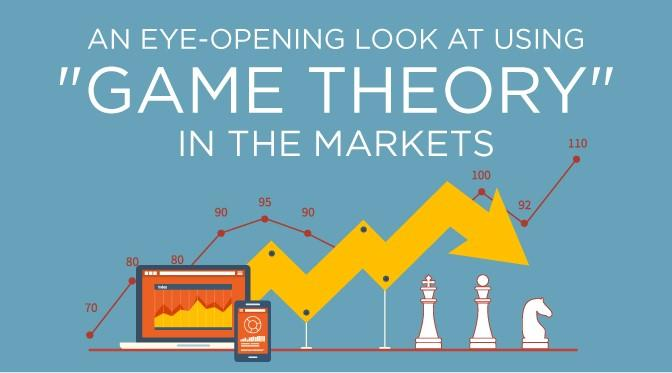

## Table of Contents

## What is game theory and how does it apply to trading?

Game theory is a way of studying how people make decisions when they are in a situation where what they do affects others, and what others do affects them. It's like a game where players choose strategies to win, but winning depends on what everyone else does too. In game theory, people try to predict what others will do and then make their own best move based on those predictions.

In trading, game theory can be useful because trading is a lot like a game. Traders are always trying to guess what other traders will do next. They look at things like market trends and news to make their guesses. If a trader can predict what others will do, they can buy or sell at the right time to make more money. For example, if a trader thinks others will start buying a certain stock because of good news, they might buy it first to get it at a lower price before it goes up. So, game theory helps traders think about the whole market as a big game and make smarter moves.

## Can you explain the basic concepts of game theory relevant to trading?

Game theory is all about understanding how people make choices when they're playing a game where everyone's moves affect each other. In trading, this means thinking about what other traders might do and how that affects your own decisions. For example, if you think other traders will start buying a stock because of good news, you might want to buy it first to get a better price. This is called anticipating the moves of others, which is a big part of game theory.

Another important idea in game theory is the concept of Nash equilibrium. This is a situation where no trader can do better by changing their strategy if everyone else keeps their strategy the same. In trading, this might mean finding a point where everyone's buying and selling patterns balance out, and no one can gain an advantage by switching what they're doing. Understanding Nash equilibrium can help traders see when the market might be stable or when it might be about to change.

Lastly, game theory also looks at zero-sum games, where one trader's gain is another's loss. In trading, this can be seen in situations where traders are competing directly against each other, like in a stock market where one person's profit from selling a stock is another's loss from buying it at a higher price. Recognizing these zero-sum situations can help traders decide when to enter or [exit](/wiki/exit-strategy) trades to maximize their gains.

## What are some common game theory models used in trading?

One common game theory model used in trading is the Prisoner's Dilemma. This model helps traders understand situations where they have to decide whether to cooperate or compete with other traders. Imagine two traders who could either work together to make the market stable or try to outsmart each other for personal gain. If both choose to compete, they might end up worse off than if they had cooperated. This model shows traders that sometimes working together can lead to better outcomes for everyone involved.

Another model is the Stag Hunt, which looks at how traders can work together to achieve a big goal, like making a big profit from a rising market. In this model, traders have to decide if they should trust each other to go after a big reward (the stag) or play it safe and go for smaller, surer gains (the hare). If everyone trusts each other and goes for the stag, they can all win big. But if some traders don't trust the others and go for the hare instead, they might miss out on the bigger reward. This model helps traders think about the importance of trust and cooperation in the market.

A third model is the Hawk-Dove Game, which helps traders understand when to be aggressive or cautious in their trading strategies. In this game, 'hawks' are aggressive traders who go for big gains but also face big risks, while 'doves' are more cautious and go for smaller, safer gains. The best strategy depends on what other traders are doing. If there are too many hawks, the market can become risky and unstable, but if there are too many doves, opportunities for big gains might be missed. This model helps traders decide when to take risks and when to play it safe based on the behavior of others in the market.

## How can game theory help in understanding market behavior?

Game theory helps traders understand market behavior by showing how traders make decisions based on what they think others will do. Imagine a big game where everyone is trying to guess what the other players will do next. In the stock market, traders look at things like news and trends to predict if others will buy or sell. If a trader thinks others will start buying a stock because of good news, they might buy it first to get it at a lower price before it goes up. This way, game theory helps traders see the market as a big game and make smarter moves by thinking about what everyone else might do.

Another way game theory helps is by showing how traders can work together or compete. Sometimes, traders can make more money if they cooperate, like in the Prisoner's Dilemma model. If everyone works together, the market can be more stable, and everyone can benefit. But if traders compete too much, it can lead to big risks and losses. Game theory models like the Stag Hunt and Hawk-Dove Game also show how trust and the right balance between being aggressive and cautious can affect market behavior. By understanding these models, traders can better predict when the market might be stable or when it might change, helping them make better trading decisions.

## What is the Nash Equilibrium and how does it apply to trading strategies?

Nash Equilibrium is a concept from game theory that explains a situation where no one can do better by changing their strategy if everyone else keeps their strategy the same. Imagine you and your friends are playing a game, and you've all picked a way to play. If no one can win more by changing their way of playing, while everyone else keeps playing the same, you're at a Nash Equilibrium. In trading, this means finding a point where everyone's buying and selling patterns balance out, and no one can gain an advantage by switching what they're doing.

In the stock market, Nash Equilibrium can help traders understand when the market might be stable or when it might be about to change. For example, if everyone is buying and selling in a certain way and no one can do better by changing their strategy, the market is in a Nash Equilibrium. Traders can use this idea to predict when the market might stay the same or when it might shift, helping them decide when to buy or sell. By understanding Nash Equilibrium, traders can make smarter decisions and avoid making moves that might upset the balance of the market.

## How can traders use game theory to anticipate competitor moves?

Traders can use game theory to anticipate competitor moves by thinking about what other traders might do and how that affects their own decisions. Imagine the stock market as a big game where everyone is trying to guess what others will do next. Traders look at things like market trends and news to make their guesses. If a trader thinks others will start buying a certain stock because of good news, they might buy it first to get it at a lower price before it goes up. This is like playing a game where you try to outsmart others by predicting their moves.

Game theory models like the Prisoner's Dilemma, Stag Hunt, and Hawk-Dove Game can also help traders anticipate competitor moves. For example, in the Prisoner's Dilemma, traders can decide whether to work together or compete. If they think others will cooperate, they might do the same to keep the market stable. In the Stag Hunt, traders might choose to trust each other to go after big profits, or play it safe if they think others won't cooperate. And in the Hawk-Dove Game, traders can decide to be aggressive or cautious based on what they think others will do. By understanding these models, traders can better predict what competitors might do and adjust their strategies accordingly.

## What are zero-sum games in the context of trading?

Zero-sum games in trading are situations where one trader's gain is another trader's loss. Imagine you and a friend are playing a game where if you win money, your friend loses the same amount, and if your friend wins, you lose. In trading, this can happen when traders are directly competing against each other. For example, if you sell a stock at a high price, the person buying it from you pays more and might lose money if the stock price goes down. So, your gain is their loss.

Understanding zero-sum games can help traders know when they are in a situation where they need to outsmart others to make money. If the market is acting like a zero-sum game, traders might focus more on what others are doing and try to predict their moves to get an advantage. This way, they can buy or sell at the right time to make a profit while others might lose out.

## How does the Prisoner's Dilemma relate to trading decisions?

The Prisoner's Dilemma is a game theory model that can help traders understand when they should work together or compete with other traders. Imagine two traders who can either cooperate to keep the market stable or try to outsmart each other for personal gain. If both choose to compete, they might end up worse off than if they had cooperated. For example, if both traders try to sell a stock at the same time to make a quick profit, they might drive the price down so much that they both lose money. But if they cooperate and sell slowly, they might keep the price stable and both make a profit.

In trading, the Prisoner's Dilemma shows traders that sometimes working together can lead to better outcomes for everyone. If traders think others will cooperate, they might choose to do the same to avoid big losses. This model helps traders see the benefits of cooperation and understand when it might be better to work with others instead of competing against them. By thinking about the Prisoner's Dilemma, traders can make smarter decisions about when to buy or sell based on what they think other traders will do.

## What role does auction theory play in trading markets?

Auction theory is a part of game theory that helps traders understand how prices are set in markets where people buy and sell things. In trading, auctions happen all the time, like when people bid to buy stocks or when sellers try to get the best price for what they're selling. Auction theory helps traders see how different kinds of auctions work, like English auctions where the price goes up, or Dutch auctions where the price starts high and goes down. By understanding these auctions, traders can make better guesses about what prices might be and when to buy or sell.

Auction theory also helps traders understand how people behave in auctions. For example, traders might try to figure out if others will bid high or low, and then decide their own strategy. If a trader thinks others will bid high for a stock because of good news, they might bid high too to make sure they get it. Or, if they think others will bid low, they might wait for a better price. By using auction theory, traders can predict what others might do and make smarter moves in the market.

## How can game theory be used to develop trading algorithms?

Game theory can help traders make better trading algorithms by showing them how to predict what other traders might do. Imagine a trading algorithm as a smart computer program that buys and sells stocks. Game theory can help this program guess what other traders will do next by looking at things like market trends and news. For example, if the algorithm thinks other traders will start buying a stock because of good news, it might buy the stock first to get it at a lower price before it goes up. This way, the algorithm can make smarter decisions and maybe make more money.

Game theory models like the Prisoner's Dilemma, Stag Hunt, and Hawk-Dove Game can also help trading algorithms decide what to do. In the Prisoner's Dilemma, the algorithm might decide whether to work with other traders or compete against them. If it thinks others will cooperate, it might do the same to keep the market stable. In the Stag Hunt, the algorithm might choose to trust other traders to go after big profits, or play it safe if it thinks others won't cooperate. And in the Hawk-Dove Game, the algorithm can decide to be aggressive or cautious based on what it thinks others will do. By using these models, trading algorithms can better predict what competitors might do and adjust their strategies to make the best moves.

## What advanced game theory strategies can be applied to high-frequency trading?

High-frequency trading ([HFT](/wiki/high-frequency-trading-strategies)) is like a super fast game where traders use computers to buy and sell stocks very quickly. Game theory can help these traders make better guesses about what other traders will do next. For example, in HFT, traders might use a model called the Prisoner's Dilemma to decide if they should work with other traders or try to beat them. If they think others will cooperate and not make big, sudden moves, they might do the same to keep the market stable. But if they think others will try to outsmart them, they might use their fast computers to buy or sell first and make a quick profit.

Another useful model for HFT is the Hawk-Dove Game, which helps traders decide when to be aggressive or cautious. In HFT, traders can use their fast computers to be very aggressive and make lots of quick trades, hoping to beat others to the punch. But if too many traders are being aggressive, it can make the market risky and unstable. So, traders might use the Hawk-Dove Game to decide if they should be a 'hawk' and trade aggressively, or a 'dove' and trade more cautiously, based on what they think others will do. By understanding these game theory strategies, HFT traders can make smarter, faster decisions and maybe make more money.

## How does game theory integrate with behavioral economics in trading scenarios?

Game theory and behavioral economics both help traders understand how people make choices in the market. Game theory looks at how traders make decisions based on what they think others will do. It's like a big game where everyone is trying to guess what the other players will do next. Traders use game theory to predict if others will buy or sell, and then make their own moves. For example, if a trader thinks others will start buying a stock because of good news, they might buy it first to get it at a lower price before it goes up.

Behavioral economics adds another layer by looking at how people's feelings and habits affect their trading choices. Sometimes, traders don't always make the best decisions because they can be influenced by emotions like fear or greed. Behavioral economics helps traders understand these human behaviors and how they can lead to mistakes in the market. By combining game theory with behavioral economics, traders can better predict what others might do, not just based on logic, but also on how people might feel or react. This can help traders make smarter decisions by considering both the strategies of others and their emotional responses.

## How can we achieve integration with technology?

The integration of [artificial intelligence](/wiki/ai-artificial-intelligence) (AI) and [machine learning](/wiki/machine-learning) with game theory is significantly transforming [algorithmic trading](/wiki/algorithmic-trading) by enabling the development of more sophisticated and adaptable algorithms. This synthesis allows for enhanced predictive capabilities where AI systems and machine learning models incorporate game-theoretical principles to more accurately forecast the actions of market competitors and predict market movements. 

Machine learning algorithms, equipped with game-theoretic frameworks, can strategically assess and respond to the dynamic behaviors of various market players. These models employ [reinforcement learning](/wiki/reinforcement-learning) techniques where an algorithm learns optimal strategies through trial and error, continually adjusting based on received feedback. Such algorithms can be expressed through a utility function, $U(a)$, aiming to maximize the expected payoff, $E[P]$:

$$
U(a) = \max E[P]
$$

where $a$ is the set of strategic actions taken by the algorithm.

Quantum computing further extends the application of game theory in trading, offering unprecedented computational power to solve more intricate financial problems. Quantum algorithms have the potential to revolutionize the way game-theoretic models are constructed and used, particularly by handling vast datasets and complex calculations simultaneously. Quantum systems could tackle problems like portfolio optimization and risk assessment with greater efficiency than classical computing systems, using concepts such as superposition and entanglement to consider multiple outcomes at once.

Emerging technologies continually expand the strategic capabilities achieved through game-theoretical approaches in financial markets. Innovations such as blockchain and decentralized finance (DeFi) platforms present new data sources and strategic layers. Python libraries such as TensorFlow and PyTorch allow for the creation of advanced analytical models that integrate game-theory insights to optimize trading strategies.

Overall, the fusion of AI, machine learning, and quantum computing with game theory is not only enhancing the strategic prowess of algorithmic trading but also driving innovations that redefine competitive advantage in financial markets. As these technologies evolve, they promise to offer increasingly nuanced and effective solutions for complex trading scenarios.

## References & Further Reading

[1]: Osborne, M. J., & Rubinstein, A. (1994). ["A Course in Game Theory"](https://sites.math.rutgers.edu/~zeilberg/EM20/OsborneRubinsteinMasterpiece.pdf). MIT Press.

[2]: Narang, R. K. (2013). ["Inside the Black Box: A Simple Guide to Quantitative and High-Frequency Trading"](https://onlinelibrary.wiley.com/doi/book/10.1002/9781118662717). Wiley Finance.

[3]: Lopez de Prado, M. (2018). ["Advances in Financial Machine Learning"](https://www.amazon.com/Advances-Financial-Machine-Learning-Marcos/dp/1119482089). Wiley.

[4]: Von Neumann, J., & Morgenstern, O. (1944). ["Theory of Games and Economic Behavior"](https://www.jstor.org/stable/j.ctt1r2gkx). Princeton University Press.

[5]: Bertsimas, D., & Lo, A. W. (1998). ["Optimal control of execution costs"](http://web.mit.edu/dbertsim/www/papers/Finance/Optimal%20control%20of%20execution%20costs.pdf). Journal of Financial Markets, 1(1), 1-50.

[6]: Jansen, S. (2018). ["Machine Learning for Algorithmic Trading"](https://github.com/stefan-jansen/machine-learning-for-trading). Packt Publishing.

[7]: Myerson, R. B. (1997). ["Game Theory: Analysis of Conflict"](https://www.jstor.org/stable/j.ctvjsf522). Harvard University Press.

[8]: Yarom, Y., & Fuller, A. (2011). ["Game Theory and Artificial Intelligence in Financial Markets"](https://www.researchgate.net/publication/356838079_GAMES_game_theory_and_artificial_intelligence). Springer.