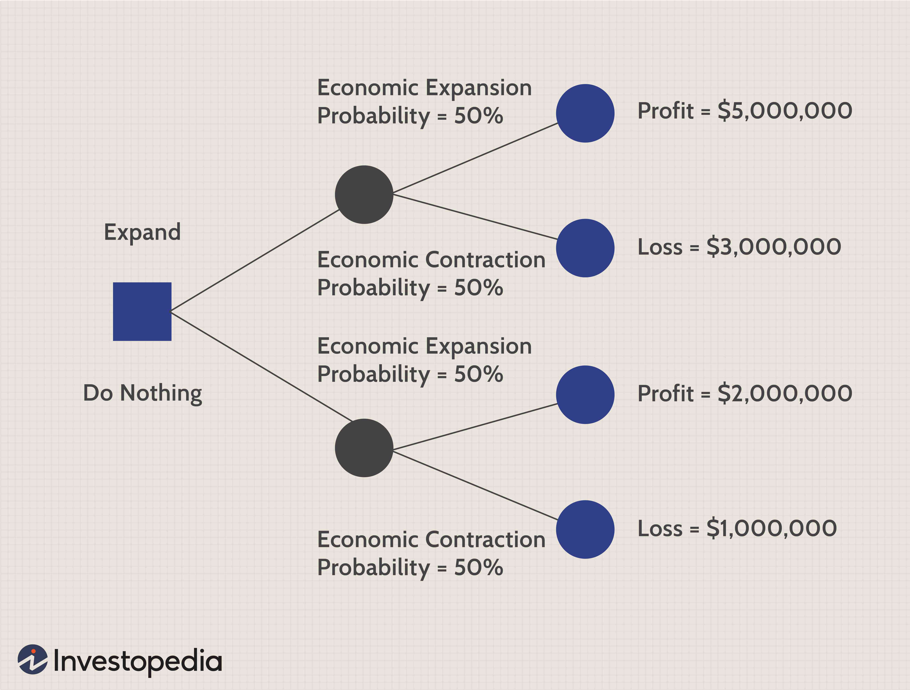

In the rapidly evolving world of finance, strategic decision-making is more crucial than ever. The financial markets are characterized by their complexity and volatility, demanding sophisticated tools and methodologies to navigate successfully. Among the various approaches that have gained prominence, game theory and algorithmic trading stand out as powerful instruments for enhancing decision-making strategies.

Game theory, originally developed to understand economic behaviors and interactions, provides a structured framework for analyzing strategic interactions among rational decision-makers. This analytical framework assists in predicting and interpreting the actions of competitors within the marketplace, enabling traders to optimize their strategies effectively. Concepts such as Nash equilibrium and zero-sum games offer valuable insights into how participants can expect to act when engaged in competitive or cooperative scenarios.



Algorithmic trading, on the other hand, represents a technological innovation that automates trading processes through the use of sophisticated algorithms. These systems are capable of processing vast amounts of market data with speed and precision unmatched by human traders. Algorithmic trading strategies, such as statistical arbitrage, trend following, and market making, play a crucial role in ensuring disciplined and consistent decision-making by minimizing emotional bias. The ability to analyze data and execute trades at high frequency has made algorithms indispensable in responding to rapid market dynamics.

This article explores the interplay between game theory and algorithmic trading and their influence on modern trading landscapes. By integrating the strategic insights provided by game theory with the computational efficiency of algorithms, traders and financial institutions can gain a competitive edge. Understanding these dynamics is key to capitalizing on market opportunities and mitigating risks in today's complex financial environment.

## Table of Contents

## Understanding Game Theory

Game theory is a mathematical framework that systematically studies strategic interactions among rational players. In scenarios where the outcome is dependent on the actions and decisions of multiple participants, game theory provides critical insights into these competitive situations. By considering the strategies of all involved entities, game theory helps in predicting possible outcomes and understanding the incentives driving each participant.

Key concepts within game theory include Nash equilibrium, zero-sum games, and cooperative versus non-cooperative games. The Nash equilibrium, named after John Nash, is a solution concept within non-cooperative games wherein no player can benefit by unilaterally changing their strategy if the strategies of the others remain unchanged. It represents a point where every participant's strategy is optimal given the strategies of others, hence reflecting a state of mutual best response. Mathematically, in a game with n players, a strategy profile $(s_1, s_2, \ldots, s_n)$ is a Nash equilibrium if for any player $i$,

$$
u_i(s_i, s_{-i}) \geq u_i(s_i', s_{-i})
$$

for every possible strategy $s_i'$ of player $i$, where $s_{-i}$ represents the strategies of all players except $i$.

Zero-sum games are another fundamental concept, characterized by scenarios where one participant’s gain is exactly balanced by the losses of others. This means that the total change in wealth or benefit in the game is zero. Examples include classical games like chess or poker, where the gain or loss of one player is equivalent to the loss or gain of the opposing player.

Cooperative games, meanwhile, allow for binding agreements between players, which can lead to outcomes that benefit all parties involved, unlike non-cooperative games where such agreements are not possible. These games focus on coalition formation and the redistribution of payoffs amongst players.

In finance, game theory has several practical applications, enabling traders to anticipate competitor actions and optimize their strategies accordingly. By modeling financial markets as games, traders are provided with a framework to make more sophisticated and informed decisions. For instance, through the lens of game theory, asset allocation strategies can be optimized by predicting competitors' likely responses to various market conditions.

Risk management strategies can also be enhanced using game theory by anticipating how competitors might react to external market shocks or policy changes. This predictive ability allows financial professionals to proactively adjust their risk exposure and capitalize on potential opportunities, minimizing adverse outcomes.

In conclusion, understanding these core concepts of game theory equips financial traders with the analytical tools necessary to navigate complex market dynamics. This mathematical approach clarifies strategic decision-making processes, enabling improved capital allocation and more effective risk management. As financial markets grow increasingly complex, the application of game theory remains an essential element for traders striving to maintain a competitive edge.

## Algorithmic Trading Explained

Algorithmic trading leverages computer algorithms to autonomously make and execute trading decisions. These algorithms, often embedded in sophisticated software, are capable of analyzing extensive datasets at speeds far beyond human capability. Such rapid data processing allows for the prompt identification of valuable trading opportunities, thus providing traders with a competitive advantage.  

A variety of strategies are employed in [algorithmic trading](/wiki/algorithmic-trading), each catering to specific market conditions and trader goals. Statistical [arbitrage](/wiki/arbitrage) involves exploiting price inefficiencies between correlated assets to make small, risk-adjusted profits. Traders utilizing this strategy depend heavily on statistical models to predict price anomalies before they are arbitraged away by the market.

Another prevalent strategy is [trend following](/wiki/trend-following), which capitalizes on the [momentum](/wiki/momentum) of asset price movements. Algorithms programmed with this strategy typically utilize technical indicators, such as moving averages, to identify the direction of price trends and execute trades aligned with these trends. This approach assumes that assets which have been moving in a particular direction will continue their trajectory in the short to medium term.

Market making, another common algorithmic strategy, involves providing [liquidity](/wiki/liquidity-risk-premium) to financial markets by quoting buy and sell prices for assets and profiting from the bid-ask spread. Algorithms perform rapid calculations to determine optimal pricing and timing, enabling market makers to respond to market fluctuations and secure profits from continuous trading.

Emotional biases that often impede human decision-making are significantly reduced through algorithmic trading. By following predefined parameters and conditions, algorithms execute trades consistently and objectively, thereby fostering discipline in trading strategies. This consistency not only improves the reliability of trading results but also helps mitigate risks associated with human error and impulsive behavior.

High-frequency trading ([HFT](/wiki/high-frequency-trading-strategies)), a subset of algorithmic trading, has emerged as a crucial component of modern financial markets. HFT systems execute large volumes of trades in fractions of a second, capitalizing on small price discrepancies across markets. The speed and precision of HFT algorithms make them indispensable for traders seeking to capitalize on fleeting market dynamics. 

Given the complexities and rapid changes within financial markets, algorithmic trading systems have become essential tools for institutional and individual traders alike. By continuously refining these algorithms with technological advancements and market intelligence, traders can maintain an edge in the highly competitive trading environment.

## Integrating Game Theory with Algorithmic Trading

Combining game theory with algorithmic trading enhances decision-making by enabling traders to incorporate strategic foresight into their operations. Game theory, a mathematical framework for analyzing strategic interactions, offers tools that allow traders to anticipate movements in the market and adjust their algorithms accordingly. This strategic anticipation stems from modeling the financial markets as a series of strategic games, where traders act as rational players seeking to optimize outcomes.

One of the central concepts in game theory that can be applied to algorithmic trading is the Nash Equilibrium. In a Nash Equilibrium, no player can benefit by changing their strategy while the other players keep theirs unchanged. By using this equilibrium concept, algorithmic traders can identify stable trading conditions where no single entity can easily alter the prevailing market conditions to its unilateral advantage. This helps in formulating algorithms that adjust effectively to maintain competitive advantage.

Moreover, dynamic game-theoretic models allow algorithms to adapt to competitive pressures and swift market changes. For instance, by analyzing repeated games, traders can develop strategies that evolve over time, learning from past interactions to optimize future decisions. This is particularly beneficial in high-frequency trading where the market environment can shift in milliseconds.

A practical application of game theory in algorithmic trading is the development of algorithms that simulate competitive 'games' against other market participants. By considering the potential moves of competitors, these algorithms predict possible market trajectories, enabling traders to decide on optimal strategies based on simulated outcomes. This is outlined in Python using libraries like `numpy` for matrix calculations and `scipy.optimize` for solving Nash Equilibria problems in imperfect-information games. For instance, solving a simple Nash Equilibrium could be implemented as follows:

```python
import numpy as np
from scipy.optimize import minimize

def payoff_matrix(strategy):
    # Example payoff matrix for P1 and P2
    return np.array([[3, 0], [5, 1]]) @ strategy

initial_strategy = np.array([0.5, 0.5])
result = minimize(lambda x: -payoff_matrix(x).sum(), initial_strategy, method='SLSQP', bounds=[(0, 1), (0, 1)])
optimal_strategy = result.x

print(f"Optimal Strategy: {optimal_strategy}")
```

This code segment demonstrates how one might start constructing basic strategic models using Python to find optimal strategies given simple payoff matrices. These integrative methods contribute to creating more intelligent trading algorithms that weigh both quantitative data and strategic insights, pushing the horizon of trading technologies. They lay the groundwork for developing systems that not only react to immediate market data but also anticipate the possible strategies of competitors, thereby optimizing decision-making in a sophisticated and competitive marketplace.

## Implications and Future Directions

The intersection of game theory and algorithmic trading is creating fertile ground for innovation within the finance sector. As technology continues to evolve, the potential to develop more nuanced and sophisticated strategic models and algorithms expands. These advancements can provide enhanced decision-making tools, enabling traders and financial institutions to gain deeper insights and react quickly to market changes. 

Artificial intelligence (AI) and [machine learning](/wiki/machine-learning) are poised to play pivotal roles in this evolution. By leveraging AI, algorithms can process and analyze vast datasets to uncover patterns and predict market movements with increasing accuracy. Machine learning techniques such as neural networks can refine trading strategies by learning from historical data and adapting to new information in real-time. This capability can lead to more predictive and responsive trading systems, reducing latency in reaction times and enhancing profitability.

However, as these systems grow in complexity and prevalence, they present regulatory challenges. The need for stringent oversight becomes increasingly important to ensure market integrity and prevent potential manipulative practices. Regulatory bodies may need to adapt existing frameworks or create new ones to address the unique challenges posed by these advanced systems. 

Looking ahead, research and development are likely to focus on enhancing the robustness, adaptability, and security of trading systems. Not only will future systems need to cope with the rapidly changing market conditions, but they must also be fortified against cybersecurity threats. This necessity requires a holistic approach encompassing both technological advancements and regulatory considerations.

In conclusion, the integration of game theory and algorithmic trading promises substantial growth and innovation opportunities. By continuously advancing these technologies, the financial sector can develop more sophisticated tools that provide a competitive advantage while ensuring market stability and security.

## Conclusion

Strategic decision-making in finance is progressing significantly with the integration of game theory and algorithmic trading. These two advanced concepts together provide a holistic approach, enabling traders and firms to better understand and exploit market opportunities. The application of game theory helps by offering a structured framework to predict and analyze competitive moves, while algorithmic trading automates and enhances the execution process, thereby eliminating human errors and biases.

The synergy of game theory and algorithmic trading is pivotal in securing a competitive edge for traders who adeptly implement these strategies. By utilizing game theory, traders can anticipate the moves of competitors and align their algorithms to respond effectively to market dynamics. This strategic foresight allows for the identification of optimal trading opportunities, thereby enhancing profitability and risk management.

Continuous innovation in the financial sector underscores the necessity for mastery in these tools. As technology evolves, strategic models and algorithms are expected to become increasingly sophisticated with the aid of [artificial intelligence](/wiki/ai-artificial-intelligence) and machine learning. These advancements will provide traders and investors with deeper analytical insights and more accurate predictions, further refining decision-making processes.

To successfully navigate modern finance's complexities and capitalize on emerging opportunities, staying informed about developments in game theory and algorithmic trading is crucial for traders and investors. As these technologies grow more common and intricate, understanding their implications and potential applications will be essential for achieving success amidst the challenges present in today's financial markets.

## References & Further Reading

[1]: Osborne, M. J., & Rubinstein, A. (1994). ["A Course in Game Theory"](https://sites.math.rutgers.edu/~zeilberg/EM20/OsborneRubinsteinMasterpiece.pdf). MIT Press.

[2]: Fama, E. F. (1970). ["Efficient Capital Markets: A Review of Theory and Empirical Work."](https://onlinelibrary.wiley.com/doi/abs/10.1111/j.1540-6261.1970.tb00518.x) Journal of Finance, 25(2), 383-417.

[3]: Lopez de Prado, M. (2018). ["Advances in Financial Machine Learning"](https://www.amazon.com/Advances-Financial-Machine-Learning-Marcos/dp/1119482089). Wiley.

[4]: Shreve, S. E. (2004). ["Stochastic Calculus for Finance I: The Binomial Asset Pricing Model"](https://link.springer.com/book/10.1007/978-0-387-22527-2). Springer Finance.

[5]: Nisan, N., Roughgarden, T., Tardos, E., & Vazirani, V. (2007). ["Algorithmic Game Theory"](https://www.cs.cmu.edu/~sandholm/cs15-892F13/algorithmic-game-theory.pdf). Cambridge University Press.