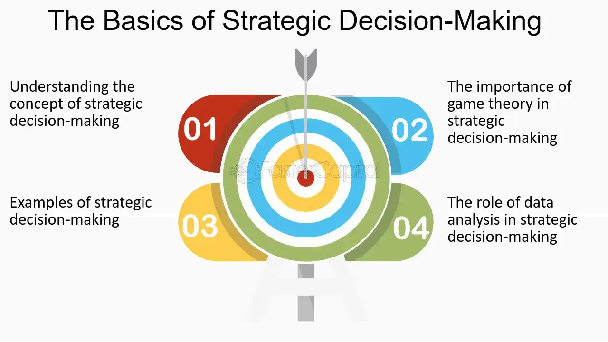

## Table of Contents

## What is game theory and how does it relate to decision-making?

Game theory is a way to study how people make choices when they are affected by what others do. It's like a math tool that helps us understand situations where the outcome depends on the actions of different people. Imagine playing a board game where your move depends on what you think the other player will do. Game theory helps us figure out the best moves in these situations.

In decision-making, game theory is really helpful because it shows us how to think about what others might do. For example, if you're deciding whether to start a new business, you need to think about what your competitors might do. Game theory helps you predict their moves and choose your strategy wisely. It's all about making smart choices by understanding how everyone's decisions fit together.

## Can you explain the concept of a 'game' in game theory?

In game theory, a 'game' is a situation where different people or groups make choices that affect each other. It's like a set of rules that everyone follows, and each person tries to do what's best for themselves. Think of it like playing a board game with friends, where what you do depends on what you think they'll do. In a game, everyone has their own goals, and the outcome depends on all the choices made by everyone involved.

A game in game theory can be simple or complex. It might involve just two people, like in a game of chess, or many people, like in an election. Each player has different options, called strategies, and they try to pick the one that will give them the best result. The key thing is that the choices are interdependent, meaning what one person does changes what's best for others. By studying these games, we can learn how to make better decisions in real life, whether it's in business, politics, or everyday situations.

## What are the basic elements of a game in game theory?

In game theory, a game has a few basic elements that help us understand how people make choices. First, there are the players, who are the people or groups making decisions. Each player has different options, called strategies, which are the choices they can make. For example, in a game of rock-paper-scissors, the strategies are to choose rock, paper, or scissors.

Next, there are the payoffs, which are the results or rewards that each player gets based on the choices made by everyone. The payoffs show what each player gains or loses depending on the combination of strategies chosen. Finally, there are the rules of the game, which tell us how the game is played and when it ends. The rules help everyone know what to expect and how to make their decisions. Together, these elements help us predict what people might do in different situations.

## How does the concept of Nash Equilibrium apply to decision-making?

Nash Equilibrium is a key idea in game theory that helps us understand how people make decisions when they depend on each other. It's a situation where no one can do better by changing their choice, as long as everyone else keeps their choices the same. Imagine you and your friend are deciding where to eat. If you both pick a place that makes you happy enough, and neither of you wants to switch to a different place alone, you're at a Nash Equilibrium. It shows us that sometimes, the best choice is to stick with what you have, even if it's not perfect, because changing could make things worse.

In decision-making, Nash Equilibrium helps us see what might happen when everyone is trying to do their best. It's useful in all sorts of situations, like business deals or political negotiations. For example, if two companies are setting prices for their products, they might find a Nash Equilibrium where neither wants to change their price because doing so would hurt their profits. Understanding Nash Equilibrium can help us predict what people will do and make better choices ourselves, knowing that others are also trying to make the best of their situation.

## What is the difference between zero-sum and non-zero-sum games?

In a zero-sum game, one player's gain is another player's loss. It's like a pie that stays the same size no matter what. If one person gets a bigger slice, someone else gets a smaller one. Think of a game like chess or poker. If you win, your opponent loses, and the total score stays the same. Zero-sum games are all about competition, where the goal is to do better than others.

In a non-zero-sum game, the total gain or loss can change. It's like a pie that can grow or shrink. If players work together, they might both end up with more than they started with. Or, if they don't work well together, they might both end up with less. Non-zero-sum games are about cooperation and competition mixed together. For example, in business, companies might find ways to work together to make more money for everyone, or they might compete and hurt each other's profits.

## Can you provide examples of common game theory strategies used in everyday decision-making?

One common game theory strategy used in everyday decision-making is the 'tit-for-tat' strategy. This is often used in situations where people need to cooperate over time, like in a relationship or at work. The idea is to start by being nice and doing what's good for the other person. If they do something good back, you keep being nice. But if they do something bad, you do the same back to them once, then go back to being nice. This helps keep things fair and encourages people to work together.

Another strategy is 'minimax', which people use when they want to be safe in a risky situation. Imagine you're playing a game where you want to lose the least amount of money possible. You think about the worst thing that could happen with each choice you make and pick the one where the worst outcome isn't too bad. This is useful in business when deciding how much to invest in something new, or even in sports when deciding how to play against a strong opponent. By focusing on the worst-case scenario, you make choices that keep you safe.

## How can game theory be applied to business negotiations and strategic planning?

Game theory can help a lot in business negotiations by helping people understand what the other side might do. Imagine you're trying to make a deal with another company. You need to think about what they want and what they might offer. Game theory gives you tools like Nash Equilibrium to predict what might happen if you make certain offers. If you can find a point where neither side wants to change their offer, you might reach a deal that works for everyone. This makes negotiations smoother because you can plan your moves based on what you think the other side will do.

In strategic planning, game theory helps businesses think about how to compete or work with others. For example, if two companies are trying to set prices for their products, they can use game theory to figure out the best price. They might find that if they both set their prices at a certain level, neither wants to change because it could hurt their profits. This is like finding a Nash Equilibrium. Game theory also helps businesses think about different ways to cooperate or compete, like deciding whether to enter a new market or form a partnership. By understanding these strategies, businesses can make smarter plans that help them succeed.

## What role does probability play in game theory and decision-making?

Probability is really important in game theory because it helps us guess what might happen next. When we're making decisions, we often don't know for sure what other people will do. So, we use probability to think about the chances of different things happening. For example, if you're playing a game and you think there's a 70% chance your friend will pick a certain move, you can plan your own move based on that. This helps you make better choices because you're thinking about all the possible outcomes and their chances.

In everyday decision-making, probability helps us weigh the risks and rewards. Let's say you're deciding whether to bring an umbrella when you go out. You check the weather forecast and see there's a 30% chance of rain. With that information, you can decide if it's worth carrying an umbrella. If the chance of rain was higher, you might be more likely to bring it. By using probability, we can make smarter decisions that take into account what might happen, even when we're not sure.

## How do repeated games differ from one-shot games in terms of strategy?

In one-shot games, players only play once and then the game is over. Because of this, they might act differently than if they knew they'd play again. They might take bigger risks or do things that help them win right now, even if it's not nice to the other player. For example, if you're playing rock-paper-scissors just once, you might pick rock because you think it's a good choice, even if it's not the best move overall.

In repeated games, players play the same game many times. This changes how they act because they know they'll see each other again. They might start being nicer or working together because they want to keep a good relationship going. A good example is the 'tit-for-tat' strategy in the prisoner's dilemma. If you keep playing with the same person, you might start by being nice, and then copy what they do. This can lead to more cooperation and better outcomes for everyone over time.

## What advanced game theory concepts like Bayesian games can enhance decision-making processes?

Bayesian games are a part of game theory that helps us make better decisions when we're not sure about what other people know or might do. In a regular game, everyone knows all the rules and what each other might choose. But in real life, we often don't have all the information. Bayesian games let us use probability to guess what other people might know or do, based on what we see or hear. For example, if you're bidding in an auction and you're not sure how much others value the item, you can use what you know about them to guess their bids and plan your own.

Using Bayesian games can really improve how we make choices. They help us think about what we're not sure about and make plans based on different possibilities. This is useful in business, where you might not know exactly what your competitors are thinking, or in everyday life, like deciding whether to trust someone based on their past actions. By considering these uncertainties and using probability, Bayesian games help us make smarter decisions that take into account the real world, where we don't always have all the facts.

## How can game theory help in understanding and predicting the behavior of competitors in a market?

Game theory can help businesses understand what their competitors might do in a market by looking at the choices and possible outcomes. Imagine you're a company selling a product, and you need to decide on a price. Game theory lets you think about what price your competitor might set and how that could affect your sales. By using ideas like Nash Equilibrium, you can find a point where neither you nor your competitor wants to change your prices because it would make things worse for both of you. This helps you predict what might happen and plan your moves to stay ahead.

Understanding competitors' behavior through game theory also involves thinking about different types of games, like zero-sum or non-zero-sum. In a zero-sum game, if your competitor gains more customers, you lose some. But in a non-zero-sum game, you might find ways to work together or grow the market so that both of you can do better. By considering these different scenarios, you can better guess what your competitors will do and make smarter decisions about your own strategies. This can lead to better outcomes for your business, whether it's through competition or cooperation.

## What are the limitations and criticisms of applying game theory to real-world decision-making scenarios?

Game theory can be really helpful for understanding how people make choices, but it has some limits. One big problem is that it often assumes everyone knows all the rules and what others might do. In real life, things are not so clear. People don't always have all the information, and they might not act in the best way. This makes it hard to use game theory perfectly in real situations because the models can be too simple compared to the messy real world.

Another issue is that game theory focuses a lot on what people should do to get the best result, but people don't always act logically. Emotions, feelings, and other things can make people choose differently than what game theory predicts. Critics also say that game theory can be too focused on competition and might not capture how people can work together in real life. So, while game theory gives us a good way to think about choices, it's not perfect and should be used carefully, knowing its limits.

## What is Understanding Game Theory?

Game theory is a mathematical framework that systematically studies strategic interactions among rational players. In scenarios where the outcome is dependent on the actions and decisions of multiple participants, game theory provides critical insights into these competitive situations. By considering the strategies of all involved entities, game theory helps in predicting possible outcomes and understanding the incentives driving each participant.

Key concepts within game theory include Nash equilibrium, zero-sum games, and cooperative versus non-cooperative games. The Nash equilibrium, named after John Nash, is a solution concept within non-cooperative games wherein no player can benefit by unilaterally changing their strategy if the strategies of the others remain unchanged. It represents a point where every participant's strategy is optimal given the strategies of others, hence reflecting a state of mutual best response. Mathematically, in a game with n players, a strategy profile $(s_1, s_2, \ldots, s_n)$ is a Nash equilibrium if for any player $i$,

$$
u_i(s_i, s_{-i}) \geq u_i(s_i', s_{-i})
$$

for every possible strategy $s_i'$ of player $i$, where $s_{-i}$ represents the strategies of all players except $i$.

Zero-sum games are another fundamental concept, characterized by scenarios where one participant’s gain is exactly balanced by the losses of others. This means that the total change in wealth or benefit in the game is zero. Examples include classical games like chess or poker, where the gain or loss of one player is equivalent to the loss or gain of the opposing player.

Cooperative games, meanwhile, allow for binding agreements between players, which can lead to outcomes that benefit all parties involved, unlike non-cooperative games where such agreements are not possible. These games focus on coalition formation and the redistribution of payoffs amongst players.

In finance, game theory has several practical applications, enabling traders to anticipate competitor actions and optimize their strategies accordingly. By modeling financial markets as games, traders are provided with a framework to make more sophisticated and informed decisions. For instance, through the lens of game theory, asset allocation strategies can be optimized by predicting competitors' likely responses to various market conditions.

Risk management strategies can also be enhanced using game theory by anticipating how competitors might react to external market shocks or policy changes. This predictive ability allows financial professionals to proactively adjust their risk exposure and capitalize on potential opportunities, minimizing adverse outcomes.

In conclusion, understanding these core concepts of game theory equips financial traders with the analytical tools necessary to navigate complex market dynamics. This mathematical approach clarifies strategic decision-making processes, enabling improved capital allocation and more effective risk management. As financial markets grow increasingly complex, the application of game theory remains an essential element for traders striving to maintain a competitive edge.

## References & Further Reading

[1]: Osborne, M. J., & Rubinstein, A. (1994). ["A Course in Game Theory"](https://sites.math.rutgers.edu/~zeilberg/EM20/OsborneRubinsteinMasterpiece.pdf). MIT Press.

[2]: Fama, E. F. (1970). ["Efficient Capital Markets: A Review of Theory and Empirical Work."](https://onlinelibrary.wiley.com/doi/abs/10.1111/j.1540-6261.1970.tb00518.x) Journal of Finance, 25(2), 383-417.

[3]: Lopez de Prado, M. (2018). ["Advances in Financial Machine Learning"](https://www.amazon.com/Advances-Financial-Machine-Learning-Marcos/dp/1119482089). Wiley.

[4]: Shreve, S. E. (2004). ["Stochastic Calculus for Finance I: The Binomial Asset Pricing Model"](https://link.springer.com/book/10.1007/978-0-387-22527-2). Springer Finance.

[5]: Nisan, N., Roughgarden, T., Tardos, E., & Vazirani, V. (2007). ["Algorithmic Game Theory"](https://www.cs.cmu.edu/~sandholm/cs15-892F13/algorithmic-game-theory.pdf). Cambridge University Press.