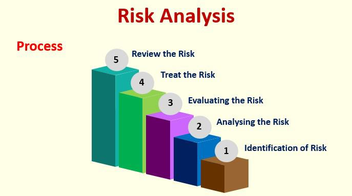

## Table of Contents

## What is gamification?

Gamification is when you take things that make games fun and use them in other areas, like school or work. This can make boring tasks more interesting. For example, you might earn points or badges for doing your homework or completing a project at work. This makes people want to do these tasks more because it feels like a game.

It's used in many places. Schools use it to help students learn better. Companies use it to make their employees work harder and feel more motivated. Apps and websites also use gamification to keep people interested and coming back. By adding elements like challenges, rewards, and leaderboards, these places become more exciting and engaging for everyone involved.

## What are the basic elements of gamification?

The basic elements of gamification include points, badges, and leaderboards. Points are like scores that you get for doing things. They show how well you're doing. Badges are like awards you earn for completing tasks or reaching goals. They make you feel proud and accomplished. Leaderboards show how you compare to others. They can make you want to do better and compete with others.

Another important element is challenges. Challenges are tasks that you need to complete. They can be simple or hard, but they always make things more exciting. Rewards are also key. Rewards are what you get for doing well or finishing a challenge. They can be things like more points, special badges, or even real prizes. These elements together make gamification fun and motivating.

Lastly, feedback and progress tracking are crucial. Feedback tells you how you're doing and what you can do better. It helps you learn and improve. Progress tracking shows you how far you've come and what's left to do. It keeps you motivated by showing your journey. All these elements work together to make tasks feel like a game, which makes them more enjoyable and engaging.

## How does gamification work in different contexts?

In schools, gamification makes learning fun. Teachers use points and badges to reward students for doing their homework or getting good grades. They might also use leaderboards to show who is doing well in class. This makes students want to learn more because it feels like a game. They can see their progress and feel proud when they earn rewards. It turns boring lessons into exciting challenges.

At work, gamification helps employees feel more motivated. Companies use it to make tasks more interesting. For example, they might give points for finishing projects on time or badges for learning new skills. Leaderboards can show who is doing the best work. This makes employees want to work harder and do better. It turns their daily tasks into a fun competition, which can make the workplace more exciting and productive.

Apps and websites also use gamification to keep people interested. They might give you points for using the app every day or badges for reaching certain goals. Leaderboards can show how you compare to other users. This makes you want to keep using the app or website because it feels like a game. It turns simple actions into fun challenges, which can make people more engaged and loyal to the app or website.

## What are some common examples of gamification in everyday life?

One common example of gamification in everyday life is fitness apps like Fitbit or Strava. These apps use points and badges to reward you for walking, running, or biking. They also have leaderboards where you can see how you compare to your friends. This makes exercising feel like a game, which can make you want to do it more often. You feel proud when you earn a new badge or reach a new goal, which keeps you motivated to stay active.

Another example is language learning apps like Duolingo. Duolingo uses points and levels to show how well you're doing. You earn badges for completing lessons and can see your progress on a leaderboard. This makes learning a new language feel like a fun challenge. It turns what could be a boring task into an exciting game, which can make you want to keep learning and improving your skills.

## What psychological principles underpin gamification?

Gamification works because it taps into basic human psychology. One key principle is the reward system. When we get points or badges, our brains release dopamine, a chemical that makes us feel good. This reward makes us want to keep doing the task to get more rewards. It's like getting a treat every time we do something well, which motivates us to keep going.

Another principle is the need for achievement. People like to feel like they are getting better at something. When gamification shows our progress and lets us earn badges or move up levels, it satisfies this need. It makes us feel proud and accomplished, which can push us to work harder. Leaderboards also play into our competitive nature, making us want to do better than others.

Lastly, gamification uses the power of feedback. When we get immediate feedback on our actions, it helps us learn and improve. This feedback loop keeps us engaged and motivated. By making tasks feel like games, gamification taps into these psychological principles to make boring tasks more fun and engaging.

## How can gamification be designed to enhance user engagement?

To enhance user engagement through gamification, it's important to use points, badges, and leaderboards in a way that feels rewarding and fun. Points should be given for completing tasks or reaching goals. This makes users feel like they are making progress and doing well. Badges can be special awards for doing something great or finishing a challenge. They make users feel proud and accomplished. Leaderboards let users see how they compare to others. This can make them want to do better and keep coming back to the game or app.

Another way to boost engagement is by adding challenges and rewards. Challenges should be exciting and make users want to try harder. They can be simple or hard, but they should always be fun. Rewards are what users get for doing well or finishing a challenge. They can be more points, special badges, or even real prizes. These rewards make users feel good and want to keep playing. By using these elements together, gamification can make tasks feel like a game, which keeps users engaged and coming back for more.

## What are the key metrics used to measure the success of gamification?

The success of gamification is measured by looking at how engaged users are. One key metric is user retention, which shows if people keep coming back to use the app or complete tasks. Another important metric is the level of participation, which measures how many users are actively taking part in the gamified activities. If more people are joining in and doing the tasks, it means the gamification is working well. Time spent on the app or task is also a good sign. If users are spending more time, it means they find it fun and engaging.

Another way to measure success is by looking at how well users are doing their tasks. This can be seen in the completion rates, which show how many users are finishing their challenges or goals. If more users are completing tasks, it means the gamification is motivating them. Progress tracking is also important. It shows how far users have come and if they are getting better at what they are doing. If users are making good progress, it means the gamification is helping them stay motivated and improve.

## What are the potential benefits of implementing gamification in a business or educational setting?

In a business setting, gamification can make work more fun and exciting. It can help employees feel more motivated to do their tasks. For example, they might get points or badges for finishing projects on time or learning new skills. This makes them want to work harder and do better. It can also make the workplace more enjoyable and friendly. When employees see their progress and compete on leaderboards, they feel proud and want to keep improving. This can lead to better productivity and a happier work environment.

In an educational setting, gamification can make learning more interesting for students. It turns boring lessons into fun challenges. Students might earn points or badges for doing their homework or getting good grades. This makes them want to learn more because it feels like a game. They can see their progress and feel proud when they earn rewards. It also helps them stay focused and engaged in class. When students are more motivated, they learn better and enjoy school more.

## What ethical considerations should be taken into account when using gamification?

When using gamification, it's important to think about fairness. Not everyone likes to compete or might feel bad if they don't do well on leaderboards. It's good to make sure everyone can join in and feel good about what they are doing. Also, it's not fair if some people get more rewards just because they have more time or money to spend on the game. Making sure everyone has the same chance is key.

Another thing to consider is privacy. When you use gamification, you might be collecting data about what people do. It's important to keep this information safe and not share it without asking. People should know what data is being collected and why. It's also important to make sure the game doesn't trick people into doing things they don't want to do. The game should be honest and clear about what it's for and what the rewards really mean.

## What are the potential risks and downsides of gamification?

One risk of gamification is that it might make people focus too much on the game part and forget about the real goals. For example, if students are just trying to earn points or badges, they might not really learn the lesson. They might just do the minimum to get the reward. This can make the whole thing less effective. Also, if the game is too hard or too easy, people might get bored or frustrated and stop trying.

Another downside is that gamification can create stress or make people feel bad about themselves. If someone is always at the bottom of the leaderboard, they might feel like they are not good enough. This can make them not want to try anymore. Also, some people might feel pressured to spend more time or money on the game to keep up with others. This can lead to problems like addiction or spending too much money. It's important to make sure the game is fun and fair for everyone.

## How can one mitigate the risks associated with gamification?

To make gamification safer and more fun, it's important to keep the focus on the real goals, not just the game part. For example, in school, make sure students are learning and not just trying to earn points. The game should be challenging but not too hard, so people don't get frustrated and give up. It should also not be too easy, so people don't get bored. By balancing the game well, you can help everyone stay interested and motivated without losing sight of what's important.

Another way to reduce risks is to make sure everyone feels good about themselves while playing. Don't let leaderboards make people feel bad if they are at the bottom. Instead, celebrate everyone's progress and achievements. Also, be careful about how much time and money people might spend on the game. Make sure it's not too much and that people can still enjoy other parts of their life. By keeping the game fair and fun for everyone, you can avoid problems like stress or addiction.

## What advanced strategies can be used to evolve gamification systems over time?

To keep gamification systems exciting and effective, you can change them over time by adding new challenges and rewards. As people get used to the game, you can make it harder or add new levels to keep them interested. You can also introduce new types of rewards, like special badges or real prizes, to make things more exciting. Listening to what users say and what they want can help you make the game better. By updating the game regularly, you can keep people coming back and enjoying it.

Another way to evolve gamification systems is by using data to see how people are playing. You can look at what parts of the game people like the most and what parts they don't like. This can help you make changes to make the game more fun. You can also use data to see if people are reaching their goals and if the game is helping them. By making the game better based on what you learn, you can keep it working well and keep people engaged.

## References & Further Reading

[1]: Zichermann, G., & Cunningham, C. (2011). ["Gamification by Design: Implementing Game Mechanics in Web and Mobile Apps."](https://books.google.com/books/about/Gamification_by_Design.html?id=Hw9X1miVMMwC) O'Reilly Media.

[2]: Huotari, K., & Hamari, J. (2012). ["Defining Gamification: A Service Marketing Perspective."](https://www.researchgate.net/publication/259841647_Defining_Gamification_-_A_Service_Marketing_Perspective) In Proceedings of the 16th International Academic MindTrek Conference.

[3]: Patel, N. (2017). ["How Gamification Works: Impulse Drive to Help Entrepreneurs and Marketers."](https://www.sciencedirect.com/science/article/pii/S1747938X19301058)

[4]: Gomber, P., Koch, J. A., & Siering, M. (2017). ["Digital Finance and FinTech: Current Research and Future Research Directions."](https://link.springer.com/content/pdf/10.1007/s11573-017-0852-x.pdf) Journal of Business Economics.

[5]: Skarzauskiene, A. (2015). ["Gamification as a Form of Encouraging Interest in Trading on the Stock Market in Poland."](https://www.sciencedirect.com/science/article/pii/S1747938X19301058) Journal of Management Studies.