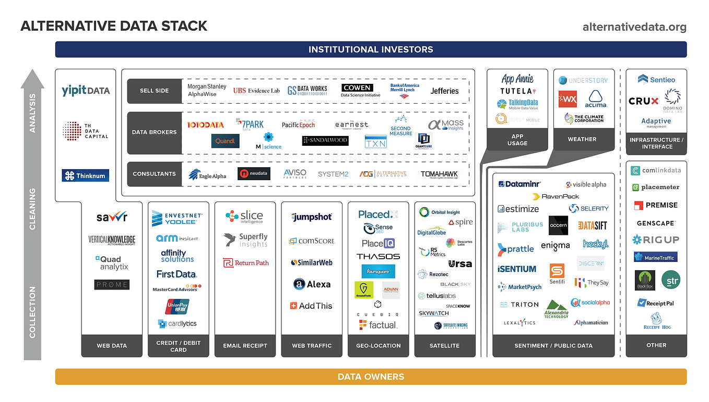

## Table of Contents

## What is alternative data in the context of gaming?

Alternative data in gaming refers to information that comes from sources outside of traditional data like sales figures or player counts. This can include things like social media posts, streaming data, or even in-game behavior patterns. Game developers and companies use this data to learn more about how players interact with their games, what they like or dislike, and how they can improve the gaming experience.

For example, by looking at social media, a company might see that players are talking a lot about a certain feature in the game. This can help them understand what players enjoy and want more of. Similarly, data from streaming platforms can show which games are popular and why, helping developers to make games that more people will want to play. This kind of data helps companies make better decisions and create games that are more fun and engaging for everyone.

## How is alternative data collected in the gaming industry?

Alternative data in the gaming industry is collected from many different places. Companies look at what people say on social media like Twitter and Instagram. They also watch what gamers do on streaming sites like Twitch and YouTube. This helps them see what games are popular and what players are talking about. Sometimes, they use special tools to gather this information automatically, making it easier to keep track of a lot of data.

Another way to collect alternative data is by looking at in-game behavior. Game developers can see how players move through the game, what they spend their time on, and what they buy. This information comes directly from the game itself and can tell developers a lot about what players enjoy or find difficult. By studying this data, companies can make their games better and more fun for everyone.

Overall, alternative data helps gaming companies understand their players better. They combine information from social media, streaming platforms, and in-game actions to get a full picture of what gamers want. This helps them make smarter choices about how to develop and improve their games.

## What types of alternative data are used in gaming?

Alternative data in gaming includes information from social media like Twitter and Instagram. Companies look at what people say about their games on these platforms. This helps them see what players like or don't like. They can also see what features players talk about a lot. This kind of data helps game makers understand what makes players happy or upset.

Another type of alternative data comes from streaming sites like Twitch and YouTube. Game companies watch what gamers do and say when they play games live. This shows them which games are popular and why. They can learn what parts of the game make players excited or bored. This information helps them make games that more people will enjoy.

In-game behavior is also a big source of alternative data. Game developers can see how players move through the game, what they spend their time on, and what they buy. This data comes right from the game and tells developers a lot about what players enjoy or find hard. By looking at this, companies can make their games better and more fun for everyone.

## Why is alternative data important for gaming companies?

Alternative data is really important for gaming companies because it helps them understand what players like and don't like. By looking at social media and streaming sites, they can see what people are saying about their games. This tells them what features players enjoy and what they want more of. It also helps them spot any problems or things that players don't like. This way, they can make their games better and keep players happy.

Another reason alternative data is important is that it helps companies see what's popular in the gaming world. They can watch what games are being streamed a lot on sites like Twitch and YouTube. This shows them which games are getting attention and why. By understanding these trends, gaming companies can make games that more people will want to play. This can help them be more successful and make more money.

## How can alternative data be used to enhance game development?

Alternative data can help game developers make better games by showing them what players like and don't like. By looking at what people say on social media and streaming sites, developers can find out which parts of their games are fun and which parts need to be improved. For example, if lots of players are talking about a certain feature, the developers might decide to add more of that kind of thing to the game. This helps them create games that are more fun for everyone because they know what players enjoy.

In-game behavior is another big source of alternative data that can improve game development. Developers can see how players move through the game, what they spend their time on, and what they buy. This tells them a lot about what players find easy or hard, and what keeps them coming back to play more. By using this data, game makers can make changes to the game to make it more interesting and enjoyable. This can lead to happier players and more successful games.

## What are the ethical considerations when using alternative data in gaming?

When using alternative data in gaming, companies need to think about privacy. They collect a lot of information from social media, streaming sites, and in-game actions. This means they need to be careful about how they use this data. They should make sure they are not sharing personal information about players without permission. It's important to follow laws and rules about data privacy to keep players safe and happy.

Another thing to consider is being fair. Companies should not use alternative data to trick or manipulate players. For example, they should not use what they learn to make games that make people spend more money than they want to. They need to use the data to make games better and more fun for everyone, not just to make more money. Being honest and clear about how they use data can help build trust with players.

## How does alternative data influence gaming market analysis?

Alternative data helps companies understand the gaming market better. By looking at what people say on social media and streaming sites, companies can see which games are popular and why. This helps them know what kinds of games players want to play. They can also see trends in the market, like if a certain type of game is becoming more popular. This information helps companies decide what new games to make and how to market them to reach more players.

In addition to social media and streaming data, in-game behavior gives companies a lot of useful information. They can see how players interact with the game, what they spend time on, and what they buy. This helps them understand what parts of the game are fun and what might need to be changed. By using this data, companies can make better decisions about how to improve their games and keep players happy. This can lead to more successful games and a better understanding of what players want in the gaming market.

## What are the challenges in collecting and analyzing gaming alternative data?

Collecting and analyzing gaming alternative data can be hard because there is so much information to look at. Companies need to gather data from many different places like social media, streaming sites, and in-game actions. This means they need special tools to help them collect all this data quickly and correctly. Sometimes, the data can be messy or hard to understand, so they need to clean it up and make sure it is accurate before they can use it. This can take a lot of time and effort.

Another challenge is making sure the data is useful and tells them something important. Not all data is the same, and some of it might not be helpful for understanding what players want. Companies need to be smart about which data they look at and how they use it. They also need to be careful about privacy and following rules about data. If they don't handle the data the right way, they could upset players or get in trouble. It's a big job to turn all this data into something that helps them make better games.

## Can you provide examples of successful use of alternative data in gaming?

One example of using alternative data successfully in gaming is how Riot Games used it to improve "League of Legends." They looked at what players said on social media and what they did in the game. They saw that players loved watching professional matches on streaming sites like Twitch. So, Riot Games made more events and added new ways to watch the game. This made players happier and helped "League of Legends" stay popular.

Another example is how Electronic Arts (EA) used alternative data to make "FIFA" better. They watched what players did in the game and what they talked about on social media. They found out that players really liked the Ultimate Team mode. So, EA made more updates and added new features to this mode. This made the game more fun and kept players coming back to play more.

## How does alternative data help in predicting gaming trends?

Alternative data helps companies see what gamers like and what's becoming popular. By looking at what people say on social media and what games they watch on streaming sites like Twitch, companies can spot trends early. For example, if lots of people start talking about a new type of game or a certain feature, companies can see that this might be the next big thing. This helps them plan what games to make next and how to make them fun for players.

In-game behavior also gives companies clues about what might be popular in the future. By watching what players do in the game, like what they spend time on or what they buy, companies can see what parts of the game are most exciting. If many players are enjoying a certain type of gameplay or spending money on specific items, this can show what trends might grow. Using this data, companies can make better decisions about how to develop their games to match what players will want in the future.

## What advanced techniques are used to process and interpret gaming alternative data?

To process and interpret gaming alternative data, companies use special computer programs called machine learning algorithms. These programs can look at lots of information from social media, streaming sites, and in-game actions very quickly. They can find patterns and trends that people might miss. For example, a machine learning program can read thousands of social media posts to see what players like or don't like about a game. This helps companies understand what is popular and what might become popular soon.

Another technique is called natural language processing (NLP). This helps computers understand what people are saying on social media and streaming sites. It can tell if players are happy, sad, or angry about a game. By using NLP, companies can learn a lot about how players feel about their games. This information helps them make better games that players will enjoy more. Both machine learning and NLP make it easier for companies to use alternative data to improve their games and stay ahead of trends.

## How can gaming companies integrate alternative data into their strategic planning?

Gaming companies can use alternative data to make smart choices about what games to make next. They look at what people say on social media and what games they watch on streaming sites. This helps them see what kinds of games players like and what might be popular soon. By understanding these trends, companies can plan to make games that match what players want. This can help them be more successful and make more money.

They also use in-game behavior data to improve their games. By watching how players move through the game, what they spend time on, and what they buy, companies can see what parts of the game are fun and what might need to be changed. This information helps them make better games that keep players happy and coming back for more. Using alternative data in this way helps companies make better decisions and stay ahead in the gaming world.

## How can SimilarWeb data be used to mine alpha in a case study?

Using SimilarWeb data to generate trading signals has gained traction as a strategy to harness web traffic and app activity metrics for stock market predictions. SimilarWeb provides comprehensive data on website traffic, including total visits, unique visitors, and engagement metrics like time spent on site. This information can be instrumental in assessing consumer interest and market trends, particularly when considering tech companies and app-based businesses.

In implementing a decision algorithm for trading, the primary focus lies in developing strategies to long (buy) or short (sell) stocks based on web traffic metrics. This involves using total visit counts and download data as indicators of a company's market performance. For instance, an increase in web traffic for an online retail company might suggest a positive market sentiment and potential revenue growth, translating into a buying signal. Conversely, a decrease may indicate declining interest, serving as a selling signal.

The decision algorithm may involve the following steps:
1. **Data Collection and Preprocessing**: Gather historical web traffic data and app download statistics over a defined period. Clean and normalize this data to ensure consistency.

2. **Signal Generation**: Compute average visit growth rates and download increases over time. Establish thresholds for significant changes that would trigger trading actions. For example:
$$
   \text{Growth Rate} = \frac{\text{Current Visits} - \text{Previous Visits}}{\text{Previous Visits}}

$$
   If the growth rate exceeds a predefined threshold, it could prompt a long position, while a substantial decline could lead to a short position.

3. **Backtesting**: This stage involves simulating the trading strategy over a historical period (e.g., three years) using past data. Assess the algorithm's performance by calculating key metrics such as return on investment (ROI), Sharpe ratio, and maximum drawdown.

4. **Evaluation of Performance**: Analyze the strategy's outcomes over the testing period to determine its effectiveness. In a successful instance, the strategy might reveal a notable return, outperforming traditional benchmarks.

During a three-year test period, the application of SimilarWeb data-driven strategies has demonstrated significant returns for select stocks, attributing precise market predictions to the accessible traffic data. By correlating web activity with stock prices, traders could optimize their investment decisions, adjusting their portfolios dynamically in response to emerging traffic trends. This approach emphasizes the potential of digital behavior insights as a powerful tool in modern [algorithmic trading](/wiki/algorithmic-trading).

## References & Further Reading

[1]: Bergstra, J., Bardenet, R., Bengio, Y., & Kégl, B. (2011). ["Algorithms for Hyper-Parameter Optimization."](https://proceedings.neurips.cc/paper/2011/file/86e8f7ab32cfd12577bc2619bc635690-Paper.pdf) Advances in Neural Information Processing Systems 24.

[2]: ["Advances in Financial Machine Learning"](https://www.amazon.com/Advances-Financial-Machine-Learning-Marcos/dp/1119482089) by Marcos Lopez de Prado

[3]: ["Evidence-Based Technical Analysis: Applying the Scientific Method and Statistical Inference to Trading Signals"](https://www.amazon.com/Evidence-Based-Technical-Analysis-Scientific-Statistical/dp/0470008741) by David Aronson

[4]: ["Machine Learning for Algorithmic Trading"](https://github.com/stefan-jansen/machine-learning-for-trading) by Stefan Jansen

[5]: ["Quantitative Trading: How to Build Your Own Algorithmic Trading Business"](https://books.google.com/books/about/Quantitative_Trading.html?id=j70yEAAAQBAJ) by Ernest P. Chan