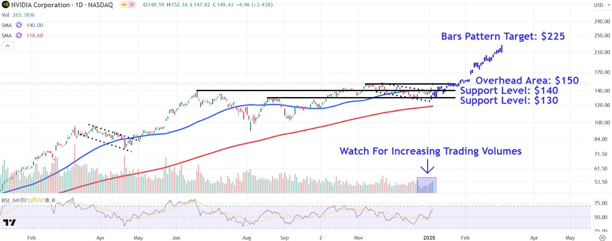

In the rapidly evolving world of financial markets, the quest for gaining a competitive edge is relentless. Algorithmic trading has transformed the trading landscape, leveraging vast amounts of data to make split-second decisions. This technique enables traders to execute orders at speeds and frequencies that would be impossible for a human trader. The core strength of algorithmic trading lies in its ability to process conventional datasets such as stock prices, trading volumes, and economic indicators. However, recent advancements have given rise to an intriguing trend: the integration of alternative data sources into algorithmic trading strategies.

Alternative data refers to unconventional information that has not traditionally been used for financial analysis. Encompassing a wide array of data types, from satellite images to social media activity, these sources offer fresh insights into market conditions and consumer behavior that are typically unseen in traditional datasets. Among these, an emerging interest is observed in the use of gaming industry data. The gaming sector generates enormous volumes of data through player interactions, in-game transactions, and community dialogues. This vast data repository provides real-time reflections of consumer interest and behavior trends, which are vital for predicting financial market shifts.



The integration of gaming alternative data into trading strategies raises the question of whether this is a fundamental game-changer or merely a fleeting trend. Understanding consumer behavior and market shifts through gaming data offers potential to better inform stock performance predictions, particularly of gaming companies and related sectors. The impacts on algorithmic trading could signify an innovative shift, driven by the powerful data analytics tools and machine learning techniques capable of processing such voluminous and complex datasets.

This article aims to explore the potential impact of gaming alternative data in algorithmic trading. As technological advancements make such data increasingly accessible and usable, it remains to be seen if the integration will provide a sustainable competitive advantage or simply remain a short-term trend in the financial markets.

## Table of Contents

## Understanding Alternative Data

Alternative data refers to a variety of information sources that are not typically used in standard financial analysis. These sources encompass a wide range of data types, including social media sentiment, credit card transactions, and geolocation data. Such data is characterized by its [volume](/wiki/volume-trading-strategy), velocity, and variety, and provides real-time or near-real-time insights that are not captured by traditional data sources like financial statements or [fundamental analysis](/wiki/fundamental-analysis).

Traders and financial analysts are increasingly leveraging [alternative data](/wiki/best-alternative-data) to potentially gain an edge over competitors. By analyzing unconventional data sources, they aim to uncover hidden insights and patterns that may not be immediately visible through traditional data analysis. For instance, social media platforms generate vast amounts of user-generated content, which can be analyzed for sentiment analysis to predict market trends or shifts in consumer behavior. Text mining and natural language processing (NLP) techniques are commonly employed to extract sentiments from social media data.

Credit card transactions provide another valuable source of alternative data. They offer real-time insights into consumer spending patterns which can be used to predict the financial performance of industries or specific companies. When aggregated, this data can offer a comprehensive view of economic activity, potentially forecasting shifts in demand for certain products or services.

Geolocation data, derived from GPS-enabled devices, allows analysts to track movement patterns that can give clues about consumer behavior or foot traffic in commercial areas. This data can be pivotal for sectors like retail or hospitality, where physical presence correlates directly with sales performance.

Technology has significantly expanded both the availability and scope of alternative data. Advances in data storage, processing power, and [machine learning](/wiki/machine-learning) algorithms have made it feasible to collect, process, and analyze massive volumes of data efficiently. Cloud computing solutions offer scalable resources that handle the analytics of large datasets, thus enabling traders and analysts to integrate alternative data into their decision-making processes effectively.

The integration of alternative data into trading strategies requires robust data analytics capabilities, often involving sophisticated tools and techniques such as [artificial intelligence](/wiki/ai-artificial-intelligence) (AI) and machine learning (ML) to derive actionable insights from complex datasets. As a result, while alternative data offers significant potential to inform trading decisions, it also necessitates a deep understanding of data science and big data technologies. 

The continuous evolution of these technological advancements is likely to further enhance the accessibility and utility of alternative data, potentially transforming how financial markets are analyzed and understood over the coming years.

## The Role of Gaming Data in Trading

The gaming industry produces substantial amounts of data through various channels, including player interactions, in-game purchases, and online community discussions. This plethora of data offers a dynamic lens to observe consumer behavior in real-time, providing insights into prevailing trends and potential market transformations. 

By analyzing player interactions, algorithmic traders can identify which games are gaining traction, allowing them to predict the potential stock performance of gaming companies. Players' engagement levels and their interactions within a game can indicate the game's popularity and longevity, which can be a crucial [factor](/wiki/factor-investing) in the valuation of game developers and publishers.

In-game purchases, often tracked through transactional data, offer additional layers of valuable information. The frequency and volume of these purchases can shed light on a game's financial success and the spending behavior of its user base. For instance, a spike in in-game purchases might indicate a successful release of new content or special promotions, translating to increased revenue for the company.

Online community discussions, particularly on platforms like Reddit, Discord, and Twitter, provide qualitative data that reflects public sentiment and perception of gaming products. Sentiment analysis of these discussions can help traders gauge the reception of new game releases or updates, impacting how the market values gaming stocks and related sectors.

The integration of gaming data into trading strategies leverages these rich datasets to forecast stock movements, not only for gaming companies but also for sectors influenced by gaming trends, such as hardware manufacturers and streaming services. This predictive capability is particularly useful in a fast-paced market environment where traditional financial metrics might lag behind real-time consumer behavior. As such, gaming data becomes a vital component for traders seeking an edge through informed and prompt decision-making, highlighting the innovative use of alternative data in the financial sector.

## Key Alternative Data Sources in Gaming

Mobile app usage data is pivotal in understanding game popularity and user engagement. It provides insights into how frequently users interact with a game and the duration of each session. This data is instrumental for predicting game virality and lifecycle, enabling traders to make informed decisions based on user trends. Metrics such as daily active users (DAU) and monthly active users (MAU) shed light on a game's traction, revealing potential growth or decline before it is evident in traditional financial reports.

Credit card transaction data serves as another valuable source. By monitoring in-game purchases and revenue flows, traders can assess a game's financial success and sustainability. This transactional data reflects consumer purchasing patterns and allows analysts to infer the performance of in-game economies, which are crucial for evaluating gaming companies’ stock potential. Such data can highlight increases in spending during events or after new feature releases, signaling positive consumer response and potential stock upswings.

Social media sentiment analysis is increasingly utilized to gauge public perception and reactions to new game releases. By analyzing user-generated content on platforms like Twitter, Reddit, and gaming forums, it is possible to quantify sentiment and track public responses to new developments in the gaming industry. Sentiment scores can be derived using natural language processing (NLP) techniques, providing an early indication of a game's success or failure based on the tone and volume of discussions.

These alternative data sources, when effectively harnessed, offer a comprehensive view of gaming trends and industry health, facilitating the development of robust trading strategies.

## Case Study: Mining Alpha with SimilarWeb Data

Using SimilarWeb data to generate trading signals has gained traction as a strategy to harness web traffic and app activity metrics for stock market predictions. SimilarWeb provides comprehensive data on website traffic, including total visits, unique visitors, and engagement metrics like time spent on site. This information can be instrumental in assessing consumer interest and market trends, particularly when considering tech companies and app-based businesses.

In implementing a decision algorithm for trading, the primary focus lies in developing strategies to long (buy) or short (sell) stocks based on web traffic metrics. This involves using total visit counts and download data as indicators of a company's market performance. For instance, an increase in web traffic for an online retail company might suggest a positive market sentiment and potential revenue growth, translating into a buying signal. Conversely, a decrease may indicate declining interest, serving as a selling signal.

The decision algorithm may involve the following steps:
1. **Data Collection and Preprocessing**: Gather historical web traffic data and app download statistics over a defined period. Clean and normalize this data to ensure consistency.

2. **Signal Generation**: Compute average visit growth rates and download increases over time. Establish thresholds for significant changes that would trigger trading actions. For example:
$$
   \text{Growth Rate} = \frac{\text{Current Visits} - \text{Previous Visits}}{\text{Previous Visits}}

$$
   If the growth rate exceeds a predefined threshold, it could prompt a long position, while a substantial decline could lead to a short position.

3. **Backtesting**: This stage involves simulating the trading strategy over a historical period (e.g., three years) using past data. Assess the algorithm's performance by calculating key metrics such as return on investment (ROI), Sharpe ratio, and maximum drawdown.

4. **Evaluation of Performance**: Analyze the strategy's outcomes over the testing period to determine its effectiveness. In a successful instance, the strategy might reveal a notable return, outperforming traditional benchmarks.

During a three-year test period, the application of SimilarWeb data-driven strategies has demonstrated significant returns for select stocks, attributing precise market predictions to the accessible traffic data. By correlating web activity with stock prices, traders could optimize their investment decisions, adjusting their portfolios dynamically in response to emerging traffic trends. This approach emphasizes the potential of digital behavior insights as a powerful tool in modern [algorithmic trading](/wiki/algorithmic-trading).

## Challenges and Considerations

Alternative data can significantly enhance trading strategies, offering unique insights that traditional datasets might overlook. However, this promising frontier is not without its challenges. One of the primary concerns is data reliability. Unlike structured financial data, alternative data often comes from sources like social media, gaming interactions, and web activities, which are inherently noisy and unstructured. This irregularity necessitates advanced techniques for cleansing and validating the data to ensure it is actionable. A trader may employ statistical methods such as outlier detection or machine learning models that help in identifying and correcting data inconsistencies.

Another challenge lies in the complexity of integrating this data with existing systems. Financial organizations must often re-engineer their infrastructure to handle the sheer volume and variety of data. This integration involves overcoming issues related to data latency, storage capacity, and the need for real-time processing capabilities. The evolution of big data technologies, such as Hadoop and Spark, has ameliorated some of these issues, providing the scalability and speed required to manage large datasets effectively.

The analytics capabilities required to process alternative data are another crucial consideration. Successful utilization demands powerful data analytics tools and techniques to extract meaningful insights. Algorithm developers must utilize sophisticated models that can handle high-dimensional datasets, such as [deep learning](/wiki/deep-learning) models, which can discern complex patterns in large volumes of data. Python libraries such as TensorFlow or PyTorch can be instrumental in building these models, offering flexibility and support for various machine learning tasks.

An additional layer of complexity arises from regulatory considerations. As financial markets increasingly leverage alternative data, regulations governing the use of personal data and data privacy, such as the General Data Protection Regulation (GDPR) in the EU, require careful navigation. Traders must ensure that their data sourcing and processing activities are compliant with applicable laws to mitigate the risk of legal repercussions. This involves robust documentation of data usage practices and implementing data anonymization techniques where necessary to protect user privacy.

In summary, while alternative data represents an exciting opportunity for algorithmic trading, it brings with it a set of challenges that require careful consideration. Reliability, integration complexity, analytical capability, and regulatory compliance are all critical factors that traders must address to harness the full potential of these innovative data sources.

## Future Perspectives

The potential of alternative data in trading is immense, driven by technological advancements that enhance its accessibility and usability. As the gaming industry continues to expand, the increasing volume and richness of data present a valuable resource for making informed trading decisions. This data allows traders to closely track consumer behavior, identify emerging trends, and anticipate market shifts with greater accuracy.

The evolution of data analytics and machine learning technologies significantly contributes to the effective utilization of alternative data in algorithmic trading. Machine learning algorithms can process and analyze vast datasets, enabling traders to generate predictive insights with heightened precision. These technologies allow for the detection of complex patterns and correlations that might remain hidden within conventional data analysis methods.

For instance, machine learning models such as neural networks and natural language processing (NLP) can be employed to analyze social media sentiment and online discussions about gaming products. By doing so, traders gain a deeper understanding of public perception and potential market movements. Additionally, advancements in data processing capabilities ensure that the integration of large-scale data sources, such as those from gaming, can be managed efficiently and effectively.

Python and its libraries, like Pandas and Scikit-learn, are essential tools in this process. They offer the functionality required to manipulate data, implement machine learning models, and visualize results. For example, using Python's Scikit-learn, one might implement a Random Forest classifier to predict stock performance based on gaming data metrics:

```python
from sklearn.ensemble import RandomForestClassifier
from sklearn.model_selection import train_test_split
from sklearn.metrics import accuracy_score

# Assuming X is the feature matrix and y is the target variable
X_train, X_test, y_train, y_test = train_test_split(X, y, test_size=0.2, random_state=42)

# Initialize the classifier
rf_classifier = RandomForestClassifier(n_estimators=100, random_state=42)

# Fit the classifier with the training data
rf_classifier.fit(X_train, y_train)

# Make predictions
predictions = rf_classifier.predict(X_test)

# Evaluate accuracy
accuracy = accuracy_score(y_test, predictions)
print(f"Accuracy: {accuracy * 100:.2f}%")
```

As data analytics and machine learning technologies advance, traders can expect further enhancements in their ability to harness the full potential of alternative data in algorithmic trading. The synergy between burgeoning gaming data and sophisticated analytical tools promises to redefine the landscape, enabling market participants to make more informed and strategic decisions.

## Conclusion

Alternative data from the gaming industry offers promising avenues for gaining insights and enhancing trading strategies. The integration of gaming data provides a unique lens through which traders can observe market dynamics and capture trends that might otherwise remain unnoticed in traditional datasets. This integration allows for a more nuanced understanding of consumer behavior and market sentiment, which are crucial aspects of making informed trading decisions.

Despite the potential benefits, there are inherent challenges. Data reliability and the complexity of integrating massive data streams pose significant hurdles. However, advancements in data analytics and machine learning are progressively addressing these challenges, making it feasible to process and interpret vast amounts of gaming data efficiently.

The exploration of gaming data is not merely a curiosity but a strategic venture with potential rewards that justify the investment in technological and analytical resources. As the financial markets continue to demand innovation, integrating gaming data into algorithmic trading exemplifies the innovative spirit that propels these markets forward. Whether this trend becomes a foundational element of trading strategies or remains a complex, transient phenomenon, its exploration is undoubtedly a testament to the relentless quest for competitive advantage in financial markets.

## References & Further Reading

[1]: Bergstra, J., Bardenet, R., Bengio, Y., & Kégl, B. (2011). ["Algorithms for Hyper-Parameter Optimization."](https://proceedings.neurips.cc/paper/2011/file/86e8f7ab32cfd12577bc2619bc635690-Paper.pdf) Advances in Neural Information Processing Systems 24.

[2]: ["Advances in Financial Machine Learning"](https://www.amazon.com/Advances-Financial-Machine-Learning-Marcos/dp/1119482089) by Marcos Lopez de Prado

[3]: ["Evidence-Based Technical Analysis: Applying the Scientific Method and Statistical Inference to Trading Signals"](https://www.amazon.com/Evidence-Based-Technical-Analysis-Scientific-Statistical/dp/0470008741) by David Aronson

[4]: ["Machine Learning for Algorithmic Trading"](https://github.com/stefan-jansen/machine-learning-for-trading) by Stefan Jansen

[5]: ["Quantitative Trading: How to Build Your Own Algorithmic Trading Business"](https://books.google.com/books/about/Quantitative_Trading.html?id=j70yEAAAQBAJ) by Ernest P. Chan