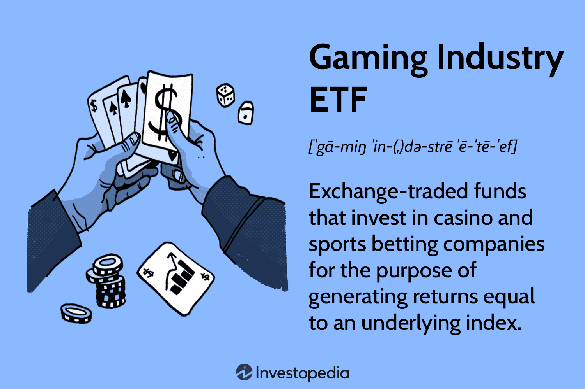

The gaming industry has witnessed remarkable growth over the past decade, transforming from a niche interest into a major sector of mainstream entertainment. This evolution is driven by advancements in technology, increasing internet penetration, and the rising popularity of eSports, making gaming a significant component of global leisure activities. According to market data, the global gaming market is projected to surpass USD 250 billion by 2025, underscoring its expanding influence and attractiveness [1].

Consequently, investors are increasingly interested in gaining exposure to this vibrant sector through financial instruments like Exchange-Traded Funds (ETFs). ETFs provide a convenient way to invest in a diversified portfolio of gaming-related stocks, reducing the need to directly invest in multiple individual gaming companies. The liquidity and flexibility offered by ETFs have contributed to their popularity among investors seeking to benefit from the gaming industry's growth trajectory.



This article examines the investment landscape concerning gaming industry ETFs, focusing particularly on how algorithmic trading can be employed to enhance returns. Algorithmic trading refers to the use of computer algorithms to execute trades based on predefined criteria, optimizing the timing and pricing of transactions. As markets become more complex and fast-paced, algorithmic strategies have emerged as a crucial tool in modern investment approaches, including those targeting gaming industry ETFs.

Through this discussion, we aim to highlight the mechanics and performance of gaming-specific ETFs and explore the strategic implementation of algorithmic trading in maximizing financial outcomes. Investors are invited to consider both the opportunities and challenges that characterize the investment in gaming through ETFs, as they navigate this rapidly evolving market space.

[1] Newzoo, "Global Games Market Report", 2023.

## Table of Contents

## Understanding Exchange-Traded Funds (ETFs)

Exchange-Traded Funds (ETFs) are a type of investment fund and exchange-traded product, meaning they are traded on stock exchanges much like individual stocks. An ETF holds assets such as stocks, commodities, or bonds and operates with an arbitrage mechanism designed to keep its trading price close to its net asset value (NAV). 

The basic structure of an [ETF](/wiki/etf-trading-strategies) includes a portfolio of assets that is divided into shares. These shares are traded on exchanges similar to corporate stocks. ETFs are typically designed with an underlying index or sector in mind. This allows them to provide the average return of the index or sector they track, minus expenses. For instance, a gaming industry ETF might include a collection of stocks from companies within the gaming sector, ranging from game developers to hardware manufacturers.

The [arbitrage](/wiki/arbitrage) mechanism that maintains the ETF's price close to its NAV involves the creation and redemption of shares. Authorized participants (APs), which are often large financial institutions, play a critical role in this process. If an ETF is trading at a price higher than its NAV, APs will buy the underlying securities and sell ETF shares, thus pushing the ETF price down towards the NAV. Conversely, if the ETF is trading below its NAV, APs sell the underlying securities and buy ETF shares, pushing the price up. This constant creation and redemption of shares help keep the ETF's market price in line with its NAV.

Investors appreciate ETFs for their [liquidity](/wiki/liquidity-risk-premium), as they are traded throughout the day on exchanges, much like regular stocks. This contrasts with mutual funds, which are only priced at the end of the trading day. The cost-effectiveness of ETFs is another appealing [factor](/wiki/factor-investing), as they usually have lower expense ratios compared to mutual funds, mainly due to their passive management style. Additionally, the ability of investors to diversify their portfolios with ETFs without buying individual stocks directly is another reason for their growing popularity. By purchasing shares of an ETF, investors gain exposure to a broad spectrum of assets, reducing the risk associated with investing in single companies.

ETFs provide exposure to a variety of markets and sectors, allowing investors to react to niche opportunities or broader market trends. Whether focusing on specific industries, like technology or healthcare, or diverse geographical markets, ETFs offer a flexible investment vehicle that aligns with different investment strategies and financial goals.

## Overview of the Gaming Industry ETF

As gaming has grown into a significant sector within the entertainment industry, Exchange-Traded Funds (ETFs) have increasingly tailored their focus to capture the potential of this dynamic market. Gaming ETFs are investment funds comprised of a diversified portfolio of stocks from various entities within the gaming ecosystem. This includes major video game developers such as Electronic Arts, publishers like Activision Blizzard, accessory makers, and eSports organizations.

These ETFs provide investors with exposure to a wide range of companies, from established firms that have been pivotal in the traditional gaming markets to innovative technology companies that are shaping the future of gaming with advancements in virtual reality, cloud gaming, and other emerging technologies. For example, companies like NVIDIA, which produce high-performance graphics processing units (GPUs), are critical players in the industry due to their essential role in the hardware that powers these gaming experiences.

Understanding the composition of gaming industry ETFs is crucial for investors aiming to leverage the sector's growth. These ETFs are meticulously designed to balance the inclusion of stable, revenue-generating companies with the potential high returns of emerging technology firms. Analyzing their performance involves assessing how these funds manage to capture value across different segments of the gaming ecosystem, considering factors like market cap, revenue growth, and innovation potential.

In summary, gaming ETFs serve as a gateway for investors seeking to tap into the vibrant world of gaming. By maintaining a diverse portfolio, these funds aim to manage risk while providing opportunities for growth as the gaming industry continues to expand and evolve.

## Algorithmic Trading in ETFs

Algorithmic trading utilizes advanced computer algorithms to manage trading strategies and execute transactions at optimal times and prices, thereby enhancing the efficiency of trading Exchange-Traded Funds (ETFs). ETFs represent a collection of securities traded on stock exchanges, providing investors with diversified exposure to specific markets or sectors. When applied to ETFs, [algorithmic trading](/wiki/algorithmic-trading) can significantly improve portfolio management by automating transactions that capitalize on market inefficiencies. 

This method allows investors to place trades faster than traditional manual processes by evaluating various market data points almost instantaneously. The algorithms are designed to analyze vast datasets, identify patterns, and determine the most beneficial times to buy or sell ETF shares, thereby reducing costs and improving the accuracy of trade execution. For instance, an algorithm might be programmed to execute a trade when a specific price deviation from the net asset value (NAV) occurs.

Moreover, algorithmic trading in ETFs can effectively manage risks by dynamically adjusting strategies based on real-time market conditions. This ability is particularly advantageous in volatile markets, such as the gaming industry, where rapid developments and shifts in consumer demand can lead to significant price fluctuations. By employing algorithmic strategies, investors can respond quickly to such changes, optimizing returns while minimizing potential downsides.

The implementation of these algorithms hinges on various strategies, including arbitrage, [trend following](/wiki/trend-following), and [market making](/wiki/market-making). For example, in an arbitrage strategy, the algorithm might exploit price discrepancies between an ETF and its underlying assets to achieve profit. In contrast, a trend-following strategy would focus on identifying and capitalizing on sustained movements in market prices.

Here's a basic illustration of how one might implement a simple algorithmic trading strategy using Python:

```python
import pandas as pd
import numpy as np

# Load ETF price data
data = pd.read_csv('etf_prices.csv')
data['Date'] = pd.to_datetime(data['Date'])
data.set_index('Date', inplace=True)

# Calculate moving averages
data['Short_MA'] = data['Close'].rolling(window=10).mean()
data['Long_MA'] = data['Close'].rolling(window=50).mean()

# Generate trading signals
data['Signal'] = 0
data.loc[data['Short_MA'] > data['Long_MA'], 'Signal'] = 1
data.loc[data['Short_MA'] < data['Long_MA'], 'Signal'] = -1

# Backtest strategy
data['Returns'] = data['Close'].pct_change()
data['Strategy_Returns'] = data['Signal'].shift(1) * data['Returns']

# Performance Metrics
cumulative_strategy_returns = (1 + data['Strategy_Returns']).cumprod()[-1]

print(f'Cumulative Strategy Returns: {cumulative_strategy_returns:.2f}')
```

This sample strategy uses simple moving averages to generate buy and sell signals, demonstrating the efficiency of algorithmic trading in enhancing decision-making for ETF investments. While such strategies can boost performance and efficiency, investors must remain cognizant of potential risks, such as technological failures or data discrepancies, which can lead to substantial financial losses if not properly managed. Hence, integrating robust risk management protocols and continuous monitoring can help mitigate these risks, ensuring that the potential benefits of algorithmic trading are fully realized.

## Benefits and Risks of Algo Trading in Gaming Industry ETFs

Algorithmic trading offers considerable advantages in managing investments within gaming industry ETFs. The rapid processing capabilities of algorithms enable traders to analyze and interpret vast quantities of data efficiently. This quick adaptation to market trends allows for prompt responses, considerably reducing the latency between decision-making and execution. The capability to execute trades with precision minimizes the risk of slippage—a situation where there is a difference between the expected price of a trade and the actual price. By ensuring trades are executed at optimal prices, algorithmic trading maximizes potential gains, capitalizing fully on minor price movements that might be missed with manual trading.

For instance, algorithms can be designed to recognize patterns and signals that indicate favorable trading opportunities within gaming stocks, such as sudden spikes in trading [volume](/wiki/volume-trading-strategy) or price changes. The following Python snippet demonstrates a simple algorithmic approach to detect such opportunities based on historical data:

```python
import pandas as pd

def detect_trading_opportunities(data, moving_average_period=20):
    data['MovingAverage'] = data['Close'].rolling(window=moving_average_period).mean()
    opportunities = data[data['Close'] > data['MovingAverage']]
    return opportunities

# Example usage:
# df = pd.read_csv('gaming_etf_data.csv')
# opportunities = detect_trading_opportunities(df)
```

While the benefits are clear, the deployment of algorithmic trading strategies carries inherent risks. The reliance on technology means that any malfunction, such as hardware failures or connectivity issues, can disrupt trading operations significantly. Additionally, data errors—stemming from incorrect market data inputs or flawed algorithm designs—can result in substantial financial losses. Complex algorithms, if not managed carefully, might behave unpredictably, leading to unintended trading actions.

Furthermore, algorithms must be continuously monitored and recalibrated to align with evolving market dynamics and regulatory standards. This requirement underscores the necessity for technical expertise and robust risk management protocols in algorithmic trading practices for gaming industry ETFs.

Investors targeting gaming ETFs should thoroughly understand both the technical landscape and market environment to leverage the strengths of algorithmic trading while mitigating its vulnerabilities. A carefully calibrated approach, attentive to technological and market changes, can enhance the efficacy of investment strategies in this vibrant and fast-paced sector.

## Case Studies of Successful Gaming Industry ETFs

### Case Studies of Successful Gaming Industry ETFs

Analyzing the performance of selected gaming industry Exchange-Traded Funds (ETFs) provides valuable insights into effective investment strategies. By examining these ETFs, investors can better understand the factors that contribute to market outperformance and the role of algorithmic trading in enhancing returns.

#### Key Factors Contributing to Success

The success of gaming ETFs often hinges on their focus on high-growth segments within the gaming industry. These funds typically include stocks from major video game publishers, developers, and technology companies that are leading advancements in areas such as virtual reality, mobile gaming, and eSports. One common strategy is to capture the extensive consumer base and innovative developments within the industry, translating these into investment returns.

#### Case Study: The VanEck Vectors Video Gaming and eSports ETF (ESPO)

The VanEck Vectors Video Gaming and eSports ETF (ESPO) is a notable example of a gaming industry ETF that has seen significant success. ESPO invests in companies that generate at least 50% of their revenues from video gaming and eSports. By targeting firms engaged in video game development, publishing, and hardware manufacturing, ESPO capitalizes on the rapid growth of the gaming industry. This focus on high-performing companies is a primary reason for the ETF's success.

#### The Role of Algorithmic Trading

Algorithmic trading has become an integral part of how these ETFs manage their portfolios. By leveraging sophisticated algorithms, fund managers can execute large trades efficiently without causing significant market impact. For instance, algorithms are used to identify and capitalize on arbitrage opportunities, optimize trade execution, and manage liquidity.

Such algorithms process real-time data to make instantaneous buy-sell decisions, allowing funds to adjust swiftly to market [volatility](/wiki/volatility-trading-strategies). Python is often used for developing these algorithms due to its robust libraries like NumPy for numerical computations and Pandas for data manipulation.

##### Example Code for Basic Algorithmic Trading Strategy

```python
import numpy as np
import pandas as pd

# Example data
price_data = pd.Series([100, 102, 104, 105, 107])

# Simple Moving Average
def calculate_sma(data, window):
    return data.rolling(window=window).mean()

# Trading Signal
def generate_trading_signal(data, short_window, long_window):
    short_sma = calculate_sma(data, short_window)
    long_sma = calculate_sma(data, long_window)

    signal = pd.Series(index=data.index)
    signal[data.index >= long_window] = np.where(short_sma[long_window:] > long_sma[long_window:], 1, -1)

    return signal

signal = generate_trading_signal(price_data, short_window=2, long_window=4)
```

This basic example illustrates how a moving average crossover strategy can identify potential buy and sell signals for an ETF. Such strategies, though simplistic, form the basis for more complex algorithms used by ETFs to enhance performance.

#### Managing Risks

Algorithmic trading also plays a crucial role in risk management. By continuously monitoring market conditions, algorithms can adjust portfolios in response to unfavorable trends, thereby protecting against downside risks. The swift execution afforded by algorithms helps minimize market impact and slippage, contributing to greater accuracy and efficiency in trades.

#### Conclusion

Through strategic portfolio composition and the effective use of algorithmic trading, gaming industry ETFs like ESPO have successfully navigated market dynamics to deliver strong returns. As the gaming industry continues to expand, investors can glean important lessons from these case studies to refine their investment approaches and leverage technology for enhanced portfolio management.

## Future Trends and Opportunities in Gaming and ETF Investments

As technology progresses and consumer preferences evolve, the gaming industry stands at the forefront of innovative growth. This sector's ongoing transformation presents lucrative opportunities for investors, particularly those looking to engage with Exchange-Traded Funds (ETFs) that capture the essence and future potential of gaming.

Emerging trends such as virtual reality (VR), cloud gaming, and mobile gaming are pivotal drivers of growth within the industry. Virtual reality offers immersive experiences that appeal to a wide range of users, from casual gamers to professionals. Companies at the cutting edge of VR technology are increasingly becoming focal points for gaming ETFs, providing investors with profitable avenues to explore. For instance, VR hardware and software developers are integral to the ETF composites seeking to leverage this immersive market.

Cloud gaming is transforming how consumers access and experience games by eliminating the need for high-end hardware. This paradigm shift facilitates gaming on a broader range of devices, thereby expanding the consumer base. ETFs that focus on cloud gaming technologies are particularly attractive, as they include stocks of companies that provide the necessary infrastructure and platforms to support this growing demand.

Mobile gaming continues to expand rapidly, driven by increased smartphone penetration and the proliferation of app-based gaming platforms. The convenience and accessibility of mobile gaming have led to its dominance over traditional console and PC gaming markets in terms of user base and revenue generation. ETFs investing in mobile gaming companies capture a significant share of this growth, targeting developers who are adept at capitalizing on microtransactions and freemium models.

Investors aiming to maximize their returns in gaming industry ETFs must keep abreast of industry trends, technological advancements, and regulatory changes. Staying informed ensures that investment strategies remain aligned with market dynamics. For example, understanding shifts in consumer preferences and technological leaps can guide ETF portfolio adjustments, protecting against obsolescence and optimizing investment outcomes.

With the gaming industry positioned for ongoing expansion, investors have a wealth of opportunities to pursue through thoughtful engagement with gaming ETFs. By focusing on sectors geared towards innovation and adapting to changing consumer habits, these funds provide a strategic pathway to capitalize on the gaming industry's robust growth potential.

## Conclusion

Investment in gaming industry ETFs represents a compelling pathway for investors seeking diversification and growth within a formidable market landscape. The inclusion of algorithmic trading in this investment domain amplifies the efficiency and effectiveness of strategies, offering precise trade execution, optimizing timing, and exploiting market inefficiencies. Nevertheless, embracing algorithmic trading necessitates a comprehensive understanding of its inherent risks, such as technical failures and data inaccuracies, which can substantially impact investment performance.

As the gaming industry continues its transformative journey, characterized by technological revolutions and shifting consumer preferences, investors must exhibit adaptability and vigilance. Emerging trends such as virtual reality, cloud gaming, and mobile gaming are reshaping the industry's contours, presenting a spectrum of lucrative opportunities for ETFs poised to capitalize on innovation and profitability. To thrive, investors must stay attuned to these trends, technological advancements, and regulatory changes.

In synthesizing modern technology with strategic acumen, investors can effectively optimize their portfolios, ensuring success in the ever-evolving gaming sector. Such a balanced approach not only leverages the benefits of advanced trading methodologies but also roots investment decisions in sound industry insight, setting the stage for informed and prosperous engagement with gaming industry ETFs.

## References & Further Reading

[1]: Newzoo. (2023). ["Global Games Market Report"](https://newzoo.com/resources/trend-reports/newzoo-global-games-market-report-2023-free-version). Newzoo.

[2]: Lopez de Prado, M. (2018). ["Advances in Financial Machine Learning."](https://www.amazon.com/Advances-Financial-Machine-Learning-Marcos/dp/1119482089) Wiley.

[3]: Chan, E. P. (2008). ["Quantitative Trading: How to Build Your Own Algorithmic Trading Business."](https://github.com/ftvision/quant_trading_echan_book) Wiley.

[4]: Jansen, S. (2020). ["Machine Learning for Algorithmic Trading: Predictive models to extract signals from market and alternative data for systematic trading strategies with Python."](https://github.com/stefan-jansen/machine-learning-for-trading) Packt.

[5]: Aronson, D. (2006). ["Evidence-Based Technical Analysis: Applying the Scientific Method and Statistical Inference to Trading Signals."](https://www.wiley.com/en-us/Evidence+Based+Technical+Analysis%3A+Applying+the+Scientific+Method+and+Statistical+Inference+to+Trading+Signals-p-9780470008744) Wiley.