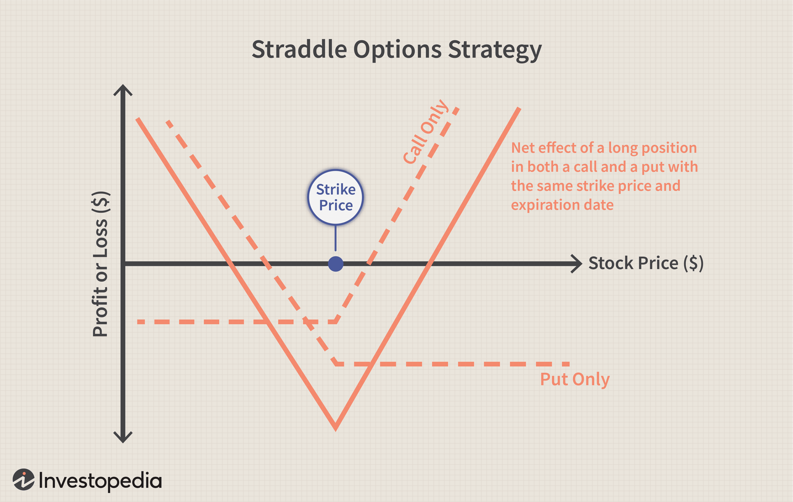

Options trading encompasses a diverse range of strategies designed to accommodate varying risk tolerance levels and profit objectives. At the core of these strategies are neutral approaches that strive to reduce the sensitivity of a position to price movements, thereby stabilizing its value. These strategies appeal to traders who prefer to manage risk rather than chase high returns in volatile market conditions.

Gamma-delta neutral strategies are a subset of neutral trading approaches that strategically balance two key factors, gamma and delta, to harness the benefits of time decay—represented by theta—while minimizing adverse price fluctuation exposure. These strategies are particularly favored by traders interested in capitalizing on the predictable erosion of an option's value as it approaches expiration without assuming significant directional risk.



The focus of this article is to examine gamma-delta risk in options trading. It aims to provide insights into the underlying mechanics of neutral strategies and how they can be effectively implemented using algorithmic trading techniques. Algorithmic trading plays a crucial role in executing these complex strategies with precision and speed, allowing traders to maintain neutrality and respond swiftly to market changes.

Practical applications of gamma-delta neutral strategies involve using algorithmic systems to continuously monitor and adjust positions, ensuring a consistent balance between gamma and delta as market conditions fluctuate. However, these strategies are not without challenges. Traders must navigate factors such as market volatility, commission costs, and changes in implied volatility, which can impact the overall effectiveness of their approach. Understanding these dynamics is essential for successfully employing gamma-delta neutral strategies, particularly within the framework of automated trading platforms.

## Table of Contents

## Understanding Options 'Greeks'

Options Greeks are essential tools for traders seeking to effectively manage risk and optimize potential rewards in options trading. These mathematical constructs, derived from the Black-Scholes model and other pricing models, provide critical insights into how various factors affect the pricing and stability of options.

Gamma is a second-order Greek that measures the rate of change in delta, the first-order Greek, with respect to a one-point move in the underlying asset price. This relationship can be mathematically expressed as:

$$
\Gamma = \frac{\partial^2 V}{\partial S^2}
$$

where $V$ represents the value of the option and $S$ the price of the underlying asset. Gamma provides insight into an option's stability by indicating how sensitive the delta is to changes in the underlying asset price. A high gamma implies that delta can change rapidly, which can lead to significant variations in the option's price, thereby affecting the overall position's stability.

Delta ($\Delta$) represents the sensitivity of an option's price to a one-point move in the underlying asset's price. It is given by:

$$
\Delta = \frac{\partial V}{\partial S}
$$

For a call option, delta values range from 0 to 1, while for a put option, they range from -1 to 0. Delta is critical for neutralizing price movements because it helps traders understand how the option's value will change with small movements in the underlying asset price. By using delta, traders can construct neutral strategies that minimize directional risk.

In gamma-delta neutral strategies, the primary objective is to balance gamma and delta to maintain a position's neutrality despite market fluctuations. Achieving this balance involves adjusting the portfolio to ensure that the combined effect of gamma and delta does not expose the trader to unwanted market risks. For instance, a trader might use a combination of long and short positions in options and the underlying asset to achieve a zero net delta position. This could be done by:

```python
def calculate_delta_neutral_position(delta_option, amount_options, current_price, beta_underlying):
    """
    Calculate the number of shares needed to create a delta-neutral position.

    Parameters:
    delta_option (float): Delta of the option.
    amount_options (int): Number of options.
    current_price (float): Current price of the underlying asset.
    beta_underlying (float): Beta of the underlying asset.

    Returns:
    int: Number of shares.
    """
    return - delta_option * amount_options / beta_underlying * current_price

# Example usage
delta_option = 0.6
amount_options = 100
current_price = 50
beta_underlying = 1.0

shares_needed = calculate_delta_neutral_position(delta_option, amount_options, current_price, beta_underlying)
print(shares_needed)
```

The code snippet demonstrates a simple calculation for achieving delta neutrality by balancing the impact of options and their respective deltas with the underlying asset. Maintaining such balanced positions is integral to gamma-delta neutral strategies, as it ensures that even when the underlying asset's price changes, the overall position remains unaffected by directional movements, thereby focusing on other factors such as time decay for generating returns.

## The Role of Theta in Options Trading

Theta is a fundamental component of options trading, representing the rate at which an option's value erodes as it approaches its expiration date. This intrinsic decay feature is a pivotal consideration for traders who attempt to leverage time as a strategic advantage. In mathematical terms, theta quantifies the decrease in an option's price for each day that passes, assuming all other factors remain constant. It is expressed as a negative value, reflecting the inevitable loss in the option's worth over time.

Traders exploit theta in numerous strategies designed to capitalize on time decay. One common approach is selling options with a short time to expiration, where theta decay is most pronounced. By selling options, traders collect premiums and benefit as time passes, provided the underlying asset's price does not move significantly against their position. This tactic is particularly prevalent in strategies like the iron condor or the covered call, where the erosion of time premium directly contributes to the strategy's profitability.

In the context of gamma-delta neutral strategies, harnessing theta's benefits while maintaining neutrality concerning gamma and delta presents a unique challenge. Gamma represents the rate of change of delta for a one-point move in the underlying asset, and together with delta, they govern the sensitivity of an option's value to price changes. In a neutral strategy, traders aim to offset the directional risk (delta) and curvature risk (gamma) to maintain a stable position irrespective of market fluctuations. The balancing act involves constructing a portfolio of options and potentially the underlying asset, such that the gamma and delta effects are neutralized.

Achieving this balance requires strategic construction and continuous adjustment of the portfolio through intricate calculations. It often involves selecting a combination of long and short options positions that collectively stabilize the portfolio's delta and gamma values, while theta remains a driving force for potential profits. Here's a basic Python snippet demonstrating how a trader might calculate the combined theta of a portfolio, assuming a list of options with individual theta values:

```python
def calculate_total_theta(options):
    total_theta = sum(option['theta'] for option in options)
    return total_theta

options_portfolio = [
    {'name': 'call_option_1', 'theta': -0.05},
    {'name': 'put_option_1', 'theta': -0.03},
    {'name': 'call_option_2', 'theta': -0.04},
]

total_theta = calculate_total_theta(options_portfolio)
print(f'Total Theta for the Portfolio: {total_theta}')
```

The careful planning and execution necessary to balance these factors often involve sophisticated [algorithmic trading](/wiki/algorithmic-trading) systems. These systems are capable of swiftly responding to market movements, recalibrating the component parts of the position as needed to ensure the continued realization of theta decay benefits. Automation is particularly advantageous given the complexity and speed required, offering traders the precision to constantly keep gamma and delta neutral throughout the life of the trade.

## Neutralizing Gamma and Delta

Gamma-delta neutral strategies in options trading are designed to minimize the influence of directional market moves on the value of a portfolio by achieving both gamma and delta neutrality. 

Gamma neutrality refers to balancing out the effects of gamma, which measures the rate of change in an option's delta in response to the price movement of the underlying asset. To achieve gamma neutrality, a trader typically adjusts the ratio at which options are bought and sold. The goal is to create a position where gamma effects from different options offset one another, maintaining a stable delta despite fluctuations in the underlying asset's price. 

Mathematically, gamma neutrality can be represented as follows:

$$
\sum_{i=1}^{n} \Gamma_i = 0
$$

where $\Gamma_i$ denotes the gamma of the $i$-th option in the portfolio, and the sum is taken across all options in the portfolio. Ensuring this balance requires careful monitoring and adjusting of the option positions as market conditions evolve.

Delta neutrality, on the other hand, involves managing the delta of a portfolio, which indicates the sensitivity of an option's price to a one-point change in the price of the underlying asset. Achieving delta neutrality often involves balancing the positive and negative delta contributions of various options. Traders might short shares of the underlying asset to offset the deltas of their option positions, or they might employ a combination of other options to neutralize the overall delta.

The equation for delta neutrality is:

$$
\sum_{i=1}^{n} \Delta_i \times Q_i + \Delta_{\text{hedge}} = 0
$$

where $\Delta_i$ is the delta of the $i$-th option, $Q_i$ is the quantity of the $i$-th option, and $\Delta_{\text{hedge}}$ represents the delta contribution from the hedging instrument, such as shorted stocks or additional options.

Understanding the mechanics of gamma and delta adjustments is crucial for implementing successful gamma-delta neutral strategies. This often involves dynamic adjustments through either manual intervention or automated algorithmic trading systems. These systems help in recalibrating the portfolio by continuously monitoring market changes and executing trades that preserve the general neutrality of the portfolio. 

Here's a simplified Python example illustrating the concept of portfolio adjustments for delta neutrality:

```python
def adjust_for_delta_neutrality(options, underlying_price, hedge_delta):
    total_delta = sum([opt['delta'] * opt['quantity'] for opt in options])
    hedge_quantity = -(total_delta + hedge_delta) / underlying_price
    return hedge_quantity

# Example portfolio
options = [{'delta': 0.6, 'quantity': 50}, {'delta': -0.4, 'quantity': 70}]
underlying_price = 100  # Example underlying asset price
hedge_delta = 0  # Initial delta hedge

# Adjust hedge
hedge_quantity = adjust_for_delta_neutrality(options, underlying_price, hedge_delta)
print(f"Quantity to short for delta neutrality: {hedge_quantity} shares")
```

In this example, the `adjust_for_delta_neutrality` function calculates the quantity of the underlying asset to short to achieve delta neutrality, based on the deltas and quantities of the options in the portfolio. As market conditions shift, such adjustments can be executed to maintain a neutral stance, helping to mitigate the directional risks associated with price movements in the underlying asset.

## Implementing Algorithmic Trading

Algorithmic trading is crucial for managing gamma-delta neutral strategies effectively, offering precision and speed that manual trading cannot match. These strategies require constant adjustments to maintain neutrality as market conditions fluctuate, and algorithms are particularly well-suited to this task. 

At the core, algorithms monitor real-time data to quantify changes in the delta and gamma of the options portfolio. These calculations inform the necessary adjustments to rebalance the portfolio, typically involving dynamic hedging techniques. The goal is to keep the portfolio's delta and gamma as close to zero as possible. This approach minimizes the impact of unexpected price movements while maximizing the benefits from theta, the time decay of options.

### Algorithm Design and Implementation

The design of an algorithm involves creating a set of rules for trading signals, risk management, and position sizing. A common technique is using a delta-neutral hedging strategy, enhanced by gamma adjustments. The algorithm may utilize statistical models to predict expected changes in delta and gamma given specific triggers such as price movements, [volatility](/wiki/volatility-trading-strategies) shifts, or time decay.

In practice, the algorithm could be structured using a Python program like the following pseudocode:

```python
def update_positions(portfolio, market_data):
    delta = calculate_portfolio_delta(portfolio, market_data)
    gamma = calculate_portfolio_gamma(portfolio, market_data)

    if delta != 0 or gamma != 0:
        # Adjust positions to neutralize delta and gamma
        adjust_delta = -delta / market_data['underlying_price'] 
        adjust_gamma = -gamma / (market_data['underlying_price'] ** 2)

        execute_trade(adjust_delta, adjust_gamma, portfolio)
    return portfolio

while trading_session_open:
    market_data = get_market_data()
    portfolio = update_positions(current_portfolio, market_data)
    sleep(interval)  # predefined time interval for periodic checks
```

### Risk Management and Adjustment Protocols

Risk management is integral to algorithmic trading, especially for complex strategies like gamma-delta neutrality. The algorithm must include protocols that limit exposure to adverse price movements and volatility spikes. One common risk management technique is predetermined stop-loss levels, where the algorithm automatically unwinds the position if the portfolio's delta or gamma surpasses set thresholds. Furthermore, algorithms can employ variance tracking to adjust for unexpected changes in implied volatility.

Adjustment protocols should specify when and how much of the portfolio needs rebalancing as market data updates. This means setting rules for frequency and magnitude of trades, ensuring that cost considerations, such as transaction fees and slippage, are factored into the decisions made by the algorithm.

### Optimization Techniques

The success of an algorithm in maintaining gamma-delta neutrality hinges on its optimization abilities. Machine learning and heuristic methods like genetic algorithms can be utilized to fine-tune parameters over time, adapting to changing market conditions to enhance performance. This iterative optimization reduces the gap between theoretical expectations and real-world results, thus improving the overall profitability and sustainability of the trading strategy.

In summary, implementing algorithmic trading for gamma-delta neutral strategies involves a precise balance between maintaining position neutrality and optimizing for profitability, with a robust framework for executing dynamic hedging while adhering to strict risk management protocols.

## Profitability and Risk Considerations

Gamma-delta neutral strategies in options trading are designed to profit from the decay of time value, known as theta, while neutralizing potential price risks associated with gamma and delta. While these strategies offer unique opportunities for seasoned traders, they come with specific profitability metrics and risk factors that need to be carefully managed.

The profitability of gamma-delta neutral strategies primarily hinges on the ability to consistently capture theta, the rate of time decay of an option's price. In ideal market conditions, as time progresses, the options within a gamma-delta neutral portfolio will lose less value than they would in a non-neutralized position, potentially leading to a net gain. However, the actual returns are highly susceptible to market factors such as implied volatility, a measure of expected future volatility in an asset's price. Changes in implied volatility can magnify or reduce the effect of theta on an option's price, impacting profitability. For instance, a sudden increase in implied volatility might counteract the gains from theta decay, leading to potential losses.

Commission costs are another critical aspect to consider. Frequent rebalancing is essential in maintaining the neutrality of the portfolio — a process that can incur significant transaction fees, particularly if the trading infrastructure is not optimized for low-cost trades. These costs can erode the profits earned from theta decay, making the strategy less viable for traders who don't have access to low-cost brokers.

Market volatility further compounds the risks associated with gamma-delta neutral strategies. While the aim is to remain neutral to movements in the underlying asset's price, gamma risks can arise when there's a significant move in the market. Large, unexpected market shifts can alter the gamma and delta of the options in a portfolio, necessitating rapid adjustments to re-establish neutrality. Without a robust risk management framework, these adjustments can become costly and introduce additional risks.

A practical approach to mitigating these risks involves leveraging algorithmic trading techniques. Algorithms can monitor market conditions continuously and execute trades with precision and speed, which is crucial for managing a gamma-delta neutral portfolio. They also incorporate risk management protocols that can adapt to changing market dynamics, ensuring that the portfolio maintains its neutral stance.

In summary, while gamma-delta neutral strategies can yield profitable outcomes, especially in stable markets with minimal volatility, they require an in-depth understanding of the underlying risks, including commission expenses, implied volatility variability, and the challenges posed by market movements. Implementing a robust risk management framework is essential for traders aiming to capitalize on these strategies effectively.

## Drawbacks and Limitations

Gamma-delta neutral strategies, while offering a sophisticated approach for managing risk in options trading, come with certain drawbacks and limitations. One of the primary challenges for traders implementing these strategies is the necessity of having access to low-commission brokers. Frequent adjustments to maintain neutrality in both gamma and delta can incur significant transaction costs. For traders using brokers with high commissions, these costs can erode potential profits, making the strategy less viable.

Another substantial risk is the impact of large market movements. Gamma-delta neutral strategies are designed to mitigate the effects of small to moderate price fluctuations. However, in the event of significant market shifts, these strategies may fail to maintain their intended neutrality. This failure can result in substantial financial losses if not properly managed.

Changes in implied volatility also pose a threat to the effectiveness of gamma-delta neutral strategies. Since these strategies rely on a balance between gamma and delta, unexpected shifts in implied volatility can disrupt this balance. This disruption necessitates prompt adjustments to restore neutrality, which, if not carried out efficiently, can lead to increased risk exposure.

Traders need to be aware of these potential pitfalls and integrate robust risk management practices to safeguard their positions. Techniques such as volatility forecasting, dynamic hedging, and scenario analysis can help in assessing and mitigating these risks. Additionally, utilizing algorithmic trading can assist in executing necessary adjustments swiftly and accurately, although it requires access to sophisticated trading platforms and technology infrastructure.

In summary, while gamma-delta neutral strategies present an advanced method for exploiting time decay while minimizing price risk, understanding and addressing their limitations is crucial for successful implementation.

## Conclusion

Gamma-delta neutral strategies offer a balanced approach for traders aiming to benefit from theta decay while controlling exposure to price fluctuations. These strategies are especially appealing to those who wish to maintain a neutral stance on market direction yet still capitalize on the inevitable passage of time that erodes the value of options. By achieving a balance between gamma and delta, traders can effectively neutralize the price risk associated with fluctuating market conditions, focusing instead on the consistent, predictable decline of option value as expiration approaches.

The integration of algorithmic trading significantly enhances the precision and efficiency of executing gamma-delta neutral strategies. Algorithms are equipped to swiftly process vast amounts of market data and execute trades with speed and accuracy far beyond human capability. This automation ensures that traders can continually adjust their positions, maintaining neutrality even as market conditions shift. For instance, a Python-based algorithm might be designed to continuously calculate the gamma and delta of a portfolio and perform trades to adjust these values, allowing the strategy to remain effectively neutral. This can be accomplished using libraries such as NumPy for numerical computations and pandas for handling data. Here is a simple illustrative code snippet:

```python
import numpy as np
import pandas as pd

def calculate_greeks(option_data):
    # Example function to calculate delta and gamma (simplified for illustration)
    option_data['delta'] = ...  # Calculate delta using market data
    option_data['gamma'] = ...  # Calculate gamma using market data
    return option_data

def adjust_positions(option_data):
    # Adjust positions to achieve gamma-delta neutrality
    # Example: Buy/sell options based on delta and gamma values
    desired_delta = 0
    desired_gamma = 0

    delta_error = option_data['delta'].sum() - desired_delta
    gamma_error = option_data['gamma'].sum() - desired_gamma

    # Implement trades to correct delta and gamma errors
    trades = {
        'delta_adjustment': -delta_error,
        'gamma_adjustment': -gamma_error
    }
    return trades

# Simulated option data
option_data = pd.DataFrame({
    'option_id': [1, 2, 3],
    'delta': [0.5, -0.3, 0.2],
    'gamma': [0.1, -0.05, 0.04]
})

adjusted_trades = adjust_positions(calculate_greeks(option_data))
```

Such automation not only offers efficiency but also helps manage the finer nuances of risk inherent in these strategies. Despite the potential for profit, successful implementation of gamma-delta neutral strategies requires a thorough understanding of their complexities and associated risks. Factors such as transaction costs, changes in implied volatility, and the need for continual portfolio adjustments underline the importance of a robust risk management framework. Traders must utilize their understanding of options mechanics and leverage technological advancements to stay ahead in this sophisticated approach to options trading.

## References & Further Reading

[1]: Bergstra, J., Bardenet, R., Bengio, Y., & Kégl, B. (2011). ["Algorithms for Hyper-Parameter Optimization."](https://dl.acm.org/doi/10.5555/2986459.2986743) Advances in Neural Information Processing Systems 24.

[2]: ["Advances in Financial Machine Learning"](https://www.amazon.com/Advances-Financial-Machine-Learning-Marcos/dp/1119482089) by Marcos Lopez de Prado

[3]: ["Evidence-Based Technical Analysis: Applying the Scientific Method and Statistical Inference to Trading Signals"](https://www.amazon.com/Evidence-Based-Technical-Analysis-Scientific-Statistical/dp/0470008741) by David Aronson

[4]: ["Machine Learning for Algorithmic Trading"](https://github.com/stefan-jansen/machine-learning-for-trading) by Stefan Jansen

[5]: ["Quantitative Trading: How to Build Your Own Algorithmic Trading Business"](https://www.amazon.com/Quantitative-Trading-Build-Algorithmic-Business/dp/1119800064) by Ernest P. Chan