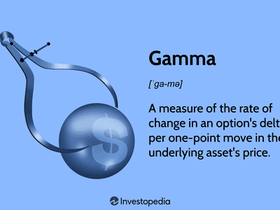

## Table of Contents

## What is hedging in financial markets?

Hedging in financial markets is like buying insurance for your investments. It's a strategy that investors use to reduce the risk of losing money when the market goes down. For example, if you own a stock and you're worried that its price might fall, you can hedge by buying another investment that will go up in value if the stock goes down. This way, any losses from the stock can be offset by gains from the hedge.

Hedging can be done in many ways, but one common method is using options. Options give you the right to buy or sell an asset at a specific price within a certain time. If you own a stock, you can buy a put option, which allows you to sell the stock at a set price even if the market price drops below that. This limits your potential loss. While hedging can protect you from big losses, it also comes with a cost, as you have to pay for the options or other hedging instruments.

## What is Gamma in options trading?

Gamma in options trading is a measure of how fast the delta of an option changes as the price of the underlying stock moves. Delta tells you how much the price of an option will change for every $1 move in the stock price. Gamma helps you understand how sensitive the delta is to these stock price changes. Think of it like this: if delta is the speed of the option's price change, then gamma is how quickly that speed changes.

Gamma is important because it can affect the risk and potential profit of an options position. When the stock price is close to the option's strike price, gamma is usually higher, meaning the delta can change more rapidly. This can be good if you're trying to make money from small moves in the stock price, but it also means your position can become riskier if the stock price moves against you. So, traders pay attention to gamma to manage their options strategies effectively.

## What is Delta in options trading?

Delta in options trading tells you how much the price of an option will change when the price of the stock it's based on moves by $1. It's like a speedometer for your option. If a call option has a delta of 0.5, it means that for every $1 increase in the stock price, the price of the option will go up by about $0.50. For put options, a delta might be -0.5, meaning the option price will drop by $0.50 for every $1 increase in the stock price.

Delta is important because it helps traders understand how sensitive their options are to changes in the stock price. It's a key part of managing risk and planning strategies. For example, if you want to protect a stock you own, you might buy put options with a high negative delta to offset potential losses. Delta also changes over time and as the stock price moves, which is where gamma comes into play, showing how quickly delta can change.

## How does Gamma hedging work?

Gamma hedging is a way for options traders to manage their risk when the delta of their options changes quickly. Imagine you have options that are very sensitive to the stock price moving, meaning they have a high gamma. If the stock price goes up or down, the delta of these options will change a lot. To keep your risk under control, you need to adjust your position by buying or selling the stock. This is called gamma hedging. By doing this, you try to keep your delta at a level you're comfortable with, even when the stock price is moving around.

For example, if you have call options with a high gamma and the stock price goes up, the delta of your options will increase. To hedge this, you might sell some of the stock to bring your delta back to where you want it. If the stock price goes down, the delta will decrease, and you might buy more stock to adjust your position. Gamma hedging can be a bit tricky because you have to keep making these adjustments as the stock price changes. But it's a useful tool for traders who want to manage the risk that comes with high gamma options.

## How does Delta hedging work?

Delta hedging is a way for traders to reduce the risk of their options by balancing them with the stock they're based on. Imagine you have call options with a delta of 0.5. This means for every $1 the stock goes up, your options go up by $0.50. If you want to protect yourself from the stock price moving, you can buy or sell the stock to make your overall position less sensitive to these changes. If you own the call options, you might sell some of the stock to bring your delta closer to zero. This way, if the stock price goes up or down, your total position won't change as much.

Keeping your delta hedged means you need to keep an eye on the stock price and adjust your position as it moves. For example, if the stock price goes up and your call options' delta increases to 0.6, you might sell more stock to bring your delta back to where you want it. It's like constantly balancing a seesaw to keep it level. Delta hedging can help you manage risk, but it takes work because you need to keep making these adjustments. It's a useful tool for traders who want to protect their investments from big swings in the stock price.

## What are the main differences between Gamma hedging and Delta hedging?

Delta hedging and Gamma hedging are both ways to manage risk in options trading, but they focus on different things. Delta hedging is about keeping your position balanced so it doesn't change too much when the stock price moves. You do this by buying or selling the stock to match the delta of your options. If you have call options and the stock price goes up, making your delta higher, you might sell some stock to bring your delta back to where you want it. It's like trying to keep a seesaw level by adding or removing weight.

Gamma hedging, on the other hand, is about dealing with how fast your delta changes. When you have options with a high gamma, their delta can change quickly if the stock price moves. To manage this, you need to keep adjusting your stock position to keep your delta where you want it. For example, if the stock price goes up and your call options' delta increases a lot because of high gamma, you might sell more stock to hedge. Gamma hedging is more about reacting to these fast changes in delta, making it a bit trickier than delta hedging because you have to keep making adjustments as the stock price moves around.

Both types of hedging help traders manage risk, but delta hedging is simpler and focuses on the overall sensitivity of your position to stock price changes. Gamma hedging is more complex and focuses on the speed at which that sensitivity changes. Understanding both can help traders better protect their investments and make more informed decisions.

## Why is Gamma hedging important for options traders?

Gamma hedging is important for options traders because it helps them manage the risk of their options changing value quickly. When you have options with a high gamma, their delta, which shows how much the option price changes with the stock price, can change a lot. This means if the stock price moves, your options can become more or less valuable very fast. By doing gamma hedging, traders can adjust their stock positions to keep their delta where they want it, even when the stock price is moving around a lot. This helps them control how much their overall position might change and keeps their risk in check.

For example, if you have call options and the stock price goes up, the delta of your options will increase because of high gamma. To hedge this, you might sell some of the stock to bring your delta back to a level you're comfortable with. This way, if the stock price keeps moving, you won't be caught off guard by big changes in your options' value. Gamma hedging is like constantly adjusting a seesaw to keep it balanced, making sure your trading strategy stays on track even when the market is unpredictable.

## Why is Delta hedging important for options traders?

Delta hedging is important for options traders because it helps them manage the risk of their options by balancing them with the stock they're based on. Imagine you have call options, and you want to protect yourself from big changes in the stock price. By buying or selling the stock, you can keep your overall position stable. For example, if you have call options with a delta of 0.5 and the stock price goes up, your options will go up too. To hedge this, you might sell some stock to bring your delta closer to zero, so your total position won't change as much if the stock keeps moving.

Keeping your position delta hedged means you need to keep an eye on the stock price and adjust your stock holdings as it changes. It's like constantly balancing a seesaw to keep it level. Delta hedging helps traders protect their investments from big swings in the stock price, making it easier to manage risk. While it requires ongoing adjustments, it's a useful tool for traders who want to keep their options positions stable and predictable.

## Can you explain the mathematical formulas used in Gamma and Delta hedging?

Delta hedging involves using the delta value of an option to balance out the risk. The delta of an option tells you how much the option's price will change if the stock price changes by $1. For example, if you have a call option with a delta of 0.5, it means the option's price will go up by $0.50 for every $1 increase in the stock price. To delta hedge, you need to buy or sell enough of the stock to make your overall delta close to zero. If you own the call option, you might sell 50 shares of the stock (since 0.5 delta means you need 100 shares to hedge one option contract fully). This way, if the stock price moves, the gain or loss from the stock will offset the change in the option's value, keeping your position stable.

Gamma hedging is a bit more complex because it deals with how fast the delta changes. Gamma is the rate at which the delta of an option changes when the stock price moves. If you have options with a high gamma, their delta can change quickly, making your position riskier. To gamma hedge, you need to keep adjusting your stock position to keep your delta where you want it. For example, if you have call options and the stock price goes up, the delta might increase from 0.5 to 0.6 because of high gamma. To hedge this, you might sell more stock to bring your delta back to 0.5. Gamma hedging means you're always tweaking your position to manage the risk of fast-changing deltas, making sure your overall exposure stays under control.

## What are the practical challenges of implementing Gamma hedging?

Gamma hedging can be tricky because it means you have to keep changing your stock position a lot. When the stock price moves, the delta of your options changes quickly because of high gamma. This means you need to buy or sell more stock to keep your delta where you want it. Doing this all the time can be hard work and might cost you money because of trading fees and other costs. It's like trying to keep a seesaw perfectly balanced while someone keeps adding or taking away weight.

Another challenge is that the stock price can be unpredictable. It might move up and down a lot, making it hard to keep your gamma hedge just right. If you don't adjust your position fast enough, your options could become more risky than you planned. Plus, gamma hedging might not always be perfect because there can be other factors affecting your options, like changes in the market or time until the option expires. So, while gamma hedging can help manage risk, it takes a lot of attention and quick action to do it well.

## What are the practical challenges of implementing Delta hedging?

Delta hedging can be tricky because you have to keep an eye on the stock price and adjust your position all the time. If the stock price goes up or down, you need to buy or sell more stock to keep your delta balanced. This can be a lot of work and might cost you money because of trading fees and other costs. It's like trying to keep a seesaw level by adding or removing weight whenever someone else moves.

Another challenge is that the stock price can move around a lot, making it hard to keep your delta hedge just right. If you don't adjust your position quickly enough, your options might become riskier than you planned. Plus, other things can affect your options, like changes in the market or time until the option expires. So, while delta hedging can help you manage risk, it takes a lot of attention and quick action to do it well.

## How do professional traders use Gamma and Delta hedging strategies in combination?

Professional traders often use both Gamma and Delta hedging strategies together to manage their risk better. They start with Delta hedging to make sure their position doesn't change too much when the stock price moves. If they have call options, they might sell some stock to balance out the delta. This way, if the stock price goes up or down, their overall position stays stable. But they know that the delta can change quickly because of Gamma, especially if the stock price is close to the option's strike price.

To deal with this, they also use Gamma hedging. They keep an eye on how fast the delta is changing and adjust their stock position to keep it under control. If the stock price goes up and the delta of their options increases a lot, they might sell more stock to bring the delta back to where they want it. By using both Delta and Gamma hedging, traders can handle the risk of their options changing value quickly and make sure their overall position stays balanced, even when the market is unpredictable.

## How does Gamma Hedging work?

Gamma hedging is a technique employed by options traders to manage the curvature, or convexity, of their portfolio's delta—the sensitivity of the option’s price to changes in the price of the underlying asset. The main objective is to maintain a delta-neutral position, mitigating the impact of large and abrupt price movements in the underlying asset. This strategy is vital in environments with high [volatility](/wiki/volatility-trading-strategies) and rapidly fluctuating market conditions.

To implement gamma hedging, traders frequently adjust their portfolios by adding or removing options, effectively balancing their gamma exposure. Gamma ($\Gamma$) itself is the second derivative of the option’s price with respect to the price of the underlying asset, mathematically represented as:

$$
\Gamma = \frac{\partial^2 V}{\partial S^2}
$$

where $V$ denotes the option's price and $S$ represents the price of the underlying asset. A balanced gamma leads to stabilized delta variations, contributing to a portfolio that is less sensitive to market volatilities.

Traders achieve gamma neutrality by combining long and short positions in calls and puts. For instance, if a portfolio has positive gamma, meaning the delta increases with a rise in the underlying asset’s price, the trader might consider selling calls or buying puts to counterbalance this effect. Conversely, for negative gamma, strategies might include purchasing calls or selling puts.

The dynamic adjustments necessary in gamma hedging require continuous monitoring and rapid executions to respond to market shifts effectively. Due to this complexity, real-time analytics and transaction execution capabilities are essential. Algorithmic trading systems are often employed to automate this process, using predefined rules and mathematical models to adjust the positions dynamically and more efficiently than manual trading could accomplish.

The sophistication of gamma hedging lies in its requirement for precise calculations and the need for realtime adjustments. Tools and technologies play a critical role in managing and executing these strategies, ensuring that traders can maintain their desired risk profiles even as market conditions change.

## What is Delta Hedging: A Complementary Strategy?

Delta hedging is a fundamental technique in options trading, aimed at reducing the first-order price sensitivity, commonly referred to as delta, of a portfolio. At its core, delta ($\Delta$) represents the rate of change of an option’s price with respect to changes in the underlying asset's price. Therefore, delta hedging involves taking positions in the underlying asset to offset this sensitivity, maintaining a delta-neutral position.

### Principles of Delta Hedging

Delta hedging is accomplished by buying or selling the underlying asset to offset the delta of the options held. For instance, if an option has a positive delta of 0.5, this implies that for every $1 increase in the price of the underlying asset, the option's price would increase by $0.50. To hedge this position, a trader might sell 0.5 units of the underlying asset for each option held, thereby neutralizing the position's delta.

Mathematically, the delta of a portfolio ($\Delta_P$) with $n$ options can be expressed as:

$$
\Delta_P = \sum_{i=1}^{n} \Delta_i \times N_i + \Delta_{U} \times N_{U}
$$

Where:
- $\Delta_i$ is the delta of the $i^{th}$ option,
- $N_i$ is the number of $i^{th}$ options,
- $\Delta_{U}$ is the delta of the underlying asset (equal to 1),
- $N_{U}$ is the number of units of the underlying asset in the portfolio.

### Benefits of Delta Hedging

Delta hedging provides significant benefits in risk management, particularly by protecting against small price changes in the underlying asset. By maintaining a delta-neutral position, the portfolio becomes less sensitive to market movements, allowing traders to focus on other variables such as time decay (theta) or volatility changes (vega).

Furthermore, delta hedging helps in stabilizing cash flows when managing large portfolios, as traders adjust their positions dynamically to account for market fluctuations. This precision reduces potential losses and can improve the overall performance of the trading strategy.

### Challenges in Delta Hedging

Despite its benefits, delta hedging presents several challenges:

1. **Transaction Costs**: Frequent rebalancing of the portfolio to maintain delta neutrality can incur significant transaction costs, which can diminish overall profitability.

2. **Gamma Risk**: Delta hedging primarily addresses first-order risk, but it does not account for the curvature or convexity of the payoff, known as gamma. This is why delta hedging is often used alongside gamma hedging, as gamma accounts for changes in delta itself over time.

3. **Market Volatility**: In highly volatile markets, maintaining delta neutrality can be particularly challenging, as the delta of options can change rapidly, necessitating constant adjustments to the hedge.

4. **Liquidity Constraints**: Sufficient liquidity in the underlying asset is important for executing the necessary trades involved in delta hedging. In illiquid markets, achieving or maintaining a delta-neutral position might not be feasible.

### Python Simulation Example

To illustrate delta hedging, a simple Python script can simulate a portfolio's delta hedging process:

```python
# Assumptions
option_delta = 0.5
option_count = 100
underlying_position = 0

# Required hedge for delta neutrality
required_hedge = -option_delta * option_count

# Adjusting position in the underlying asset
underlying_position += required_hedge

print(f"Units of underlying to hold for delta neutrality: {underlying_position}")
```

In this example, if a position in options results in a combined delta of 50 (0.5 delta for each of 100 options), a trader would sell 50 units of the underlying asset to achieve a delta-neutral stance.

## How can Delta-Gamma Hedging be implemented in practice?

Combining delta and gamma hedging strategies allows traders to effectively address a wide range of market risks. By maintaining a balanced approach that neutralizes both linear and non-linear sensitivities of an options portfolio, traders can achieve a more stable investment performance. This requires a comprehensive understanding of quantitative models and analytics, which play a crucial role in the practical implementation of delta-gamma hedging.

At the heart of delta-gamma hedging lies the need to manage the combined effects of delta, which measures the sensitivity of an option's price to changes in the price of the underlying asset, and gamma, which indicates the rate of change of delta itself. To effectively implement these strategies, traders often rely on quantitative models that best fit the specific characteristics of their portfolios.

Consider a trader holding a portfolio of options with known delta and gamma values. The objective is to maintain this portfolio's neutrality against minor price fluctuations while also managing the curvature effects on delta. In mathematical terms, this involves continuous recalibration of positions to ensure:

$$
\Delta_{\text{total}} = 0
$$

$$
\Gamma_{\text{total}} \approx 0
$$

Where $\Delta_{\text{total}}$ and $\Gamma_{\text{total}}$ represent the aggregated delta and gamma of the portfolio, respectively. By setting these values to zero, the portfolio becomes robust against both small and sudden changes in the underlying asset's price.

Algorithmic trading platforms enhance the execution of delta-gamma hedging by providing real-time analytics and trade execution capabilities. This automation is particularly useful in capturing fleeting market opportunities and minimizing transaction costs. For instance, a Python-based algorithm could be implemented to automatically adjust the hedge balance:

```python
def adjust_hedge(portfolio):
    delta_total = sum(option.delta for option in portfolio)
    gamma_total = sum(option.gamma for option in portfolio)

    if abs(delta_total) > threshold_delta:
        # Trade to reduce delta exposure
        trade_delta(delta_total, portfolio)

    if abs(gamma_total) > threshold_gamma:
        # Trade to reduce gamma exposure
        trade_gamma(gamma_total, portfolio)

def trade_delta(delta_total, portfolio):
    # Logic to neutralize delta
    pass

def trade_gamma(gamma_total, portfolio):
    # Logic to neutralize gamma
    pass
```

Despite its robustness, delta-gamma hedging can present challenges. It requires continuous monitoring and adaptation, which can be resource-intensive. Furthermore, markets are dynamic, and models may not perfectly capture real-world complexities, leading to basis risk. Liquidity constraints can also hinder the timely execution of hedges, especially in volatile market conditions.

Nonetheless, the integration of [algorithmic trading](/wiki/algorithmic-trading) technologies has mitigated some of these challenges, making delta-gamma hedging a vital tool for sophisticated traders. By balancing the intricacies of both delta and gamma, this combined strategy delivers a comprehensive framework to navigate the complexities of modern financial markets effectively.

## References & Further Reading

[1]: ["Options, Futures, and Other Derivatives"](https://www.amazon.com/Options-Futures-Other-Derivatives-10th/dp/013447208X) by John C. Hull

[2]: Taleb, N. N. (1997). ["Dynamic Hedging: Managing Vanilla and Exotic Options."](https://www.amazon.com/Dynamic-Hedging-Managing-Vanilla-Options/dp/0471152803) Wiley Finance.

[3]: Jaeckel, P. (2002). ["Monte Carlo Methods in Finance."](https://www.wiley.com/en-us/Monte+Carlo+Methods+in+Finance-p-9780471497417) Wiley Series in Financial Engineering.

[4]: ["Options, Futures, and Other Derivatives"](https://www.amazon.com/Options-Futures-Other-Derivatives-10th/dp/013447208X) by John C. Hull

[5]: ["Algorithmic Trading: Winning Strategies and Their Rationale"](https://www.amazon.com/Algorithmic-Trading-Winning-Strategies-Rationale-ebook/dp/B00CY5HC0U) by Ernest P. Chan

[6]: Kwok, Y. K. (2008). ["Mathematical Models of Financial Derivatives."](https://link.springer.com/book/10.1007/978-3-540-68688-0) Springer Finance.

[7]: ["The Volatility Surface: A Practitioner's Guide"](https://www.amazon.com/Volatility-Surface-Practitioners-Guide/dp/0471792519) by Jim Gatheral

[8]: Gatheral, J. (2006). ["The Volatility Surface: A Practitioner's Guide."](https://onlinelibrary.wiley.com/doi/book/10.1002/9781119202073) Wiley.

[9]: ["Python for Finance: Mastering Data-Driven Finance"](https://www.amazon.com/Python-Finance-Mastering-Data-Driven/dp/1492024333) by Yves Hilpisch