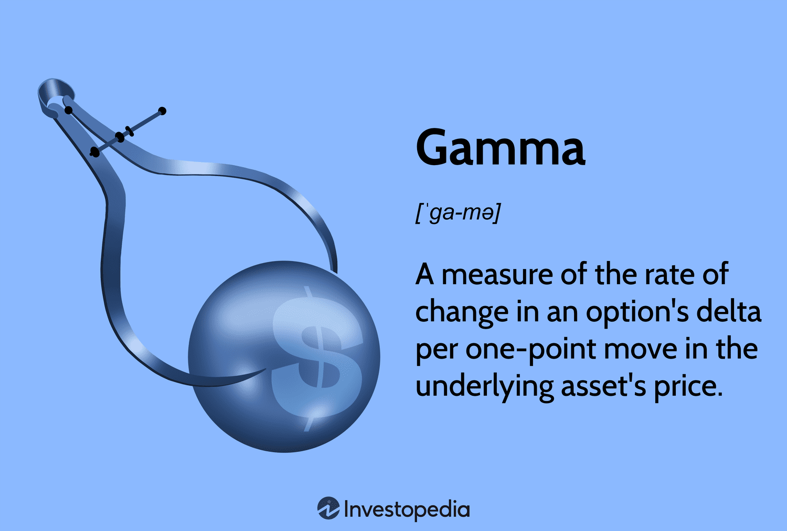

In today's fast-paced financial markets, investors and traders are constantly seeking innovative strategies to maximize returns and manage risks. With the rapid advancement of technology, traditional trading methods have been increasingly supplemented and, in some cases, replaced by algorithmic trading strategies. These strategies utilize complex mathematical models and fast computing power to execute trades at precise moments, optimizing both returns and risk management. One such advanced concept that is frequently employed in these strategies is gamma, a crucial component in options trading.

Gamma is part of the set of metrics known as the "Greeks" in options trading, which provides insights into the behavior of options prices relative to their underlying variables. Specifically, gamma measures the rate of change in an option's delta in response to movements in the price of the underlying asset. Understanding gamma is essential for traders who are managing options portfolios, as it allows them to assess the stability and potential profitability of their positions under varying market conditions.



Algorithmic trading, or algo trading, enhances the application of gamma in investment strategies by automating gamma-driven adjustments. This automation allows for rapid, precise trading actions that would be difficult to implement manually. Algo trading systems can swiftly respond to minute market changes, thereby maintaining desired risk levels while aiming to capture profitable opportunities. By integrating gamma within algorithmic frameworks, traders can systematically hedge their portfolios against unfavorable price movements while capitalizing on favorable conditions.

This article explores the various financial strategies involved in gamma algo trading, offering insights into how investors can effectively utilize these techniques. An understanding of gamma and its role in enhancing investment strategies through algorithmic trading can significantly benefit traders in navigating the complexities of modern financial markets.

## Table of Contents

## Understanding Gamma

Gamma is a fundamental metric in options trading and is crucial for measuring the sensitivity of an option's delta concerning changes in the underlying asset's market price. It is classified among the 'Greeks,' a set of financial measures used by traders to evaluate the risk and potential profitability of options portfolios. Gamma, specifically, provides insight into the curvature of the option's price in relation to the changes in the price of the underlying asset, signifying how the delta responds to these fluctuations.

Mathematically, gamma ($\Gamma$) can be expressed as the second derivative of the option's price ($C$) with respect to the price of the underlying asset ($S$):

$$
\Gamma = \frac{\partial^2 C}{\partial S^2}
$$

This equation underlines gamma's role in indicating the rate of change in delta, which in itself represents the sensitivity of the option's price to a one-unit change in the price of the underlying asset. For traders, a higher gamma value suggests that the delta will experience significant changes with small movements in the asset's price, making it an essential tool for predicting and strategizing around future market moves.

A deep understanding of gamma is indispensable for investors, particularly those engaging in strategies that depend on option moneyness—whether the option is in-the-money, at-the-money, or out-of-the-money. Gamma is typically more pronounced for at-the-money options and tends to diminish as the option moves deeper in or out of the money. This behavior illustrates how gamma helps investors to anticipate shifts in an option's pricing dynamics and its corresponding value in response to market changes.

For instance, an investor holding a portfolio of options with a high gamma must be prepared for large swings in delta as the market price of the underlying asset moves, necessitating quick adjustments to maintain a desired risk profile. This aspect makes gamma a critical element for managing and hedging options portfolios efficiently.

In summary, gamma is not just a measure of risk but also a predictive tool that enhances an investor's ability to manage and optimize options trading strategies. Understanding gamma allows traders to be more responsive and adaptive to market conditions, maintaining agility in a rapidly changing financial landscape.

## Significance of Gamma in Financial Strategies

Gamma plays a pivotal role in risk management and strategic planning by quantifying the curvature of the options pricing relationship. As a second-order Greek, gamma represents the rate of change in an option's delta in response to changes in the underlying asset's price. This attribute makes gamma a critical measure for traders and investors who are keen on predicting large swings in option prices.

Investors value gamma for its ability to enhance forecasting. When market [volatility](/wiki/volatility-trading-strategies) increases, options trading becomes inherently riskier. Gamma provides insights into how rapidly an option's price can change as the underlying asset price deviates from expected trends. For example, a high gamma indicates that an option's delta is highly sensitive to changes in the underlying asset's price, enabling traders to anticipate and prepare for significant price movements. By understanding these dynamics, traders can develop more informed forecasting models, allowing for strategic allocation of capital and resources.

In hedging strategies, gamma is invaluable in maintaining gamma-neutral positions, an approach aimed at minimizing the risks associated with unpredictable price fluctuations. A gamma-neutral portfolio is one where the net gamma is zero, meaning that the overall change in delta due to price movement is negligible. This implies that any price movement in the underlying asset will not significantly affect the overall position's delta, thus stabilizing the portfolio against abrupt changes. While achieving a perfect gamma-neutral position can be challenging due to transaction costs and market dynamics, maintaining a close approximation can significantly enhance risk mitigation.

To manage gamma effectively, traders often use dynamic hedging techniques. This involves frequently adjusting a portfolio's positions to maintain desired exposure levels. Such adjustments require sophisticated algorithms that account for real-time data and execute trades efficiently to capitalize on market movements while minimizing risk. In Python, for instance, traders might use libraries such as NumPy and pandas to perform real-time calculations and implement algorithms that adjust positions based on gamma values. This level of precision and responsiveness underscores the importance of integrating gamma into comprehensive financial strategies, ultimately driving better investment outcomes.

## Algorithmic Trading: Enhancing Gamma Strategies

Algorithmic trading utilizes advanced computer programs to execute trades by adhering to predefined criteria, such as adjustments based on changes in gamma. Gamma, a key concept in options trading, reflects the sensitivity of an option's delta in relation to the price movements of its underlying asset. By implementing algorithmic techniques, traders can rapidly and efficiently rebalance their options portfolios, thereby optimizing returns while maintaining specific risk levels.

One of the prime advantages of using [algorithmic trading](/wiki/algorithmic-trading) for gamma strategies is the capability to handle large volumes of data and execute complex calculations instantaneously. This enables traders to exploit market inefficiencies and adjust their portfolios in response to real-time market changes. For instance, traders focusing on gamma [scalping](/wiki/gamma-scalping)—wherein small profits are collected from frequent trading—can automate the monitoring of delta movements and re-calculate gamma exposure to maintain a neutral position.

Gamma scalping involves a cyclical process of buying and selling the underlying asset to adjust delta, aiming to benefit from small price fluctuations. This strategy becomes particularly effective when market volatility is high. By using algorithms, traders can continuously track these movements and execute trades at the appropriate times. A basic Python algorithm for maintaining a gamma-neutral position could involve:

```python
def adjust_portfolio(options_portfolio, market_data):
    for option in options_portfolio:
        current_delta = calculate_delta(option, market_data)
        current_gamma = calculate_gamma(option, market_data)

        if current_delta is not requirement:
            # Calculate how much of the underlying asset is required to hedge
            hedge_amount = calculate_hedge_amount(option, current_delta)
            execute_trade(hedge_amount, option)

def calculate_delta(option, market_data):
    # Implement formula to calculate delta
    pass

def calculate_gamma(option, market_data):
    # Implement formula to calculate gamma
    pass

def calculate_hedge_amount(option, delta):
    # Implement calculation for delta hedging
    pass

def execute_trade(amount, option):
    # Simulate trading execution
    pass
```

Incorporating these algorithmic elements into trading strategies also facilitates the execution of long gamma strategies, which are advantageous during extreme asset price movements. Long gamma positions benefit traders as the portfolio's delta increases alongside asset price changes, offering gains during periods of high volatility. With algorithmic support, traders can dynamically adjust their positions and efficiently manage the complexities that arise in such volatile environments, ensuring that trades align with their strategic objectives.

The precision and speed facilitated by algorithmic trading not only enhance the efficacy of gamma-based strategies but also contribute to improved overall outcomes by minimizing human errors and leveraging computational power for strategic advantage.

## Implementing Gamma in Algo Trading Strategies

Gamma scalping is a tactical approach in options trading that leverages market volatility. This strategy involves the continuous adjustment of positions to maintain delta neutrality, thereby capitalizing on price swings. By frequently rebalancing these positions, traders can profit from fluctuations in the underlying asset without excessive directional exposure. Essentially, gamma scalping is about managing the gamma of an options portfolio to ensure it responds optimally to changes in market conditions.

A significant advantage of gamma scalping lies in its dynamic nature. Traders can maintain a neutral delta position, meaning the portfolio's sensitivity to small price changes in the underlying asset is minimized. When the market moves, these traders will adjust their positions to return to delta neutrality, thus capturing profits from the volatility of the asset prices. This continuous rebalancing requires robust algorithms capable of swift calculations and rapid trade executions. Here is a simple code snippet illustrating how one might approach delta adjustments using Python:

```python
def calculate_delta(option_position):
    # Placeholder function to calculate the delta of the position
    # Assume we have a function that returns delta for the given option_position
    return option_position.calculate_delta()

def rebalance_position(option_position, target_delta=0.0):
    # Calculate current delta
    current_delta = calculate_delta(option_position)

    # Determine adjustment needed to reach target_delta
    delta_adjustment = target_delta - current_delta

    # Execute trades to adjust delta (this is a placeholder)
    execute_trade(delta_adjustment)

def execute_trade(delta_change):
    # Execute trades required to rebalance the portfolio's delta
    print(f"Adjusting delta by {delta_change}")
```

In contrast, a long gamma position is beneficial during substantial market fluctuations. This strategy involves maintaining a position where the portfolio's delta increases when the asset price changes significantly, allowing traders to gain from large price movements without taking an outright directional stance. Long gamma positions are characterized by having a positive gamma, which means they become more profitable as movements in the underlying asset become larger, regardless of the direction.

Implementing these strategies effectively necessitates the deployment of sophisticated algorithmic systems. These systems must be capable of processing vast amounts of market data to make real-time decisions and adjustments. The algorithms are tailored to identify optimal rebalancing points, ensuring that trades are executed efficiently to maintain desired portfolio characteristics while minimizing transaction costs.

In conclusion, both gamma scalping and long gamma strategies enable traders to harness market volatility, optimizing profitability in different market conditions. Success in these strategies depends heavily on the ability to effectively deploy and manage complex algorithms that can adapt quickly to ever-changing market dynamics.

## Balancing Gamma with Other Greeks

To craft comprehensive trading strategies, gamma must be evaluated alongside other critical Greeks like delta, theta, and vega. These metrics collectively provide a multifaceted view of an options portfolio's risk characteristics and potential return profile. Understanding each Greek's role and interaction is crucial for traders aiming to optimize their strategies.

**Delta** measures the rate of change of an option's price with respect to the change in the price of the underlying asset. It indicates how much the option's price is expected to move for a $1 movement in the underlying asset. By combining gamma with delta, traders can better predict price movements, particularly by anticipating how delta itself will change in response to underlying price shifts. Mathematically, gamma is the derivative of delta with respect to the price of the underlying asset:

$$
\Gamma = \frac{\partial \Delta}{\partial S}
$$

where $\Delta$ is delta, and $S$ is the price of the underlying asset. This relationship helps traders anticipate the sensitivity of delta and hence make informed adjustments to maintain desired exposure levels.

**Theta** represents the sensitivity of the option's price to the passage of time, often known as time decay. Options lose value as they approach their expiration date, a phenomenon more pronounced the closer the options are to expiry. An in-depth understanding of theta's impact is essential to balance the time decay effect when maintaining gamma positions. Managing the interplay between gamma and theta enables traders to shield portfolios from significant erosion of option value due to time decay.

**Vega** measures an option's sensitivity to changes in the volatility of the underlying asset. Volatility is a significant factor affecting option prices, and its unpredictable nature can lead to substantial portfolio value fluctuations. By assessing gamma in conjunction with vega, traders can prepare for and react to volatility-driven changes in option prices, ensuring that their portfolios are better positioned to withstand sudden market movements.

Incorporating these Greeks into algorithmic trading strategies requires sophisticated models and computational efficiency. Traders often employ algorithms that harness these Greeks to generate dynamic hedging strategies that respond to real-time market data. Below is a Python snippet for a basic calculation of the Greeks, which can be expanded upon for more complex trading strategies:

```python
import numpy as np
from scipy.stats import norm

def calculate_greeks(S, K, T, r, sigma, option_type='call'):
    d1 = (np.log(S / K) + (r + 0.5 * sigma**2) * T) / (sigma * np.sqrt(T))
    d2 = d1 - sigma * np.sqrt(T)

    if option_type == 'call':
        delta = norm.cdf(d1)
        theta = -(S * norm.pdf(d1) * sigma) / (2 * np.sqrt(T)) - r * K * np.exp(-r * T) * norm.cdf(d2)
    else:
        delta = -norm.cdf(-d1)
        theta = -(S * norm.pdf(d1) * sigma) / (2 * np.sqrt(T)) + r * K * np.exp(-r * T) * norm.cdf(-d2)

    gamma = norm.pdf(d1) / (S * sigma * np.sqrt(T))
    vega = S * norm.pdf(d1) * np.sqrt(T)

    return delta, gamma, theta, vega

# Example usage
S = 100  # underlying asset price
K = 100  # option strike price
T = 1    # time to expiration in years
r = 0.05 # risk-free interest rate
sigma = 0.2 # volatility
calculate_greeks(S, K, T, r, sigma)
```

In this code, key inputs such as the underlying asset price, strike price, time to expiration, risk-free [interest rate](/wiki/interest-rate-trading-strategies), and volatility are used to compute delta, gamma, theta, and vega, helping traders anticipate how these variables interact in real world market conditions.

## Challenges and Limitations of Gamma Trading

Gamma trading, while offering significant predictive capabilities, is not without its inherent challenges and limitations. One of the primary complexities lies in the calculation of gamma itself, which requires advanced mathematical modeling. Accurately computing gamma necessitates substantial computational resources, as it involves second-order derivatives of an option's value concerning the price of the underlying asset. This can become resource-intensive, especially when dealing with large portfolios or high-frequency trading environments.

Market volatility exacerbates the challenges of gamma trading. In highly volatile markets, maintaining gamma-hedged positions can become extremely difficult. The rapid and unpredictable changes in asset prices require constant recalibration of portfolios, leading to increased transaction costs. These costs can significantly erode the profits derived from gamma trading, especially if the frequency of trades is high.

Model sensitivity is another critical concern. The accuracy of gamma calculations is heavily reliant on the underlying models and assumptions. Inaccurate assumptions about market behavior or incorrect volatility forecasts can lead to significant deviations in gamma values, thereby impacting hedging strategies. Traders need to adopt sophisticated models that can adapt to changing market conditions to mitigate this risk.

Moreover, the ability to maintain gamma-neutral positions—where small changes in the price of the underlying asset do not affect the value of the portfolio—requires intricate balancing. The cost of adjusting portfolios to maintain this neutrality can be prohibitive. Frequent recalibrations needed to address the constant shifts due to market volatility increase the operational complexity and cost.

Despite these challenges, the evolution of sophisticated algorithmic systems provides tools to address these issues. These systems are designed to efficiently process vast amounts of market data, enabling continuous analysis and adjustment of portfolios. They can help traders optimize trade executions, reducing the transaction costs associated with maintaining gamma-hedged positions. Furthermore, advanced algorithms can incorporate real-time market analytics, improving the accuracy of gamma predictions and adjustments.

Algorithmic solutions can also automate many of the processes involved in gamma trading, from calculating the necessary adjustments to executing trades based on predefined strategies. This reduces the manual intervention required and allows traders to respond swiftly to market changes.

In conclusion, while gamma trading presents a set of complex challenges, particularly with respect to computation, volatility, and model sensitivity, the integration of advanced algorithmic methods offers viable solutions to overcome these obstacles. The continuous development of these technologies promises to enhance the effectiveness and efficiency of gamma trading strategies, making them more accessible and profitable for traders.

## Conclusion

Gamma algotrading represents a vibrant and potentially profitable strategy for contemporary investors aiming to refine their financial methodologies. By harnessing the intricacies of gamma and embedding it into algorithmic systems, traders are better equipped to maneuver through market volatility and guard against associated risks. This innovative approach enables dynamic adjustment of positions, facilitating the pursuit of optimized returns and risk management.

Algorithmic trading technologies offer the speed and precision needed to implement complex strategies, such as gamma scalping or maintaining gamma-neutral positions. As technology progresses, developing more sophisticated algorithms will likely enhance the effectiveness of gamma-based trading strategies. These advancements promise to expand the possibilities within financial markets, providing traders with more tools to capitalize on market opportunities.

Incorporating gamma into algorithmic trading requires a robust understanding of both the mathematical underpinnings and practical considerations, such as computational power and data analysis capabilities. As technology continues to evolve, the potential for more refined and innovative gamma-based trading strategies will only increase, offering exciting prospects for those involved in financial markets. With ongoing technological advancements, traders and investors poised to leverage these developments may see promising returns and enhanced risk mitigation in their investment strategies.

## References & Further Reading

[1]: Hull, J. C. (2014). ["Options, Futures, and Other Derivatives."](https://www.amazon.com/Options-Futures-Other-Derivatives-9th/dp/0133456315) Pearson Education.

[2]: Black, F., & Scholes, M. (1973). ["The Pricing of Options and Corporate Liabilities,"](https://www.cs.princeton.edu/courses/archive/fall09/cos323/papers/black_scholes73.pdf) Journal of Political Economy, 81(3), 637-654.

[3]: Wilmott, P. (2006). ["Paul Wilmott Introduces Quantitative Finance."](https://www.amazon.com/Paul-Wilmott-Quantitative-Finance-Set/dp/0470018704) Wiley.

[4]: ["Trading Volatility: Trading Volatility, Correlation, Term Structure and Skew"](https://trading-volatility.com/Trading-Volatility.pdf) by Colin Bennett

[5]: Glasserman, P. (2003). ["Monte Carlo Methods in Financial Engineering."](https://link.springer.com/book/10.1007/978-0-387-21617-1) Springer.