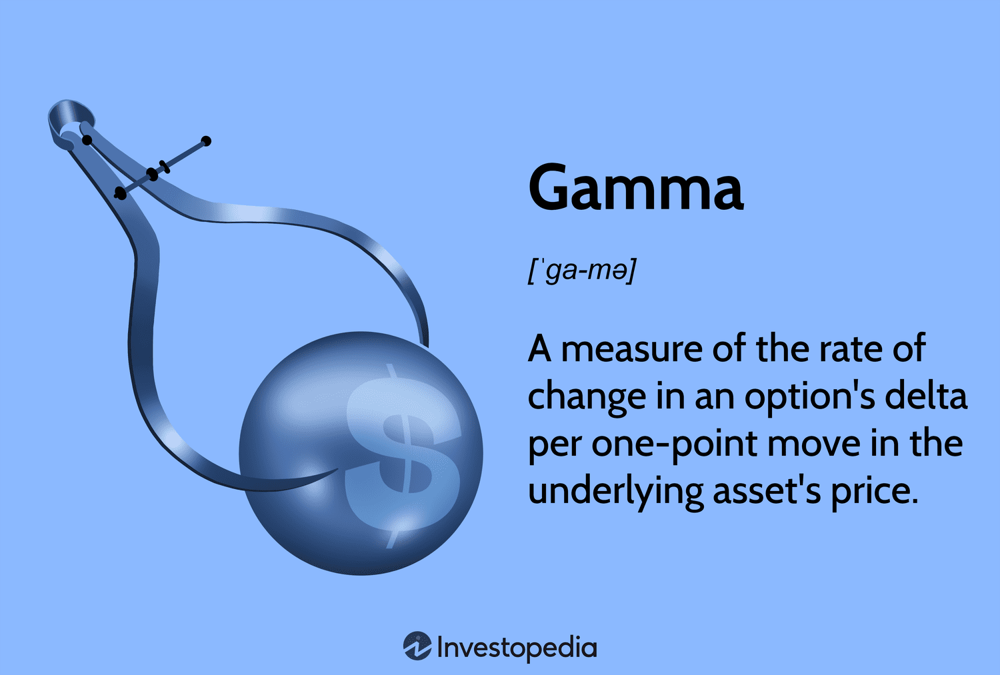

## Table of Contents

## What is gamma in the context of finance?

In finance, gamma is a term used in options trading. It measures how much the delta of an option changes when the price of the underlying stock moves. Delta is the rate at which the price of an option changes relative to the price of the stock. So, gamma helps traders understand how sensitive their option's delta is to changes in the stock price.

Think of gamma as a measure of the stability of an option's delta. If an option has a high gamma, its delta can change a lot even with small movements in the stock price. This can be important for traders because it affects how they manage their risk. A low gamma means the delta is more stable, and the option's price will not change as dramatically with small stock price movements.

## How does gamma relate to options trading?

Gamma is really important in options trading because it shows how much the delta of an option changes when the stock price moves. Delta tells you how much the price of an option will change if the stock price changes by $1. So, gamma is like a measure of how fast the delta is changing. If gamma is high, the delta can change a lot even with small movements in the stock price. This means the option's price can be more unpredictable and sensitive to the stock's price.

Traders use gamma to manage their risk. If you have an option with a high gamma, you need to be more careful because the option's price can swing a lot. On the other hand, if the gamma is low, the delta is more stable, and the option's price won't change as much with small stock price movements. This can help traders decide when to buy or sell options, and how to protect their investments from big losses.

## What does it mean for a portfolio to be gamma neutral?

When a portfolio is gamma neutral, it means the total gamma of all the options in the portfolio adds up to zero. This is important because gamma measures how much the delta of an option changes when the price of the stock moves. If a portfolio is gamma neutral, it means the portfolio's sensitivity to big swings in the stock price is balanced out. This can help traders manage risk better because they won't have to worry as much about the delta changing quickly.

Traders often aim for gamma neutrality to keep their portfolio stable. If the stock price goes up or down a lot, a gamma neutral portfolio won't change as much in value. This is because the positive and negative gammas from different options cancel each other out. By keeping the portfolio gamma neutral, traders can focus on other aspects of their strategy without worrying about sudden changes in their option's delta.

## Why is gamma neutrality important in risk management?

Gamma neutrality is important in risk management because it helps keep a portfolio stable when stock prices move a lot. When a portfolio is gamma neutral, the total gamma of all the options in it adds up to zero. This means the portfolio's sensitivity to big swings in the stock price is balanced out. Traders don't have to worry as much about the delta of their options changing quickly, which can help them avoid big losses.

By keeping a portfolio gamma neutral, traders can manage their risk better. If the stock price goes up or down a lot, a gamma neutral portfolio won't change as much in value. This is because the positive and negative gammas from different options cancel each other out. This stability allows traders to focus on other parts of their strategy without worrying about sudden changes in their option's delta, making their overall trading approach more predictable and controlled.

## How can an investor achieve gamma neutrality?

An investor can achieve gamma neutrality by balancing the gamma of different options in their portfolio. If you have some options with positive gamma, you need to find other options with negative gamma to cancel them out. This means you might buy or sell options that have the opposite effect on your portfolio's overall gamma. For example, if you have a call option with a positive gamma, you could sell another call option or buy a put option with a negative gamma to balance it out.

Keeping track of the gamma of each option and adjusting your portfolio regularly is important to stay gamma neutral. As stock prices change, the gamma of your options will also change, so you might need to buy or sell more options to keep the balance. By doing this, you can make sure your portfolio's sensitivity to big swings in the stock price stays low, which helps manage your risk better.

## What are the challenges of maintaining gamma neutrality?

Maintaining gamma neutrality can be tough because it requires constant attention. As stock prices change, the gamma of the options in your portfolio also changes. This means you need to keep adjusting your positions to keep the total gamma at zero. It's like trying to balance on a seesaw that keeps moving. If you don't make the right adjustments quickly, your portfolio can become unbalanced, and you might lose the risk protection you were aiming for.

Another challenge is the cost of making these adjustments. Every time you buy or sell options to keep your portfolio gamma neutral, you have to pay transaction fees. These costs can add up, especially if you're making a lot of trades. Plus, finding the right options to balance your gamma can be tricky. You need to find options with the opposite gamma effect, which might not always be easy or cheap. This means you have to think carefully about whether the benefits of gamma neutrality are worth the time and money you're spending to maintain it.

## Can gamma neutrality be applied to different types of options?

Gamma neutrality can be used with different kinds of options, like calls and puts. Calls are options that give you the right to buy a stock at a certain price, while puts give you the right to sell a stock at a certain price. Both types of options have gamma, which measures how fast their delta changes when the stock price moves. To make a portfolio gamma neutral, you need to balance the gamma from calls with the gamma from puts. For example, if you have a call option with a positive gamma, you might need a put option with a negative gamma to cancel it out.

The challenge is that the gamma of different options changes as the stock price and time go by. So, you have to keep adjusting your portfolio to stay gamma neutral. This can be harder with some options than others. For example, options that are close to expiring might have higher gamma, which means you have to make more adjustments. But no matter what type of options you're using, the goal is the same: to keep the total gamma of your portfolio at zero so you can manage risk better.

## How does gamma neutrality interact with other Greeks like delta and vega?

Gamma neutrality works together with delta and vega to help traders manage their options portfolio. Delta tells you how much the price of an option changes when the stock price moves by $1. If you're gamma neutral, it means your portfolio's delta won't change too much even if the stock price swings a lot. This can help keep your portfolio stable. But you still need to watch your delta because it can tell you if your options are becoming more or less valuable as the stock price changes.

Vega is different because it measures how much the price of an option changes when the expected volatility of the stock changes. Gamma neutrality doesn't directly affect vega, but it can help you focus more on managing vega. If your portfolio is gamma neutral, you won't have to worry as much about sudden changes in delta, so you can pay more attention to how changes in volatility might affect your options. This can make your overall risk management strategy more effective.

## What are the mathematical models used to calculate gamma and achieve neutrality?

To calculate gamma and achieve gamma neutrality, traders use mathematical models like the Black-Scholes model. The Black-Scholes model is a popular way to figure out the price of options and how they might change. It uses things like the current stock price, the option's strike price, time until the option expires, the risk-free interest rate, and the expected volatility of the stock to calculate the gamma. Gamma is the second derivative of the option's price with respect to the stock price, which means it tells you how fast the delta changes as the stock price moves.

To achieve gamma neutrality, traders use the gamma values from the Black-Scholes model to balance their portfolio. If you have some options with positive gamma, you need to find other options with negative gamma to cancel them out. This means you might need to buy or sell more options to keep the total gamma at zero. As the stock price changes, the gamma of each option will also change, so you have to keep adjusting your portfolio to stay gamma neutral. This can be tricky because it requires constant attention and adjustments, but it helps manage risk by keeping the portfolio's sensitivity to big stock price swings low.

## How does market volatility affect the strategy of gamma neutrality?

Market volatility can make it harder to keep a portfolio gamma neutral. When the stock market is moving a lot, the gamma of options changes more quickly. This means traders have to keep adjusting their portfolio to keep the total gamma at zero. It's like trying to balance on a moving seesaw. If you don't make the right adjustments fast enough, your portfolio can become unbalanced, and you might lose the protection against big price swings that gamma neutrality provides.

Despite the challenges, gamma neutrality can be even more important during times of high volatility. When the market is unpredictable, having a gamma neutral portfolio can help keep things stable. It means your portfolio won't change as much in value even if the stock price goes up or down a lot. This can give traders peace of mind and help them focus on other parts of their strategy without worrying about sudden changes in their options' delta.

## What are the advanced techniques for dynamically adjusting gamma neutrality?

When the market is always changing, traders use advanced techniques to keep their portfolio gamma neutral. One way is to use algorithms and computer programs to watch the gamma of their options all the time. These programs can make trades automatically to keep the total gamma at zero. This helps because the market can move fast, and it's hard for a person to keep up with all the changes. By using technology, traders can make sure their portfolio stays balanced without having to do everything by hand.

Another technique is to use options with different expiration dates. Options that are about to expire can have a higher gamma, which means they change more quickly. By mixing options that expire soon with ones that expire later, traders can keep their portfolio stable. They might also use options on different stocks or indexes to spread out their risk. This way, if one part of the market moves a lot, the other parts can help balance things out. By using these advanced techniques, traders can better manage their risk and keep their portfolio gamma neutral even when the market is unpredictable.

## How do professional traders use gamma neutrality in their trading strategies?

Professional traders use gamma neutrality to keep their portfolios stable, especially when the market is moving a lot. They do this by balancing the gamma of different options in their portfolio. If they have some options with positive gamma, they find other options with negative gamma to cancel them out. This means they might buy or sell more options to keep the total gamma at zero. As the stock prices change, the gamma of their options also changes, so they have to keep adjusting their portfolio to stay gamma neutral. This can be hard work, but it helps them manage their risk better by keeping their portfolio's sensitivity to big stock price swings low.

Traders often use computer programs and algorithms to help them stay gamma neutral. These programs watch the gamma of their options all the time and can make trades automatically to keep the total gamma at zero. This is really helpful because the market can move fast, and it's hard for a person to keep up with all the changes. By using technology, traders can make sure their portfolio stays balanced without having to do everything by hand. They might also use options with different expiration dates and options on different stocks or indexes to spread out their risk. This way, if one part of the market moves a lot, the other parts can help balance things out.

## What is the role of Gamma in Options Trading?

Gamma is a fundamental concept in options trading, representing the rate of change of an option's Delta with respect to changes in the price of the underlying asset. In options trading, Delta measures the sensitivity of an option's price to small changes in the price of the underlying asset, essentially indicating how much the option's price is expected to move per one-point movement in the underlying asset. However, Delta is not static; it changes as the market evolves. This is where Gamma plays a critical role, as it quantifies the rate at which Delta changes as the underlying asset's price fluctuates.

Mathematically, Gamma ($\Gamma$) can be expressed as the second derivative of the option's price ($C$) with respect to the price of the underlying asset ($S$):

$$
\Gamma = \frac{\partial^2 C}{\partial S^2}
$$

Gamma is essential for predicting an option's price change relative to its underlying asset, providing deep insights into both strategy and risk management. A higher Gamma implies that Delta will change significantly with small movements in the underlying asset's price, indicating that the option's sensitivity to price changes is more pronounced. This makes options with higher Gammas potentially more volatile, offering both greater risk and reward opportunities.

Understanding Gamma is critical in distinguishing it from other Greek parameters used in options trading. While Delta measures the first order of sensitivity (i.e., price sensitivity), Gamma measures the second order (i.e., the rate of change in price sensitivity). Other Greeks, such as Theta, Vega, and Rho, measure different sensitivities, such as time decay, [volatility](/wiki/volatility-trading-strategies) effects, and [interest rate](/wiki/interest-rate-trading-strategies) impacts, respectively.

Gamma's significance can be illustrated using a common trading analogy: if Delta is akin to speed, Gamma is akin to acceleration. Traders utilize this analogy to navigate through various market complexities. When options have high Gamma, small changes in the underlying price can lead to significant changes in Delta, which can dynamically alter risk profiles. This is particularly important in risk management, allowing traders to anticipate and react to rapid movements in the markets by adjusting their positions accordingly.

By understanding and utilizing Gamma, traders can fine-tune their options strategies, manage risk more effectively, and optimize trading performance. This involves not only predicting how an option's price will move in response to changes in the underlying asset but also ensuring the portfolio remains balanced in the face of market volatility. Gamma management becomes a powerful tool for traders aiming to maintain control over their portfolios and maximize their strategic outcomes in diverse market settings.

## What are the concepts and techniques of Gamma Neutrality?

Gamma Neutrality involves strategically designing an options portfolio so that its performance remains stable regardless of significant market swings. This is achieved by managing the portfolio's Gamma, which measures the rate of change of Delta, the first derivative of the option's value with respect to the price of the underlying asset. The goal is to achieve a state where the portfolio's aggregate Gamma is zero, thus immunizing it against large movements in the market.

Gamma hedging is a technique used to reach Gamma Neutrality. This involves adjusting the holdings of options and underlying assets to offset positive and negative Gamma values across the portfolio. In practice, achieving a Gamma-neutral state requires accurately calculating the Gamma for each option and combining them in a manner that neutralizes the overall portfolio Gamma. This is particularly important due to the convex nature of options, where the risks can escalate with large price movements of the underlying asset.

One simplistic method to understand Gamma hedging is in the context of a basic options portfolio. Assume a portfolio with various call and put options, each having its own Gamma value. To maintain neutrality, a trader might adjust the quantities of these options or add positions that counterbalance existing Gamma values. The adjustments ensure the cumulative Gamma of the portfolio sums to zero. This concept can be represented mathematically:

$$
\Gamma_{\text{portfolio}} = \sum_{i=1}^{n} \Gamma_i \cdot Q_i = 0
$$

where $\Gamma_i$ is the Gamma of the $i$-th option, and $Q_i$ is its quantity in the portfolio.

Offsetting Gamma values is crucial in dynamic markets. As market conditions fluctuate, so do the Deltas and Gammas of options. Continuous rebalancing of the portfolio is necessary to preserve the Gamma-neutral state. While this strategy can mitigate risk, it requires keen attention to market dynamics and sophisticated modeling to adjust the portfolio efficiently, considering transaction costs and the impact on overall performance.

In practice, implementing and maintaining a Gamma-neutral position is a complex endeavor, often necessitating advanced computational tools and software to automate the tracking and rebalancing processes. Traders may use Python libraries such as NumPy and SciPy for numerical calculations to model and optimize their strategies:

```python
import numpy as np

# Example function to compute total Gamma of a portfolio
def calculate_portf_gamma(gammas, quantities):
    total_gamma = np.dot(gammas, quantities)  # Dot product to calculate total Gamma
    if np.isclose(total_gamma, 0):
        return "Portfolio is Gamma Neutral"
    else:
        return "Gamma Adjustment Needed"

# Example usage
gammas = np.array([0.02, -0.015, 0.01])  # Gamma values of options
quantities = np.array([50, 100, 150])   # Quantities of options
status = calculate_portf_gamma(gammas, quantities)
print(status)
```
This level of precision and automation underscores the significance of Gamma Neutrality as a sophisticated risk management strategy in options trading. It highlights the need for traders to integrate both qualitative insights and quantitative rigor into their trading frameworks.

## References & Further Reading

[1]: Rebonato, R. (2004). ["Volatility and Correlation: The Perfect Hedger and the Fox"](https://archive.org/details/volatilitycorrel0000rebo). Wiley.

[2]: Taleb, N. N. (1997). ["Dynamic Hedging: Managing Vanilla and Exotic Options"](https://www.amazon.com/Dynamic-Hedging-Managing-Vanilla-Options/dp/0471152803). Wiley.

[3]: Hull, J. C. (2018). ["Options, Futures, and Other Derivatives"](https://www.semanticscholar.org/paper/Options%2C-Futures%2C-and-Other-Derivatives-Hull/89bdee500c8623864fc9eb7a471546aa713acc44). Pearson.

[4]: Wilmott, P. (2006). ["Paul Wilmott Introduces Quantitative Finance"](https://www.amazon.com/Paul-Wilmott-Quantitative-Finance-Set/dp/0470018704). Wiley.

[5]: Black, F., & Scholes, M. (1973). ["The Pricing of Options and Corporate Liabilities."](https://www.cs.princeton.edu/courses/archive/fall09/cos323/papers/black_scholes73.pdf) Journal of Political Economy, 81(3), 637-654.