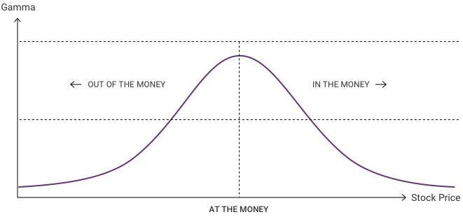

Algorithmic trading in the financial markets has gained significant traction over recent years, bringing precision and efficiency to trading strategies. This form of trading employs complex algorithms that can analyze and execute orders at speeds and frequencies impossible for a human trader. As a result, algorithmic trading can capitalize on minute market inefficiencies and adapt quickly to market changes, which is crucial in a highly dynamic trading environment.

A critical aspect of quantitative trading models used in algorithmic trading is the accurate pricing of derivatives, particularly options. Options are financial derivatives that provide the right, but not the obligation, to buy or sell an asset at a predetermined price before a specified expiration date. Valuing these options accurately is essential to developing effective trading strategies and managing financial risks. Traditional models, like the Black-Scholes model, have been widely used for this purpose. However, these models often rely on the assumption of normally distributed asset returns, a premise that may not always hold true in real-world financial markets.



In scenarios where asset prices deviate from normal distributions, the gamma pricing model presents itself as a pivotal tool. This model addresses some of the limitations of classical pricing models by incorporating the concept of gamma. Gamma, in the context of options pricing, measures the rate of change of an option's delta relative to changes in the underlying asset's price. This allows for more refined predictions of an option's price, accommodating market conditions where volatility and price distributions may exhibit significant deviations from the norm.

This article will explore the integration of gamma pricing within various financial strategies, focusing specifically on its application in algorithmic trading. By leveraging gamma pricing models, algorithmic trading can enhance its ability to manage risks and accurately price options in markets characterized by higher volatility and non-standard price distributions.

## Table of Contents

## Understanding Pricing Models in Finance

Pricing models are a cornerstone of modern finance, facilitating the accurate valuation of securities and derivatives. These models play a critical role in informed decision-making and effective risk management. Traditionally, the Black-Scholes model has been the go-to framework for option pricing. Introduced by Fischer Black and Myron Scholes in 1973, this model assumes that the returns on the underlying asset follow a log-normal distribution and that volatility remains constant over time. While this model is mathematically elegant and widely used, its assumptions do not always align with real-world market conditions, particularly during periods of significant financial turbulence.

A key limitation of the Black-Scholes model is its assumption of normality in return distributions. Market data often exhibit characteristics like skewness, kurtosis, and fat tails, which are not captured under a normal distribution. This can result in pricing discrepancies and misestimated risks, particularly under volatile or unpredictable market conditions.

Selecting an appropriate pricing model is crucial, as it directly impacts trading strategies and outcomes. For portfolios involving derivative instruments, inaccurate pricing can lead to substantial deviations from expected performance. As financial markets become increasingly complex, relying solely on traditional models may lead to suboptimal results.

Gamma pricing seeks to address some of these shortcomings. By accommodating non-normal distributions of asset returns, gamma pricing models aim to deliver more accurate valuations in environments characterized by heightened [volatility](/wiki/volatility-trading-strategies) or skewed distributions. In the context of options, gamma refers to the rate of change of an option's delta with respect to changes in the price of the underlying asset. The gamma of an option is crucial for traders managing complex portfolios, as it affects how sensitive the pricing is to market movements.

The integration of gamma into pricing models transforms the static assumptions of traditional models into a more dynamic framework. This allows market participants to better anticipate changes in implied volatility and adjust their strategies accordingly. Gamma-sensitive models can improve decision-making processes, offering investors a robust toolset to manage risk and optimize returns in a wide range of market conditions.

In summary, understanding and utilizing advanced pricing models are essential for the accurate valuation of derivatives, effective risk management, and the development of sound trading strategies. Gamma pricing, with its consideration of non-standard distributions and market dynamics, provides a valuable enhancement over traditional models, enabling traders and financial analysts to operate with greater precision and confidence in today's complex financial landscape.

## What is the Gamma Pricing Model?

The gamma pricing model is designed to address the limitations of traditional pricing methods by incorporating non-normal distributions of underlying asset prices, specifically leveraging log-normal distributions. This approach refines the pricing of options, particularly in scenarios where asset price movements deviate from normal probabilistic patterns.

Central to the gamma pricing model is the concept of "gamma," which is a second-order derivative measure. Gamma quantifies the rate of change in the option's delta, which itself measures the sensitivity of the option's price to changes in the price of the underlying asset. Mathematically, gamma ($\Gamma$) is expressed as:

$$
\Gamma = \frac{\partial^2 V}{\partial S^2}
$$

where $V$ represents the option's price, and $S$ is the current price of the underlying asset. This second derivative provides deeper insight into how an option's delta will shift as the underlying asset price moves, enabling traders to anticipate the curvature in the option's value curve.

By accounting for gamma, traders and financial strategists can achieve more precise valuations of options. This increased accuracy is crucial in environments where asset price volatility does not conform to classical assumptions, such as during market turbulence or with assets exhibiting skewed returns.

Furthermore, employing the gamma model aids in the effective management of hedge portfolios. The sensitivity information provided by gamma allows traders to construct more balanced hedging strategies that cater to the non-linear characteristics of option pricing. As a result, the model not only enhances valuation accuracy but also supports risk management efforts by highlighting potential exposure to volatility and enabling timely adjustments to hedging positions.

Incorporating such advanced measures into pricing models provides significant advantages for traders, particularly in volatile markets where understanding and predicting price movements is essential. By accommodating for gamma and its effects, financial professionals can navigate non-standard market behaviors and optimize their strategic responses to dynamic trading environments.

## Gamma's Role in Volatility Skew

Volatility skew, or smile, is a notable feature in options markets where implied volatility varies with strike prices. This variation often reflects market participants' expectations of future volatility and indicates potential risks. Implied volatility tends to be higher for deep out-of-the-money (OTM) and in-the-money (ITM) options compared to at-the-money (ATM) options, giving rise to the skew-like pattern.

Gamma, the second-order derivative of the option's price concerning the underlying asset, is intrinsic to managing this volatility skew. It measures how much the delta (first derivative of the option's price) changes when the underlying asset's price shifts. Essentially, gamma acts as the sensitivity of delta, providing insights into the potential acceleration of price changes, which is critical when implied volatilities vary.

When dealing with volatility skew, gamma helps traders adjust their hedging strategies according to market movement predictions. This adaptability comes from gamma's ability to account for the non-linear price behavior inherent in skewed markets. A more positive gamma for an options portfolio enables a faster adjustment to position delta, safeguarding against rapid changes in market conditions.

Consider a scenario where a trader has a portfolio with a high gamma exposure. The trader can anticipate larger fluctuations in delta as the underlying asset price moves, allowing for preemptive risk management adjustments. This is particularly important in markets with pronounced skew, where traditional hedging models may fall short.

To illustrate this concept mathematically, one might consider the relationship of gamma (Γ) in the context of the Black-Scholes model adapted for skewed distributions:

$$
\Gamma = \frac{\partial \Delta}{\partial S}
$$

where $\Delta$ is the option's delta and $S$ is the underlying asset price. In a skewed volatility surface, gamma requires continuous monitoring and adjustment.

For trading strategies relying heavily on gamma, [algorithmic trading](/wiki/algorithmic-trading) platforms excel by allowing for real-time computation and execution. Python, for instance, can be used effectively to programmatically adjust these positions:

```python
def calculate_gamma(S, K, T, r, sigma):
    d1 = (np.log(S / K) + (r + 0.5 * sigma ** 2) * T) / (sigma * np.sqrt(T))
    gamma = np.exp(-d1 ** 2 / 2) / (S * sigma * np.sqrt(2 * np.pi * T))
    return gamma

# Example usage
S = 100  # current asset price
K = 100  # strike price
T = 1    # time to expiration in years
r = 0.05 # risk-free interest rate
sigma = 0.2  # volatility

gamma_value = calculate_gamma(S, K, T, r, sigma)
```

In markets characterized by significant volatility skews, gamma offers a powerful measure for traders to refine their hedging and decision-making frameworks. Utilizing this approach not only enhances the robustness of trading systems but also equips traders with tools needed to respond effectively to market dynamics.

## Algorithmic Trading and Gamma Pricing

Algorithmic trading employs sophisticated algorithms to execute trades with remarkable speed and precision, using pre-set criteria for decision-making. This approach allows traders to swiftly adapt to market dynamics, crucial in today’s fast-paced financial environment. By integrating gamma pricing models into these algorithmic frameworks, traders can significantly enhance their ability to predict and respond to market volatilities, which are common and often unpredictable in financial markets.

Gamma pricing models offer a robust mechanism for understanding the non-linear risks associated with options trading. These models consider the gamma of an option—denoted as Γ—which measures the rate of change of an option's delta with respect to changes in the underlying asset price. In mathematical terms, gamma is represented as:

$$
\Gamma = \frac{\partial^2 C}{\partial S^2}
$$

where $C$ is the option price and $S$ is the underlying asset price. This measure provides traders with insights into how the delta—an indicator of the sensitivity of the option's price to changes in the underlying asset price—might change as the asset price itself fluctuates. Accurate gamma calculations are essential for managing hedge portfolios effectively.

The integration of gamma pricing models into algorithmic trading systems allows for the automatic adjustment of gamma in response to market movements. This level of automation ensures that traders can instantly recalibrate their strategies, thus maintaining an optimized balance between risk and reward. Consider, for example, a Python implementation that utilizes real-time data to adjust trading positions based on gamma calculations:

```python
def calculate_gamma(option_price, asset_price, price_change):
    return (option_price(asset_price + price_change) - 2 * option_price(asset_price) + option_price(asset_price - price_change)) / (price_change ** 2)

def adjust_trading_strategy(gamma, positions, threshold=0.05):
    for position in positions:
        if abs(gamma) > threshold:
            # Adjust the position accordingly
            position.update(gamma)
```

This hypothetical function `calculate_gamma` computes gamma based on small changes in the asset price, while `adjust_trading_strategy` modifies trading positions if the gamma surpasses defined threshold levels. This automated approach not only enhances trading proficiency but also empowers traders to handle market unpredictability with greater confidence.

Incorporating gamma pricing into algorithmic platforms provides a dynamic framework for managing the complexities of volatility. As the financial landscape evolves, these advanced methodologies enable traders to stay competitive, ensuring precision in execution and robust risk management in the face of market volatilities.

## Case Studies: Success Stories Utilizing Gamma Pricing

Several financial institutions have demonstrated the successful application of gamma pricing models within their trading frameworks, showcasing the adaptability and effectiveness of these models in managing risk and enhancing trading outcomes. 

High-frequency trading ([HFT](/wiki/high-frequency-trading-strategies)) firms are at the forefront of employing gamma models to manage risks associated with complex derivative products. These firms operate in a highly competitive environment where speed and precision are critical. By incorporating gamma pricing models, they can effectively navigate the intricacies of options trading, particularly in volatile markets where standard pricing models may fall short. The gamma model provides a nuanced understanding of the sensitivity of option prices to changes in the underlying asset's price, which is crucial for adjusting hedging strategies dynamically and maintaining an optimal risk-reward balance.

For instance, a notable case is that of a major HFT firm that incorporated gamma pricing to optimize its derivative trading strategies. This firm developed an algorithmic trading platform integrating the gamma pricing model to adjust its delta-hedging positions in real-time. By doing so, it was able to manage its exposure to price fluctuations more accurately, thus minimizing potential losses and maximizing profit margins. The use of gamma allowed the firm to better anticipate the curvature effects in their portfolios, particularly in portfolios with a heavy concentration of out-of-the-money options, which tend to have significant gamma exposure.

Implementing gamma pricing in algorithmic trading systems also offers financial institutions the ability to better respond to market anomalies. For example, during a sudden increase in market volatility, the gamma pricing model can help adjust strategies to prevent over-hedging or under-hedging, both of which could lead to substantial financial losses. The real-time adaptability afforded by algorithmic implementation of gamma models has been crucial for firms dealing with frequent and unexpected market shifts.

Overall, case studies emphasize the importance of integrating gamma pricing models for risk management and improved financial outcomes. The ability to dynamically adjust hedging strategies in response to market fluctuations provides a competitive advantage, allowing firms to effectively manage complex risk profiles and optimize their trading strategies in increasingly volatile environments. As the financial landscape continues to evolve, the utilization of sophisticated pricing models such as gamma is likely to become even more prevalent among financial professionals seeking to maintain a competitive edge.

## Conclusion

The gamma pricing model emerges as a refined tool tailored to accommodate the unpredictable nature of market movements that deviate from standard distribution assumptions. By focusing on gamma, which measures the rate of change of an option’s delta in relation to the asset price, traders can better anticipate and respond to market fluctuations. This advanced strategy is instrumental in providing more accurate valuations and efficient risk management.

Integrating the gamma pricing model into algorithmic trading platforms amplifies the ability to swiftly adapt to market changes, enhancing precision in trade execution and optimizing the risk-reward balance. The automation inherent in algorithmic systems allows for rapid gamma adjustments, thereby maintaining the strategic agility necessary in dynamic trading environments.

As the financial markets become increasingly complex, professionals who harness the capabilities of gamma pricing models will find themselves better equipped to navigate evolving challenges. This approach not only refines trading strategies but also fortifies risk management tactics, ensuring that financial professionals can maintain and even sharpen their competitive edge. The gamma pricing model thus stands as a pivotal component in the toolkit of savvy traders aiming for success in modern markets.

## References & Further Reading

[1]: Black, F., & Scholes, M. (1973). ["The Pricing of Options and Corporate Liabilities."](https://www.cs.princeton.edu/courses/archive/fall09/cos323/papers/black_scholes73.pdf) Journal of Political Economy, 81(3), 637-654.

[2]: Hull, J. C. (2018). ["Options, Futures, and Other Derivatives"](https://www.semanticscholar.org/paper/Options%2C-Futures%2C-and-Other-Derivatives-Hull/89bdee500c8623864fc9eb7a471546aa713acc44). Pearson.

[3]: Wilmott, P. (2006). ["Paul Wilmott Introduces Quantitative Finance."](https://www.amazon.com/Paul-Wilmott-Quantitative-Finance-Set/dp/0470018704) John Wiley & Sons.

[4]: Gatheral, J. (2006). ["The Volatility Surface: A Practitioner's Guide."](https://onlinelibrary.wiley.com/doi/book/10.1002/9781119202073) Wiley.

[5]: Haug, E. G. (2007). ["The Complete Guide to Option Pricing Formulas."](https://www.amazon.com/Complete-Guide-Option-Pricing-Formulas/dp/0071389970) McGraw-Hill Education.