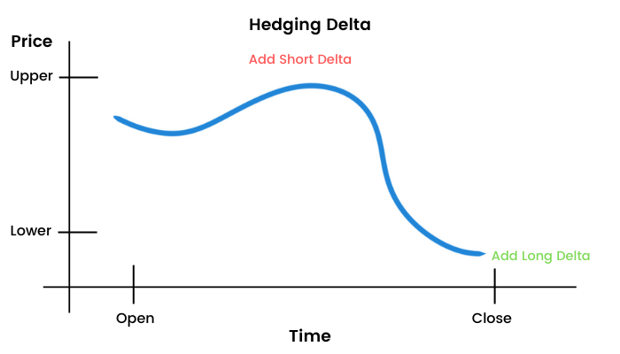

## Table of Contents

## What is gamma scalping?

Gamma scalping is a trading strategy used by options traders to make money from small price movements in the underlying stock. When you buy options, you get something called "gamma." Gamma measures how fast the option's price changes when the stock price moves. Traders who use gamma scalping try to make money by adjusting their options positions as the stock price changes.

Here's how it works: If you own options with a high gamma, even a small move in the stock price can cause a big change in the option's price. Traders will buy or sell the stock to balance out these changes. For example, if the stock price goes up, the value of the option goes up too, and the trader might sell some of the stock to lock in the profit. If the stock price goes down, the trader might buy more stock. By doing this over and over, they can make small profits from each little move in the stock price.

## Why is gamma important in options trading?

Gamma is important in options trading because it tells you how fast the option's price will change when the stock price moves. This is helpful because it shows how sensitive your option is to changes in the stock price. If you have an option with a high gamma, even a small move in the stock price can make the option's price change a lot. This can be good if the stock price is moving in your favor, but it can also be risky if the stock price moves against you.

Traders use gamma to manage their risk and to find ways to make money. For example, if you are an options trader and you want to make money from small price movements in the stock, you might look for options with a high gamma. This way, you can adjust your position quickly to take advantage of these movements. Understanding gamma helps traders decide when to buy or sell options and how to balance their portfolio to make the most profit while managing risk.

## How does gamma scalping work in practice?

Gamma [scalping](/wiki/gamma-scalping) is a way for options traders to make money from small changes in a stock's price. Imagine you own an option that has a high gamma. This means if the stock price goes up a little bit, the option's price will go up a lot. If the stock price goes down a little, the option's price will drop a lot too. To use gamma scalping, you need to keep adjusting your position. If the stock price goes up, you might sell some of the stock to lock in the profit from the option's increased value. If the stock price goes down, you might buy more stock to take advantage of the option's decreased value.

In practice, this means you're constantly buying and selling the stock to balance out the changes in your option's value. For example, let's say you own a call option on a stock, and the stock price goes up. The value of your call option will go up too because of the high gamma. You might sell some of the stock to capture this gain. If the stock price then drops, the value of your call option will drop quickly, but you can buy back the stock at a lower price. By doing this over and over, you can make small profits from each little move in the stock price. It's like riding the waves of the stock price to make money from the option's sensitivity to those changes.

## What are the key components needed for gamma scalping?

Gamma scalping needs a few key things to work well. First, you need options with a high gamma. This means the options will change a lot in price even if the stock only moves a little. High gamma options are usually found when the option is close to being "in the money" and when there's not much time left until the option expires. You also need to be able to trade the stock quickly. This means you can buy and sell the stock easily to adjust your position as the stock price changes.

Another important part is having a good trading plan. You need to know when to buy or sell the stock based on the changes in the option's value. This means keeping an eye on the stock price and being ready to make quick decisions. It can be helpful to use trading software or platforms that let you see real-time prices and make trades fast. With these pieces in place, you can try to make small profits from the ups and downs of the stock price.

## What are the risks associated with gamma scalping?

Gamma scalping can be risky. One big risk is that it needs a lot of trading. You have to buy and sell the stock a lot to keep adjusting your position. This can cost you money because every time you trade, you might have to pay fees or commissions. If these costs add up, they could eat into your profits or even make you lose money.

Another risk is that the stock price can move a lot against you. If the stock price goes down a lot, the value of your option can drop quickly because of the high gamma. This means you could lose money fast. Also, if the stock price doesn't move much at all, you might not make enough money from the small changes to cover your trading costs. So, you need to be ready for big swings in the stock price and have a plan to handle them.

## Can you explain the relationship between delta and gamma in gamma scalping?

Delta and gamma are important for gamma scalping. Delta tells you how much the option's price will change if the stock price moves by one dollar. If you have a call option with a delta of 0.5, that means if the stock goes up by one dollar, your option's price will go up by about 50 cents. Gamma, on the other hand, tells you how fast the delta changes when the stock price moves. If your option has a high gamma, the delta will change a lot even if the stock price only moves a little.

In gamma scalping, you use both delta and gamma to make money. When the stock price goes up, your option's delta goes up because of the high gamma. This means your option becomes more valuable, so you might sell some of the stock to lock in that profit. If the stock price goes down, your option's delta goes down, and you might buy more stock to take advantage of the lower price. By doing this over and over, you can make small profits from the changes in the stock price. So, gamma helps you adjust your delta quickly, which is key to making gamma scalping work.

## What are some common strategies used in gamma scalping?

One common strategy in gamma scalping is to buy options that are close to being "in the money" and have a short time until they expire. These options have a high gamma, which means their delta changes a lot even if the stock price only moves a little. Traders will then buy or sell the stock to balance out these changes. For example, if the stock price goes up, the option's value goes up too, so the trader might sell some stock to lock in the profit. If the stock price goes down, the trader might buy more stock to take advantage of the lower price. By doing this over and over, they can make small profits from each little move in the stock price.

Another strategy is to use a delta-neutral position. This means the trader sets up their options and stock so that the overall delta of their portfolio is zero. When the stock price moves, the delta of the options changes because of the high gamma. The trader then adjusts their stock position to keep the portfolio delta-neutral. This way, they can make money from the changes in the option's value without being too affected by the stock price moving up or down a lot. It's like constantly balancing a seesaw to keep it level, making small profits from each adjustment.

## How does market volatility affect gamma scalping?

Market [volatility](/wiki/volatility-trading-strategies) can make gamma scalping more profitable or riskier. When the stock price moves a lot, it's good for gamma scalping because the high gamma of the options means their value changes quickly. Traders can make more money from these big moves by buying and selling the stock to adjust their positions. If the stock price goes up a lot, the option's value goes up too, and the trader can sell some stock to lock in that profit. If the stock price goes down a lot, the trader can buy more stock to take advantage of the lower price. So, high volatility can give more chances to make money from the small changes in the stock price.

But high volatility also makes gamma scalping riskier. If the stock price moves a lot against you, the value of your options can drop quickly because of the high gamma. This means you could lose money fast. Also, if the stock price moves around a lot, you might have to trade more often to keep adjusting your position. This can cost you more in trading fees or commissions, which could eat into your profits or even make you lose money. So, while high volatility can be good for making profits, it also means you need to be ready for big swings in the stock price and have a good plan to handle them.

## What are the best practices for managing a gamma scalping strategy?

To manage a gamma scalping strategy well, you need to focus on choosing the right options. Look for options that are close to being "in the money" and have a short time until they expire. These options have a high gamma, which means their value changes a lot even if the stock price only moves a little. You should also keep an eye on the stock's volatility. High volatility can give you more chances to make money, but it also means you need to be ready for big swings in the stock price. Make sure you understand how much risk you're taking on and have a plan to handle it.

Another important part of managing a gamma scalping strategy is to trade often and carefully. You need to buy and sell the stock quickly to adjust your position as the stock price changes. This means keeping an eye on the stock price and being ready to make quick decisions. It can be helpful to use trading software or platforms that let you see real-time prices and make trades fast. Remember that every trade can cost you money in fees or commissions, so try to balance making enough small profits with keeping your trading costs low. With these practices, you can try to make the most of gamma scalping while managing the risks.

## How can one measure the success of a gamma scalping strategy?

Measuring the success of a gamma scalping strategy involves looking at how much money you make compared to how much you spend on trading. You need to keep track of all your trades and see if the small profits you make from adjusting your position add up to more than the costs of buying and selling the stock. If you're making more money than you're spending, then your strategy is working well. But if your trading costs are too high or the stock isn't moving enough to make those small profits, you might not be successful.

Another way to measure success is by looking at how well you handle the risks. Gamma scalping can be risky because the stock price can move a lot against you, and the high gamma of your options can make you lose money fast. So, you need to see if you're able to adjust your position quickly enough to take advantage of the stock's movements without losing too much. If you can do this and still make a profit, then your gamma scalping strategy is successful.

## What are the advanced techniques used in gamma scalping?

One advanced technique in gamma scalping is using a delta-neutral strategy. This means setting up your options and stock so that the overall delta of your portfolio is zero. When the stock price moves, the delta of the options changes because of the high gamma. You then adjust your stock position to keep the portfolio delta-neutral. This way, you can make money from the changes in the option's value without being too affected by big moves in the stock price. It's like constantly balancing a seesaw to keep it level, making small profits from each adjustment.

Another technique is using multiple expiration dates. Instead of just trading options that expire soon, you can buy options with different expiration dates. This can help you take advantage of different levels of gamma and delta over time. For example, you might have some options that expire in a week and others that expire in a month. By managing these different options, you can make money from the stock's movements over different time frames. This can be more complex, but it can also give you more chances to profit from gamma scalping.

## How does gamma scalping differ across various financial markets?

Gamma scalping can be used in different financial markets like stocks, [forex](/wiki/forex-system), and futures, but it works a bit differently in each one. In the stock market, gamma scalping involves buying and selling the stock to adjust your options position. The stock market has set trading hours, so you can only trade during those times. Also, stocks can be affected by company news and events, which can cause big price swings that you need to watch out for. In the forex market, gamma scalping involves trading currency pairs. The forex market is open 24 hours a day, so you can trade anytime. This means you can adjust your position more often, but it also means you need to keep an eye on the market all the time. Currency prices can be affected by economic news and global events, so you need to be ready for sudden changes.

In the futures market, gamma scalping involves trading futures contracts instead of stocks or currencies. Futures markets can be more volatile than stocks, which can be good for gamma scalping because it gives you more chances to make money from small price movements. But it also means the risk is higher. Futures contracts have expiration dates, so you need to keep track of when your contracts are expiring and plan your trades around that. Each market has its own rules and trading costs, so you need to understand these differences to use gamma scalping effectively.

## References & Further Reading

[1]: ["Options, Futures, and Other Derivatives"](https://www.amazon.com/Options-Futures-Other-Derivatives-9th/dp/0133456315) by John C. Hull

[2]: ["Option Volatility & Pricing: Advanced Trading Strategies and Techniques"](https://www.amazon.com/Option-Volatility-Pricing-Strategies-Techniques/dp/155738486X) by Sheldon Natenberg