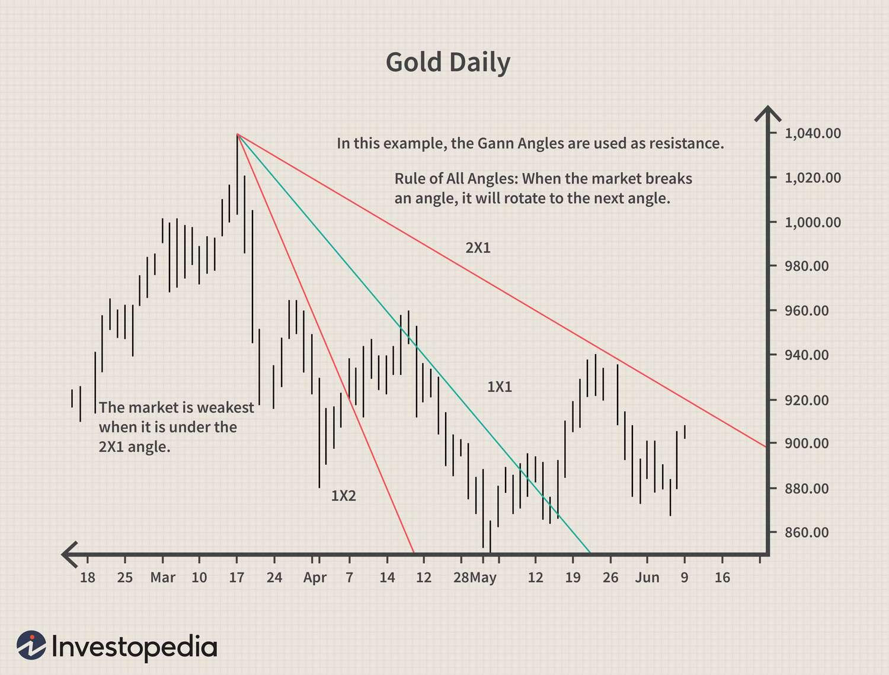

## Table of Contents

## What are Gann Angles and who developed them?

Gann Angles are a type of technical analysis tool used in trading to predict future price movements of stocks, commodities, and other financial instruments. They are drawn on charts to show the relationship between time and price. The idea is that certain angles can help traders understand the strength or weakness of a trend. For example, if the price of a stock is moving along a specific Gann Angle, it might suggest that the trend will continue. If the price breaks through the angle, it could mean the trend is changing.

These angles were developed by W.D. Gann, a famous trader and analyst who lived in the early 20th century. Gann believed that the market followed certain geometric patterns and that by understanding these patterns, traders could make better predictions. He used his knowledge of mathematics, astrology, and geometry to create his trading methods. Gann Angles are just one part of his broader system, which also includes other tools like Gann Squares and Gann Fans. Despite being over a century old, many traders still use Gann's techniques today.

## How are Gann Angles used in technical analysis?

Gann Angles are used in technical analysis to help traders see where a stock or commodity might be going next. They are lines drawn on a chart that show the relationship between time and price. Traders look at these lines to see if the price of something is following a certain angle. If it is, they might think the price will keep going in that direction. If the price moves away from the angle, it could mean the trend is changing.

To use Gann Angles, traders first find important points on the chart, like the highest or lowest price in a certain time. They then draw lines from these points at different angles, usually 1x1, 1x2, and 2x1. The 1x1 angle means the price moves up or down at the same rate as time. The 1x2 angle means the price moves half as fast as time, and the 2x1 angle means the price moves twice as fast as time. By watching how the price interacts with these lines, traders can make guesses about future price movements.

## What is the basic principle behind Gann Angles?

The basic principle behind Gann Angles is that they help traders see how price changes over time. W.D. Gann thought that the market moves in certain patterns that can be shown with lines on a chart. These lines, or Gann Angles, show the relationship between how much time passes and how much the price changes. If a price follows a Gann Angle, it might keep going in that direction. If it moves away from the angle, it could mean the trend is changing.

Traders use Gann Angles by drawing lines from important points on a chart, like the highest or lowest price. They draw these lines at different angles, like 1x1, 1x2, and 2x1. The 1x1 angle means the price moves at the same speed as time. The 1x2 angle means the price moves half as fast as time, and the 2x1 angle means the price moves twice as fast as time. By watching how the price interacts with these lines, traders can guess where the price might go next.

## How do you construct a Gann Angle on a chart?

To construct a Gann Angle on a chart, start by finding an important point on the chart, like the highest or lowest price in a certain time. This point is called the "pivot point." From this pivot point, you draw lines at different angles. The most common angles are 1x1, 1x2, and 2x1. The 1x1 angle means the price moves up or down at the same speed as time. The 1x2 angle means the price moves half as fast as time, and the 2x1 angle means the price moves twice as fast as time.

You can draw these lines using a special tool in your charting software or by hand if you know the right scale. For a 1x1 angle, you would move one unit up or down for every one unit of time. For a 1x2 angle, you move one unit up or down for every two units of time. And for a 2x1 angle, you move two units up or down for every one unit of time. Once you have these lines drawn, you can watch how the price moves in relation to them to help guess where it might go next.

## What are the most common Gann Angles used by traders?

The most common Gann Angles used by traders are the 1x1, 1x2, and 2x1 angles. These angles help traders see how the price of something changes over time. The 1x1 angle is the most important one. It means the price moves up or down at the same speed as time. If the price follows this angle, it might keep going in that direction.

The 1x2 angle is also used a lot. It means the price moves half as fast as time. This angle can show if the price is moving more slowly. The 2x1 angle means the price moves twice as fast as time. This angle can show if the price is moving quickly. Traders watch how the price moves in relation to these angles to guess where it might go next.

## How can Gann Angles help in identifying support and resistance levels?

Gann Angles can help traders find where the price of something might stop going up or down. These places are called support and resistance levels. When the price touches a Gann Angle and then bounces back, that angle can act like a support level if the price is going up, or a resistance level if the price is going down. Traders look at these angles to see if the price will keep following the angle or if it will break through it.

For example, if the price is going up and it hits a 1x1 Gann Angle, it might stop there and then start going up again. This means the 1x1 angle is acting as a support level. If the price is going down and it hits a 1x1 Gann Angle, it might stop there and then start going down again. This means the 1x1 angle is acting as a resistance level. By watching how the price moves around these angles, traders can guess where the price might stop next.

## Can Gann Angles be used to predict price movements, and if so, how?

Gann Angles can be used to predict price movements by showing how the price of something changes over time. Traders draw these angles on charts starting from important points, like the highest or lowest price. By watching how the price moves in relation to these angles, traders can make guesses about where the price might go next. If the price follows a Gann Angle, it might keep going in that direction. If the price breaks through the angle, it could mean the trend is changing.

For example, if a stock's price is moving along a 1x1 Gann Angle, it means the price is going up or down at the same speed as time. If the price stays close to this angle, traders might predict that the price will continue in the same direction. But if the price suddenly moves away from the angle, traders might predict that the price is about to change direction. By using Gann Angles, traders can get a better idea of where the price might be headed.

## What are the limitations and criticisms of using Gann Angles?

Using Gann Angles has some problems. One big problem is that they are based on old ideas and might not work well with today's fast-changing markets. Also, it can be hard to know exactly where to start drawing the angles on the chart. If you start from the wrong place, your predictions might be wrong. Another problem is that Gann Angles are just one way to look at the market. They don't work well by themselves and need to be used with other tools to be useful.

Some people also say that Gann Angles are too hard to use and understand. They need a lot of practice and can be confusing for new traders. Critics also say that the angles might not be based on strong evidence and could be more like guessing than real science. Because of these problems, many traders are careful about using Gann Angles and often use them along with other ways to look at the market.

## How do Gann Angles integrate with other technical analysis tools?

Gann Angles work best when used with other technical analysis tools. Traders often use them along with things like moving averages, trend lines, and chart patterns. For example, if a Gann Angle shows that a stock might keep going up, traders can check if a moving average also shows the same thing. This helps them feel more sure about their guesses. By using Gann Angles with other tools, traders can see the market from different angles and make better decisions.

Another way Gann Angles can be used with other tools is by watching how the price moves around important levels like support and resistance. If a Gann Angle lines up with a support or resistance level, it can make that level even more important. Traders can also use other tools like the Relative Strength Index (RSI) or the Moving Average Convergence Divergence (MACD) to see if the market is overbought or oversold. This extra information can help traders decide when to buy or sell, making Gann Angles more useful in their trading plans.

## What are some advanced techniques for applying Gann Angles in trading?

Advanced traders often use Gann Angles in more complex ways. One way is by combining different Gann Angles to form a Gann Fan. A Gann Fan is made up of several Gann Angles drawn from the same starting point, like 1x1, 1x2, and 2x1. By looking at how the price moves around these different angles, traders can see where the price might change direction or keep going. They also use other Gann tools, like Gann Squares and Gann Grids, to find more exact points where the price might move.

Another advanced technique is using Gann Angles to predict time cycles. W.D. Gann believed that the market follows certain time patterns. Traders can use Gann Angles to find these patterns and guess when the price might go up or down. For example, if a 1x1 Gann Angle shows a strong trend, traders might look at the time it took for the price to move along the angle and use that to predict future movements. By combining Gann Angles with time cycles, traders can make more accurate predictions about the market.

## How have Gann Angles been adapted for use in modern trading software?

Gann Angles have been adapted for use in modern trading software by making them easier to draw and use. In today's software, traders can quickly draw Gann Angles on charts with just a few clicks. They can choose different angles like 1x1, 1x2, and 2x1, and the software will draw them automatically from any point on the chart. This makes it easier for traders to see how the price is moving and make guesses about where it might go next.

These tools also let traders combine Gann Angles with other technical analysis tools. For example, modern software can show Gann Angles along with moving averages, trend lines, and other indicators all on the same chart. This helps traders see the market from different angles and make better decisions. By using Gann Angles in this way, traders can use old ideas in new and more powerful ways.

## What case studies or examples demonstrate the effectiveness of Gann Angles in trading?

One example of Gann Angles being used successfully is in the stock market during a strong uptrend. Let's say a trader noticed that the price of a certain stock was following a 1x1 Gann Angle closely for several weeks. The trader used this angle as a guide and decided to buy the stock when it touched the angle and bounced back up. Over time, the stock kept following the angle, and the trader was able to make a good profit by selling when the price reached a new high. This shows how Gann Angles can help traders see where the price might go next and make smart trading decisions.

Another case study involves using Gann Angles in the commodity market. A trader was watching the price of gold and saw that it was moving along a 1x2 Gann Angle. The trader used this angle to predict that the price would keep going up but at a slower pace. They decided to buy gold when it touched the angle and then sold it when the price broke through the angle and started to go down. By using the Gann Angle, the trader was able to make money by understanding the speed of the price movement and knowing when to get out of the trade.

## What are Gann angles?

Gann angles are a fundamental component of the trading analysis techniques developed by William Delbert Gann. These geometric tools are utilized to predict future price movements by considering the relationship between time and price, forming a critical part of what is known as the Gann Fan. The Gann Fan consists of multiple angles, such as 1:1, 2:1, 3:1, and others, each representing a different rate of price movement over time.

The '1:1' angle, often referred to as the 45-degree angle, is particularly significant. It represents a perfect equilibrium where one unit of price is equated with one unit of time. This balance symbolizes steady market conditions, where price progression matches time progression uniformly. Traders often look to the 1:1 angle for signals of stability or potential shifts, using it as a benchmark for interpreting other angles within the Gann Fan.

Gann Angles are calculated based on the principle of geometric progression, requiring precise formulation to ensure accurate application. A typical Gann angle calculation involves determining the slope or steepness of the angle, which can be expressed using the formula:

$$
\text{Slope (angle)} = \frac{\Delta \text{Price}}{\Delta \text{Time}}
$$

In this context, each Gann angle corresponds to a specific slope value, reflecting different market sentiments. For example:
- A 1:1 angle implies a slope of 1, indicating one unit of price change per one unit of time.
- A 2:1 angle implies a slope of 2, suggesting faster upward price movements relative to time.
- Conversely, a 1:2 angle would indicate a slower price increase or a faster time progression relative to price.

The interpretation of Gann Angles in market analysis involves mapping these angles onto price charts to identify trends, support, and resistance levels. By projecting these angles from significant price points, traders can anticipate potential price reversals or continuations based on historical patterns and expected future movements.

Using Gann Angles effectively requires careful chart scaling and consistent angle measurement. Accurate chart scaling ensures that the angles reflect true market conditions, as misaligned scales can distort the relationships between time and price. Therefore, maintaining the integrity of angles is crucial for reliable analysis.

In modern trading, Gann Angles can be integrated into algorithmic strategies through programming languages like Python, automating the detection and application of these geometric angles. This integration facilitates real-time market analysis, allowing traders to swiftly respond to emerging trends and patterns detected by Gann Angles. This approach leverages computational power to enhance the precision and efficiency of traditional Gann-based methodologies in the dynamic landscape of financial markets.

## How can Gann Angles be applied in algorithmic trading?

Algorithmic trading, or 'algo-trading,' relies on computer programs to execute trades based on predefined criteria, enhancing precision and speed. Integrating Gann Angles into these algorithms necessitates accurate calculation and the consideration of their relationship with current market data. Gann Angles are geometric patterns where the angle is formed between a price point and time period, often used to identify significant support and resistance levels.

### Calculation and Implementation

To utilize Gann Angles in an algorithmic context, it is essential to precisely calculate these angles. The fundamental principle revolves around the concept of price and time being proportionate. For instance, the critical 1:1 angle, representing a 45-degree line on charts, means one unit of price for one unit of time.

To calculate a Gann Angle, consider a formula where:

$$
\text{Angle} = \frac{\Delta \text{Price}}{\Delta \text{Time}}
$$

This simple ratio ensures that as time progresses, price changes maintain a consistent geometric relationship that can be leveraged by algorithms to predict support and resistance levels.

### Automatic Identification of Support and Resistance

Traders can implement Gann Angles in algos to automatically recognize support and resistance levels. By analyzing historical price movements and applying Gann Angles, algorithms can determine potential rebound or turnaround points. For instance, if a market is approaching a key Gann Angle, such as 1:1, 2:1, or 3:1, the algo can flag these as potential levels where market behavior might shift, triggering trades based on predefined strategies.

### Market Turnaround Forecasting

Programming Gann Angles for market turnaround forecasting involves incorporating them into algorithms that regularly scan for specific angle formations. Python scripts, for instance, can process historical and real-time data to continually adjust projections:

```python
import numpy as np
import pandas as pd

def calculate_gann_angle(price_data, time_interval):
    angles = []
    for i in range(len(price_data) - time_interval):
        delta_price = price_data[i + time_interval] - price_data[i]
        angle = delta_price / time_interval
        angles.append(angle)
    return angles

# Example usage with historical data
price_data = pd.Series([20, 21, 22, 23, 24, 25, 26])
time_interval = 1
print(calculate_gann_angle(price_data, time_interval))
```

These programmed angles help algos to not only identify but anticipate points where trend reversals might occur, improving the accuracy of market predictions. This predictive capability is invaluable in volatile markets where rapid changes occur frequently.

By integrating Gann Angles into algo-trading strategies, traders can harness historical price trends and geometric calculations, enriching their toolkit for more informed and timely trading decisions.

## References & Further Reading

[1]: Gann, W.D. (1927). ["The Tunnel Thru the Air or Looking Back from 1940."](https://en.wikipedia.org/wiki/The_Tunnel_Thru_the_Air;_Or,_Looking_Back_from_1940) Lambert Gann Publishing.

[2]: Gann, W.D. (1949). ["45 Years in Wall Street."](https://www.amazon.com/Years-Wall-Street-William-Gann/dp/1578987687) Lambert Gann Publishing.

[3]: Gann, W.D. (1936). ["New Stock Trend Detector: A Review of the 1929-1932 Panic and the 1932-1935 Bull Market."](https://archive.org/details/newstocktrenddet0000wdga) Financial Guardian Publishing Co.

[4]: Poser, Stefan T. (2011). ["Gann’s Angles and the Square of Nine Eminent Tools or Esoteric Stuff? An Analysis on the Dow Jones Industrial Average."](https://pmc.ncbi.nlm.nih.gov/articles/PMC11105687/) 

[5]: Kaufman, Perry J. (2013). ["Trading Systems and Methods."](https://onlinelibrary.wiley.com/doi/book/10.1002/9781119202561) Wiley.