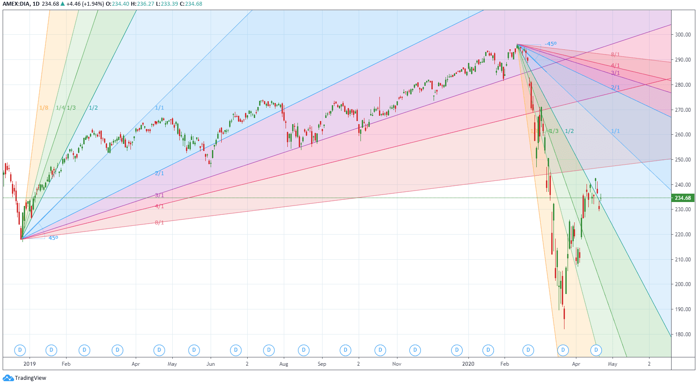

In the ever-evolving world of trading, techniques and strategies are as diverse as the markets themselves. Traders constantly seek methodologies that offer a competitive edge, and one such fascinating approach is the W.D. Gann technical analysis. William Delbert Gann was a notable figure in financial market analysis, renowned for employing geometric shapes and mathematical calculations to forecast market movements.

This article explores the concept of Gann Angles, a cornerstone of Gann's methodology, and their significant role in the advancement of algorithmic trading. Gann Angles are geometric constructs that attempt to depict the relationship between time and price. They provide traders with a framework for predicting potential market movements by analyzing geometric patterns and the spatial relationship between these two critical factors. 



The integration of Gann's methods into algorithmic trading underscores their relevance today. Algorithmic trading, which uses computer programs to execute trades based on pre-set criteria, benefits from the precision and predictive potential of Gann Angles. These angles can be harnessed to identify key support and resistance levels, offering a mathematical basis for predicting market turnarounds and trend continuations.

This article examines the origins, principles, and significance of Gann's approaches while addressing their advantages and potential drawbacks. Understanding how Gann Angles can be applied within modern trading algorithms reveals the potential for improved market predictions and strategic innovation.

## Table of Contents

## Understanding W.D. Gann and His Theories

William Delbert Gann was an influential figure in the history of financial markets, renowned for his unconventional approach to technical analysis that continues to inspire traders today. Born in 1878 in Lufkin, Texas, Gann's career in trading began in the early 20th century. He developed a unique methodology that integrated principles from diverse fields such as geometry, astrology, and ancient mathematics, distinguishing his work from other trading theories of his time.

Gann's analysis primarily aimed to decipher market movements through the lens of time and price symmetry. His theories propose that time and price are inextricably linked, and that successful market predictions hinge upon identifying geometric patterns that align these two dimensions. Gann's infamous geometric angles, known as Gann Angles, serve as a cornerstone of his trading strategy. These angles are constructed by plotting a price movement diagonally over time on a chart, creating a visual representation of time and price symmetry. The concept of a '1:1' angle, or a 45-degree line, is particularly significant as it represents a balanced trajectory where one unit of price equals one unit of time.

Gann's influence extends beyond the technical framework he established. His work prompted a broader exploration of how mathematical and astronomical cycles can inform financial market predictions. Though some consider his methods esoteric, they have sparked a discourse that combines quantitative analysis with historical and astronomical cycles, offering a holistic approach to market prediction.

Throughout his career, Gann was a prolific writer and educator, authoring numerous [books](/wiki/algo-trading-books) and courses that elucidated his theories. Some of his seminal works include "The Tunnel Thru the Air" and "45 Years in Wall Street", which articulate his trading concepts and philosophical insights. Gann's predictions, often documented with precise price and time forecasts, have been credited with notable accuracy, bolstering his reputation in both contemporary and modern trading circles.

Despite Gann's death in 1955, his legacy persists as traders continue to apply and adapt his methodologies to modern markets. The ongoing interest in Gann's work underscores the enduring appeal of his approach and its applicability in various trading environments, providing foundational techniques that many traders find valuable for understanding and predicting market behavior. This fusion of historical methodologies with contemporary trading techniques highlights the lasting impact of Gann's theories and their relevance in today's algorithm-driven financial landscape.

## What Are Gann Angles?

Gann angles are a fundamental component of the trading analysis techniques developed by William Delbert Gann. These geometric tools are utilized to predict future price movements by considering the relationship between time and price, forming a critical part of what is known as the Gann Fan. The Gann Fan consists of multiple angles, such as 1:1, 2:1, 3:1, and others, each representing a different rate of price movement over time.

The '1:1' angle, often referred to as the 45-degree angle, is particularly significant. It represents a perfect equilibrium where one unit of price is equated with one unit of time. This balance symbolizes steady market conditions, where price progression matches time progression uniformly. Traders often look to the 1:1 angle for signals of stability or potential shifts, using it as a benchmark for interpreting other angles within the Gann Fan.

Gann Angles are calculated based on the principle of geometric progression, requiring precise formulation to ensure accurate application. A typical Gann angle calculation involves determining the slope or steepness of the angle, which can be expressed using the formula:

$$
\text{Slope (angle)} = \frac{\Delta \text{Price}}{\Delta \text{Time}}
$$

In this context, each Gann angle corresponds to a specific slope value, reflecting different market sentiments. For example:
- A 1:1 angle implies a slope of 1, indicating one unit of price change per one unit of time.
- A 2:1 angle implies a slope of 2, suggesting faster upward price movements relative to time.
- Conversely, a 1:2 angle would indicate a slower price increase or a faster time progression relative to price.

The interpretation of Gann Angles in market analysis involves mapping these angles onto price charts to identify trends, support, and resistance levels. By projecting these angles from significant price points, traders can anticipate potential price reversals or continuations based on historical patterns and expected future movements.

Using Gann Angles effectively requires careful chart scaling and consistent angle measurement. Accurate chart scaling ensures that the angles reflect true market conditions, as misaligned scales can distort the relationships between time and price. Therefore, maintaining the integrity of angles is crucial for reliable analysis.

In modern trading, Gann Angles can be integrated into algorithmic strategies through programming languages like Python, automating the detection and application of these geometric angles. This integration facilitates real-time market analysis, allowing traders to swiftly respond to emerging trends and patterns detected by Gann Angles. This approach leverages computational power to enhance the precision and efficiency of traditional Gann-based methodologies in the dynamic landscape of financial markets.

## Applying Gann Angles in Algo Trading

Algorithmic trading, or 'algo-trading,' relies on computer programs to execute trades based on predefined criteria, enhancing precision and speed. Integrating Gann Angles into these algorithms necessitates accurate calculation and the consideration of their relationship with current market data. Gann Angles are geometric patterns where the angle is formed between a price point and time period, often used to identify significant support and resistance levels.

### Calculation and Implementation

To utilize Gann Angles in an algorithmic context, it is essential to precisely calculate these angles. The fundamental principle revolves around the concept of price and time being proportionate. For instance, the critical 1:1 angle, representing a 45-degree line on charts, means one unit of price for one unit of time.

To calculate a Gann Angle, consider a formula where:

$$
\text{Angle} = \frac{\Delta \text{Price}}{\Delta \text{Time}}
$$

This simple ratio ensures that as time progresses, price changes maintain a consistent geometric relationship that can be leveraged by algorithms to predict support and resistance levels.

### Automatic Identification of Support and Resistance

Traders can implement Gann Angles in algos to automatically recognize support and resistance levels. By analyzing historical price movements and applying Gann Angles, algorithms can determine potential rebound or turnaround points. For instance, if a market is approaching a key Gann Angle, such as 1:1, 2:1, or 3:1, the algo can flag these as potential levels where market behavior might shift, triggering trades based on predefined strategies.

### Market Turnaround Forecasting

Programming Gann Angles for market turnaround forecasting involves incorporating them into algorithms that regularly scan for specific angle formations. Python scripts, for instance, can process historical and real-time data to continually adjust projections:

```python
import numpy as np
import pandas as pd

def calculate_gann_angle(price_data, time_interval):
    angles = []
    for i in range(len(price_data) - time_interval):
        delta_price = price_data[i + time_interval] - price_data[i]
        angle = delta_price / time_interval
        angles.append(angle)
    return angles

# Example usage with historical data
price_data = pd.Series([20, 21, 22, 23, 24, 25, 26])
time_interval = 1
print(calculate_gann_angle(price_data, time_interval))
```

These programmed angles help algos to not only identify but anticipate points where trend reversals might occur, improving the accuracy of market predictions. This predictive capability is invaluable in volatile markets where rapid changes occur frequently.

By integrating Gann Angles into algo-trading strategies, traders can harness historical price trends and geometric calculations, enriching their toolkit for more informed and timely trading decisions.

## Comparisons: Gann Angles vs. Traditional Trendlines

Gann Angles and traditional trendlines are two distinct methods used in technical analysis to predict market movements. Understanding their differences is essential for traders aiming for optimal trading outcomes.

Trendlines are a straightforward tool often used in technical analysis to identify the direction of past price movement. They are formed by connecting a series of price highs or lows, creating a visual representation of support or resistance levels. For instance, an ascending trendline can be drawn by connecting at least two consecutive higher lows, indicating a bullish trend. Conversely, a descending trendline connects at least two lower highs, signaling a bearish trend. The simplicity of trendlines makes them a go-to for many traders. However, their effectiveness largely depends on the trader's ability to accurately identify significant swing highs and lows.

Gann Angles, however, offer a different perspective by describing the rate of ascent or decline over time. Unlike trendlines that merely connect discrete price points, Gann Angles incorporate both price and time to present a more holistic view of the market's potential direction. They are based on specific geometric angles, such as the 1:1 line, which represents a 45-degree angle signifying that price and time are in perfect balance. This angle reflects the idealized growth or decline rate, where price changes are proportionate to time elapsed. Gann Angles are constructed from a significant price point by increasing the time and price according to the defined angle.

The choice between employing trendlines or Gann Angles should be influenced by the trader's specific goals and the market context. Trendlines are more intuitive and can be quickly drawn, which is advantageous for identifying clear support and resistance areas. They are particularly useful in markets that exhibit clear cyclical patterns where price movements are more predictable in a linear perspective. However, their reliance on past price extremes can sometimes lead to subjective interpretations, especially in volatile markets.

On the other hand, Gann Angles can provide a more dynamic analysis of market conditions by incorporating the rate of change over time. This is particularly valuable in markets with less apparent directional patterns or where time is a critical [factor](/wiki/factor-investing) in the analysis. Gann Angles can help identify precise points where price and time will converge, offering insights into potential market turnarounds or continuation patterns. Additionally, they offer the potential for predictive analytics, which can be a significant advantage in [algorithmic trading](/wiki/algorithmic-trading) where anticipating future movements is crucial.

In conclusion, both methods have their unique applications and can even complement each other when used correctly. While trendlines provide a simplified and direct observation of market levels, Gann Angles offer a more sophisticated analysis by considering the time-price relationship. Traders who effectively integrate both tools into their strategy can gain a comprehensive view of market structures, enabling them to make informed trading decisions.

## Advantages and Limitations of Using Gann Angles

Gann Angles offer several advantages to traders, particularly in their predictive nature and unique perspective on market movements. These geometric angles extend from key price points, providing forecasts on potential price levels and market direction. Their predictive power stems from the fundamental principle of time-price symmetry, which posits that significant price movements often occur when time and price are in relative harmony.

**Advantages**

1. **Predictive Nature**: Gann Angles are appreciated for their forward-looking insights, suggesting potential price movements before they unfold. By plotting these angles, traders can identify support and resistance levels, predicting where price reversals might occur.

2. **Unique Market Insights**: Unlike traditional methods such as moving averages or standard trendlines, Gann Angles consider the element of time as equally important to price, thus offering a multidimensional analysis of market trends. This approach enables traders to gauge the strength and sustainability of a trend beyond simple price action.

3. **Historical Relevance**: Gann Angles have stood the test of time, maintaining relevance across numerous market cycles, which suggests a fundamental robustness to these methods. Traders have applied these angles to historical data to validate their effectiveness in identifying recurring patterns.

**Limitations**

1. **Subjective Interpretation**: The application of Gann Angles requires a degree of subjectivity. Selecting the initial point (pivot) from which angles are drawn can significantly influence the analysis outcome, leading to different interpretations among traders.

2. **Complexity**: Properly applying Gann Angles involves a complex understanding of time and price relations. Accurately calculating these angles necessitates both precision and experience, often proving challenging for new traders.

3. **Skepticism and Variability**: Some traders remain skeptical of Gann's methodologies due to the lack of empirical evidence and the subjective nature of their interpretation. The results can vary widely depending on individual trader skill and market conditions, making it difficult to replicate successes consistently.

4. **Market Specific Application**: Gann Angles may not be equally effective across all markets or timeframes. Their success depends on the inherent volatility and seasonal patterns of the market in question, which can limit their applicability.

Despite these limitations, Gann Angles can be effective when combined with other analytical tools, providing a comprehensive overview of market dynamics. Their predictive capabilities and unique perspective on time-price relations remain valuable for traders seeking to enhance their strategic trading approaches.

## Practical Tips for Trading with Gann Angles

When trading with Gann Angles, maintaining the integrity of these angles on price charts is crucial for accurate analysis. Proper scaling ensures that the angles are depicted accurately relative to time and price. One effective technique is locking the scales on the charts. This involves setting the chart to a fixed aspect ratio, typically ensuring that a unit of time corresponds consistently with a unit of price movement. Many trading platforms allow users to lock the x-axis (time) and y-axis (price) scales to preserve the 1:1 angle, commonly represented by a 45-degree line on the chart, crucial for maintaining the predicted price and time balance.

For best practices, it is also recommended to use logarithmic scales, particularly for charts covering extensive price ranges. A logarithmic scale proportionally represents percentage changes, which is beneficial when analyzing markets with substantial fluctuations. Traders should verify that their charting software supports these features and regularly check the accuracy of the locked scales.

Beyond scale adjustments, a strategic approach involves combining Gann Angles with other technical indicators to bolster analysis and decision-making. Indicators such as Moving Averages, Fibonacci retracements, or RSI (Relative Strength Index) can provide additional confirmation and validation of signals generated by Gann Angles. For example, a crossover of a moving average could corroborate a reversal forecasted by a Gann Fan.

Here's an example of leveraging Python to integrate Gann Angles with moving averages:

```python
import numpy as np
import pandas as pd
from ta.trend import SMAIndicator

def gann_angle(price_series, angle_degree=45):
    # Ensure consistent scaling: 1 unit of price per 1 unit of time for a 45-degree Gann Angle
    time_to_price_ratio = np.tan(np.radians(angle_degree))
    gann_levels = [(price_series.iloc[0] + i * time_to_price_ratio) for i in range(len(price_series))]
    return gann_levels

# Example data: Generating a Gann Angle line
price_data = pd.Series([100, 101, 102, 103, 104, 105])
gann_line = gann_angle(price_data)

# Adding a Simple Moving Average for additional analysis
sma_indicator = SMAIndicator(price_data, window=3)
sma_line = sma_indicator.sma_indicator()

# Visualize Gann Angle and Moving Average
import matplotlib.pyplot as plt

plt.plot(price_data, label='Price')
plt.plot(gann_line, label='Gann 1:1 Line', linestyle='--')
plt.plot(sma_line, label='SMA (3)', linestyle='-')
plt.legend()
plt.title('Price with Gann Angle and SMA')
plt.show()
```

Using this strategy, traders can cross-reference the predictive power of Gann Angles with other technical signals, offering a more robust analysis. Combining these tools requires continuous validation to align with changing market dynamics. Through these methods, traders might achieve a more nuanced understanding of market behaviors and improve their trading accuracy.

## Conclusion

W.D. Gann's techniques, particularly the use of Gann Angles, offer valuable insights into the dynamics of price movements and market trends. By rooting analysis techniques in geometric and mathematical principles, Gann provides traders with tools that transcend traditional chart patterns and indicators. In the context of modern trading, these methods still hold relevance, primarily due to their predictive capabilities that help identify potential support and resistance levels based on time and price symmetry.

Algorithmic trading has breathed new life into these historic strategies. With advancements in technology, traders can now integrate Gann Angles into sophisticated computer algorithms, enabling automated calculations and real-time application in volatile markets. This synergy allows traders to analyze large data sets efficiently and deploy strategies that capitalize on the predictive benefits of Gann methodologies. Custom algorithmic code can be developed to calculate Gann Angles and adjust trading strategies according to predefined criteria. For example, in Python, libraries such as `pandas` and `numpy` can handle historical data processing and angle calculations, facilitating an automated approach in detecting market shifts.

However, while Gann Angles provide a framework for market prediction, their effectiveness enhances when used in conjunction with other analytical tools. Cross-verifying insights from Gann theories with traditional indicators like moving averages, RSI, or Fibonacci retracements can increase the accuracy and reliability of trading signals. By combining the strengths of Gann Angles with diverse analytical inputs, traders can achieve a more comprehensive view of market conditions, making informed decisions that are statistically and historically grounded.

Traders are encouraged to remain open to exploring Gann Angles not as standalone solutions but as complementary methods that integrate well within broader analytical and algorithmic systems. As digital trading continues to evolve, harnessing these principles with innovative tools underscores the enduring importance of Gann's legacy in the pursuit of optimal trading outcomes.

## Frequently Asked Questions (FAQs)

### Frequently Asked Questions (FAQs)

**Q1: What is the 50-percent rule, and how does it apply to Gann Angles?**

The 50-percent rule is a key principle in Gann analysis which suggests that securities will often retrace 50% of their previous movement before continuing their trend. This rule is applied when using Gann Angles to identify potential reversal or continuation points in a market. Traders map the Gann Angles on the chart and monitor how price levels react around the 50% retracement level. If a price consistently finds support or resistance near this midpoint, it might serve as a confirmation of the prevailing trend.

**Q2: What is the significance of the 9:5 rule in market cycles?**

The 9:5 rule is another aspect of Gann's work, related to market cycles. It implies a relationship between time cycles and price movements, suggesting that a nine-day cycle may predict potential changes in a five-day trend (or vice versa). This rule can be crucial when calculating Gann Angles as it provides insights into time and price balance, aiding in the anticipation of market movements. Understanding these cycles helps traders align Gann Angles more effectively with their market strategies.

**Q3: How can Gann Angles be adapted to the forex market?**

Adapting Gann Angles to the [forex](/wiki/forex-system) market involves recognizing the highly liquid and volatile nature of currency pairs. Traders need to set accurate scales on their charts since forex markets operate 24/7 and exhibit different [volatility](/wiki/volatility-trading-strategies) patterns compared to stocks or commodities. To apply Gann Angles effectively, one must calculate the angles based on significant highs and lows and monitor for potential support and resistance levels. It's crucial to implement stop-loss strategies due to the erratic nature of forex trading.

**Q4: How are Gann Angles applied to commodity markets?**

For commodity markets, Gann Angles must be adjusted to the specific characteristics of the commodity being traded. Commodities often have seasonal cycles, which need consideration when plotting Gann Angles. Traders should first determine the key historical high and low points and then calculate the relevant Gann Angles from these data points. Monitoring how prices interact with these angles can assist in determining trends or potential reversal points.

**Q5: What is the reliability of Gann Angles in predicting market movements?**

Gann Angles can provide unique insights into potential price movements, but their reliability largely depends on the trader’s expertise and the accuracy of angle plotting. The method can be quite subjective, requiring precise scale adjustments and interpretations. It is advisable for traders to use Gann Angles in conjunction with other technical indicators and analytical tools to improve reliability and reduce the risk of false signals. Proper [backtesting](/wiki/backtesting) and simulation can also enhance the confidence in Gann-based trading strategies.

## References & Further Reading

[1]: Gann, W.D. (1927). ["The Tunnel Thru the Air or Looking Back from 1940."](https://en.wikipedia.org/wiki/The_Tunnel_Thru_the_Air;_Or,_Looking_Back_from_1940) Lambert Gann Publishing.

[2]: Gann, W.D. (1949). ["45 Years in Wall Street."](https://www.amazon.com/Years-Wall-Street-William-Gann/dp/1578987687) Lambert Gann Publishing.

[3]: Gann, W.D. (1936). ["New Stock Trend Detector: A Review of the 1929-1932 Panic and the 1932-1935 Bull Market."](https://archive.org/details/newstocktrenddet0000wdga) Financial Guardian Publishing Co.

[4]: Poser, Stefan T. (2011). ["Gann’s Angles and the Square of Nine Eminent Tools or Esoteric Stuff? An Analysis on the Dow Jones Industrial Average."](https://pmc.ncbi.nlm.nih.gov/articles/PMC11105687/) 

[5]: Kaufman, Perry J. (2013). ["Trading Systems and Methods."](https://onlinelibrary.wiley.com/doi/book/10.1002/9781119202561) Wiley.