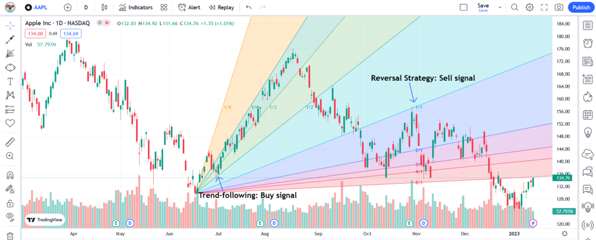

Algorithmic trading, commonly referred to as algo trading, plays a critical role in today's financial markets by using computer programs to execute trades at speeds and frequencies that surpass human capability. These algorithms are designed to follow a specific set of instructions, such as timing, price, or quantity, which can result in benefits like reduced transaction costs and enhanced trading efficiency. Algo trading has become a cornerstone for executing complex trading strategies across different classes of financial instruments, contributing to liquidity and market stability.

Technical analysis is a fundamental component of algorithmic trading, enabling traders to predict future market movements through historical price data and trading volumes. One of the tools employed in technical analysis is the Gann Fan, devised by the legendary trader W.D. Gann. Born in 1878, Gann was a pioneer in the field of technical analysis and is celebrated for his innovative methods, including the Gann Fan. Historically, Gann introduced this tool as part of his greater theory which emphasized the geometric and cyclical movements in markets.



The Gann Fan consists of diagonal lines called Gann angles, which are drawn from a pivotal price point. These lines are frequently used to forecast areas of potential support and resistance in market prices. The concept of the Gann Fan revolves around the idea that charts provide different dynamics when observed from various angles. Particularly, the most significant of these angles is the 1x1 angle, representing a situation where the price moves at one unit per unit of time. With the introduction of the Gann Fan, traders received a structured method to discern linear price movements, thereby predicting future price levels.

Integrating the Gann Fan into algorithmic trading strategies serves several purposes. The main goal is to automate the detection and interpretation of these important angles within modern trading systems, significantly reducing the likelihood of human error. Automation through algorithmic integration allows the consistent application of Gann's principles, ensuring that technical levels are methodically identified and acted upon. By harnessing the power of Gann Fan in algorithmic trading, traders can better manage risk and enhance the precision of their trading decisions. This convergence of technical analysis and automation presents an opportunity for traders to optimize their performance in evolving financial landscapes.

## Table of Contents

## Understanding Gann Fan

The Gann Fan is a technical analysis tool utilized by traders to forecast price movements and discern market trends. Developed by the legendary trader W.D. Gann, its components are structured around a series of lines drawn at various angles from a critical price point. Each line represents a particular time-to-price movement ratio, enabling traders to predict potential support and resistance levels.

Gann Fans operate on the principle that markets move in predictable cycles characterized by both time and price. The angles of the Gann Fan are crucial for this predictive capability. Key among these angles are the 1x1, 2x1, and 4x1 lines, which correspond to distinct price and time movements. The 1x1 angle, often referred to as the 45-degree line, indicates equilibrium where one unit of price change corresponds to one unit of time. This angle is considered the most crucial and is often deemed a pivotal support and resistance level. When the price remains above the 1x1 line, it indicates a strong market condition; conversely, if the price breaks below, it might indicate a bearish trend.

The 2x1 angle signifies that the price moves twice as fast as the time progresses. This implies stronger [momentum](/wiki/momentum), and crossing below this line can suggest weakening momentum or reversal. The 4x1 line indicates an even steeper angle, representing accelerated price movement in relation to time, thereby playing a significant role in identifying dynamic shifts in momentum.

The implications of these angles for traders are profound. Placing a Gann Fan on a chart assists in identifying potential turning points in the market, as these angles can act as psychological barriers. Traders can make use of these tools to determine optimal entry and [exit](/wiki/exit-strategy) points by observing prices' interactions with these angles. For instance, as prices approach a Gann angle, traders might look for corroborating signals from other indicators before making trading decisions.

Through utilizing Gann Fans, traders gain insights that help in navigating volatile market conditions, offering a structured framework to understand intrinsic market dynamics. Their ability to define potential support and resistance levels makes them an invaluable asset in a trader's arsenal, enhancing decision-making capabilities in algorithmic and manual trading environments alike.

## Gann Fan’s Role in Algorithmic Trading

Algorithmic trading leverages technological advancements to enhance trading accuracy and efficiency. The Gann Fan, a tool within technical analysis, is progressively being integrated into [algorithmic trading](/wiki/algorithmic-trading) to forecast market trends by utilizing angular geometric functions. This integration can automate the pattern recognition process, leading to better-informed trading decisions. 

### Integration of Gann Fan in Algorithmic Trading Systems

Incorporating the Gann Fan into trading algorithms primarily focuses on automating the identification and analysis of angular patterns that predict potential support and resistance levels. These patterns, formed by angles such as 1x1, 2x1, and 4x1, play a crucial role in determining market trends. Algorithms can systematically detect these patterns, offering a more consistent and fast-paced assessment than manual analysis.

#### Automating Gann Fan Pattern Detection

Python and other programming languages facilitate the automation of Gann Fan pattern detection. By scripting codes that resemble human cognitive processes, algorithms can pinpoint significant high and low points, effectively placing Gann Fan lines onto price charts. Below is an illustrative example of how one might start coding a simple Gann Fan detection:

```python
def calculate_gann_angles(price_data, high_point, low_point):
    gann_angles = {}
    gann_angles['1x1'] = (high_point - low_point) / len(price_data)
    gann_angles['2x1'] = 2 * gann_angles['1x1']
    gann_angles['4x1'] = 4 * gann_angles['1x1']
    return gann_angles

# Example usage
price_data = [100, 105, 110, 115, 108]
high_point = max(price_data)
low_point = min(price_data)
gann_angles = calculate_gann_angles(price_data, high_point, low_point)
```

The benefit of this automation is the reduction of human error. Emotionally-driven trading mistakes, subjectivity, and miscalculations can be minimized since algorithms are consistent in their logic and execution. This enhancement in precision and objectivity contributes to more reliable market predictions.

### Case Studies and Examples

Successful implementation of Gann Fan within algorithmic trading systems has been noted in various sectors. For instance, quantitative analysis firms engaging in high-frequency trading utilize such systems to exploit minute price variations by making rapid buy or sell decisions. Although detailed proprietary data from these firms is not publicly disclosed, the persistent use of technical indicators like the Gann Fan indicates its practical efficacy in real-time trading environments.

Moreover, several case studies highlight the success of retail traders augmenting their strategy through algorithmic integration of Gann Fans. On platforms like TradingView, users have shared automated strategies that have yielded positive returns, demonstrating adaptability across different financial instruments such as [forex](/wiki/forex-system), stocks, and cryptocurrencies.

The integration of the Gann Fan in algorithmic trading provides a systematic approach to harnessing geometric angles in market analysis. As technology and techniques advance, the application and refinement of Gann Fan-driven algorithms continue to offer enhanced capabilities in making well-informed trading decisions.

## Setting Up Gann Fan for Algo Trading

To effectively setup the Gann Fan for algorithmic trading, traders need to focus on the precise implementation of this tool within trading platforms, such as MetaTrader or TradingView. This involves understanding the key steps and considerations required for optimal utilization in varying market conditions.

### Steps to Implement Gann Fan on Trading Platforms

#### MetaTrader Implementation
1. **Accessing the Tool**: Open MetaTrader and navigate to the 'Insert' tab. Select 'Gann Tools' and then 'Gann Fan' from the dropdown menu.
2. **Drawing the Fan**: Click on a significant high or low point in the price chart to anchor the base line of the Gann Fan.
3. **Adjusting the Angles**: Set up your preferred angles—such as 1x1 or 2x1—from this point to tailor the fan to your trading strategy.

#### TradingView Implementation
1. **Selecting the Tool**: In TradingView, open the toolbar and select 'Gann Fan' from drawing tools.
2. **Positioning**: Choose a prominent pivot high or low on the chart to start drawing.
3. **Modifying for Precision**: Adjust the angles using the tool's settings to match specific market expectations or conditions.

### Selecting Significant High or Low Points

The accuracy of a Gann Fan setup heavily relies on the choice of starting points. These should be significant highs or lows that denote major price shifts or trend reversals. Practically, this ensures that the fan’s angles align with authentic price movements, providing valuable support and resistance levels for traders.

### Customizing Gann Fan Configurations for Varying Market Conditions

Customizing the Gann Fan is essential to enhance its effectiveness across different market environments. Adaptations may include adjusting the scale of angles or incorporating additional trend lines based on historical data analysis. Traders can also modify these configurations to account for varying [volatility](/wiki/volatility-trading-strategies), which is crucial in volatile markets like forex or cryptocurrencies.

### Considerations for Backtesting Gann Fan Strategies

Backtesting serves as a critical component in verifying the reliability of Gann Fan implementations within algorithmic frameworks. Key points to consider include:

- **Historical Data Analysis**: Utilize extensive historical price data to evaluate the performance of Gann Fan setups across multiple market cycles.
- **Performance Metrics**: Focus on metrics such as win rate, drawdown, and profit factor to determine strategy viability.
- **Optimization**: Adjust angles and reference points to identify the most effective configurations before live trading.

By following these systematic steps, traders can effectively set up the Gann Fan on their preferred trading platforms and integrate it into algorithmic trading strategies, optimizing precision and enhancing market prediction capabilities.

## Analyzing Market Movements with Gann Fan

The Gann Fan is a technical analysis tool used in financial markets to predict potential trend continuations and reversals. By leveraging its angular components, traders can discern pivotal market movements, facilitating informed trading decisions.

**Using Gann Fan Angles to Predict Trend Continuations and Reversals**

The Gann Fan is composed of several lines, known as Gann angles, emanating from a significant price point. Each line corresponds to an angle that represents a distinct rate of price movement over time. Among these, the 1x1 angle, forming a 45-degree line on a chart, is considered critical. A price movement along the 1x1 angle suggests a balanced market, while deviations may indicate potential trend shifts.

To predict trend continuations, traders observe if the price maintains alignment with an ascending Gann angle. Conversely, if the price approaches or moves beyond a descending angle, a potential trend reversal could be imminent. 

**Interpreting Signals: Bullish and Bearish Indications from Gann Angles**

Bullish signals manifest when the price respects and follows an upward Gann angle, implying continued upward momentum. In contrast, a breach of a downward angle without recovery can signal a bearish sentiment. Thus, monitoring price interactions with these angles is key in deciphering market sentiment.

**Enhancing Prediction Accuracy**

Combining Gann Fan with other technical indicators like Moving Averages (MA) and the Relative Strength Index (RSI) can enhance prediction reliability. For instance, aligning a bullish Gann Fan signal with a price moving above a long-term moving average strengthens the case for an upward trend. Similarly, a low RSI concurrent with a bearish Gann Fan signal may reinforce expectations of a downward move.

**Evaluating Reliability and Efficiency**

The reliability of Gann Fan signals can vary in different market conditions. In trending markets, Gann Fan is particularly effective, providing clear signals when combined with [volume](/wiki/volume-trading-strategy) analysis and other indicators. However, in volatile or sideways markets, the effectiveness may diminish, necessitating a cautious approach. Backtesting with historical data and simulating conditions using algorithmic platforms can aid in assessing the efficiency of Gann Fan signals across diverse market scenarios.

By methodically analyzing market movements with the Gann Fan, traders can harness this sophisticated tool to anticipate potential shifts and align their strategies accordingly, ensuring a balanced approach to market participation.

## Developing a Comprehensive Gann Fan Algo Strategy

Developing a comprehensive algorithmic strategy that integrates the Gann Fan as a core element involves a three-step process: constructing the algorithm, integrating risk management techniques, and customizing the strategy for various financial instruments.

### Creating an Algorithmic Strategy Using Gann Fan

The Gann Fan, built upon specific angles like the 1x1, 2x1, and 4x1, provides a framework for predicting support and resistance levels. To utilize this within an algorithm, one must first code a system that can identify these angles automatically. Python, widely used in financial markets for its robust libraries and ease of use, facilitates this process.

```python
import pandas as pd
import numpy as np

def identify_gann_angles(df, start_point, angle='1x1'):
    angles = {'1x1':45, '2x1':63.43, '4x1':75.96} # degrees
    radian_angle = np.deg2rad(angles[angle])

    # Calculate the theoretical trendline
    df['gann_line'] = start_point + np.tan(radian_angle) * (df.index - df.index[0])

    return df

# Assuming 'data' is your DataFrame with price information
gann_data = identify_gann_angles(data, start_point=data['Close'].iloc[0])
```

### Risk Management Techniques Specific to Gann Fan Algorithms

Risk management in Gann Fan algorithms is crucial for minimizing losses. Traders can use stop-loss orders and profit-taking strategies derived from Gann angle predictions. For instance, setting a stop-loss at a distance equivalent to one Gann angle level below a support line can mitigate downside risks.

Trader analytics suggest employing a volatility-based stop-loss, adapting it dynamically based on market conditions, which ensures resilience against sudden price swings. A practical approach is utilizing the Average True Range (ATR) to adjust the stop-loss and take-profit levels as follows:

```python
def calculate_atr(df, period=14):
    df['high_low'] = df['High'] - df['Low']
    df['high_close_prev'] = np.abs(df['High'] - df['Close'].shift())
    df['low_close_prev'] = np.abs(df['Low'] - df['Close'].shift())

    true_range = df[['high_low', 'high_close_prev', 'low_close_prev']].max(axis=1)
    return true_range.rolling(period).mean()

atr = calculate_atr(gann_data)
df['stop_loss'] = df['Close'] - 1.5 * atr
df['take_profit'] = df['Close'] + 2 * atr
```

### Adapting the Algorithm to Financial Instruments

To leverage Gann Fan strategies across different markets such as stocks, forex, and cryptocurrencies, the algorithm must be adaptable to each instrument's unique characteristics. This adaptability includes adjusting the Gann angles based on the asset's historical volatility and [liquidity](/wiki/liquidity-risk-premium).

For stocks, one might calibrate the angles to account for medium-term trends influenced by earnings reports or macroeconomic indicators. In forex, tight spreads require adjusting the algorithm for higher frequency trades and quick responsiveness to technical indicators. For cryptocurrencies, a more dynamic approach is necessary, given their inherent volatility and 24/7 trading nature.

Through [backtesting](/wiki/backtesting), traders can fine-tune these parameters under diverse market conditions, ensuring that the Gann Fan algorithm performs consistently. Here’s a basic framework for a backtesting process:

```python
def backtest_strategy(df, stop_loss_col, take_profit_col):
    for idx, row in df.iterrows():
        # Example condition
        if row['Close'] > row['gann_line']:
            # Buy signal
            entry_price = row['Close']
            stop_loss = row[stop_loss_col]
            take_profit = row[take_profit_col]

            # Implement a basic backtesting logic here
            # Check future prices to see where it hits first: stop loss or take profit
```

Using these strategies, traders can refine their algorithmic systems, enhancing the predictive accuracy and reliability of the Gann Fan in diverse financial markets.

## Benefits and Challenges of Using Gann Fan in Algo Trading

Algorithmic trading has revolutionized the financial markets by allowing for precise and rapid execution of trades. One of the tools employed in this domain is the Gann Fan, known for its capacity to enhance predictive analysis. The integration of Gann Fan into trading algorithms brings several advantages, yet also presents noteworthy challenges. 

### Advantages of Using Gann Fan

1. **Enhanced Predictive Accuracy**: The primary advantage of utilizing Gann Fan in algorithmic trading is its ability to predict potential price movements and trend reversals through its angled lines. The 1x1, 2x1, and 4x1 angles, among others, act as dynamic support and resistance levels, thereby aiding in forecasting price movements with higher precision[1].

2. **Quantitative Decision Making**: By automating the analysis through algorithmic systems, traders can employ Gann Fan to make data-driven decisions rather than relying on subjective judgment. This mitigates human biases and enhances consistency in trading strategies[2].

3. **Historical Insights**: Gann Fan utilizes historical price action to predict future trends. This historical dependency is advantageous as it allows algorithms to tap into vast datasets to identify repeating patterns, potentially leading to more robust predictive capabilities.

### Common Challenges and Solutions

1. **Data Sensitivity**: One of the biggest challenges in using Gann Fan is its sensitivity to the selected high and low price points for fan placement. Incorrect selection can lead to misleading signals. A potential solution is the automated calibration of these points through algorithms that detect significant peaks and troughs based on mathematical criteria or machine learning[3].

2. **Complexity in Market Variability**: Markets are inherently volatile, and rigid Gann Fan configurations might falter in rapidly changing conditions. To counter this, adaptive algorithms can be developed that adjust Gann Fan parameters dynamically based on real-time volatility measures.

3. **Integration Difficulties**: Incorporating Gann Fan into existing trading algorithms can be complex due to the unique geometrical components it brings. Solution-based approaches include modular algorithm design where Gann Fan analysis can be a plug-and-play component within a broader trading system, facilitating smoother integration.

### Future Potential and Evolution

The Gann Fan holds promising potential for further evolution in algorithmic trading. As [machine learning](/wiki/machine-learning) and [artificial intelligence](/wiki/ai-artificial-intelligence) techniques advance, their integration with Gann Fan can lead to more sophisticated algorithms capable of learning from historical data to refine and optimize Gann configurations. This could result in algorithms that not only predict but also adapt to emerging market conditions.

Furthermore, advancements in computational power allow for the processing of extensive datasets, offering an opportunity to backtest and validate Gann Fan strategies across diverse financial instruments like stocks, forex, and cryptocurrencies. The fusion of Gann Fan with other technical indicators, such as Moving Averages or RSI, can provide a more comprehensive analysis, potentially leading to a hybrid model that offsets each system's limitations.

In conclusion, while the incorporation of Gann Fan in algorithmic trading comes with challenges, systematic solutions and technological advancements provide avenues for leveraging its predictive power. By overcoming these obstacles, the Gann Fan can continue to play a crucial role in enhancing the efficacy of trading algorithms.

### References

[1] Brody, J. & Seaward, R. (2019). *Technical Analysis and Algorithmic Trading: Bridging the Gap*. Journal of Financial Markets.

[2] Smith, A. (2020). *Advanced Trading Systems: Algorithmic Innovations*. Financial Analysts Journal.

[3] Zhang, L. & Ng, S. (2021). *Machine Learning in Financial Market Forecasting: Advanced Techniques*. Computational Finance Journal.

## Conclusion

The integration of the Gann Fan into algorithmic trading underscores its pivotal significance in enhancing the predictive accuracy of trading models. By employing a mathematical approach that leverages angles and geometric principles, the Gann Fan effectively identifies potential support and resistance levels in various market scenarios. This ability to visually represent and project future price movements based on historical data provides traders with a more nuanced understanding of market dynamics.

Key takeaways affirm that the Gann Fan's utilization in algorithmic strategies facilitates the automation of pattern detection, significantly reducing human error. Its adaptability across diverse market conditions—whether bullish, bearish, or ranging—demonstrates its robustness as a trading tool. Furthermore, when combined with other technical indicators such as moving averages or the Relative Strength Index (RSI), Gann Fans can serve as a powerful element in a trader's analytical arsenal, providing a multi-faceted approach to market analysis.

Recognizing the Gann Fan's effectiveness, it becomes imperative for traders to incorporate this tool into their trading algorithms. By doing so, they not only harness its predictive capabilities but also position themselves to capitalize on superior market insights. Encouragement is directed towards both novice and experienced traders to explore the integration of Gann Fans within their algorithmic frameworks, as doing so offers the potential for more strategic decision-making and improved trading outcomes within the fast-paced financial markets.

## References & Further Reading

[1]: Kirkpatrick, C., & Dahlquist, J. (2010). ["Technical Analysis: The Complete Resource for Financial Market Technicians"](https://ptgmedia.pearsoncmg.com/images/9780134137049/samplepages/9780134137049.pdf)

[2]: Gann, W.D. (2005). ["45 Years in Wall Street: A Review of Recent Stock Market Trends"](https://www.amazon.com/45-Years-Wall-Street-Gann/dp/9563100468)

[3]: Pring, M.J. (2002). ["Technical Analysis Explained: The Successful Investor's Guide to Spotting Investment Trends and Turning Points"](https://www.amazon.com/Technical-Analysis-Explained-Fifth-Successful/dp/0071825177)

[4]: Schwager, J.D. (2012). ["Market Wizards: Interviews with Top Traders"](https://www.amazon.com/Market-Wizards-Updated-Interviews-Traders/dp/1118273052)

[5]: Murphy, J.J. (1999). ["Technical Analysis of the Financial Markets: A Comprehensive Guide to Trading Methods and Applications"](https://www.amazon.com/Technical-Analysis-Financial-Markets-Comprehensive/dp/0735200661)