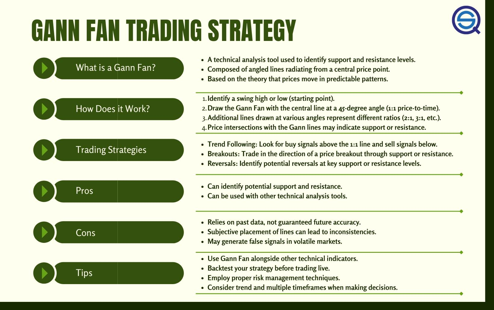

## Table of Contents

## What is the Gann Fan trading strategy?

The Gann Fan is a technical analysis tool used by traders to predict price movements in financial markets. It was developed by W.D. Gann, a famous trader and analyst, who believed that prices move in predictable patterns. The Gann Fan consists of a series of diagonal lines called Gann angles, which are drawn from a significant price point, such as a major high or low. These angles help traders identify potential support and resistance levels, as well as predict future price movements based on the angle of the trend.

Using the Gann Fan, traders look for price reactions at the various Gann angles. If the price respects these angles and bounces off them, it can confirm the strength of the trend. For example, if the price is moving along a 1x1 Gann angle, it suggests a balanced market where one unit of price movement equals one unit of time. If the price breaks through a Gann angle, it might signal a change in trend direction. Traders often combine the Gann Fan with other technical indicators to increase the accuracy of their predictions and make more informed trading decisions.

## Who developed the Gann Fan and why is it significant?

The Gann Fan was developed by W.D. Gann, a well-known trader and analyst from the early 20th century. Gann believed that price movements in financial markets follow specific geometric patterns and angles. He created the Gann Fan to help traders predict these movements by drawing a series of diagonal lines, called Gann angles, from a significant price point on a chart.

The Gann Fan is significant because it helps traders identify potential support and resistance levels, as well as predict future price trends. By observing how prices react to these Gann angles, traders can make more informed decisions about when to buy or sell. The tool's use of angles and time-price relationships makes it a unique and valuable part of technical analysis, often used alongside other indicators to improve trading accuracy.

## How do you draw a Gann Fan on a price chart?

To draw a Gann Fan on a price chart, start by [picking](/wiki/asset-class-picking) a key point on the chart where there was a big high or low price. This could be where the price hit a peak or a bottom that you think is important. Once you have that point, you draw a line straight up from it if it's a low, or straight down if it's a high. This first line is called the 1x1 Gann angle, which means the price moves up or down at the same rate as time goes by.

After drawing the 1x1 line, you add more lines at different angles. These lines go out from the same starting point but at different slopes. You draw lines at angles like 1x2, 1x3, 1x4, and so on, which means the price moves one unit for every two, three, or four units of time. You also draw lines the other way, like 2x1, 3x1, 4x1, where the price moves two, three, or four units for every one unit of time. All these lines together make up the Gann Fan, helping you see where the price might go next based on these angles.

## What are the key components of a Gann Fan?

The main part of a Gann Fan is the starting point. This is a big high or low on the price chart that you think is important. From this point, you draw the first line straight up or down. This line is called the 1x1 Gann angle. It shows that the price moves at the same speed as time. This line is very important because it helps you see if the market is balanced.

After drawing the 1x1 line, you add more lines at different angles. These lines start from the same point but go out at different slopes. You draw lines like 1x2, 1x3, 1x4, which means the price moves one unit for every two, three, or four units of time. You also draw lines the other way, like 2x1, 3x1, 4x1, where the price moves two, three, or four units for every one unit of time. All these lines together make the Gann Fan. They help you see where the price might go next based on these angles.

## How does the Gann Fan help in identifying support and resistance levels?

The Gann Fan helps traders find support and resistance levels by using lines called Gann angles. These lines are drawn from a big high or low point on the price chart. When the price touches or bounces off these lines, it shows that the price might stop or change direction there. The lines act like floors and ceilings for the price. If the price keeps bouncing off a certain line, it becomes a strong support or resistance level.

Traders watch how the price reacts to these Gann angles. If the price hits a line and then goes back up or down, that line is a good place to watch for future price moves. For example, if the price hits a 1x1 line and bounces back up, traders might think that line will act as support again. If the price breaks through a line, it might mean the trend is changing, and that line could become a new support or resistance level. By using the Gann Fan, traders can better guess where the price might go next.

## Can you explain the different angles used in a Gann Fan and their meanings?

The Gann Fan uses different angles to help traders see where the price might go. The main angle is the 1x1, which means the price moves up or down at the same speed as time. This line is important because it shows if the market is balanced. If the price follows this line, it means the market is moving steadily. Other angles like 1x2, 1x3, and 1x4 mean the price moves one unit for every two, three, or four units of time. These lines show slower price moves. On the other side, angles like 2x1, 3x1, and 4x1 mean the price moves two, three, or four units for every one unit of time. These lines show faster price moves.

Traders look at how the price reacts to these different angles. If the price touches a line and bounces back, that line can be a support or resistance level. For example, if the price hits the 1x2 line and goes back up, traders might think that line will act as support again. If the price breaks through a line, it might mean the trend is changing. The Gann Fan helps traders guess where the price might go next by showing these different angles and how the price reacts to them.

## What are the best time frames to use the Gann Fan strategy?

The Gann Fan strategy can be used on different time frames, but it often works best on longer ones like daily, weekly, or monthly charts. These longer time frames give a clearer view of the big trends and major price moves. When you use the Gann Fan on these charts, you can see how the price reacts to the Gann angles over time, which helps you find strong support and resistance levels.

For shorter time frames like hourly or 15-minute charts, the Gann Fan can be trickier to use. The price moves faster on these charts, so the angles might not hold as well. But some traders still use it on shorter time frames to catch quick moves in the market. It's all about finding what works best for you and the market you're trading in.

## How can the Gann Fan be used to predict price movements?

The Gann Fan helps traders predict where the price might go next by using lines called Gann angles. These lines start from a big high or low point on the chart and spread out at different angles. When the price touches or bounces off these lines, it can show where the price might stop or change direction. For example, if the price hits a 1x1 line and then goes back up, traders might think that line will act as support again. By watching how the price reacts to these angles, traders can guess if the price will keep going the same way or if it might change direction.

Traders use the Gann Fan on different time frames, but it often works best on longer ones like daily, weekly, or monthly charts. On these longer time frames, the Gann angles can show big trends and major price moves more clearly. If the price breaks through a Gann angle, it might mean the trend is changing. By combining the Gann Fan with other tools and watching how the price moves over time, traders can make better guesses about future price movements and make smarter trading choices.

## What are some common mistakes traders make when using the Gann Fan?

One common mistake traders make when using the Gann Fan is not picking the right starting point. The Gann Fan works best when you start it from a big high or low on the chart. If you pick the wrong spot, the angles won't line up right, and your predictions might be off. Traders sometimes rush to draw the fan without thinking about which key point on the chart is most important.

Another mistake is relying too much on the Gann Fan alone. The Gann Fan is a good tool, but it works best when you use it with other tools like moving averages or trend lines. If you only use the Gann Fan, you might miss other important signs in the market. Traders need to look at the big picture and not just focus on where the price hits the Gann angles.

## How can the Gann Fan be integrated with other technical analysis tools?

Traders often use the Gann Fan along with other tools to get a better understanding of the market. For example, they might use moving averages to see the overall trend and then check if the Gann angles match up with these trends. If the price is following a Gann angle and also staying above a moving average, it can be a strong sign that the trend will keep going. Another tool traders use with the Gann Fan is trend lines. By drawing trend lines on the chart, traders can see if the Gann angles line up with these lines, which can help confirm where the price might find support or resistance.

Another way to use the Gann Fan with other tools is by looking at indicators like the Relative Strength Index (RSI) or the Moving Average Convergence Divergence (MACD). These indicators can show if the market is overbought or oversold, which can help traders decide if a Gann angle will hold or if the price might break through it. For example, if the price hits a Gann angle and the RSI shows the market is overbought, it might be a good time to sell. By combining the Gann Fan with these other tools, traders can make more accurate predictions and better trading decisions.

## What are the limitations and criticisms of the Gann Fan strategy?

The Gann Fan strategy has some limitations that traders should know about. One big problem is that it can be hard to pick the right starting point for the fan. If you choose the wrong high or low point, the angles won't line up right, and your predictions might not work. Another issue is that the Gann Fan can be too simple for some traders. It doesn't take into account things like news events or big changes in the market that can affect prices. Some traders think it's too old-fashioned and doesn't fit well with today's fast-moving markets.

Critics also say that the Gann Fan can be too subjective. Different traders might draw the fan differently, which can lead to different predictions. This means it's not always clear what the Gann Fan is telling you. Also, the Gann Fan can give false signals, where the price hits an angle but then keeps going without changing direction. This can trick traders into making bad trades. Because of these problems, many traders use the Gann Fan along with other tools to get a better overall view of the market.

## Can you provide a case study or example of the Gann Fan strategy in action?

Let's look at a simple example of how the Gann Fan can be used in trading. Imagine a stock that has just hit a big low at $50. A trader decides to draw a Gann Fan starting from this low point. They draw the 1x1 line straight up from $50, and then add other lines like 1x2, 1x3, and 2x1. Over the next few weeks, the stock price starts to move up and hits the 1x1 line at $55. The price bounces off this line and keeps going up, showing that the 1x1 line is acting as support. The trader sees this and decides to buy the stock, thinking the upward trend will continue.

A few weeks later, the stock price reaches $60 and hits the 1x2 line. This time, the price doesn't bounce back but instead breaks through the line and starts to fall. The trader watches this and decides to sell the stock, thinking the trend might be changing. By using the Gann Fan, the trader was able to see where the price might find support and resistance, and make trading decisions based on how the price reacted to these Gann angles. This example shows how the Gann Fan can help traders predict price movements and make better trading choices.

## References & Further Reading

[1]: Kirkpatrick, C., & Dahlquist, J. (2010). ["Technical Analysis: The Complete Resource for Financial Market Technicians"](https://ptgmedia.pearsoncmg.com/images/9780134137049/samplepages/9780134137049.pdf)

[2]: Gann, W.D. (2005). ["45 Years in Wall Street: A Review of Recent Stock Market Trends"](https://www.amazon.com/45-Years-Wall-Street-Gann/dp/9563100468)

[3]: Pring, M.J. (2002). ["Technical Analysis Explained: The Successful Investor's Guide to Spotting Investment Trends and Turning Points"](https://www.amazon.com/Technical-Analysis-Explained-Fifth-Successful/dp/0071825177)

[4]: Schwager, J.D. (2012). ["Market Wizards: Interviews with Top Traders"](https://www.amazon.com/Market-Wizards-Updated-Interviews-Traders/dp/1118273052)

[5]: Murphy, J.J. (1999). ["Technical Analysis of the Financial Markets: A Comprehensive Guide to Trading Methods and Applications"](https://www.amazon.com/Technical-Analysis-Financial-Markets-Comprehensive/dp/0735200661)