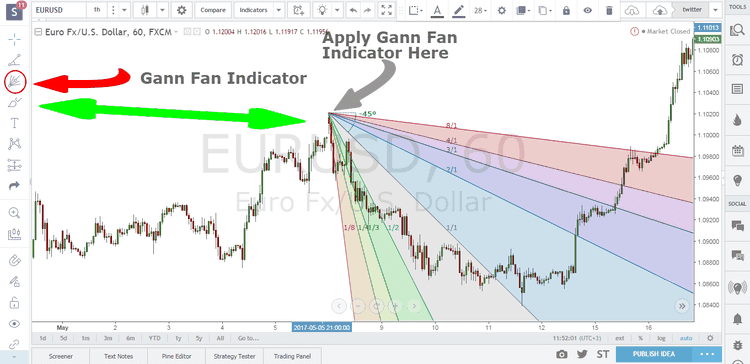

Technical analysis serves as a vital tool in modern financial markets, allowing traders to forecast future price movements by examining historical market data. This discipline employs a variety of techniques and indicators designed to provide insights into market trends and help traders make informed decisions. Among these technical analysis tools, Gann Fans distinguish themselves through their unique geometric and cyclical approach to predicting price fluctuations. Named after their developer, W.D. Gann, these fans use angled lines placed on price charts to determine possible support and resistance levels, ultimately facilitating a deeper understanding of market dynamics.

Algorithmic trading capitalizes on such technical tools to execute trades with high levels of precision. By employing advanced computational techniques and algorithms, this form of trading integrates Gann Fan strategies to enhance the analysis of market conditions. The automation involved in algorithmic trading enables the swift execution of numerous trades, which is crucial in today's fast-paced financial environments. Integrating Gann Fans into these algorithms optimizes trading strategies, allowing for more sophisticated and data-driven approaches to market analysis.



This article examines the integration of Gann Fans within algorithmic trading frameworks, illustrating how such combinations can optimize trading strategies and improve financial risk management. This exploration is aimed at uncovering the potential of Gann Fans as robust tools for interpreting market dynamics through the use of advanced algorithmic techniques. While technical analysis provides the foundation, the application of algorithmic strategies involving Gann Fans offers traders the ability to gain a strategic advantage, utilizing historical patterns to inform future actions and effectively navigate the complexities of financial markets. By leveraging these techniques, traders can achieve more accurate market forecasts and develop comprehensive trading strategies that are well-suited to the evolving financial landscape.

## Table of Contents

## Understanding Gann Fans

Gann Fans are technical analysis tools consisting of angled lines superimposed on price charts, used to determine critical support and resistance levels. Developed by the renowned trader W.D. Gann, these fans rely on a framework of geometric angles—such as 1:1, 2:1, and 4:1—that correlate time and price movements.

The 1:1 line, often represented as the 45-degree angle, holds particular importance within Gann Fans. This angle signifies an equilibrium state between price and time, where price movements are balanced with time progression. This balance is crucial in identifying potential shifts in market trends.

The predictive capability of Gann Fans is rooted in their structured approach to illustrating possible future market turning points. By identifying these angles on a chart, traders can make informed decisions about when to enter or exit trades. The Gann Fan tool operates on the assumption that market behavior follows cyclical patterns. This cyclical nature allows traders to anticipate shifts in market trends by observing how price interacts with the fan lines.

Market movements, seen through the lens of Gann Fans, provide a systematic approach to anticipating changes. The tool encourages a perspective of the market as a series of predictable cycles, aiding traders in forecasting future movements with structured strategic insights.

## Gann Fan's Role in Algorithmic Trading

Algorithmic trading integrates technical indicators to enhance decision-making processes through automation and precision. Gann Fans are among these tools, providing a unique geometric approach to predicting market trends. When incorporated into [algorithmic trading](/wiki/algorithmic-trading) systems, Gann Fans automate the identification of significant market levels and patterns, which significantly aids in minimizing human error typical in manual analysis. 

The integration process involves coding algorithms to detect and react to specific Gann angles, such as the 1:1 or 2:1 lines, which correspond to vital support and resistance levels. This systematic approach ensures that trading decisions are made consistently and are data-driven, allowing for improved market predictions. For instance, traders can program algorithms in Python to monitor price movements and execute trades once these movements align with predetermined Gann angles. Such an algorithm might look like the following pseudocode:

```python
def gann_fan_trading(prices, angle_set):
    for price in prices:
        for angle in angle_set:
            if price_meets_angle_criteria(price, angle):
                execute_trade(price)
```

Here, `price_meets_angle_criteria` is a function that checks if the current price aligns with a specified angle, and `execute_trade` performs the trading action.

As technology progresses, the integration of Gann Fans with algorithmic trading systems continues to evolve. The combination of advanced analytics and [machine learning](/wiki/machine-learning) techniques augments the predictive capacity of these systems, allowing traders to gain insights into market behavior more accurately. This evolution not only enhances the precision of trading algorithms but also provides a framework for adapting to fluctuations in market conditions. The resulting synergy offers improved market prediction capabilities and a competitive edge for traders capitalizing on algorithmic strategies.

## Setting Up Gann Fan for Algo Trading

To implement Gann Fans in algorithmic trading, it is crucial to utilize precise setups on trading platforms such as MetaTrader and TradingView. This process begins by identifying significant price points, particularly historical highs or lows, as these serve as anchor points for the Gann angles relevant to specific trading strategies. The placement of these angles, such as 1x1, 2x1, or 4x1, determines how potential market trends are anticipated, requiring precision and attention to the chosen timeframes and asset types.

Customization of Gann Fan settings is vital to adapt to varying market conditions like [volatility](/wiki/volatility-trading-strategies) and [liquidity](/wiki/liquidity-risk-premium). Traders can adjust the scale and angle configurations to fit the specific characteristics of the asset being traded. This adaptability allows the Gann Fan to provide more accurate predictions by aligning with the unique cyclical patterns of different markets. In platforms like TradingView, this customization involves altering the angle's slopes directly within the software, while MetaTrader often requires coding scripts with MQL4 or MQL5 to implement these changes.

Backtesting is an indispensable step in this process, involving the use of extensive historical data to simulate Gann Fan strategies. Backtesting enables traders to evaluate how their strategies would have performed in the past, providing insights into their potential future effectiveness. The analysis of historical price data helps identify patterns and market behaviors that can be exploited through Gann Fans, residing in platforms' [backtesting](/wiki/backtesting) environments or using libraries like `[backtrader](/wiki/backtrader)` in Python for more tailored assessments.

An accurate implementation of Gann Fans necessitates a meticulous assessment of performance metrics and strategic optimizations. Performance evaluation could involve metrics such as the Sharpe Ratio, Maximum Drawdown, and Trade Win Rates, which are instrumental in determining the viability of a strategy within the algorithmic framework. Strategic adjustments might include optimizing the placement of Gann angles, calibrating the risk exposure through mechanisms like stop-loss orders, and refining entry and [exit](/wiki/exit-strategy) points based on observed data efficacy.

Overall, setting up Gann Fans in algorithmic trading systems requires a blend of technical analysis and computational proficiency to optimize the use of this historical tool in contemporary financial markets.

## Analyzing Market Movements with Gann Fan

Gann Fans play a pivotal role in the analysis of market movements by utilizing a series of angled lines that intersect price charts. These lines assist in predicting trend continuations and reversals. The primary mechanism through which Gann Fans operate involves the key angles that represent potential levels of support and resistance. The most critical of these is the 1x1 line, denoted as a 45-degree angle on the chart, which signifies an equilibrium between time and price movements. When price actions align with this line, traders can interpret potential bullish or bearish signals based on whether the price stays above or falls below it.

An effective analysis typically involves combining Gann Fan assessments with other technical indicators such as the Relative Strength Index (RSI) or moving averages. This multifaceted approach enhances trading predictions by providing a more comprehensive view of the market dynamics. For instance, a bullish signal from the Gann Fan may gain further validation if it coincides with a moving average crossover or an RSI reading moving from an oversold condition.

However, it is crucial to note that the reliability of Gann Fans can vary under different market conditions. For example, in highly volatile markets, the predictive capacity of Gann angles might be less dependable, necessitating traders to adapt their strategies. This adaptability often includes recalibrating angle alignments or re-selecting reference points to maintain prediction accuracy.

By leveraging geometric principles, Gann Fans offer traders a systematic methodology for interpreting market potentialities. Traders use this tool to map historical price data and project future price paths, borrowing from mathematical concepts that govern point and line relationships on a Cartesian plane. The utilization of such geometric frameworks in analyzing financial markets underscores the mathematical foundations upon which technical analysis tools like Gann Fans are built. Consequently, traders equipped with these analytical tools can better navigate and anticipate market trends, thereby optimizing their trading strategies.

## Developing a Comprehensive Gann Fan Algo Strategy

A comprehensive Gann Fan strategy in algorithmic trading requires the development of sophisticated algorithms capable of identifying and leveraging fan angles effectively. This involves integrating risk management techniques, such as placing stop-loss orders and adjusting parameters to account for volatility. The dynamic nature of the financial markets necessitates algorithms that can adapt to different financial instruments and thrive despite varying levels of market volatility.

### Algorithm Construction

The cornerstone of a Gann Fan algorithm is its ability to analyze price movements in relation to specific fan angles, such as the 1:1 and 2:1 lines. These angles function as guides for predicting market trends and potential reversal points. By designing algorithms that can recognize when a market price intersects or approaches these critical angles, traders can make informed decisions on entry and exit points.

### Risk Management Integration

To mitigate potential losses, risk management strategies must be seamlessly integrated into the algorithm. Techniques such as stop-loss placement are vital, allowing the algorithm to automatically close positions that become unfavorable. Moreover, algorithms must incorporate volatility-adjusted parameters to dynamically recalibrate stop-loss points and position sizes based on current market conditions, thereby optimizing profitability and minimizing risk exposure.

### Instrument-Specific Adaptation

Different financial instruments exhibit unique characteristics and levels of volatility, requiring bespoke adjustments in trading algorithms. For instance, stocks, currencies, and commodities may react differently to market stimuli and possess distinctive trading patterns. Algorithms should be programmed to recognize these idiosyncrasies and adapt accordingly. Implementing machine learning models like Random Forest or Gradient Boosting can assist in identifying patterns specific to the instrument being traded, enhancing the algorithm's adaptability.

```python
# Python example: Random Forest for market prediction
from sklearn.ensemble import RandomForestClassifier
import pandas as pd

# Load historical market data
data = pd.read_csv('market_data.csv')

# Assume data has features and target columns
features = data[['open', 'high', 'low', 'close']]
target = data['trend_direction']

# Initialize and fit the Random Forest model
rf_model = RandomForestClassifier(n_estimators=100, random_state=42)
rf_model.fit(features, target)

# Predict market trend using the trained model
predicted_trend = rf_model.predict(features)
```

### Backtesting for Algorithm Refinement

Before deploying a Gann Fan algorithm, rigorous backtesting using extensive historical data is essential. This process allows traders to evaluate the robustness, consistency, and accuracy of the strategy across various market scenarios. By simulating past market conditions, traders can identify potential flaws and optimize algorithm parameters, resulting in a strategy better aligned with historical trends.

### Continuous Tuning and Adjustment

Financial markets are inherently dynamic, requiring continuous algorithm tuning and practice to maintain effectiveness in evolving market conditions. Regular updates and refinements based on new data and emerging market trends are essential for keeping the Gann Fan strategy pertinent. Incorporating adaptive algorithms that learn from trading outcomes can further enhance strategy efficiency.

By following these principles, traders can develop a comprehensive Gann Fan strategy that not only captures market opportunities but also efficiently manages risk, facilitating informed and timely trading decisions.

## Benefits and Challenges of Using Gann Fan in Algo Trading

Gann Fans are valuable in algorithmic trading as they enhance predictive accuracy by providing dynamic support and resistance levels. This enhances quantitative decision-making and reduces the impact of human biases. By systematically analyzing market patterns and trends, algorithmic strategies can assess and predict market movements with greater consistency.

However, there are challenges in using Gann Fans. One significant issue is the sensitivity to anchor point selection, which can significantly affect the predictive outcomes. The market's inherent variability poses another challenge, as real-time conditions can diverge from historical patterns used to calibrate the tools.

Addressing these challenges involves developing adaptive algorithms. These algorithms can automatically calibrate based on fluctuating market metrics and historical insights. By adjusting in real-time, such adaptations can mitigate errors and improve the robustness of predictions.

Future advancements in AI and machine learning are anticipated to further optimize the integration of Gann Fans in trading algorithms. AI technologies, with their ability to process and learn from vast data sets, can enhance the precision of Gann Fan-derived insights. Machine learning models can refine the placement of anchor points and adjust for market variability, potentially increasing the reliability of predictions and strategy efficiency. Through these technological enhancements, Gann Fans remain a promising component in the toolkit of algorithmic traders.

## Conclusion

The integration of Gann Fans in algorithmic trading offers traders a robust mathematical framework for anticipating market dynamics by leveraging geometric relationships. By utilizing Gann Fans alongside other technical indicators, such as Relative Strength Index (RSI) or moving averages, traders can enhance forecast accuracy and develop comprehensive trading strategies. This multifaceted approach provides a more complete analysis of market trends, enabling informed decision-making that can adapt to varying market conditions.

For both novice and seasoned traders, incorporating Gann Fans into their trading arsenal can optimize outcomes when combined with effective risk management techniques. By setting appropriate stop-loss limits and adjusting to market volatility, traders can mitigate potential losses and capitalize on profitable opportunities. The systematic nature of Gann Fans, with their ability to define dynamic support and resistance levels, reduces the influence of emotional biases, thereby facilitating more objective trading practices.

The enduring relevance of Gann Fans highlights the significance of geometric principles in informing present-[day trading](/wiki/day-trading-spy) decisions. As a tool that has stood the test of time, Gann Fans continue to provide valuable insights into market behaviors, derived from the cyclical patterns they illustrate. By identifying key angles and lines of equilibrium, traders gain the ability to anticipate market turning points with greater precision.

As the market landscape evolves with advancements in technology and data analysis, Gann Fans maintain their position as a valuable analytical tool. Their adaptability allows traders to keep pace with dynamic market changes, ensuring an analytical edge necessary for strategic advancements. Whether through manual analysis or integration within sophisticated algorithmic systems, Gann Fans offer a time-tested method for navigating the complexities of financial markets.

## References & Further Reading

[1]: "Gann Explained: What is a Gann Fan?" on Investopedia. [https://www.investopedia.com/terms/g/gann-fan.asp](https://www.investopedia.com/terms/g/gann-fans.asp)

[2]: "The Definitive Guide to Position Sizing" by Van K. Tharp. It covers risk management, which is relevant to trading strategies involving tools like Gann Fans.

[3]: Pring, M. J. (2002). "Technical Analysis Explained: The Successful Investor's Guide to Spotting Investment Trends and Turning Points." This book provides a broader context for technical analysis tools.

[4]: Hutchinson, M., & Dein, C. (2009). "Gann Made Easy." This book offers insights into the application of Gann's principles in modern trading.

[5]: "Algorithmic Trading: Winning Strategies and Their Rationale" by Ernie Chan. This book explores algorithmic trading strategies, which can be integrated with tools such as Gann Fans.

[6]: Pardo, R. (2008). "The Evaluation and Optimization of Trading Strategies." This book discusses the backtesting and optimization of trading strategies, which is relevant for algorithmic trading using Gann Fans.

[7]: Murphy, J. J. (1999). "Technical Analysis of the Financial Markets: A Comprehensive Guide to Trading Methods and Applications." This is a fundamental text on technical analysis and trading strategies, including the use of geometric tools like Gann Fans.

[8]: Cootner, P. (1964). "The Random Character of Stock Market Prices." This provides a foundational understanding of the statistical nature of market movements.

[9]: "The Trading Book: A Complete Solution to Mastering Technical Systems and Trading Psychology" by Anne-Marie Baiynd. Discusses integrating technical systems like Gann Fans into trading psychology.

[10]: "Security Analysis: Sixth Edition" by Benjamin Graham and David Dodd. An essential read for understanding market analysis from a fundamental and technical perspective.