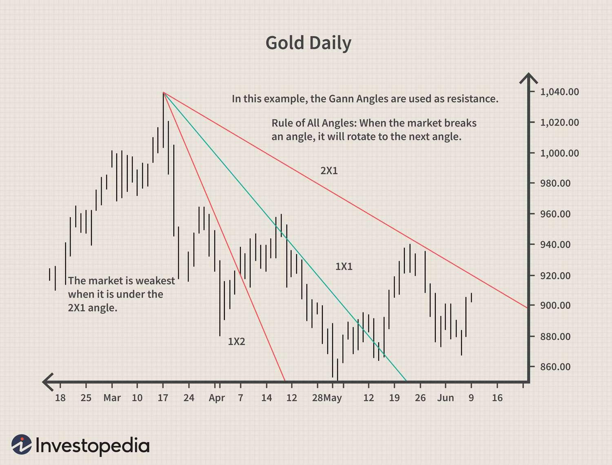

## Table of Contents

## What are Gann Fans and how are they used in technical analysis?

Gann Fans are a type of technical analysis tool used by traders to predict future price movements in financial markets. They were created by W.D. Gann, a famous trader from the early 20th century. Gann Fans consist of a series of diagonal lines called Gann angles, which are drawn from a significant low or high point on a price chart. These lines help traders identify potential support and resistance levels, as well as predict where the price might go next.

Traders use Gann Fans by first identifying a significant price point, such as a major low or high, and then drawing the Gann angles from that point. The angles are based on time and price movements and are usually set at specific ratios like 1:1, 1:2, and 2:1. When the price of an asset touches or crosses these lines, it can signal that the price might change direction or continue its current trend. By watching how the price interacts with these lines, traders can make better decisions about when to buy or sell.

## Who was W.D. Gann and why did he develop Gann Fans?

W.D. Gann was a famous trader who lived a long time ago, from 1878 to 1955. He was known for making a lot of money in the stock and commodity markets. Gann believed that the movements of prices in the markets followed certain patterns and rules. He thought that by studying these patterns, he could predict what would happen next in the markets.

Gann developed Gann Fans because he wanted to help traders see these patterns more clearly. He created the Gann Fans as a tool to draw lines on price charts that could show where the price might go in the future. By using Gann Fans, traders could find important points where the price might change direction or keep going the same way. This helped them decide when to buy or sell their investments.

## How do you draw a basic Gann Fan on a price chart?

To draw a basic Gann Fan on a price chart, you start by [picking](/wiki/asset-class-picking) a significant point on the chart. This could be a big high or a big low that you think is important. Once you have this point, you draw a vertical line straight up from it. This line represents time, and it helps you set up the angles of the Gann Fan.

Next, you draw diagonal lines from your chosen point at different angles. These angles are usually set at specific ratios like 1:1, 1:2, and 2:1. The 1:1 line goes up at a 45-degree angle, which means the price and time move at the same rate. The 1:2 line goes up more gently, showing that the price moves slower compared to time. The 2:1 line goes up steeper, showing that the price moves faster compared to time. These lines together make up the Gann Fan, and they help you see where the price might go next.

## What are the key angles used in Gann Fans and their significance?

The key angles used in Gann Fans are the 1:1, 1:2, and 2:1 angles. The 1:1 angle, also known as the 45-degree angle, is the most important one. It shows a balance between time and price movement. When the price follows this line, it means the price is moving at the same rate as time. This line is often seen as a strong support or resistance level.

The 1:2 angle is less steep than the 1:1 angle. It shows that the price is moving slower compared to time. This angle can act as a support level when the price is going up or a resistance level when the price is going down. The 2:1 angle is steeper than the 1:1 angle. It shows that the price is moving faster compared to time. This angle can act as a resistance level when the price is going up or a support level when the price is going down. Together, these angles help traders see where the price might go next and make better trading decisions.

## Can you explain the mathematical basis behind the Gann Fan angles?

The mathematical basis behind the Gann Fan angles is all about the relationship between time and price. The angles are drawn based on the idea that price movements should be measured in equal units of time. For example, the 1:1 angle, which is the most important one, is drawn at a 45-degree angle. This means that for every unit of time that passes, the price moves by the same amount. So if you move one unit to the right on the chart (which represents time), the price should move up or down by one unit as well.

The other angles, like the 1:2 and 2:1, are based on different ratios between time and price. The 1:2 angle is drawn at a less steep angle than the 1:1 angle, showing that the price moves half as much as time. So for every two units of time, the price moves up or down by one unit. On the other hand, the 2:1 angle is steeper, showing that the price moves twice as much as time. For every unit of time, the price moves up or down by two units. These different angles help traders see how the price might move in the future based on how it has moved in the past.

## How do Gann Fans help in identifying support and resistance levels?

Gann Fans help traders find support and resistance levels by drawing lines on a price chart. These lines, called Gann angles, start from a big high or low point and go out at different angles. When the price of a stock or other thing you're trading touches one of these lines, it might stop going up or down and start to move the other way. That's because these lines show where the price has moved in the past, and traders think it might do the same thing again.

For example, if the price is going up and it touches a Gann angle, that line can act like a ceiling that the price can't go through easily. This is called resistance. If the price can't break through this line, it might start to go down instead. On the other hand, if the price is going down and it touches a Gann angle, that line can act like a floor that the price can't fall through easily. This is called support. If the price can't break through this line, it might start to go up instead. By watching how the price reacts to these lines, traders can make better guesses about where the price might go next.

## What are the common time frames used when applying Gann Fans?

When using Gann Fans, traders often look at different time frames depending on what they are trying to do. For short-term trading, like [day trading](/wiki/day-trading-spy), people might use very short time frames, like 1-minute or 5-minute charts. These help them see quick changes in the price and make fast decisions. For medium-term trading, like swing trading, traders might use longer time frames, like 1-hour or 4-hour charts. These help them see bigger trends that last a few days or weeks.

For long-term trading or investing, people might use even longer time frames, like daily or weekly charts. These help them see big trends that can last months or years. No matter which time frame they use, the idea is the same: Gann Fans help traders see where the price might go next by drawing lines on the chart. By looking at how the price moves over different time periods, traders can make better guesses about future price movements.

## How can Gann Fans be used to predict price movements and trends?

Gann Fans help traders predict where the price of something might go next by drawing special lines on a chart. These lines start from a big high or low point and go out at different angles. When the price touches one of these lines, it can tell traders if the price might stop going up or down and start moving the other way. For example, if the price is going up and it hits a Gann Fan line, that line can act like a ceiling that the price can't go through easily. If the price can't break through this line, it might start to go down instead. By watching how the price reacts to these lines, traders can make better guesses about where the price might go next.

Traders also use Gann Fans to see bigger trends over time. They look at different time frames, like short ones for quick trades or long ones for investing. By drawing Gann Fans on these charts, traders can see if the price is following a certain pattern. If the price keeps bouncing off the same Gann Fan lines over and over, it can show that those lines are important support or resistance levels. This helps traders decide when to buy or sell, based on where they think the price will go in the future.

## What are the limitations and criticisms of using Gann Fans in trading?

Gann Fans can be tricky to use because they are based on old ideas from W.D. Gann, and not everyone believes they work well today. Some people think the lines drawn by Gann Fans are too random and can be hard to use correctly. It's easy to pick the wrong starting point or angle, which can make the predictions wrong. Also, Gann Fans don't work the same way in every market or time, so what works in one place might not work in another.

Another problem with Gann Fans is that they can make traders see patterns that aren't really there. This is called confirmation bias, where people only see what they want to see. Because the lines are drawn by the trader, it's easy to move them around until they fit the price movements. This can lead to bad trading decisions. Overall, while Gann Fans can be a helpful tool for some traders, they have limits and should be used carefully with other tools to make better predictions.

## How do you adjust Gann Fans for different markets or securities?

When using Gann Fans for different markets or securities, you need to think about how each market or security moves. Not all markets move the same way, so you might need to change the starting point or the angles of the Gann Fans. For example, if you're looking at a fast-moving stock, you might need to use shorter time frames and adjust the angles to catch quick changes in the price. On the other hand, if you're looking at a slower-moving commodity, you might use longer time frames and different angles to see bigger trends over time.

It's also important to test the Gann Fans on the specific market or security you're trading. What works for one stock might not work for another. You can try different starting points and angles to see which ones give you the best predictions. Remember, Gann Fans are just one tool, and they work best when you use them with other tools like moving averages or trend lines. By adjusting the Gann Fans to fit the market or security you're trading, you can make better guesses about where the price might go next.

## Can Gann Fans be combined with other technical analysis tools? If so, how?

Yes, Gann Fans can be used with other technical analysis tools to make better trading decisions. Traders often combine Gann Fans with tools like moving averages, trend lines, and Fibonacci retracements. For example, if a Gann Fan line shows a possible support level, a trader might check if a moving average is also near that level. If both tools show the same thing, it can make the trader more confident about where the price might go next.

Using Gann Fans with other tools helps traders see the market in different ways. They can use trend lines to see the overall direction of the price and then use Gann Fans to find specific points where the price might change direction. By looking at all these tools together, traders can get a fuller picture of what's happening in the market and make smarter choices about when to buy or sell.

## What advanced techniques can be used to enhance the accuracy of Gann Fan analysis?

To make Gann Fan analysis more accurate, traders can use something called Gann Squares. Gann Squares are like a grid that you put over your price chart. They help you see more patterns and find important price levels that the Gann Fans might miss. By using Gann Squares with Gann Fans, you can see where the price might go next in a more detailed way. It's like having a map that shows you more roads to follow.

Another way to improve Gann Fan analysis is by using different time frames at the same time. For example, you can look at a daily chart and a weekly chart together. If the Gann Fan lines on both charts show the same support or resistance levels, it can make your predictions stronger. This is called multi-time frame analysis, and it helps you see the big picture and the small details at the same time. By combining these advanced techniques, you can make better guesses about where the price might go next.

## References & Further Reading

[1]: "Gann Explained: What is a Gann Fan?" on Investopedia. [https://www.investopedia.com/terms/g/gann-fan.asp](https://www.investopedia.com/terms/g/gann-fans.asp)

[2]: "The Definitive Guide to Position Sizing" by Van K. Tharp. It covers risk management, which is relevant to trading strategies involving tools like Gann Fans.

[3]: Pring, M. J. (2002). "Technical Analysis Explained: The Successful Investor's Guide to Spotting Investment Trends and Turning Points." This book provides a broader context for technical analysis tools.

[4]: Hutchinson, M., & Dein, C. (2009). "Gann Made Easy." This book offers insights into the application of Gann's principles in modern trading.

[5]: "Algorithmic Trading: Winning Strategies and Their Rationale" by Ernie Chan. This book explores algorithmic trading strategies, which can be integrated with tools such as Gann Fans.

[6]: Pardo, R. (2008). "The Evaluation and Optimization of Trading Strategies." This book discusses the backtesting and optimization of trading strategies, which is relevant for algorithmic trading using Gann Fans.

[7]: Murphy, J. J. (1999). "Technical Analysis of the Financial Markets: A Comprehensive Guide to Trading Methods and Applications." This is a fundamental text on technical analysis and trading strategies, including the use of geometric tools like Gann Fans.

[8]: Cootner, P. (1964). "The Random Character of Stock Market Prices." This provides a foundational understanding of the statistical nature of market movements.

[9]: "The Trading Book: A Complete Solution to Mastering Technical Systems and Trading Psychology" by Anne-Marie Baiynd. Discusses integrating technical systems like Gann Fans into trading psychology.

[10]: "Security Analysis: Sixth Edition" by Benjamin Graham and David Dodd. An essential read for understanding market analysis from a fundamental and technical perspective.