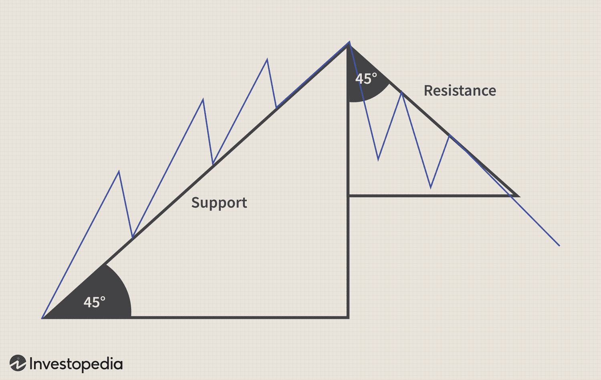

The intersection of financial markets, Gann analysis, technical analysis, and algorithmic trading presents a dynamic and multifaceted landscape for traders and analysts. Each component offers distinct methods and insights that enhance market prediction and trading strategies.

Historically, Gann analysis, named after W.D. Gann, an influential trader of the early 20th century, has focused on predicting price movements by combining geometrical and numerical relationships. His methodologies have been foundational in market predictions, emphasizing the significance of time and price analysis through innovative tools like the Gann Angles and the Square of Nine. Gann's work suggested that specific price patterns and cycles could be used to foresee future market movements, laying the groundwork for modern technical analysis techniques.



In contemporary trading, technical analysis remains a critical tool. It involves studying statistical trends gathered from trading activity, such as price movement and volume. Traders use these insights to identify patterns and potential shifts in market sentiment without focusing on a company’s intrinsic value. Technical analysis enables traders to make informed decisions based on past market data, providing a framework to predict future price movements. The introduction of advanced computational technologies and charting software has increased the accessibility and precision of technical analysis, making it indispensable in modern trading.

The rise of algorithmic trading in recent decades has further transformed the financial markets, leveraging computational power to execute trades at speeds and efficiencies unattainable by human traders. Algorithms can process extensive market data rapidly, identifying and exploiting trading opportunities in microseconds. This shift not only improved trading efficiency but also revolutionized how traditional methods like Gann analysis and technical analysis are employed. By integrating these methodologies into algorithmic models, traders can create more robust and adaptable strategies that capitalize on both historical insights and real-time data analytics. Algorithmic trading's capability to implement complex strategies that incorporate price patterns, time cycles, and statistical data points illustrates its role in the ongoing evolution of market analysis techniques.

Overall, by examining the evolution of Gann analysis and its integration with technical and algorithmic trading, one can appreciate the continuous innovation improving market analysis and trading strategies. This synthesis of traditional and modern approaches provides traders with a comprehensive suite of tools to navigate the complexities of financial markets more effectively.

## Table of Contents

## Understanding Gann Analysis

W.D. Gann was a pivotal figure in the development of trading strategies focused on predicting financial market trends. His techniques, known collectively as Gann analysis, have been widely studied and debated within the trading community. Gann introduced a multi-faceted approach that integrated price, time, and pattern studies, offering a comprehensive framework for interpreting market movements.

Gann's contributions primarily revolve around his belief that markets are cyclical, and price movements can be accurately predicted by understanding these cycles. He proposed that price and time are interdependent and created several analytical tools to interpret this relationship.

**Gann Studies: Price, Time, and Pattern**

1. **Price Studies**: Gann believed that price movements occur in repeatable cycles, driven by natural laws. His price analysis often involved identifying key levels of support and resistance, which he theorized could be predicted mathematically. Gann classified price movements into angles, where specific geometric angles correspond to potential areas of support or resistance.

2. **Time Studies**: In Gann's framework, time was as crucial as price, if not more so. He identified cyclical patterns in the markets, suggesting that time cycles repeat and that future turning points could be predicted by analyzing past cycles. This perspective ties into Gann's broader belief in the geometrical and mathematical nature of market activities.

3. **Pattern Studies**: Patterns formed by price movements were also fundamental in Gann's analysis. Through historical price chart patterns, he sought to identify repeatable formations that could indicate future price action.

**Combination of Price Movements and Time Cycles**

Gann's approach to market predictions hinged on the synchronization of price and time, proposing that their intersection could predict significant market turning points. By using various geometric and mathematical tools, Gann attempted to forecast when these intersections would occur, aiming to provide a predictive edge.

**Key Tools Developed by Gann**

1. **Gann Angles**: These are a construct of price and time plotted on a chart, drawing angles from key price points. The most well-known Gann Angle is the 1x1 angle, where one unit of price is equaled by one unit of time, signifying a perfect market balance. Other common angles include 2x1, 3x1, 4x1, etc., each suggesting different market dynamics.

   The equation for plotting a Gann angle is simple: $\text{Slope of the Angle} = \frac{\text{Price Change}}{\text{Time Change}}$.

2. **Square of Nine**: The Square of Nine is a spiral of numbers starting from the center and moving outward in a square pattern. It is used for calculating time and price projections based on square root progressions. This tool is based on the idea that market movements resonate with financial frequencies, allowing traders to identify potential turning points.

Gann's methods have had a lasting influence on technical analysis and are still used by traders seeking to identify market cycles and potential reversal points. Although some aspects of Gann's work are considered esoteric, they remain an integral part of technical analysis discussions and practices today.

## Technical Analysis in Financial Markets

Technical analysis is a method used in financial markets to evaluate and forecast the price movement of securities by analyzing historical price data and [volume](/wiki/volume-trading-strategy). It is distinct from [fundamental analysis](/wiki/fundamental-analysis), which focuses on a company's financial health, management performance, and industry position. Technical analysis operates under the assumption that all relevant information is already reflected in the price, thereby making price movements a reflective indicator of market sentiment and potential future movements.

### Basics of Technical Analysis and Its Significance in Trading

Technical analysis is based on three primary tenets: price movements are not random but follow trends, history tends to repeat itself, and market psychology can be understood through charts and patterns. Traders utilize charts and various tools to identify patterns and trends to make trading decisions. The main aim is to determine the best points for buying and selling.

It is significant because it provides traders with a systematic approach to evaluating price action, potentially delivering entry and [exit](/wiki/exit-strategy) points with high probability setups. Unlike fundamental analysis, technical analysis does not require an in-depth understanding of economic reports or corporate balance sheets, making it accessible to a broad range of traders.

### Comparison Between Technical Analysis and Fundamental Analysis

Fundamental analysis and technical analysis are often viewed as complementary approaches to market analysis, yet they differ significantly in their approach. Fundamental analysis is concerned with the intrinsic value of a security by examining related economic, financial, and other qualitative and quantitative factors. Analysts use company reports, economic indicators, and industry trends to predict future prices.

In contrast, technical analysis disregards intrinsic value and focuses purely on price action, utilizing charts, trends, and patterns to make predictions. Fundamental analysts argue that a stock's value is the primary driver of its price, whereas technical analysts believe that historical price movement patterns can be used to forecast future price movements.

| Aspect              | Technical Analysis                           | Fundamental Analysis                   |
|---------------------|----------------------------------------------|----------------------------------------|
| Focus               | Historical price and volume data             | Economic, financial, and qualitative factors |
| Tools               | Charts, technical indicators                 | Financial statements, industry data    |
| Time Horizon        | Short to medium-term trading                 | Long-term investment                   |
| Analysis            | Patterns and trends in price movements       | Intrinsic value assessment             |

### How Gann's Methodologies Fit into the Broader Landscape of Technical Trading

William Delbert Gann was a renowned trader known for developing several unique analytical techniques that combined the principles of geometry, astronomy, and ancient mathematics. Gann's methodologies, such as Gann angles and the Square of Nine, are tools aimed at predicting future price movements based on geometric and cyclical analysis.

Gann's techniques integrate seamlessly with traditional technical analysis as they provide an additional layer of context for price movements. For instance, Gann angles can be plotted on traditional price charts to identify potential support and resistance levels, enhancing a trader’s ability to anticipate market movements.

### Common Technical Indicators and Their Usage in Conjunction with Gann Angles

Technical indicators are mathematical calculations based on the price, volume, or open interest of a security. Common technical indicators include moving averages, Relative Strength Index (RSI), Moving Average Convergence Divergence (MACD), and Bollinger Bands. Each indicator provides unique insights into market trends and conditions.

When used in conjunction with Gann angles, these indicators can enhance the robustness of trading strategies. For example, traders may use Fibonacci retracement levels to identify potential reversal points and verify these signals with Gann angle projections from a significant peak or trough. Here is a simple example of calculating a moving average in Python, which can be used alongside Gann techniques:

```python
def moving_average(prices, window_size):
    return [sum(prices[i:i + window_size]) / window_size for i in range(len(prices) - window_size + 1)]

prices = [100, 102, 104, 106, 108]
window_size = 3
average = moving_average(prices, window_size)
print(average)
```
This script calculates the moving average of closing prices, a fundamental tool in technical analysis, to identify trends or validate signals derived from Gann methodologies. Integrating these technical indicators with Gann analysis can offer a comprehensive approach to understanding and capitalizing on financial markets.

## Algorithmic Trading: A Modern Approach

Algorithmic trading refers to the use of computerized systems to execute trades in financial markets. These systems are driven by algorithms, which are sets of rules and calculations to automate the trading process based on market data. Algorithmic trading leverages the power of technology to perform tasks that would be challenging or impossible for human traders to do with the same speed and accuracy.

The primary benefits of using algorithms in trading include speed, efficiency, and precision. Algorithms can process vast amounts of data rapidly to identify trading opportunities and execute orders. This capability is particularly advantageous in high-frequency trading, where milliseconds can make a difference. Algorithms reduce human error by following predefined instructions and enable traders to implement complex strategies consistently.

Integration of Gann and technical analysis strategies into algorithmic models provides a bridge between traditional market prediction techniques and modern technology. Gann analysis, developed by W.D. Gann, involves geometric techniques, angle studies, and time cycles for predicting price movements. These elements can be encoded into algorithmic models to capture Gann’s principles systematically. For instance, Gann angles and patterns can be computed algorithmically to assess market trends and potential reversal points.

Algorithmic trading strategies incorporating Gann principles often involve the use of mathematical and statistical models to automate the analysis of price charts. This may include the application of Gann angles to predict support and resistance levels, or the integration of time cycles to forecast market turning points. Python, a popular language for algorithm development, can be used to implement such strategies. Here is a simple example of how a Gann angle might be calculated in Python:

```python
import numpy as np

def calculate_gann_angle(price_change, time_change):
    angle = np.arctan(price_change / time_change)
    return np.degrees(angle)

price_change = 50  # example price change
time_change = 10   # example time change
gann_angle = calculate_gann_angle(price_change, time_change)
print(f"Gann Angle: {gann_angle} degrees")
```

The combination of [algorithmic trading](/wiki/algorithmic-trading) with Gann principles and technical analysis can offer a powerful toolkit for traders. This integration allows for advanced predictive models that harness historical market patterns and automated execution, leading to potential improvements in trading performance. The continuous evolution of technology and data processing capabilities enhances the ability to develop sophisticated strategies, blending human insight with machine efficiency.

## Integrating Gann Analysis with Algorithmic Trading

Integrating Gann Analysis with algorithmic trading presents both challenges and opportunities, reflecting the evolution from traditional to modern market analysis techniques. One of the primary challenges lies in the inherently subjective nature of Gann analysis, which relies on interpreting historical market data to forecast future trends. This subjectivity poses difficulties in creating algorithmic models, which require precise and quantifiable inputs. However, modern technology provides opportunities by enabling the integration of Gann methods with [machine learning](/wiki/machine-learning) and data analytics to enhance pattern recognition and prediction accuracy.

Case studies demonstrate successful integration. An example is a trading firm that incorporated Gann angles into its algorithmic models. By converting Gann's geometric patterns into mathematical formulas, they improved their ability to predict market support and resistance levels, thereby enhancing trading efficacy. Another relevant case involved using Gann's Square of Nine with algorithmic trading systems to optimize entry and exit points in volatile markets. These examples underscore the potential gains of hybridizing Gann principles with modern automated techniques.

Technological tools and platforms play a crucial role in this integration. Platforms like MetaTrader and TradingView allow traders to create and backtest trading strategies that incorporate Gann methodologies. Moreover, programming languages such as Python are essential for developing custom algorithms. Python libraries, including Pandas for data manipulation and NumPy for numerical calculations, facilitate the implementation of Gann's methodologies into algorithmic trading systems.

Future trends in trading are likely to see deeper integration of these methodologies as algorithmic trading systems continue to evolve. The rise of [artificial intelligence](/wiki/ai-artificial-intelligence) and machine learning can further enhance Gann analysis by identifying non-linear patterns and correlations in market data that were previously undetectable. Additionally, the increasing accessibility of big data analytics will provide more extensive datasets for testing and refining Gann-based algorithmic strategies, potentially leading to more robust financial models.

In conclusion, while integrating Gann Analysis with algorithmic trading presents challenges, technological advancements offer significant opportunities. The synergy between traditional methods and modern tech continues to reshape trading strategies, paving the way for innovative approaches in financial markets.

## Conclusion

The integration of Gann analysis, technical analysis, and algorithmic trading offers a multilayered approach to understanding and navigating financial markets. Gann analysis introduces the perspective of time cycles and geometric angles, providing insights into market behavior through historical price patterns. By combining this with technical analysis, traders gain access to a suite of indicators and methods that enhance their ability to anticipate market movements based on current and historical price data.

Algorithmic trading, with its ability to process large volumes of data at high speed and precision, brings a modern edge to these traditional techniques. By incorporating Gann principles and technical analysis indicators into algorithmic models, traders can automate decision-making processes, maximizing efficiency and reducing human error. Such integration allows for the execution of complex strategies that respond to market changes in real-time.

Understanding market cycles and patterns remains crucial, as they offer valuable context within the ever-evolving financial landscape. The cyclical nature of markets suggests that historical patterns often repeat, providing opportunities for traders who recognize these patterns. Gann’s methodologies reinforce the importance of time cycles and patterns, further supporting informed decision-making.

Traders are encouraged to explore and adapt these methodologies, using them as foundational tools to develop strategies that align with their unique goals and risk appetites. Embracing this blend of traditional and new-age techniques can enable traders to not only react to market conditions but to anticipate and adapt proactively, providing a competitive edge in a dynamic market environment.

## References

1. **Gann Analysis**: 
   - *Gann, W. D. (1927). "The Tunnel Thru the Air or Looking Back from 1940".* This book investigates into Gann's philosophy and introduces theories behind his methodologies. 
   - *Drummond, S. (1978). "Gann Simplified: A Complete Guide to Trading with Gann".* A comprehensive guide for beginners interested in Gann strategies.

2. **Technical Analysis**:
   - *Murphy, J. J. (1999). "Technical Analysis of the Financial Markets".* A standard textbook for understanding technical analysis, providing insights into tools and indicators that can be useful in trading.
   - *Pring, M. J. (2002). "Technical Analysis Explained".* This book offers an in-depth view of technical analysis and how it guides market predictions and trading decisions.

3. **Algorithmic Trading**:
   - *Chan, E. (2009). "Quantitative Trading: How to Build Your Own Algorithmic Trading Business".* A starter guide for building algorithmic trading strategies that include using sophisticated models and computational tools.
   - *Easley, D., López de Prado, M. M., & O'Hara, M. (2012). "The Volume Clock: Insights into the High Frequency Paradigm". The Journal of Portfolio Management.* This paper discusses insights into high-frequency trading, a subset of algorithmic trading.

4. **Integration of Gann Analysis with Modern Techniques**:
   - *Ruddy, T. (2015). "The Gann Method: Trading the Financial Markets Using the W.D. Gann Approach".* Explores methods for integrating Gann analysis with modern algorithmic models.
   - *Pardo, R. (2011). "The Evaluation and Optimization of Trading Strategies".* This book covers the structural design of trading strategies including the integration of traditional technical analysis with algorithmic solutions.

5. **Industry and Academic Papers**:
   - *"Algorithmic Trading and Information". Berge, T. J. (2013). Federal Reserve Bank of Kansas City Economic Review.* This paper provides a broad overview of algorithmic trading and its impact on financial markets.
   - *"Market Efficiency and Microstructure Evolution: A Comparison of Financial Markets". Hasbrouck, J. (2010). Journal of Financial Economics.* Discusses the evolution of market efficiency in light of increasing algorithmic trading activity.

These resources offer further exploration into the diverse areas of trading strategies, providing both theoretical foundations and practical applications across Gann analysis, technical analysis, and algorithmic trading.

## References & Further Reading

[1]: Gann, W. D. (1927). ["The Tunnel Thru the Air or Looking Back from 1940."](https://en.wikipedia.org/wiki/The_Tunnel_Thru_the_Air;_Or,_Looking_Back_from_1940) Financial Archive.

[2]: Murphy, J. J. (1999). ["Technical Analysis of the Financial Markets: A Comprehensive Guide to Trading Methods and Applications."](https://archive.org/details/technicalanalysi0000murp) New York Institute of Finance.

[3]: Pring, M. J. (2002). ["Technical Analysis Explained: The Successful Investor's Guide to Spotting Investment Trends and Turning Points."](https://www.amazon.com/Technical-Analysis-Explained-Fifth-Successful/dp/0071825177) McGraw-Hill.

[4]: Chan, E. (2009). ["Quantitative Trading: How to Build Your Own Algorithmic Trading Business."](https://github.com/ftvision/quant_trading_echan_book) Wiley Trading.

[5]: Easley, D., López de Prado, M. M., & O'Hara, M. (2012). ["The Volume Clock: Insights into the High-Frequency Paradigm."](https://papers.ssrn.com/sol3/papers.cfm?abstract_id=2034858) The Journal of Portfolio Management.

[6]: Pardo, R. (2011). ["The Evaluation and Optimization of Trading Strategies."](https://onlinelibrary.wiley.com/doi/book/10.1002/9781119196969) Wiley Trading.

[7]: Hasbrouck, J. (2010). ["Market Efficiency and Microstructure Evolution: A Comparison of Financial Markets."](https://www.academia.edu/118765347/Market_efficiency_and_microstructure_evolution_in_US_equity_markets_A_high_frequency_perspective) Journal of Financial Economics.