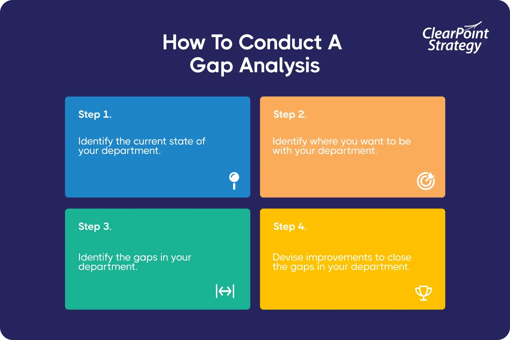

## Table of Contents

## What is a gap analysis?

A gap analysis is a way to find out the difference between where you are now and where you want to be. It's like looking at a map to see how far you are from your destination. Businesses and organizations use gap analysis to see what they need to do to reach their goals. They look at their current performance and compare it to their desired performance.

To do a gap analysis, you first need to clearly define your current state and your desired future state. Then, you identify the gaps between these two states. After finding the gaps, you can make a plan to close them. This might involve setting new goals, changing strategies, or finding new resources. Gap analysis helps make sure that efforts are focused on the most important areas for improvement.

## Why is gap analysis important for businesses?

Gap analysis is important for businesses because it helps them see where they are and where they want to go. It's like having a roadmap that shows the difference between their current situation and their goals. By understanding these gaps, businesses can figure out what they need to do to improve and reach their targets. This can save time and money by focusing efforts on the most important areas.

Another reason gap analysis is crucial is that it helps businesses stay competitive. In today's fast-changing world, companies need to keep up with new trends and technologies. Gap analysis allows them to spot areas where they are falling behind and take action to catch up. This can lead to better products, happier customers, and a stronger position in the market. By regularly doing gap analysis, businesses can keep improving and stay ahead of the competition.

## What are the common types of gap analysis?

There are several common types of gap analysis that businesses use. One type is the performance gap analysis. This looks at how well a business is doing compared to how well it wants to do. It helps find out if the business is meeting its goals or if it needs to improve in certain areas. Another type is the market gap analysis. This looks at what customers want and what the business is offering. It helps find out if there are new products or services that the business could offer to meet customer needs better.

Another common type is the product gap analysis. This compares the features of a business's products to those of its competitors. It helps find out if the business's products are as good as or better than others on the market. Lastly, there's the skills gap analysis. This looks at the skills of the people working in the business compared to the skills needed to meet the business's goals. It helps find out if the business needs to train its workers or hire new people with different skills.

These types of gap analysis help businesses understand different aspects of their operations. By using them, businesses can make better plans and take the right steps to improve. Whether it's improving performance, meeting customer needs, enhancing products, or developing employee skills, gap analysis provides a clear picture of what needs to be done.

## How do you conduct a basic gap analysis?

To conduct a basic gap analysis, start by figuring out where you are now and where you want to be. This means looking at your current situation and setting clear goals for the future. For example, if you run a small bakery, you might look at how many cakes you sell each week now and how many you want to sell in the future. Once you know these two points, you can see the gap between them.

Next, you need to find out what is causing the gap. This could be anything from not having enough staff to not advertising enough. In our bakery example, maybe you find out that you don't have enough people to bake more cakes. Once you know what's causing the gap, you can make a plan to fix it. This might mean hiring more staff or finding a new way to advertise. By following these steps, you can close the gap and reach your goals.

## What tools can be used to perform a gap analysis?

There are several tools that can help you do a gap analysis. One common tool is a spreadsheet, like Microsoft Excel or Google Sheets. You can use it to list your current situation in one column and your goals in another column. Then, you can see the gaps easily and plan how to close them. Another useful tool is a SWOT analysis, which stands for Strengths, Weaknesses, Opportunities, and Threats. This helps you understand your business better and see where the gaps are.

Another tool is a flowchart, which can help you map out your processes and see where improvements are needed. You can use software like Microsoft Visio or even draw it by hand. Mind mapping tools, like MindMeister, can also be helpful. They let you brainstorm ideas and see how different parts of your business are connected, making it easier to spot gaps. Using these tools can make your gap analysis more organized and effective.

## What are the key steps in a detailed gap analysis process?

To do a detailed gap analysis, start by clearly defining your current state and your desired future state. Look at where your business is right now in terms of performance, skills, products, or any other area you want to improve. Then, set clear goals for where you want to be. This might involve talking to your team, looking at data, and understanding what your customers want. Once you have a good picture of both your current situation and your goals, you can see the gaps between them.

Next, figure out what is causing these gaps. This could be due to many things like not having the right skills, not using the best methods, or not having enough resources. You might need to do some research or ask for feedback from your team and customers to understand the root causes. Once you know what's causing the gaps, you can make a plan to close them. This plan should include specific steps, like training your team, changing your processes, or investing in new tools. By following these steps, you can make sure your gap analysis is thorough and helps you reach your goals.

## How can gap analysis be applied in strategic planning?

Gap analysis is a great tool for strategic planning because it helps businesses see where they are and where they want to go. In strategic planning, you set long-term goals for your business. By doing a gap analysis, you can find the difference between your current situation and those goals. This helps you understand what you need to do to reach them. For example, if your goal is to increase sales by 20% in the next year, a gap analysis can show you if you're on track or if you need to make changes to your sales strategy.

Once you know the gaps, you can make a plan to close them. This plan becomes part of your overall strategy. You might decide to invest in new marketing campaigns, hire more salespeople, or improve your product. By regularly doing gap analysis as part of your strategic planning, you can keep checking your progress and adjusting your plans. This makes sure you stay on the right path to meet your long-term goals.

## What are the challenges faced when performing a gap analysis?

One challenge when doing a gap analysis is getting accurate information about your current situation. You need to know exactly where you stand to see the gaps. But sometimes, the data you have might not be up to date or complete. This can make it hard to trust your analysis. Also, people in your business might not want to share information if they think it will show they're not doing well. This can make it tough to get a clear picture of what's going on.

Another challenge is setting clear goals for the future. If your goals are not specific or realistic, it's hard to see the gaps and make a good plan to close them. Sometimes, different parts of the business might have different ideas about what the goals should be. This can cause confusion and make the gap analysis less effective. It's important to make sure everyone agrees on the goals before you start.

Lastly, acting on the results of the gap analysis can be difficult. Even if you find the gaps and make a plan, actually doing what's needed to close them can be hard. It might mean changing how things are done, which can be tough for people to accept. It might also need money or resources that you don't have right now. Making sure everyone in the business is on board with the changes and has what they need to make them happen is a big challenge.

## How do you interpret the results of a gap analysis?

When you finish a gap analysis, you need to understand what the results mean. Look at the differences between where you are now and where you want to be. These differences are your gaps. Think about why these gaps exist. Is it because you don't have enough resources, or maybe your team doesn't have the right skills? Understanding the reasons helps you know what to do next.

Once you know why the gaps are there, you can make a plan to close them. This plan should have clear steps and goals. For example, if the gap is because your team needs more training, your plan might include setting up training sessions. If the gap is because you don't have enough money, your plan might involve finding new ways to save or get more funds. By looking at the results of your gap analysis carefully, you can make sure your plan will help you reach your goals.

## What role does gap analysis play in project management?

Gap analysis helps project managers see what needs to be done to finish a project on time and within budget. By comparing where the project is now to where it should be at certain points, managers can find out if they are on track or if they need to make changes. This might mean adding more resources, like people or money, or changing the project plan to fix problems that are slowing things down.

Using gap analysis in project management also helps in planning better for the future. It shows where the project might face challenges, so managers can be ready with solutions before those problems happen. This makes the project run smoother and helps everyone involved know what to expect and how to reach the project goals.

## How can gap analysis be integrated with other business analysis techniques?

Gap analysis can be used with other business analysis techniques to make a full plan for improving a business. One way to do this is by using SWOT analysis together with gap analysis. SWOT helps you look at your business's strengths, weaknesses, opportunities, and threats. By doing a SWOT analysis first, you can find out what your business is good at and where it needs to improve. Then, you can use gap analysis to see the difference between where you are now and where you want to be. This helps you make a plan that uses your strengths to close the gaps and reach your goals.

Another way to use gap analysis with other techniques is by combining it with benchmarking. Benchmarking means looking at other businesses to see how well they are doing and then trying to do as well or better. When you do a gap analysis, you can use benchmarking to set your goals. For example, if you see that another company in your industry is doing better in customer service, you can set a goal to match or beat their level of service. Then, your gap analysis will show you what you need to do to get there. By using these techniques together, you can make sure your business keeps getting better and stays ahead of the competition.

## What advanced methodologies exist for conducting a sophisticated gap analysis?

One advanced way to do a sophisticated gap analysis is by using data analytics and [machine learning](/wiki/machine-learning). These tools can look at a lot of data from your business to find patterns and trends that you might not see otherwise. For example, they can show you how your sales are doing compared to last year or how your customers are behaving. By using these advanced methods, you can see gaps more clearly and make better plans to close them. This is especially helpful for big businesses that have a lot of data to work with.

Another advanced method is scenario analysis. This means looking at different possible futures for your business and seeing what gaps might come up in each one. You can use computer models to play out these scenarios and see how different choices might affect your business. This helps you be ready for different situations and plan ahead to close gaps before they become problems. By combining gap analysis with scenario analysis, you can make your planning more detailed and be better prepared for whatever might happen.

## What are the key metrics for evaluating algorithmic trading strategies?

Successful [algorithmic trading](/wiki/algorithmic-trading) strategies are quantified by evaluating key performance metrics. These metrics offer valuable insights into the effectiveness, risk, and profitability of trading strategies and help traders make informed decisions to optimize their approaches.

### Sharpe Ratio

One of the most widely used metrics in evaluating the return on investment in trading strategies is the Sharpe Ratio. It measures the risk-adjusted return of an investment portfolio. The Sharpe Ratio is calculated using the formula:

$$
\text{Sharpe Ratio} = \frac{R_p - R_f}{\sigma_p}
$$

where:
- $R_p$ is the expected portfolio return,
- $R_f$ is the risk-free rate of return,
- $\sigma_p$ is the standard deviation of the portfolio's excess return.

A higher Sharpe Ratio indicates that a trading strategy has a more favorable risk-reward profile, providing greater excess return per unit of risk.

### Maximum Drawdown

Maximum drawdown (MDD) is crucial for understanding potential investment losses. It quantifies the largest observed loss from a peak to a trough before a new peak is achieved. MDD is represented as a percentage of the peak value:

$$
\text{MDD} = \frac{\text{Peak Value} - \text{Trough Value}}{\text{Peak Value}} \times 100\%
$$

This metric is essential for assessing the risk associated with a trading strategy and helps traders understand the worst-case scenario regarding losses.

### Win Rate and Profit Factor

Win rate and profit [factor](/wiki/factor-investing) are essential metrics for assessing the frequency and quality of trades executed by an algorithm. The win rate is the ratio of successful trades to the total number of trades, expressed as a percentage:

$$
\text{Win Rate} = \left( \frac{\text{Number of Winning Trades}}{\text{Total Number of Trades}} \right) \times 100\%
$$

The profit factor is the ratio of gross profits to gross losses from all trades, indicating the overall profitability of a strategy:

$$
\text{Profit Factor} = \frac{\text{Total Profit from Winning Trades}}{\text{Total Loss from Losing Trades}}
$$

A high profit factor coupled with a favorable win rate reflects an effective trading strategy.

### Continuous Monitoring

The continuous monitoring of these metrics is vital for ensuring that algorithmic trading strategies remain optimal. Changes in market conditions, including [volatility](/wiki/volatility-trading-strategies) and [liquidity](/wiki/liquidity-risk-premium), can significantly impact algorithm performance. By consistently analyzing these metrics, traders can adjust their strategies to capture emerging opportunities and mitigate potential risks, thereby ensuring sustained profitability and reduced drawdowns over time.

By emphasizing these key performance metrics, traders can achieve a deeper understanding of their algorithmic trading strategies and make informed adjustments to enhance overall effectiveness and success.

## References & Further Reading

[1]: Bergstra, J., Bardenet, R., Bengio, Y., & Kégl, B. (2011). ["Algorithms for Hyper-Parameter Optimization."](https://papers.nips.cc/paper/4443-algorithms-for-hyper-parameter-optimization) Advances in Neural Information Processing Systems 24.

[2]: ["Advances in Financial Machine Learning"](https://www.amazon.com/Advances-Financial-Machine-Learning-Marcos/dp/1119482089) by Marcos Lopez de Prado

[3]: ["Evidence-Based Technical Analysis: Applying the Scientific Method and Statistical Inference to Trading Signals"](https://www.amazon.com/Evidence-Based-Technical-Analysis-Scientific-Statistical/dp/0470008741) by David Aronson

[4]: ["Machine Learning for Algorithmic Trading"](https://github.com/stefan-jansen/machine-learning-for-trading) by Stefan Jansen

[5]: ["Quantitative Trading: How to Build Your Own Algorithmic Trading Business"](https://www.amazon.com/Quantitative-Trading-Build-Algorithmic-Business/dp/1119800064) by Ernest P. Chan