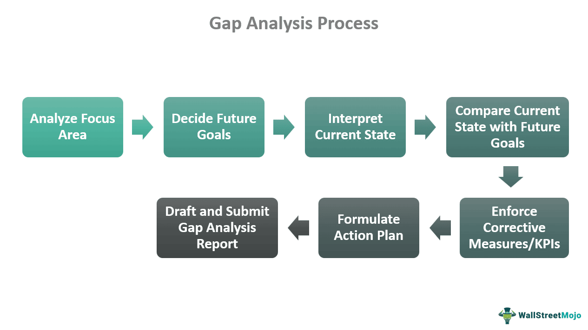

In the world of business and trading, performance evaluation and gap analysis are critical components for assessing and improving strategies. These processes enable organizations to benchmark their current practices against desired outcomes, thereby identifying areas requiring improvement. Algorithmic trading, or algo trading, significantly benefits from such evaluations, as it involves executing trades using automated, pre-programmed instructions, which consider variables like timing, price, and volume. The intersection of performance evaluation, gap analysis, business assessment, and algorithmic trading provides traders and businesses with powerful tools to enhance their operational efficiency, profitability, and competitiveness.

Algorithmic trading serves as a sophisticated means of executing trades by leveraging algorithms that can operate at speeds and frequencies that surpass human capability. By using scripts and programs, traders automate the decision-making process, ensuring that orders are executed under optimal conditions to meet strategic trading objectives. The performance of these algorithms directly affects the potential success or failure of a trading strategy, making evaluation and continuous improvement indispensable.



Gap analysis within this context is particularly vital. It allows businesses to assess the difference between the algorithm's current performance and its performance goals. This process aids in identifying any discrepancies that may exist, providing a basis for adjustments in strategy to close the gap between goals and actual outcomes. For algo trading to be truly effective, it must continuously evolve, accommodating changes in market behavior and integrating feedback from performance evaluations.

Thus, by understanding these concepts and applying them to algorithmic trading, businesses can ensure they remain competitive in a constantly changing financial landscape. Through strategic performance evaluation and rigorous gap analysis, algo trading strategies can be fine-tuned to navigate market complexities, ultimately optimizing financial outcomes and fulfilling business objectives.

## Table of Contents

## Understanding Gap Analysis in Business Assessment

Gap analysis serves as a vital strategic tool for businesses aiming to measure discrepancies between their current performance and their desired objectives. This systematic approach enables organizations to pinpoint areas of underperformance and uncover opportunities for improvement. By thoroughly understanding these gaps, companies can develop targeted strategies to bridge them, thus enhancing overall efficiency and effectiveness.

The gap analysis process begins with a comprehensive assessment of present capabilities. This involves gathering quantitative and qualitative data to form a baseline of current performance levels. Next, organizations must envision their desired future states by setting clear, measurable goals that align with their strategic vision. These goals often reflect enhancements in efficiency, profitability, or market share.

Once the current state and the desired future state are defined, the critical task of identifying performance gaps can proceed. This step involves diagnosing the specific areas where deviations exist between the present performance and the goals set forth. The organizations can use quantitative metrics, like performance indices or key performance indicators (KPIs), to quantify these gaps.

For instance, if a company wants to increase its market share by 10% over the next year but currently projects only a 5% growth rate, the gap to be bridged is quantified at 5%. Similarly, if operational efficiency is measured using a particular KPI, such as units produced per hour, and the desired improvement is from 50 to 60 units, the gap is 10 units per hour.

After identifying the gaps, creating actionable plans to address them is imperative. This step requires prioritizing initiatives based on factors like resource availability, impact potential, and alignment with broader strategic objectives. By developing targeted initiatives, organizations can systematically close the identified gaps and move closer to achieving their desired goals.

In dynamic fields such as finance and trading, where market conditions are rapidly changing, gap analysis is particularly critical. It ensures that resources and efforts are optimally aligned with strategic goals, allowing for quick adaptations to new market opportunities or threats. This alignment is instrumental in maintaining competitiveness and seizing growth opportunities in the ever-evolving business landscape. In summary, gap analysis is not just an assessment tool but a strategic framework that guides organizations towards continuous improvement and success.

## How Gap Analysis Applies to Algorithmic Trading

Algorithmic trading utilizes computer algorithms to execute trades based on predefined criteria, optimizing for variables such as timing, price, and [volume](/wiki/volume-trading-strategy). Gap analysis in this context serves as a strategic evaluation tool to measure the current efficiency of trading algorithms against predetermined performance benchmarks. By systematically analyzing these performance gaps, traders can pinpoint areas where adjustments are necessary. 

For instance, an algorithm might be lagging in execution speed, resulting in missed opportunities or suboptimal entry and [exit](/wiki/exit-strategy) points. This latency can be quantified and addressed by refining the algorithm's structure or employing faster data feeds. Accuracy is another critical metric, reflecting the algorithm’s ability to meet the predicted outcomes. Discrepancies between expected and actual results highlight inaccuracies that need addressing, possibly by recalibrating the model or incorporating more robust data inputs.

Risk management is a cornerstone of [algorithmic trading](/wiki/algorithmic-trading), and gap analysis plays a pivotal role in evaluating risk exposure and compliance with risk thresholds. Algorithms might be underperforming if they expose the portfolio to higher-than-acceptable levels of risk. By identifying and rectifying these gaps, traders can adjust risk controls, such as stop-loss limits or diversification strategies, thereby protecting capital and enhancing profit potential.

Through a disciplined application of gap analysis, adjustments can be undertaken to the algorithm’s functioning. These refinements help minimize risk and optimize profitability by ensuring the trading algorithms are aligned with the strategic financial goals of the traders or the institution. By closing identified gaps, algorithmic trading strategies become more robust, efficient, and aligned with dynamic market conditions.

## Key Metrics for Evaluating Algorithmic Trading Strategies

Successful algorithmic trading strategies are quantified by evaluating key performance metrics. These metrics offer valuable insights into the effectiveness, risk, and profitability of trading strategies and help traders make informed decisions to optimize their approaches.

### Sharpe Ratio

One of the most widely used metrics in evaluating the return on investment in trading strategies is the Sharpe Ratio. It measures the risk-adjusted return of an investment portfolio. The Sharpe Ratio is calculated using the formula:

$$
\text{Sharpe Ratio} = \frac{R_p - R_f}{\sigma_p}
$$

where:
- $R_p$ is the expected portfolio return,
- $R_f$ is the risk-free rate of return,
- $\sigma_p$ is the standard deviation of the portfolio's excess return.

A higher Sharpe Ratio indicates that a trading strategy has a more favorable risk-reward profile, providing greater excess return per unit of risk.

### Maximum Drawdown

Maximum drawdown (MDD) is crucial for understanding potential investment losses. It quantifies the largest observed loss from a peak to a trough before a new peak is achieved. MDD is represented as a percentage of the peak value:

$$
\text{MDD} = \frac{\text{Peak Value} - \text{Trough Value}}{\text{Peak Value}} \times 100\%
$$

This metric is essential for assessing the risk associated with a trading strategy and helps traders understand the worst-case scenario regarding losses.

### Win Rate and Profit Factor

Win rate and profit [factor](/wiki/factor-investing) are essential metrics for assessing the frequency and quality of trades executed by an algorithm. The win rate is the ratio of successful trades to the total number of trades, expressed as a percentage:

$$
\text{Win Rate} = \left( \frac{\text{Number of Winning Trades}}{\text{Total Number of Trades}} \right) \times 100\%
$$

The profit factor is the ratio of gross profits to gross losses from all trades, indicating the overall profitability of a strategy:

$$
\text{Profit Factor} = \frac{\text{Total Profit from Winning Trades}}{\text{Total Loss from Losing Trades}}
$$

A high profit factor coupled with a favorable win rate reflects an effective trading strategy.

### Continuous Monitoring

The continuous monitoring of these metrics is vital for ensuring that algorithmic trading strategies remain optimal. Changes in market conditions, including [volatility](/wiki/volatility-trading-strategies) and [liquidity](/wiki/liquidity-risk-premium), can significantly impact algorithm performance. By consistently analyzing these metrics, traders can adjust their strategies to capture emerging opportunities and mitigate potential risks, thereby ensuring sustained profitability and reduced drawdowns over time.

By emphasizing these key performance metrics, traders can achieve a deeper understanding of their algorithmic trading strategies and make informed adjustments to enhance overall effectiveness and success.

## Tools and Techniques for Performance Evaluation in Algo Trading

Performance evaluation tools are essential in optimizing trading algorithms for their intended purpose, particularly in algorithmic trading, where speed and accuracy are vital. Backtesting platforms are instrumental in this process. These platforms allow traders to simulate trading strategies using historical market data, which helps in assessing the potential success of these strategies before they are deployed in live trading environments. By examining how a strategy would have performed in the past, traders can identify its strengths and weaknesses and make necessary adjustments. A basic Python script for [backtesting](/wiki/backtesting) might look like this:

```python
import pandas as pd

def backtest_strategy(data, strategy_func):
    # Assume data is a pandas DataFrame with 'close' price column
    data['signals'] = strategy_func(data['close'])
    data['returns'] = data['close'].pct_change()
    data['strategy_returns'] = data['returns'] * data['signals'].shift(1)
    return data['strategy_returns'].cumsum().iloc[-1]

def example_strategy(prices):
    # An example strategy function that generates buy/sell signals
    return prices.rolling(window=20).mean() > prices

historical_data = pd.read_csv('historical_prices.csv')  # Load your data
strategy_performance = backtest_strategy(historical_data, example_strategy)
print(f'Strategy Performance: {strategy_performance}')
```

Statistical analysis tools also play a crucial role by providing insights into the reliability and effectiveness of trading algorithms. These tools analyze various data points, such as return distributions, to gauge the risk profiles and expected outcomes of trading strategies. Key metrics like standard deviation, variance, and correlation are often utilized to understand the nuances of strategy performance.

Visualization software complements backtesting and statistical analysis by enabling traders to observe patterns and anomalies in trading data visually. This ability to see data trends helps in identifying market phases where a strategy may underperform or excel, leading to more informed decision-making. Graphical representations, such as candlestick charts, histograms, and scatter plots, can reveal underlying patterns that might not be apparent in numerical data alone.

Utilizing a combination of these tools ensures a comprehensive evaluation of algorithmic trading strategies, allowing for continuous refinement and adjustment to optimize performance and align with business objectives. Through rigorous testing, analysis, and visualization, traders can build robust strategies capable of adapting to evolving market conditions.

## Challenges and Considerations in Algo Trading Business Assessment

When evaluating algorithmic trading strategies, several challenges and considerations must be addressed to ensure optimal performance and risk management. One significant challenge is data overfitting, which occurs when an algorithm is too closely tailored to historical data, capturing noise rather than the underlying market signal. Overfit models perform well in backtesting but may fail in live trading. To mitigate this, techniques such as cross-validation and regularization can be employed. 

Market volatility presents another challenge, as rapid price fluctuations can affect the predictability and performance of trading algorithms. Algorithms must be robust enough to handle such volatility without significant performance degradation. This requires adaptive algorithms that can adjust their parameters in response to changing market conditions.

Transaction costs, slippage, and liquidity are critical factors affecting algorithm performance. Transaction costs, including brokerage fees and taxes, can erode profits, particularly for high-frequency trading strategies. Slippage, the difference between the expected price of a trade and the actual price, can occur in fast-moving markets and impact strategy profitability. Ensuring sufficient liquidity in chosen trading instruments is vital to execute trades without significant market impact.

Robustness and adaptability of trading strategies are crucial for effectiveness across diverse market conditions. Strategies should be tested using various market scenarios to ensure they perform consistently. Incorporating [machine learning](/wiki/machine-learning) techniques can enhance the adaptability of trading models, allowing them to learn and evolve with market changes.

Balancing risk and reward is fundamental in developing trading strategies. Effective risk management involves setting appropriate stop-loss orders and position sizing to minimize potential losses. Moreover, algorithms should be designed to identify and capitalize on favorable risk-reward opportunities.

Keeping strategies responsive to evolving market dynamics is essential for maintaining a competitive edge. Continuous monitoring and regular recalibration of algorithms based on performance feedback constitute an integral part of this process. By addressing these challenges, businesses can develop algorithmic trading strategies that are both effective and resilient, ultimately contributing to improved financial performance.

## The Role of Continuous Improvement and Monitoring

Continuous monitoring and improvement are essential components in the effective management of algorithmic trading strategies. As financial markets are inherently dynamic, algo trading strategies must adapt to evolving conditions to maintain their efficacy and profitability. 

One key aspect of this process is the use of feedback loops. These loops involve regularly reviewing trading outcomes and comparing them against predetermined benchmarks or business goals. Through this iterative process, traders can adjust the parameters of their algorithms to better align with strategic objectives and to manage risks effectively. Such adjustments might include recalibrating risk thresholds or modifying entry and exit criteria based on observed performance deviations.

Regular performance evaluations serve as a vital mechanism for identifying new opportunities and addressing potential threats within the market. By utilizing comprehensive performance analysis metrics, traders can make data-driven decisions to optimize their strategies. For instance, a decrease in win rate or an increase in drawdown may indicate the necessity for strategic adjustments or risk management interventions.

Continuous improvement is achieved through the incorporation of systematic refinements into trading algorithms. This could involve technological advancements, such as machine learning techniques, which provide adaptive capabilities to match changing market patterns. By doing so, traders can capitalize on nascent opportunities, thereby enhancing their competitive edge. Moreover, ongoing enhancements in trading strategies can significantly bolster financial returns, ensuring long-term success.

In practice, implementing continuous improvement in algo trading can be supported by an array of software tools and technologies. For instance, machine learning models can be integrated to predict price movements based on historical data, thereby informing algorithm updates. Here is a simple Python implementation using scikit-learn for fitting a linear regression model, which could be part of such a system:

```python
from sklearn.model_selection import train_test_split
from sklearn.linear_model import LinearRegression
import numpy as np

# Sample data: historical trading data (features) and associated returns (target)
X, y = np.array([[0.1, 0.2], [0.2, 0.3], [0.3, 0.8], [0.4, 0.5]]), np.array([1.0, 1.5, 2.0, 2.5])

# Split data into training and testing sets
X_train, X_test, y_train, y_test = train_test_split(X, y, test_size=0.2, random_state=42)

# Initialize and train the model
model = LinearRegression()
model.fit(X_train, y_train)

# Predict and evaluate performance
predictions = model.predict(X_test)
print(predictions)
```

Finally, a robust evaluation framework that includes both continuous monitoring and improvement can significantly contribute to achieving business objectives in algo trading. By leveraging feedback loops and performance evaluations, businesses can align trading strategies with evolving market conditions, thereby ensuring sustained competitive advantage and improved financial outcomes.

## Conclusion

Performance evaluation and gap analysis in algorithmic trading are essential components for optimizing trading strategies. By implementing a structured approach to evaluating performance, businesses can significantly enhance their trading efficiency and profitability. This involves a thorough understanding and application of key performance metrics such as the Sharpe Ratio, Maximum Drawdown, Win Rate, and Profit Factor. These metrics provide valuable insights into the risk-adjusted returns, potential losses, frequency of successful trades, and the ratio of profits to losses, guiding traders in fine-tuning their strategies.

Leveraging appropriate tools and techniques further aids this optimization process. Backtesting platforms allow traders to test strategies on historical data, providing insights into potential future performance without the risk associated with real-time trading. Statistical analysis tools offer a deep dive into the reliability and effectiveness of trading algorithms, while visualization software assists in identifying patterns and anomalies, facilitating continuous strategy refinement.

Ultimately, a robust evaluation framework in algorithmic trading is indispensable for achieving business objectives. It ensures that trading strategies remain responsive to market changes, minimizes risks, and capitalizes on emerging opportunities. By continuously monitoring and improving strategies, businesses not only maintain but can enhance their competitive advantage and financial outcomes. This structured evaluation approach allows traders to achieve a sustainable balance between risk and reward, crucial for long-term success in the financial markets.

## References & Further Reading

[1]: Bergstra, J., Bardenet, R., Bengio, Y., & Kégl, B. (2011). ["Algorithms for Hyper-Parameter Optimization."](https://papers.nips.cc/paper/4443-algorithms-for-hyper-parameter-optimization) Advances in Neural Information Processing Systems 24.

[2]: ["Advances in Financial Machine Learning"](https://www.amazon.com/Advances-Financial-Machine-Learning-Marcos/dp/1119482089) by Marcos Lopez de Prado

[3]: ["Evidence-Based Technical Analysis: Applying the Scientific Method and Statistical Inference to Trading Signals"](https://www.amazon.com/Evidence-Based-Technical-Analysis-Scientific-Statistical/dp/0470008741) by David Aronson

[4]: ["Machine Learning for Algorithmic Trading"](https://github.com/stefan-jansen/machine-learning-for-trading) by Stefan Jansen

[5]: ["Quantitative Trading: How to Build Your Own Algorithmic Trading Business"](https://www.amazon.com/Quantitative-Trading-Build-Algorithmic-Business/dp/1119800064) by Ernest P. Chan