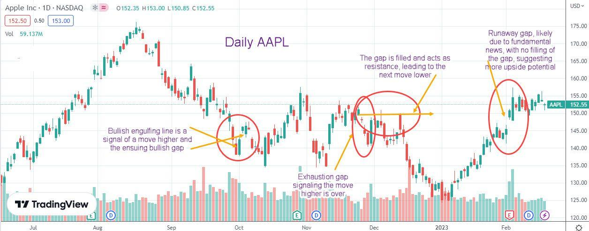

## Table of Contents

## What is a gap-down in stock trading?

A gap-down in stock trading happens when a stock's price opens lower than its previous closing price. This creates a gap on the stock chart because there is no trading activity between the closing price and the new opening price. It often happens because of bad news or negative events that happen after the market closes, making investors want to sell the stock as soon as the market opens again.

When you see a gap-down, it can mean that people are worried about the stock and think its value will go down more. This can lead to more selling and the stock price might keep falling. But, sometimes, if the stock was doing well before, some investors might see the gap-down as a chance to buy the stock at a lower price, hoping it will go back up later.

## How does a gap-down occur in the stock market?

A gap-down happens in the stock market when a stock's price starts the day much lower than where it ended the day before. This creates a space, or "gap," on the stock chart because no one bought or sold the stock at prices in between the old closing price and the new opening price. This usually happens because something bad or unexpected happens after the market closes, like a company reporting bad news or a big event that makes people worry about the stock.

When people hear this bad news, they might want to sell their shares as soon as the market opens again. This rush to sell pushes the opening price down, causing the gap-down. Sometimes, if a lot of people are trying to sell at the same time, it can make the stock's price drop even more during the day. But, if the stock was doing well before, some investors might see the lower price as a good chance to buy, hoping the stock will go back up later.

## What are the common causes of a gap-down?

A gap-down happens when a stock's price opens much lower than it closed the day before. This often happens because of bad news or unexpected events that happen after the market closes. For example, if a company reports worse earnings than expected, or if there's a big problem like a lawsuit or a scandal, people might want to sell their shares as soon as the market opens again. This rush to sell pushes the opening price down, creating the gap.

Sometimes, news from around the world can also cause a gap-down. If there's a big economic report or a global event that makes people worried about the future, they might decide to sell their stocks. This can happen even if the news doesn't directly affect the company. For instance, if there's a sudden change in interest rates or a big political event, it can make investors nervous and lead to a gap-down when the market opens.

In some cases, a gap-down can also be caused by changes in the overall market or industry. If a whole sector is doing badly, like if there's a big drop in oil prices affecting energy companies, stocks in that sector might gap down. Also, if there's a lot of selling happening in the market overall, it can push individual stock prices down at the open, causing a gap-down.

## How can a beginner identify a gap-down on a stock chart?

A beginner can identify a gap-down on a stock chart by looking for a space between the closing price of one day and the opening price of the next day. On the chart, you'll see a vertical line or a bar that shows the high and low prices for each day. If the opening price of the new day is lower than the closing price of the previous day, and there's no trading activity in between, you'll see a gap. This gap will look like an empty space on the chart, showing that the stock price jumped down when the market opened.

To make it easier, imagine the stock closed at $50 on one day, but the next day it opens at $45. On the chart, you won't see any prices between $50 and $45 because no one bought or sold the stock at those prices. This empty space between the two prices is the gap-down. By looking at the chart and seeing this space, you can tell that a gap-down happened, which usually means something bad or unexpected happened after the market closed the day before.

## What is the gap-down strategy and how does it work?

The gap-down strategy is a way to trade stocks that have opened lower than their previous closing price. When a stock gaps down, it means there's a space on the chart between the old closing price and the new opening price. Some traders see this as a chance to make money. They might buy the stock right after it gaps down, hoping that the price will go back up later. This strategy works on the idea that the gap-down might be an overreaction to bad news, and the stock's price will recover once things calm down.

To use the gap-down strategy, a trader needs to watch the market closely. When they see a stock that has gapped down, they need to decide if it's a good time to buy. They might look at the stock's history, the news that caused the gap-down, and how the stock is acting right after it opens. If they think the stock will go back up, they buy it and wait for the price to rise. Then, they sell the stock for a profit once it goes up enough. But, this strategy can be risky because the stock might keep going down instead of going back up.

## What are the key indicators to look for when implementing a gap-down strategy?

When using a gap-down strategy, it's important to look at the stock's history. You want to see if the stock has gapped down before and then gone back up. This can give you a clue that the stock might do the same thing again. Also, check how much the stock has moved in the past. If it usually moves a lot, a big gap-down might not be as scary as it looks.

Another thing to watch is the news that caused the gap-down. If it's something that will go away soon, like a one-time bad report, the stock might recover quickly. But if it's something big and long-lasting, like a lawsuit, the stock might keep going down. You should also look at how the stock is acting right after it opens. If it starts to go back up, that's a good sign. But if it keeps falling, it might be better to wait and see what happens next.

Lastly, keep an eye on the overall market and the industry the stock is in. If the whole market or the industry is doing badly, the stock might have a harder time recovering. But if the market is doing well, the stock might bounce back faster. By looking at all these things, you can make a better guess about whether the gap-down is a good chance to buy the stock or if it's too risky.

## Can you explain the risks associated with trading gap-downs?

Trading gap-downs can be risky because the stock might keep going down instead of going back up. When a stock gaps down, it means something bad happened after the market closed, and people are worried. If more bad news comes out or if the market keeps going down, the stock price could drop even more. This means you could lose money if you bought the stock hoping it would go back up.

Another risk is that the gap-down might be a sign of bigger problems with the company. If the bad news is something serious, like a lawsuit or a big drop in sales, the stock might not recover quickly. It could take a long time for the stock to go back up, or it might never go back to its old price. This can make it hard to know when to sell the stock, and you might end up holding onto it for too long and losing money.

Also, trading gap-downs can be tricky because the market can be very unpredictable. Even if you think the stock will go back up, other things can happen that make the price go down even more. For example, if a lot of people are selling their stocks at the same time, it can push the price down further. This means you need to be ready to act quickly and know when to cut your losses if things don't go as planned.

## How should one manage their trades when using a gap-down strategy?

When using a gap-down strategy, it's important to set clear rules for when to buy and sell the stock. You should decide ahead of time how much you're willing to lose if the stock keeps going down. This is called setting a stop-loss. For example, if you buy a stock at $45 after it gaps down, you might set a stop-loss at $40. This means if the stock drops to $40, you'll sell it automatically to limit your losses. Also, think about how much you want the stock to go up before you sell it for a profit. This is called setting a target price. If you think the stock will go back up to $50, you can sell it when it reaches that price.

Another important thing is to keep an eye on the stock after you buy it. The market can change quickly, and you need to be ready to act if things don't go as planned. If the stock starts to go up after you buy it, that's a good sign. But if it keeps going down, you might need to sell it before it hits your stop-loss to avoid losing more money. It's also a good idea to stay updated on any new news about the company or the market. If something new happens that could affect the stock, you might need to change your plan. By being ready to adjust your trades and knowing when to cut your losses, you can manage the risks of trading gap-downs better.

## What are some successful case studies of the gap-down strategy?

One successful case of the gap-down strategy happened with Apple Inc. in early 2019. After Apple announced lower-than-expected earnings due to weaker iPhone sales in China, its stock gapped down from a closing price of around $157 to an opening price of about $142. Some traders saw this as a buying opportunity, believing the drop was an overreaction. Over the next few months, Apple's stock not only recovered but also went on to reach new highs, rewarding those who bought during the gap-down. This case shows how a gap-down can sometimes be a chance to buy a good stock at a lower price if the company's long-term outlook is still strong.

Another example is with Netflix in April 2022. The stock gapped down from a closing price of around $350 to an opening price of about $290 after the company reported slower subscriber growth. Traders who believed in Netflix's long-term potential saw the gap-down as a buying opportunity. Within a few weeks, the stock started to recover, and by the end of the year, it had climbed back above $300. This case illustrates how a gap-down can be a temporary dip caused by short-term news, and buying during such a dip can lead to profits if the company's fundamentals remain solid.

## How can advanced traders refine the gap-down strategy for better results?

Advanced traders can refine the gap-down strategy by using technical analysis to find better entry and exit points. They can look at chart patterns, like support and resistance levels, to see where the stock might stop going down and start going back up. They can also use indicators like the Relative Strength Index (RSI) or moving averages to help them decide when to buy and sell. By combining these tools, traders can make smarter choices about when to jump into a gap-down and when to get out, which can help them make more money and lose less.

Another way advanced traders can improve the gap-down strategy is by doing more research on the company and the market. They can look at the company's financial health, like its earnings and debt, to see if the gap-down is a good buying chance or a warning sign. They can also keep an eye on the overall market and the industry the company is in. If the market is doing well and the industry is strong, the stock might recover faster. By understanding these things better, traders can pick the right stocks to trade and make better decisions about when to buy and sell.

## What role do market conditions play in the effectiveness of a gap-down strategy?

Market conditions are really important when you're using a gap-down strategy. If the whole market is doing well, a stock that gaps down might have a better chance of going back up. This is because when people feel good about the market, they're more likely to buy stocks, even ones that have dropped a lot. But if the market is doing badly, like during a big sell-off or a recession, a gap-down might be a sign of bigger problems. In this case, the stock could keep going down, and it might be harder to make money from the gap-down strategy.

Also, the industry the stock is in can affect how well the gap-down strategy works. If the industry is doing well, a gap-down in one stock might be a good chance to buy it at a lower price. But if the whole industry is struggling, like if there's a big drop in oil prices affecting energy companies, a gap-down might mean the stock will keep going down. So, it's important to look at what's happening in the market and the industry before deciding to trade a stock that has gapped down.

## How does the gap-down strategy compare to other trading strategies in terms of performance and risk?

The gap-down strategy can be a good way to make money if you pick the right stocks and the market is doing well. It's different from other strategies like buying and holding, where you keep a stock for a long time hoping it will go up, or [day trading](/wiki/day-trading-spy), where you buy and sell stocks in one day. With the gap-down strategy, you're trying to buy a stock that has dropped a lot and then sell it when it goes back up. This can work well if the drop was an overreaction and the stock recovers quickly. But it's riskier than buying and holding because the stock might keep going down instead of going back up.

Compared to other strategies, the gap-down strategy can be more exciting but also more stressful. It's a bit like day trading because you need to watch the market closely and be ready to act fast. But it's different because you're looking for specific moments when a stock drops a lot. This can be riskier than strategies like buying and holding because you might lose money if the stock keeps going down. But if you're good at [picking](/wiki/asset-class-picking) the right stocks and timing your trades, you can make more money in a shorter time than with a buy-and-hold strategy.

## What are the basics of the Gap Down Opening Strategy?

The gap down opening strategy in [algorithmic trading](/wiki/algorithmic-trading) is designed to take advantage of the swift price changes that occur immediately after a stock opens at a lower price than its previous close. These gaps can result from overnight news or market sentiment shifts, creating opportunities for traders to enter trades anticipating subsequent price corrections or continuations. 

To implement this strategy effectively, traders leverage technical indicators that provide insights into market trends and price movements. Moving averages are commonly used to establish entry and [exit](/wiki/exit-strategy) points, offering a smoothed perspective on price action and helping to discern potential trend continuations or reversals. The use of [volume](/wiki/volume-trading-strategy) indicators is equally essential, providing confirmation of the strength or weakness of a price movement—distinguishing between a true gap and a false signal possibly caused by low trading volume.

Typically, traders employing the gap down strategy will enter the market the day after a significant gap down occurs. The strategy involves staying in the trade long enough to reach predefined profit targets or until stop-loss levels are hit, depending on price action. The Average True Range (ATR) is a critical component in this process, as it measures market [volatility](/wiki/volatility-trading-strategies) and helps set realistic stops and profit margins. This can be calculated as:

$$
\text{ATR} = \frac{1}{n} \sum_{i=1}^{n} \max(\text{High}_i - \text{Low}_i, |\text{High}_i - \text{Close}_{i-1}|, |\text{Low}_i - \text{Close}_{i-1}|)
$$

Here, $\text{High}_i$, $\text{Low}_i$, and $\text{Close}_{i-1}$ are the current high, low, and previous close prices, respectively, and $n$ is the number of periods over which the average is calculated.

By integrating these technical indicators into their trading algorithms, traders can automate the process of identifying viable trades and executing them without human intervention. The effective use of ATR and volume metrics, alongside moving averages, ensures the strategy is applied with precision, balancing risk and potential returns. This allows algorithmic systems to react swiftly and efficiently to market movements during the trading day.

## What are the key indicators for successful gap down trading?

Several technical indicators are integral to executing a gap down strategy effectively in algorithmic trading, with moving averages and volume analysis being particularly crucial. These indicators help traders identify potential entry and exit points, thus optimizing trade execution.

A moving average (MA) is a statistical measure that smooths out price data by creating a constantly updated average price. A common choice in gap down trading is the 10-day moving average, which is often used to signal potential exit points. The moving average aids in assessing whether a price trend will continue or reverse. For example, if the current price of a stock moves above its 10-day moving average after a gap down, it can indicate a potential recovery or upward trend, signaling an exit point for a short position. Conversely, prices staying below the moving average may suggest continued downward [momentum](/wiki/momentum).

Mathematically, the simple moving average (SMA) is calculated as follows:

$$
SMA = \frac{P_1 + P_2 + \ldots + P_n}{n}
$$

where $P_1, P_2, \ldots, P_n$ are the closing prices of the asset over $n$ periods.

Volume analysis is another critical component of the gap down strategy. It helps differentiate between controlled sell-offs and panic-driven declines, which are crucial in determining the right timing for entering a trade. A spike in volume during a gap down suggests increased selling pressure that might lead to continued price declines. Conversely, lower volume in the context of a gap may indicate a lack of conviction among sellers, potentially predicting a price reversal.

For traders utilizing algorithmic strategies, these indicators can be integrated into their trading systems to automate decision-making processes. By accurately assessing both moving averages and volume, traders can establish more precise conditions for opening and closing trades. The use of these indicators requires an understanding of broader market conditions to ensure they are interpreted correctly. For instance, sudden market-wide events can lead to temporary distortions in typical indicator readings, requiring cautious analysis.

In conclusion, moving averages and volume are essential indicators in gap down trading strategies, providing traders with insights into trend patterns and market sentiment. Understanding and properly implementing these indicators allows for the creation of robust algorithmic trading systems tailored to capitalize on gap down opportunities.

## References & Further Reading

[1]: Bergstra, J., Bardenet, R., Bengio, Y., & Kégl, B. (2011). ["Algorithms for Hyper-Parameter Optimization."](https://papers.nips.cc/paper/4443-algorithms-for-hyper-parameter-optimization) Advances in Neural Information Processing Systems 24.

[2]: ["Advances in Financial Machine Learning"](https://www.amazon.com/Advances-Financial-Machine-Learning-Marcos/dp/1119482089) by Marcos Lopez de Prado

[3]: ["Evidence-Based Technical Analysis: Applying the Scientific Method and Statistical Inference to Trading Signals"](https://www.amazon.com/Evidence-Based-Technical-Analysis-Scientific-Statistical/dp/0470008741) by David Aronson

[4]: ["Machine Learning for Algorithmic Trading"](https://github.com/stefan-jansen/machine-learning-for-trading) by Stefan Jansen

[5]: ["Quantitative Trading: How to Build Your Own Algorithmic Trading Business"](https://books.google.com/books/about/Quantitative_Trading.html?id=j70yEAAAQBAJ) by Ernest P. Chan