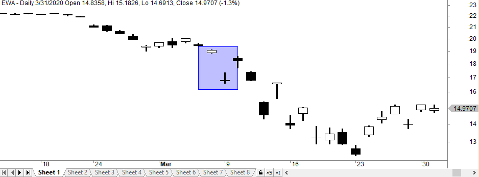

Algorithmic trading is widely recognized as a method to enhance trading efficiency through automation and predefined strategies. It employs algorithms to execute trades based on pre-set rules without the need for human intervention, thereby minimizing emotional biases and increasing the speed of trade execution. Within this trading paradigm, the SPY gap fill strategy is notable for its focus on exploiting opening price discrepancies in the S&P 500 ETF (SPY).

The SPY gap fill strategy revolves around the concept of 'gaps', which occur when the opening price of a security differs from its previous closing price. These gaps can present opportunities to traders, as prices often tend to revert to these 'gaps' or 'fill' them during the trading day. This strategy aims to profit from such reversion tendencies by predicting whether and when these gaps will be closed.



Gap fill strategies are formulated through careful analysis of historical trading data and patterns. Traders define specific rules and thresholds that signal when to enter or exit a trade based on the anticipated gap filling. Algorithmic systems enhance this approach by enabling traders to automate the process, ensuring speed and precision while adhering to the defined rules and removing human emotional factors from trading decisions.

The integration of algorithmic approaches in gap fill strategies offers numerous benefits. It allows for the rapid execution of trades and consistent adherence to trading rules, even in volatile market conditions. Such systems can be backtested with historical data to evaluate their effectiveness and optimize them for future performance. However, these strategies also pose challenges, particularly in terms of data accuracy and the need for continuous adaptation to evolving market conditions. Successful implementation demands rigor in testing and a keen awareness of market dynamics, ensuring algorithms remain effective in capturing gap-related opportunities as market conditions change.

## Table of Contents

## Understanding Gap Fill Strategies

A "gap" occurs in trading when there is a discrepancy between a stock's closing price on one day and its opening price on the next. This phenomenon often emerges due to after-hours news events, earnings announcements, or significant market moves, which affect stock prices outside regular trading hours. Traders have developed gap fill strategies to capitalize on these discrepancies, aiming to profit from the belief that prices tend to revert to the previous day's closing level after the gap is formed.

Gap fill strategies are based on the historical observation that stock prices often retrace to cover the gap. This retracement is known as a "gap fill." The underlying assumption is that the initial gap presents a temporary inefficiency or market overreaction that will be corrected as more information becomes available and trading volumes return to normal levels.

There are several types of gaps, each with unique characteristics and trading implications:

1. **Common Gaps**: These are the most frequent gaps and tend to occur in relatively stable markets. Common gaps are often seen in sideways-trading or range-bound markets and typically do not indicate any sustained price movement. Due to their prevalence, common gaps often fill quickly as the market stabilizes.

2. **Runaway Gaps**: Also called continuation gaps, these occur in trending markets. They signify a strong continuation of the existing trend, either upward or downward. Runaway gaps are typically driven by strong investor sentiment and can sometimes remain unfilled for an extended period, making them more challenging for gap fill strategies.

3. **Exhaustion Gaps**: These appear at the end of significant price trends and represent a final attempt to extend the trend. After an exhaustion gap, a reverse or strong corrective price movement is expected as the trend loses momentum. These gaps predict a potential reversal and are thus an attractive target for gap fill strategies.

Implementing a successful gap fill strategy requires a careful analysis of market conditions, including the type of gap encountered and the prevailing market sentiment. Traders may use technical indicators and historical analysis to identify gaps that are more likely to fill and define entry and [exit](/wiki/exit-strategy) points for their trades. It is also crucial to incorporate risk management practices, as gaps can sometimes signal the beginning of a new trend rather than a temporary price anomaly.

## The SPY Gap Fill Strategy

The SPY gap fill strategy targets the specific openings of the S&P 500 [ETF](/wiki/etf-trading-strategies) (SPY) where price gaps occur in either an upward or downward direction. The objective is to capitalize on these gaps, which represent discrepancies between the prior day's closing price and the subsequent day's opening price. This strategy entails taking a long or short position, guided by predefined gap thresholds and forecasts regarding whether and how swiftly the gap might close.

Key to the SPY gap fill strategy is identifying these price gaps accurately and making informed decisions about the market's response. Gaps can signal significant changes in market sentiment, often due to after-market news, economic events, or substantial order imbalances at the market open. Traders harnessing this strategy assume that these gaps are likely to be corrected, or "filled," as trading progresses, returning to the prior day's closing levels.

When implementing this strategy, traders set specific gap thresholds, which act as the minimum criteria for a trade to trigger. For instance, a gap might be considered significant if it surpasses a certain percentage or a set number of dollars. Once a gap exceeds this threshold, traders deploy one of two primary tactics: going long if the gap is downward (anticipating a price rise to fill the gap) or going short if the gap is upward (expecting a price decline to close the gap).

Backtesting plays a crucial role in refining this strategy. Data from January 2010 to August 2012, for instance, provides valuable insights into its viability. During this period, particular parameter setups demonstrated noteworthy results, indicating that the strategy could potentially yield profitable outcomes under certain conditions. For [backtesting](/wiki/backtesting), historical price data is analyzed to simulate trades and assess performance metrics like profitability, win/loss ratio, and drawdowns.

However, challenges in data accuracy can significantly impact backtesting results and subsequent live implementations. Accurate and timely data is vital for detecting gaps and making trading decisions. Traders must contend with potential discrepancies in the data, which can arise from errors in historical records or delays in obtaining real-time data feeds. This requires diligent data validation and, if necessary, the use of multiple data sources to corroborate findings.

Overall, success with the SPY gap fill strategy demands meticulous parameter tuning based on historical market performance while remaining agile to adapt to real-time market dynamics.

## Algorithmic Implementation of Gap Fill Strategies

Algorithmic trading revolutionizes the application of gap fill strategies by allowing traders to automate entry and exit points, thus enhancing efficiency and minimizing emotional biases that can impair decision-making. For successful implementation, several critical components must be addressed.

Firstly, defining precise entry and exit rules is essential. The strategy must establish clear criteria for when a trade should be executed. For instance, traders might decide to enter a trade when a gap exceeds a predetermined percentage threshold of the previous day's closing price. Exit rules could mirror this by specifying conditions under which a position should be closed, such as when the gap fills to the prior closing price or reaches a stop-loss level.

Secondly, setting appropriate gap size thresholds is crucial. The decision of how large a gap must be before initiating a trade impacts both risk and profitability. This requires analyzing historical gap data to establish thresholds that reflect typical market behavior, which can be implemented within an algorithm to trigger trades only when these criteria are met.

Implementing statistical analyses is imperative for predicting market movements post-gap. Algorithms may utilize statistical models such as linear regression or time series analysis to forecast the likelihood of a gap fill. Incorporating [volatility](/wiki/volatility-trading-strategies) measures and index correlations can also enhance these predictions, adjusting the strategy dynamically based on current market conditions.

Backtesting is a critical step to refine these strategies, allowing traders to assess the performance of their algorithm using historical data. Backtesting helps in validating the strategy's assumptions and parameters, such as entry and exit criteria and gap size thresholds, against past market behavior to fine-tune its effectiveness.

Furthermore, before deploying these algorithms in live markets, they should be tested in paper trading environments. This involves simulating trades with real-time data but without financial risk, ensuring that the strategy performs as expected under current market conditions. This testing phase is vital for identifying any flaws or unexpected outcomes in the algorithm's logic or execution.

Algorithmic implementation of gap fill strategies demands diligence in design and testing, incorporating robust statistical analysis and rigorous validation through backtesting and simulated trading environments. This approach not only optimizes the strategy's performance but also ensures its adaptability and reliability under varying market conditions.

## Challenges and Considerations

One of the pivotal challenges in deploying gap fill strategies lies in ensuring data integrity, given that precise data is indispensable for accurate gap identification and subsequent trading decisions. Real-time or high-quality historical data is crucial to analyze gap patterns accurately and make informed predictions. Data discrepancies can lead to false signal generation, which adversely affects the expected outcomes. Traders often rely on data providers who offer reliable tick or minute-level data to mitigate these issues.

Market conditions and behaviors also play a substantial role in the effectiveness of gap fill strategies. Variables such as [liquidity](/wiki/liquidity-risk-premium) and volatility can drastically alter the dynamics of gap fills. For instance, under low liquidity conditions, prices may not revert to previous levels as expected, leading to incomplete gap fills and unprofitable trades. Similarly, high volatility can cause exaggerated price movements, distorting the typical mechanics of gap filling, and necessitating more dynamic adjustments to trading strategies. Continuous monitoring and adjustment to these ever-changing market conditions are imperative.

Traders must also recognize and adapt to the inherent limitations of backtesting. While backtesting provides an informative groundwork for strategy development, it is often based on historical data and therefore assumes static market conditions. This method might not account for unpredicted market shifts or external economic factors that could significantly influence gap behaviors. It is crucial for traders to align their algorithms with real-time data and possibly integrate [machine learning](/wiki/machine-learning) techniques to enhance adaptability.

Backtesting limitations can be approached with advanced techniques like Monte Carlo simulations, which provide a probabilistic analysis of trading outcomes across numerous hypothetical scenarios. Furthermore, by employing walk-forward optimization, traders can iteratively test and refine strategies based on recent data, thereby enhancing their robustness and reliability in live markets.

Overall, successful execution of gap fill strategies necessitates a comprehensive approach that encompasses accurate data acquisition, diligent monitoring of market conditions, and a flexible strategy framework that can adapt to new information and market behaviors seamlessly.

## Conclusion

Gap fill strategies present notable opportunities for traders who leverage algorithmic systems to exploit market inefficiencies. These strategies capitalize on the tendency of market prices to revert to previous closing levels following an opening gap. Algorithmic trading enables precise execution of these strategies by defining specific entry, exit, and risk management parameters, which can be executed without emotional biases inherent in manual trading.

Implementing gap fill strategies successfully demands rigorous testing and validation to ensure robustness across various market conditions. Backtesting against historical data is crucial to refine the strategy parameters, allowing traders to identify optimal gap size thresholds and timing for trade entries. It provides insights into potential profitability and risk, though traders must remain aware of the limitations inherent in historical data, such as survivorship bias and overfitting.

Accurate and real-time data is essential to identify and react to gap opportunities promptly. This requires robust data feeds and reliable trading infrastructure to act on signals without significant latency. Changes in market volatility, liquidity, and evolving economic conditions can impact the effectiveness of gap strategies, necessitating continuous monitoring and adjustment.

As [algorithmic trading](/wiki/algorithmic-trading) technology continues to advance, gap fill strategies may evolve, offering traders additional tools and methodologies to exploit market gaps. Innovations in machine learning and data analytics could enhance the predictive power of these strategies, adapting dynamically to shifts in market behavior and improving trade execution timing and accuracy. However, these advancements also introduce new complexities and demand ongoing learning and adaptation from traders to maintain an edge in an increasingly competitive environment. As with any trading strategy, success hinges on balancing potential returns with an awareness of risks and limitations, underscoring the importance of ongoing education and adjustment in strategy execution.

## Additional Resources and Tools

Readers interested in gap fill trading strategies can explore several valuable resources and tools to enhance their understanding and implementation of these strategies. 

QuantifiedStrategies.com is a recommended platform that provides insights into various trading strategies, including gap fill methods. It offers a comprehensive analysis of trading strategies, supported by data-driven studies that can help traders refine their approach.

For obtaining reliable market data, platforms such as IQFeed are essential. IQFeed provides high-quality real-time and historical data, which is crucial for accurate gap identification and strategy backtesting. Access to precise data ensures that algorithmic models can be effectively tested and fine-tuned to reflect real market conditions.

Python, a popular programming language among algorithmic traders, offers a suite of libraries that facilitate backtesting and strategy development. Libraries such as `pandas` and `NumPy` are instrumental for data manipulation and statistical analysis. `zipline` is an algorithmic trading library that supports backtesting, allowing traders to simulate their strategies against historical data to evaluate performance. Here is a simple example of using Python libraries for backtesting:

```python
import pandas as pd
import numpy as np

# Sample data: Date and Prices
data = {'Date': pd.date_range(start='1/1/2022', periods=5),
        'Close': [3800, 3850, 3820, 3840, 3805]}
df = pd.DataFrame(data)
df['Gap'] = df['Close'].diff()

# Define a basic gap fill strategy function
def gap_fill_strategy(row):
    if row['Gap'] > 20:
        return "Short"
    elif row['Gap'] < -20:
        return "Long"
    else:
        return "Hold"

# Apply strategy
df['Signal'] = df.apply(gap_fill_strategy, axis=1)
print(df[['Date', 'Close', 'Gap', 'Signal']])
```

For more advanced simulations, trading platforms like MetaTrader and TradeStation offer robust environments for developing, testing, and executing algorithmic strategies. These platforms provide advanced charting tools, script writing capabilities, and automated trading execution.

By leveraging these resources and tools, traders can enhance their ability to develop effective algorithmic trading strategies, ensuring they are well-equipped to navigate the complexities of the financial markets.

## References & Further Reading

[1]: Chan, E. P. (2008). ["Quantitative Trading: How to Build Your Own Algorithmic Trading Business"](https://rickorford.com/quantitative-trading/). Wiley.

[2]: Jansen, S. (2018). ["Machine Learning for Algorithmic Trading"](https://books.google.com/books/about/Hands_On_Machine_Learning_for_Algorithmi.html?id=tx2CDwAAQBAJ). Packt Publishing.

[3]: Aronson, D. R. (2007). ["Evidence-Based Technical Analysis: Applying the Scientific Method and Statistical Inference to Trading Signals"](https://onlinelibrary.wiley.com/doi/book/10.1002/9781118268315). Wiley.

[4]: Lopez de Prado, M. (2018). ["Advances in Financial Machine Learning"](https://books.google.com/books/about/Advances_in_Financial_Machine_Learning.html?id=oU9KDwAAQBAJ). Wiley. 

[5]: Bergstra, J., Bardenet, R., Bengio, Y., & Kégl, B. (2011). ["Algorithms for Hyper-Parameter Optimization."](https://dl.acm.org/doi/10.5555/2986459.2986743) Advances in Neural Information Processing Systems 24.