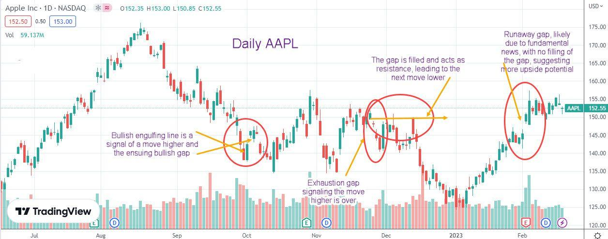

## Table of Contents

## What is gap fill trading?

Gap fill trading is a strategy where traders look for price gaps in a stock's chart and try to profit from the price moving back to fill that gap. A price gap happens when a stock's price jumps from one price to another without any trading in between, often happening overnight or after big news. Traders using this strategy believe that the price will eventually return to the level it was before the gap, so they buy or sell the stock to take advantage of this expected move.

For example, if a stock closes at $50 one day and opens at $55 the next day due to good news, a gap fill trader might buy the stock at $55, expecting it to drop back to $50. They would then sell the stock once it reaches $50, making a profit from the difference. This strategy can be risky because the price might not always return to fill the gap, and traders need to be careful with their timing and manage their risks well.

## What causes gaps in the market?

Gaps in the market happen when a stock's price jumps from one price to another without any trading happening in between. This usually happens when something big happens after the market closes, like a company announcing good or bad news, or when important economic reports come out. People see the news and want to buy or sell the stock right away, but they have to wait until the market opens again. When it does, lots of people rush to trade at the same time, which can make the price start at a different place than where it ended the day before.

Sometimes, gaps can also happen because of what traders expect to happen. For example, if everyone thinks a company's earnings will be really good, they might buy the stock before the earnings come out, pushing the price up. If the earnings are even better than expected, the price might gap up even more when the market opens. But if the earnings are not as good as people thought, the price might gap down. So, gaps can show us how surprised or excited people are about new information.

## How can beginners identify gaps on a price chart?

Beginners can identify gaps on a price chart by looking for spaces between the closing price of one day and the opening price of the next day. If the opening price is higher than the closing price, you'll see a gap up, which looks like a space between the top of one bar or candle and the bottom of the next one. If the opening price is lower than the closing price, it's a gap down, and you'll see a space between the bottom of one bar or candle and the top of the next one. These gaps stand out on the chart because they show where no trading happened between those two prices.

To make it easier, beginners can use charting tools and software that many trading platforms offer. These tools often have features that automatically highlight or mark gaps on the chart. By using these tools, you can quickly spot gaps without having to manually check each price bar or candle. Remember, the key is to look for those clear spaces on the chart where the price jumps from one level to another without any trading in between.

## What are the different types of gaps and how do they affect trading strategies?

There are four main types of gaps that traders should know about: common gaps, breakaway gaps, runaway gaps, and exhaustion gaps. Common gaps happen a lot and don't mean much. They often happen in quiet markets and usually get filled quickly. Breakaway gaps happen when a stock's price breaks out of a range or pattern, like when a stock starts a new trend. They are usually strong and can mean the start of a big move in the price. Runaway gaps happen during a trend and show that the trend is strong and likely to keep going. They are also called continuation gaps. Exhaustion gaps happen at the end of a trend and show that the trend might be running out of steam. They often get filled quickly as the price reverses.

Each type of gap can affect trading strategies differently. For common gaps, traders might not want to trade them because they are not very predictable and often get filled quickly. For breakaway gaps, traders might want to buy or sell in the direction of the gap because it could be the start of a new trend. For runaway gaps, traders might want to keep their trades going in the direction of the trend because the gap shows that the trend is strong. For exhaustion gaps, traders might want to get ready for a reversal and maybe take profits or start a new trade in the opposite direction. Knowing which type of gap you are looking at can help you make better trading decisions.

## What is the basic principle behind gap fill trading strategies?

The basic principle behind gap fill trading strategies is that traders believe a stock's price will go back to where it was before a gap happened. A gap is when the price jumps from one level to another without any trading in between. This usually happens after big news or events. Traders think that even though the price jumped because of the news, it will eventually come back to the old price. So, they try to make money by trading based on this expected move back to the original price.

For example, if a stock closes at $50 one day and opens at $55 the next day, a gap fill trader might buy the stock at $55, expecting it to drop back to $50. They would then sell the stock once it reaches $50, making a profit from the difference. This strategy can be risky because the price might not always return to fill the gap, and traders need to be careful with their timing and manage their risks well. But if they get it right, they can make money from the price moving back to where it was before the gap.

## How do traders use gap fill strategies to enter and exit trades?

Traders use gap fill strategies to enter and [exit](/wiki/exit-strategy) trades by watching for gaps in the price chart. When they see a gap, they look at the price where the gap started and the price where it ended. If the stock price gaps up, meaning it opens higher than it closed the day before, a trader might decide to enter a trade by buying the stock at the higher price. They believe the price will come back down to fill the gap. For example, if a stock closed at $50 and opened at $55, a trader might buy at $55, expecting the price to drop back to $50.

Once the trader is in the trade, they watch the price closely. Their goal is to sell the stock when it reaches the price where the gap started, which in this case is $50. If the price does go back to $50, the trader sells the stock and makes a profit from the difference between $55 and $50. But, if the price doesn't come back to fill the gap, the trader might need to exit the trade at a loss to avoid losing more money. This is why it's important for traders to set stop-loss orders, which are like safety nets that automatically sell the stock if the price goes too low.

## What are the common indicators used in gap fill trading?

In gap fill trading, traders often use a few common indicators to help them decide when to enter and exit trades. One of the most important indicators is the price chart itself. By looking at the chart, traders can see where the gap happened and where the price was before the gap. They also use [volume](/wiki/volume-trading-strategy) to see how strong the gap is. If a lot of people are trading when the gap happens, it might be a strong gap that takes longer to fill. Another useful indicator is the moving average, which helps traders see the overall trend of the stock. If the moving average is going up and the stock gaps up, it might be more likely to keep going up instead of filling the gap.

Another indicator traders use is the Relative Strength Index (RSI). The RSI helps traders see if a stock is overbought or oversold. If a stock gaps up and the RSI is very high, it might mean the stock is overbought and more likely to come back down to fill the gap. On the other hand, if the RSI is very low after a gap down, it might mean the stock is oversold and could go back up. Traders also pay attention to support and resistance levels. These are price levels where the stock has had trouble moving past before. If a gap happens near a strong support or resistance level, it might be more likely to fill the gap because the price often goes back to these levels.

## Can you explain the risk management techniques specific to gap fill trading?

In gap fill trading, managing risk is really important because the price might not always come back to fill the gap. One way traders manage risk is by using stop-loss orders. A stop-loss order is like a safety net that automatically sells the stock if the price goes too low. For example, if a trader buys a stock at $55 hoping it will go back to $50, they might set a stop-loss at $54. This means if the price keeps going up instead of coming back down, the stock will be sold at $54 to limit the loss. Another way to manage risk is by not putting all your money into one trade. Traders often use only a small part of their money for each trade, so if one trade goes wrong, they don't lose everything.

Another technique is to watch the time the trade is open. Gaps often fill quickly, so traders might set a time limit for how long they will keep the trade open. If the gap doesn't fill within that time, they might decide to exit the trade to avoid losing more money. It's also important to keep an eye on the news and events that caused the gap in the first place. If new information comes out that might affect the stock's price, traders need to be ready to change their plans. By using these risk management techniques, traders can protect their money and make smarter decisions when trading gaps.

## How does market volatility impact the success of gap fill trading strategies?

Market [volatility](/wiki/volatility-trading-strategies) can make gap fill trading more risky and harder to predict. When the market is very volatile, prices can move up and down a lot in a short time. This means that a gap might not fill as quickly as a trader expects, or the price might keep moving away from the gap instead of coming back to it. In a volatile market, traders need to be very careful and ready to change their plans quickly. They might need to set their stop-loss orders closer to the entry price to protect their money, but this also means they might get out of the trade too soon and miss out on profits.

On the other hand, high volatility can sometimes help gap fill traders if they are good at reading the market. Big price swings can create more gaps, giving traders more chances to make money. If a trader can spot these gaps quickly and enter and exit trades at the right time, they might be able to make more money in a volatile market. But it's still important to manage risk carefully because the bigger the swings, the bigger the potential losses if things don't go as planned. So, while volatility can offer more opportunities, it also makes gap fill trading more challenging and risky.

## What are some advanced techniques for predicting when a gap will fill?

One advanced technique for predicting when a gap will fill is by using technical analysis to look at patterns and indicators. Traders often use tools like the Relative Strength Index (RSI) to see if a stock is overbought or oversold. If a stock gaps up and the RSI is very high, it might mean the stock is overbought and more likely to come back down to fill the gap. Another tool is the moving average, which can show the overall trend of the stock. If the stock is above its moving average and gaps up, it might be less likely to fill the gap quickly because the trend is strong. By combining these indicators, traders can make better guesses about when a gap might fill.

Another technique is to pay close attention to volume. When a gap happens with a lot of trading volume, it might be a strong gap that takes longer to fill. On the other hand, if the volume is low, the gap might fill more quickly. Traders also look at support and resistance levels. These are price levels where the stock has had trouble moving past before. If a gap happens near a strong support or resistance level, it might be more likely to fill the gap because the price often goes back to these levels. By watching these things closely, traders can get a better idea of when a gap might fill and plan their trades accordingly.

## How can algorithmic trading be applied to gap fill strategies?

Algorithmic trading can be used in gap fill strategies by creating computer programs that automatically look for gaps in the market and trade based on them. These programs can quickly spot when a stock's price jumps from one level to another without any trading in between. Once a gap is found, the algorithm can buy or sell the stock right away, trying to make money when the price moves back to fill the gap. This can be faster and more accurate than a person doing it by hand, because the computer can check many stocks at the same time and make decisions based on set rules.

These algorithms can also use other information to make better trading choices. For example, they can look at how much trading is happening when the gap occurs, or check if the stock is overbought or oversold using indicators like the Relative Strength Index (RSI). They can also keep an eye on the overall trend of the stock using moving averages. By putting all this information together, the algorithm can decide if it's a good time to trade and set stop-loss orders to manage risk. This way, [algorithmic trading](/wiki/algorithmic-trading) can help traders take advantage of gap fill opportunities more efficiently and with less risk.

## What are the psychological challenges traders face when using gap fill trading strategies and how can they be overcome?

When traders use gap fill trading strategies, they often face psychological challenges like fear and impatience. Seeing a big gap in the price can make traders feel scared that the price won't come back to fill it. This fear can make them want to sell too soon, even if the price is still moving in their favor. Impatience is another problem because traders might want the gap to fill right away. If it takes longer than they expect, they might get frustrated and make quick decisions that can lead to losses.

To overcome these challenges, traders need to stick to their trading plan and use risk management tools like stop-loss orders. A stop-loss order can help them feel less scared because it limits how much money they can lose if the trade goes wrong. It's also important for traders to be patient and not rush into or out of trades. They should remember that gaps can take time to fill and not let their emotions control their decisions. By staying calm and following their plan, traders can handle the psychological pressures of gap fill trading better.

## References & Further Reading

[1]: Chan, E. P. (2008). ["Quantitative Trading: How to Build Your Own Algorithmic Trading Business"](https://rickorford.com/quantitative-trading/). Wiley.

[2]: Jansen, S. (2018). ["Machine Learning for Algorithmic Trading"](https://books.google.com/books/about/Hands_On_Machine_Learning_for_Algorithmi.html?id=tx2CDwAAQBAJ). Packt Publishing.

[3]: Aronson, D. R. (2007). ["Evidence-Based Technical Analysis: Applying the Scientific Method and Statistical Inference to Trading Signals"](https://onlinelibrary.wiley.com/doi/book/10.1002/9781118268315). Wiley.

[4]: Lopez de Prado, M. (2018). ["Advances in Financial Machine Learning"](https://books.google.com/books/about/Advances_in_Financial_Machine_Learning.html?id=oU9KDwAAQBAJ). Wiley. 

[5]: Bergstra, J., Bardenet, R., Bengio, Y., & Kégl, B. (2011). ["Algorithms for Hyper-Parameter Optimization."](https://dl.acm.org/doi/10.5555/2986459.2986743) Advances in Neural Information Processing Systems 24.