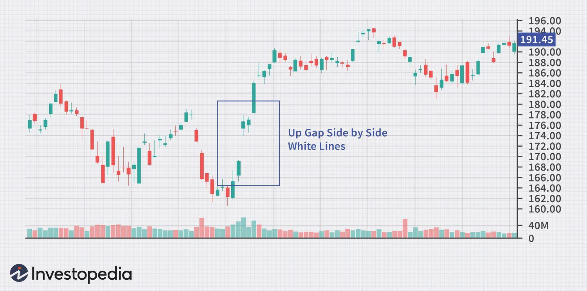

In the complex world of finance, investors constantly seek methods to maximize returns while minimizing risk. As market dynamics evolve, investment strategies that focus on effectively managing financial risk, particularly gap risk, have become essential for both amateur and seasoned investors. Gap risk, which involves abrupt price changes in assets outside regular trading hours, presents an unavoidable challenge that requires careful attention.

In this article, we explore various investment strategies designed to address these challenges, providing insights into the concepts of financial risk and gap risk, while also highlighting the role of algorithmic trading in managing these risks. Understanding these elements is crucial for investors who aim to make informed financial decisions and construct robust investment portfolios.



The advent of algorithmic trading has offered new avenues to manage risk with greater precision and efficiency, integrating advanced analytics and automation to adjust to market changes rapidly. This article outlines how investors can leverage these technologies alongside traditional risk management techniques to align their investment approaches with their financial objectives.

As investors navigate the intricacies of financial markets, having a comprehensive understanding of these strategic components will be invaluable. By the end of this discussion, readers will be equipped with the knowledge necessary to make strategic decisions that not only seek to enhance returns but also secure a measure of stability in an ever-fluctuating market landscape.

## Table of Contents

## Understanding Financial Risk in Investment

Financial risk represents the potential for financial loss when investing, and it impacts decision-making for both individual and institutional investors. This risk is primarily driven by uncertainties within the financial markets and can arise from various sources, including market dynamics, creditworthiness of counterparties, liquidity conditions, and operational challenges.

Market risk encompasses the possibility of an investment's value declining due to factors affecting the overall market, such as economic downturns, [interest rate](/wiki/interest-rate-trading-strategies) fluctuations, or geopolitical events. It is often quantified using metrics like beta, which measures an asset's volatility relative to a benchmark index. For instance, during the 2008 financial crisis, market risk manifested as a widespread decline in asset values worldwide, illustrating the systemic nature of financial risk.

Credit risk originates from the concern that a borrower may default on its financial obligations. This type of risk is often assessed through credit ratings, which evaluate a borrower's creditworthiness. Historical instances, such as the collapse of Lehman Brothers in 2008, underscore the repercussions of inadequate credit risk assessment and highlight the interconnectedness of credit risk with broader market stability.

Liquidity risk arises when an investor is unable to sell an asset without incurring a significant loss in value. This risk is accentuated in investments involving bespoke or niche financial instruments, where markets may lack depth. The 1997 Asian financial crisis exemplified [liquidity](/wiki/liquidity-risk-premium) risk when rapid capital outflows led to asset fire sales and currency devaluations, exacerbating economic instability.

Operational risk is linked to failures in internal processes, systems, or policies. Such risk can result from human errors, technological failures, or external events, impacting the overall financial integrity of an investment. The 2012 trading loss by JPMorgan Chase, known as the "London Whale" incident, is an example where operational deficiencies culminated in substantial financial losses.

Risk management techniques are crucial to mitigate the effects of these risks and safeguard investments. Diversification is a foundational strategy that spreads exposure across various assets, reducing the impact of adverse movements in any single investment. Moreover, the application of quantitative models, such as the Value at Risk (VaR) model, provides insights into potential losses under normal market conditions and aids in risk control decision-making.

Options and futures can serve as hedging instruments, allowing investors to protect against downside risks by locking in prices or establishing price floors and ceilings. Regular portfolio rebalancing ensures that investments align with an investor's risk tolerance and current market conditions, thereby maintaining a strategic risk posture.

Implementing a comprehensive risk management plan involves a mix of these strategies, coupled with continuous monitoring and adjustment in response to evolving market dynamics. By understanding and addressing financial risk, investors can make informed decisions, aiming to achieve a balance between risk and return within their portfolios.

## What is Gap Risk?

Gap risk is the potential for an asset’s price to undergo a significant change between the time a market closes and when it reopens. This risk is particularly prevalent in stocks and commodities due to their susceptibility to external factors that can drive substantial price movements outside regular trading hours. Events such as geopolitical developments, economic reports, and corporate announcements are common catalysts for these price gaps.

Identifying gap risks within a portfolio involves recognizing which assets are more prone to price jumps before market opening. One approach to assess this risk is by analyzing historical price patterns to understand past responses to similar external events. Financial news, market forecasts, and global event calendars are useful tools for anticipation.

Historically, several occurrences illustrate the impact of gap risk on investors. For example, during earnings season, companies release earnings reports outside market hours. An unexpected earnings performance can lead to a substantial gap in stock price by the next market open—either positively with better-than-expected profits or negatively with disappointing results. Another example is geopolitical tensions, such as sudden military conflicts, which can cause commodity prices, like oil, to gap dramatically, affecting related equities and exchange-traded funds (ETFs).

Protecting investments from gap risk exposure encompasses various strategies. Diversification is one fundamental method, spreading investments across various asset classes to lessen potential impacts on your overall portfolio. Utilizing derivative instruments, such as options, provides a hedge against adverse price movements. For instance, a protective put option allows an investor to sell an asset at a predetermined price, mitigating potential losses from a downward gap.

Setting stop-loss orders is another tactical measure, limiting potential drawdowns by automatically selling a security once it reaches a specified price. Additionally, investors might consider reducing their positions in high-[volatility](/wiki/volatility-trading-strategies) assets before anticipated events that could cause market fluctuations. This can involve timing the entry and [exit](/wiki/exit-strategy) from specific holdings based on news flow and sentiment analysis.

Overall, gap risk remains a notable concern for investors, demanding proactive management and strategic planning. By incorporating risk mitigation strategies and staying informed about market developments, investors can better navigate potential price gaps and safeguard their investments.

## Investment Strategies to Manage Risk

Investment strategies aimed at managing risk are essential for maintaining the stability and growth of an investment portfolio. Effective risk management involves several strategies that investors can employ to mitigate potential losses and enhance long-term returns.

Diversification is a fundamental principle in risk management, spreading investments across a range of asset classes to minimize exposure to any single source of risk. By investing in a mix of stocks, bonds, commodities, and real estate, investors can reduce the impact of a downturn in any one sector. The correlation between the performance of these asset classes can affect how diversification mitigates risk, as uncorrelated or negatively correlated assets offer better protection against market volatility.

Asset allocation further refines an investor's approach to diversification by aligning investments with their risk tolerance and financial objectives. Asset allocation involves dividing an investment portfolio among different asset categories, such as equities, fixed-income, and cash, based on an individual’s financial goals, time horizon, and risk appetite. A well-balanced portfolio is tailored to meet both the risk capacity and the desired return of the investor, enabling a more strategic long-term investment approach.

Hedging techniques, such as using options and futures, are advanced methods to protect against potential losses in an investment portfolio. Options provide the right, but not the obligation, to buy or sell an asset at a predetermined price, offering a way to lock in profits or limit losses. Futures contracts obligate the trading of an asset at a specified future date and price, serving as a hedge against price fluctuations. Using these derivatives can help manage risk by providing downside protection and locking in prices or yields.

Implementing stop-loss orders and other protective measures in investment planning can further safeguard against significant losses. A stop-loss order is a predetermined price at which an investor will sell a security to prevent further declines. These orders can be manual or automated, helping investors to minimize emotional decision-making and prevent losses from escalating due to market panic or sudden downturns.

Regular portfolio reviews and adjustments are necessary to respond to changing market conditions. Market dynamics, economic indicators, and personal financial situations can evolve, necessitating a re-evaluation of portfolio allocations and strategies. Ongoing monitoring ensures that the portfolio remains aligned with the investor’s objectives and risk tolerance, enabling timely adjustments to optimize performance and manage risk effectively.

By implementing these strategies, investors can enhance their capability to manage risk, protect their portfolios, and achieve their financial goals.

## The Role of Algorithmic Trading in Risk Management

Algorithmic trading, an approach where computer algorithms execute trading decisions rapidly and in large volumes, has become a critical tool in managing financial risks, including gap risk. Gap risk arises when there is a significant price shift in an asset between market close and reopening, often triggered by events outside regular trading hours. Analyzing massive datasets at high speed, algorithms can effectively manage and mitigate this risk.

Algorithms are equipped to detect and manage gap risk by continuously monitoring market conditions and executing trades in response to predefined parameters. For example, algorithms can be designed to recognize specific patterns or indicators that precede a gap in asset prices. By automatically executing trades when these conditions are detected, algorithms can help capitalize on price changes or protect investments from potential losses.

One significant advantage of [algorithmic trading](/wiki/algorithmic-trading) is its ability to minimize emotional biases that often affect human traders. Algorithms operate based on data and predefined rules, ensuring consistency in execution and removing the emotional component from trading decisions. This objectivity, coupled with the capability to process information more efficiently than a human can, enhances the overall effectiveness of risk management strategies.

The incorporation of [machine learning](/wiki/machine-learning) further enhances algorithmic trading. Machine learning models can be trained on historical data to predict potential risks, including gap risks. These models continuously learn and adapt to new data, improving their predictive capabilities over time. For example, using Python, a simple machine learning model could be implemented to forecast potential price gaps, providing traders with actionable insights.

```python
import pandas as pd
from sklearn.model_selection import train_test_split
from sklearn.ensemble import RandomForestClassifier

# Load historical data
data = pd.read_csv('market_data.csv')

# Features and target variable
X = data[['indicator1', 'indicator2', 'indicator3']]  # Example indicators
y = data['gap_occurred']  # Binary variable: Gap occurred (1) or not (0)

# Split the data
X_train, X_test, y_train, y_test = train_test_split(X, y, test_size=0.2, random_state=42)

# Train the model
model = RandomForestClassifier()
model.fit(X_train, y_train)

# Predict on new data
predictions = model.predict(X_test)
```

Several case studies illustrate the successful application of algorithmic trading in managing market risks. During the 2020 financial market instability, some funds used algorithms to swiftly adjust their portfolios in response to volatile conditions, thereby avoiding significant losses. For example, an algorithm could identify a sudden increase in market volatility and adjust asset allocations or implement hedging strategies with minimal delay. Such strategies ensured that the affected portfolios were rebalanced in accordance with real-time market conditions.

In summary, algorithmic trading provides a robust framework for risk management in today's dynamic financial markets. By integrating algorithms with machine learning for predictive analysis, traders can enhance their ability to detect and manage risks, including gap risks, while benefiting from the objectivity and efficiency of automated systems.

## Choosing the Right Investment Strategy for You

When selecting an investment strategy, investors must consider several critical factors to align with personal financial goals, risk tolerance, and investment horizon. Financial goals define what an investor hopes to achieve, whether it's saving for retirement, buying a home, or generating passive income. Establishing clear objectives helps in outlining a roadmap that guides investment choices and strategy formulations.

Risk tolerance, the amount of risk an investor is willing to take, is another key component. Different individuals have varying levels of comfort towards risk, often influenced by factors like age, income stability, and previous investment experience. Younger investors with a longer time horizon might afford higher risk for potential greater returns, whereas retirees might prioritize capital preservation.

The investment horizon, or the duration for which an investor plans to hold onto their investments, also plays a crucial role. Short-term goals demand different strategies than long-term objectives; for instance, high-liquidity assets are preferable for short-term goals, while equities might be better suited for long-term growth.

Continual education and staying updated with market trends are indispensable in an ever-evolving financial landscape. Investors must engage with financial news, reports, and analyses to understand potential impacts on their investments. Market trends can alter the risk-return profile of various asset classes, prompting strategy re-evaluation. For example, a change in interest rates could affect bond yields, requiring a shift in bond investment strategies.

Evaluating and adapting strategies in response to environmental changes ensures that the investment portfolio remains aligned with market conditions. Economic indicators like GDP growth, inflation rates, and technological innovations can influence asset performance. Investors should regularly assess how economic shifts affect their holdings. Tools such as beta coefficients can measure an asset's volatility relative to the market, guiding necessary strategic adjustments.

Financial advisors can play a vital role in tailoring strategies to an individual's specific needs. They possess the expertise to craft personalized plans that consider an investor's unique circumstances. Advisors guide through complex decision-making, offering insights into market opportunities and risk management techniques.

Finally, beginning investors should start small, test strategies, and gradually increase their exposure. This approach minimizes potential losses while gaining practical learning experiences. Initially, committing only a portion of total investable assets allows an investor to understand market dynamics and refine strategies progressively. As confidence and knowledge grow, further investment can be considered, thereby reducing the impact of early missteps.

By carefully considering these factors and maintaining a flexible approach, investors are better positioned to choose the right investment strategy that meets their personal financial objectives.

## Conclusion

Understanding financial risk, particularly gap risk, is vital for every investor aiming to make informed choices and effectively manage their portfolios. Financial risks like market, credit, liquidity, and operational risks can significantly impact investment outcomes, necessitating the need for robust strategies to counteract potential losses. Gap risk, emerging from unforeseen shifts in asset prices between market closure and reopening, underscores the necessity for vigilance and readiness in dealing with geopolitical, economic, or unexpected corporate announcements.

The practice of diversified investment strategies has proven to be a cornerstone in effective risk management. By spreading investments across different asset classes, investors can mitigate specific risks associated with individual investments. Similarly, algorithmic trading presents a significant advantage in managing risk. By using algorithms to automate trading decisions, investors can reduce emotional biases, enhance efficiency, and utilize predictive analytics for better risk assessment.

Investors are encouraged to regularly manage and review their portfolios. By staying aligned with market conditions and integrating technological advancements in their strategy, investors can better safeguard their investments and seize emerging opportunities. As technology evolves, so too do the complexities of risk management. Future advancements are likely to bring more sophisticated tools for predictive analysis, enabling more precise management of financial risks.

To secure a stable financial future, it is imperative for investors to take an active and informed role in managing their investments. Testing strategies with smaller investments before gradual exposure increase is a wise approach. Continual learning and adaptation are critical, and consulting with financial advisors can further refine these strategies to an individual's personal financial goals. With the right strategy and vigilance, financial security can be more attainable.

## References & Further Reading

[1]: Bergstra, J., Bardenet, R., Bengio, Y., & Kégl, B. (2011). ["Algorithms for Hyper-Parameter Optimization."](https://dl.acm.org/doi/10.5555/2986459.2986743) Advances in Neural Information Processing Systems 24.

[2]: ["Advances in Financial Machine Learning"](https://www.amazon.com/Advances-Financial-Machine-Learning-Marcos/dp/1119482089) by Marcos Lopez de Prado

[3]: ["Evidence-Based Technical Analysis: Applying the Scientific Method and Statistical Inference to Trading Signals"](https://www.amazon.com/Evidence-Based-Technical-Analysis-Scientific-Statistical/dp/0470008741) by David Aronson

[4]: ["Machine Learning for Algorithmic Trading"](https://github.com/stefan-jansen/machine-learning-for-trading) by Stefan Jansen

[5]: ["Quantitative Trading: How to Build Your Own Algorithmic Trading Business"](https://books.google.com/books/about/Quantitative_Trading.html?id=j70yEAAAQBAJ) by Ernest P. Chan