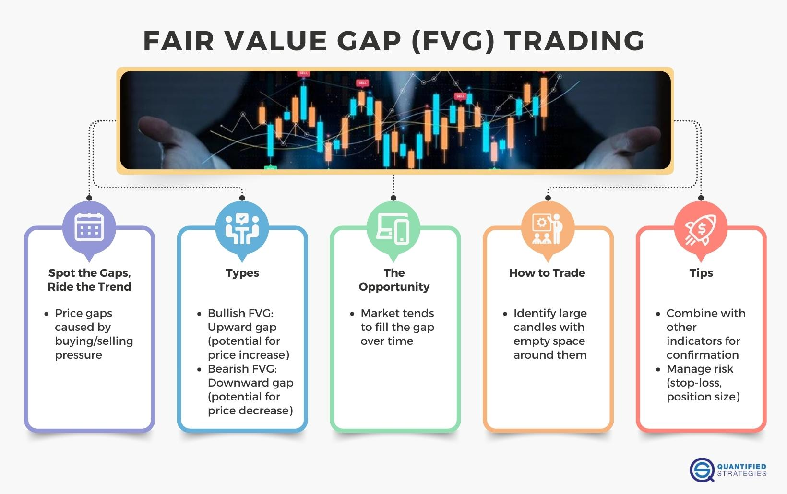

Gap trading is a well-recognized strategy in algorithmic trading that capitalizes on price gaps in the market. These gaps arise when the price of a financial asset substantially jumps up or down, often due to unexpected news or earnings reports that lead to market discrepancies. Traders rely on algorithms to swiftly identify these gaps and execute trades, aiming to profit from the ensuing price movements. By automating the detection and execution processes, traders can react promptly to market conditions, often faster than manual trading methods.

This article provides an in-depth examination of gap trading within the broader spectrum of algorithmic strategies. It offers insights into how traders can integrate gap trading into their automated systems effectively. The focus is on how to harness algorithms for recognizing potential gaps, determining entry and exit points, and executing trades with precision. Throughout, various challenges that traders encounter in this domain will be addressed, alongside a discussion on the potential profitability and risks associated with gap trading strategies in today's market.



The integration of gap trading into an algorithmic framework requires a comprehensive understanding of both the market conditions that lead to price gaps and the technological tools that can exploit these opportunities. With the ever-evolving landscape of financial markets, traders must continuously refine their approaches to stand out in a highly competitive environment. Advanced computing and algorithmic techniques have made it feasible to attempt such strategies, but they come with their own set of complexities and risk management considerations.

## Table of Contents

## What is Gap Trading?

Gap trading focuses on trading financial securities characterized by price gaps. These gaps manifest as untraded areas on a price chart, where the price of an asset has abruptly jumped either upwards or downwards. Such occurrences are typically precipitated by external influences like earnings reports, shifts in market sentiment, or significant news events that create sudden changes in supply and demand dynamics.

These price gaps are commonly observed across various asset classes, particularly in stocks and indices, and they can present in different time frames, ranging from daily to intraday charts. For instance, a stock's price might gap up at the market open due to an unexpectedly positive earnings report released after the previous day's close. Conversely, negative economic news could result in a gap down at the start of the trading session.

Understanding the distinct types of gaps is essential for crafting a robust trading strategy. There are four primary types of gaps:

1. **Breakaway Gaps**: These occur at the end of a price pattern and signal the beginning of a new trend. Breakaway gaps are typically accompanied by high trading volumes, reflecting strong market interest and confidence in the new trend's direction.

2. **Exhaustion Gaps**: Found near the end of a significant price movement, exhaustion gaps hint that a prevailing trend is nearing its conclusion. They are often identified by lower trading volumes, indicating diminishing interest.

3. **Common Gaps**: These are not tied to any particular market event and are usually temporary in nature. Common gaps often fill quickly, offering traders short-term trading opportunities. They frequently occur in markets with light volume or during consolidation periods.

4. **Continuation (or Runaway) Gaps**: Occurring in the middle of a trend, these gaps signify a potential acceleration in the existing price movement. Continuation gaps generally appear on high volume, despite their mid-trend occurrence, suggesting sustained interest and momentum.

Traders utilizing gap trading strategies aim to capitalize on the price discrepancies that gaps represent. By analyzing the context and type of gap, traders can make informed decisions on whether to enter or [exit](/wiki/exit-strategy) trades, thus enhancing their potential for profit. The relative frequency of gaps in certain markets, combined with their potential for significant price shifts, makes gap trading an alluring strategy for many algo traders.

## Integration of Gap Trading in Algorithmic Trading

Algorithmic trading utilizes algorithms to execute trades in financial markets based on predetermined criteria. Incorporating gap trading into these systems involves developing algorithms that can automatically identify and respond to price gaps in real-time. To achieve this, traders set parameters that determine the precise conditions under which trades are initiated or closed, often informed by the size and nature of the gap. 

For instance, traders may use rules that specify entering a position if a gap exceeds a certain percentage of the previous day's closing price, or if the gap is classified as a particular type, such as a breakaway or exhaustion gap. Algorithms can be programmed to act on these conditions swiftly, allowing traders to take advantage of rapid price movements post-gap.

Backtesting is an essential component of integrating gap trading into algorithmic systems. It involves using historical data to simulate and test the effectiveness of a trading strategy over a specified period. This process allows traders to refine algorithm parameters, enhancing their adaptability to market conditions while minimizing human intervention. For example, Python can be used with libraries like Pandas and NumPy to handle large datasets and perform statistical analyses.

```python
import pandas as pd
import numpy as np

# Example of a simple backtesting strategy for gap trading
def backtest_gap_trading(df, gap_threshold=0.02):
    results = []

    for index, row in df.iterrows():
        # Calculate gap (percentage change from previous close)
        if index > 0:
            previous_close = df.at[index-1, 'Close']
            open_price = row['Open']
            gap = (open_price - previous_close) / previous_close

            if abs(gap) > gap_threshold:
                # Simulate entering a trade based on gap size
                trade_result = open_price * (1 + np.random.uniform(-0.01, 0.01))  # Random return for illustration
                results.append(trade_result)

    return results

# Sample dataframe with 'Open' and 'Close' prices
data = {'Open': [100, 105, 110], 'Close': [98, 104, 111]}
df = pd.DataFrame(data)
backtest_results = backtest_gap_trading(df)
print(backtest_results)
```

Historically, gap trading required substantial manual input and was often only partially automated. However, the advancement in computing power and algorithmic sophistication now permits the full automation of gap trading strategies. This progress allows traders to efficiently evaluate vast amounts of data and make real-time decisions that capitalize on the fleeting opportunities presented by price gaps.

Moreover, the automation of gap trading has profound implications for the industry's landscape. It levels the playing field, providing retail traders access to sophisticated techniques once reserved for major financial institutions. Nonetheless, successful integration into [algorithmic trading](/wiki/algorithmic-trading) demands a robust technological infrastructure capable of executing trades at high speeds and responding to the nuanced patterns of market behavior.

## Evaluating Profitability and Risk

Algorithmic gap trading presents both opportunities and challenges, with profitability closely intertwined with the inherent risks of market [volatility](/wiki/volatility-trading-strategies) and unforeseen factors that influence price gaps. As algorithmic trading has become more mainstream, the influx of traders utilizing these strategies has led to intensified competition, which has in turn diminished the once-robust margins gap trading offered. This trend necessitates using advanced data analytics to navigate the fluctuations within modern markets effectively.

A crucial aspect of effective gap trading is the use of sophisticated data analytics for accurate gap prediction. This predictive capability helps traders anticipate the likelihood that a price gap will be filled, thus minimizing exposure to adverse price movements. By analyzing historical price patterns and integrating [machine learning](/wiki/machine-learning) models, traders can enhance their algorithm's forecasting ability, reducing the unpredictability associated with market gaps.

In addition to analytics, risk management is a pivotal element of any comprehensive gap trading algorithm. Strategies such as implementing stop-loss orders and maintaining optimal position sizing are essential to mitigate potential losses. Stop-loss orders automatically execute a trade to limit an investor's loss on a position, while position sizing helps to ensure that the potential loss on any single trade is a small percentage of total capital, preserving overall portfolio health. Here is an example of a Python implementation for determining optimal position size:

```python
def calculate_position_size(account_balance, risk_per_trade, stop_loss_distance, price_per_share):
    risk_amount = account_balance * risk_per_trade
    position_size = risk_amount / stop_loss_distance
    number_of_shares = position_size / price_per_share
    return number_of_shares

# Example usage
account_balance = 50000  # account balance in USD
risk_per_trade = 0.01   # risk 1% of account per trade
stop_loss_distance = 2.5  # stop loss in USD per share
price_per_share = 50      # price per share in USD

shares_to_buy = calculate_position_size(account_balance, risk_per_trade, stop_loss_distance, price_per_share)
print(f"Number of shares to buy: {int(shares_to_buy)}")
```

This code snippet demonstrates how to calculate the number of shares to purchase, considering the trader's total capital and the acceptable risk per trade. By coupling such quantitative techniques with robust execution strategies, traders can maintain a favorable risk-reward profile, even in a high-frequency trading environment where costs and [liquidity](/wiki/liquidity-risk-premium) concerns might erode profit margins.

In conclusion, successful algorithmic gap trading hinges on employing both advanced analytics to forecast gap behavior and stringent risk management practices to safeguard investments amidst volatile market conditions. These components help ensure that traders remain competitive and profitable as the landscape of gap trading continually evolves.

## Challenges and Considerations

One of the critical challenges in algorithmic gap trading is ensuring the quality and reliability of the data used to backtest and trigger trades. The efficacy of a trading algorithm heavily relies on the accuracy and consistency of historical price data. Inaccurate data can lead to faulty identification of gaps and subsequently, poor trading decisions. This issue underscores the importance of using reliable data sources and regular data validation processes to enhance the performance of trading algorithms.

Furthermore, there is a significant risk associated with overfitting algorithms to historical data. Overfitting occurs when a model learns the details and noise in the training data to the point that it negatively impacts the performance of the model on new data. For example, an algorithm perfectly calibrated to past price movements may perform poorly when faced with different market conditions. This risk necessitates the use of techniques such as cross-validation and out-of-sample testing to ensure that the algorithm's performance is robust across various market scenarios.

Another challenge is the fast-paced nature of trading gaps, which demands robust technology and swift execution capabilities. Gaps can close within minutes, if not seconds, requiring algorithms to react almost instantaneously to capture potential opportunities. High latency or delays in execution can result in missed opportunities or suboptimal trade prices. Therefore, investing in high-performance computing infrastructure and low-latency networks becomes crucial for competitive advantage in gap trading.

Market liquidity and trading costs also pose concerns that traders must address. In lower liquidity environments, executing large trades can move the market unfavorably, affecting the desired entry and exit points of a trade. Moreover, the cumulative effect of trading costs, including spreads and commissions, can erode the profitability of high-frequency gap trading strategies. To mitigate these issues, algorithms should incorporate considerations like optimal order execution and cost-effective trading strategies. Employing risk management tools, such as stop-loss orders, can help in managing adverse price movements, while careful position sizing can reduce exposure to volatility, thereby preserving the profitability of trading strategies in variable market conditions.

## Conclusion

Gap trading continues to be a compelling strategy within algorithmic trading, presenting traders with opportunities for profit when executed with precision and care. However, the complexities and inherent risks necessitate rigorous preparation and the development of sophisticated strategies. As technological advancements reshape the trading landscape, traders must consistently adapt and refine their techniques to remain competitive while effectively managing associated risks.

Technology plays a pivotal role in enhancing the efficacy of gap trading strategies. The integration of advanced algorithms and machine learning models can significantly improve the ability to predict gap occurrences and manage trades efficiently. Yet, the dynamic nature of financial markets requires continuous evaluation and adjustment of these algorithms to account for evolving market conditions.

It's essential for traders to acknowledge that gap trading is no longer the straightforward opportunity it once was. The increased competition and sophistication in the market have narrowed margins, transforming gap trading from a simple strategy into a nuanced approach requiring considerable expertise and technological acumen.

Nevertheless, for those who are disciplined and technologically adept, gap trading remains a valuable component of an algorithmic trading toolkit. The key to success lies in the continual honing of strategies, leveraging data analytics for informed decision-making, and maintaining agility in the face of market changes. By striking a balance between innovation and caution, traders can capitalize on the potential that gap trading offers, ensuring their strategies remain relevant and effective in a competitive trading environment.

## References & Further Reading

[1]: Bergstra, J., Bardenet, R., Bengio, Y., & Kégl, B. (2011). ["Algorithms for Hyper-Parameter Optimization."](https://papers.nips.cc/paper/4443-algorithms-for-hyper-parameter-optimization) Advances in Neural Information Processing Systems 24.

[2]: ["Advances in Financial Machine Learning"](https://www.amazon.com/Advances-Financial-Machine-Learning-Marcos/dp/1119482089) by Marcos Lopez de Prado

[3]: ["Evidence-Based Technical Analysis: Applying the Scientific Method and Statistical Inference to Trading Signals"](https://www.amazon.com/Evidence-Based-Technical-Analysis-Scientific-Statistical/dp/0470008741) by David Aronson

[4]: ["Machine Learning for Algorithmic Trading"](https://github.com/stefan-jansen/machine-learning-for-trading) by Stefan Jansen

[5]: ["Quantitative Trading: How to Build Your Own Algorithmic Trading Business"](https://books.google.com/books/about/Quantitative_Trading.html?id=j70yEAAAQBAJ) by Ernest P. Chan