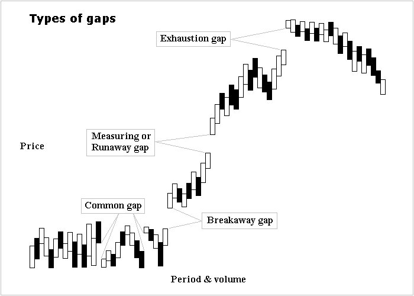

Gap trading is a strategy that focuses on price movements, or "gaps," that show a significant shift in market sentiment from one period to the next without trading occurring between. These gaps are particularly apparent in the stock, futures, and forex markets where the market closes at the end of each trading day or week but can also occur in markets that trade around the clock during news events or on weekends. They are visualized as a space on price charts where no trading has taken place, resulting in a 'jump' in price action from one level to another.

The importance of gap trading lies in its ability to tap into the momentum and potential continuation or reversal of a trend that a gap might indicate. Gaps can act as a powerful indicator for the initiation or exhaustion of a trend, providing traders with opportunities to enter or exit trades at potentially advantageous positions. When trading gaps, investors are essentially betting on the market's subsequent move following this sudden change, aiming to profit from the 'filling' of the gap, or from the extension of the gap's direction.

Understanding the psychology behind gaps is crucial, as gaps are a direct representation of traders' and investors' reactions to new information, changes in sentiment, or broader market shifts. When a gap occurs, it reflects the collective actions of the market participants, either from a rush of euphoria or panic. For instance, a common gap may occur due to overreaction to a news event, while an exhaustion gap may represent the dwindling momentum of a trend.

Technical analysis plays a fundamental role in gap trading. Traders utilize various charting tools to identify past gaps that have occurred, assess their impact, and predict future market behavior. Gaps are considered significant technical events that can lead to high-probability trades when combined with other technical indicators like volume, support and resistance levels, and trend analysis. The objective is to discern whether the gap will act as a continuation signal, driving prices further in the direction of the gap, or indicate an overextension of the current trend, suggesting a potential reversal.

By mastering gap trading, traders can potentially leverage these market inefficiencies for profit. However, it requires a keen sense of market movement, an understanding of the underlying factors contributing to the gaps, and the ability to quickly assimilate and react to new market information.

## Table of Contents

## Defining Market Gaps

Market gaps, often simply known as gaps, occur when there is a noticeable empty space on a price chart between two trading periods, indicative of a sharp move in price with no trading occurring in between. These gaps are typically represented on candlestick or bar charts where the low price of one period is higher than the high of the preceding one (gap up), or the high is lower than the low of the previous period (gap down)[1][2].



There are several types of gaps, each with its own set of characteristics and implications:

1. **Common Gaps**: These are the most frequently occurring gaps and are generally small compared to others. Common gaps are usually filled quickly, meaning prices move back to the original pre-gap level. These do not typically signify new market moves and are often attributed to the randomness of market movements rather than substantive changes in market conditions.
2. **Breakaway Gaps**: These signal the start of a new trend and occur where the price breaks away from an established range or pattern. Breakaway gaps are often accompanied by high volume and do not fill as quickly as common gaps, if at all.
3. **Exhaustion Gaps**: Occurring towards the end of a price trend, exhaustion gaps signal a final attempt to hit new highs or lows. Despite their implication of trend continuation, they often indicate the trend is losing strength and may reverse after the gap occurs. These gaps are usually identified in hindsight when the price reverses its direction post-gap.
4. **Continuation Gaps**: Also known as runaway gaps, they happen during a strong trend and signal that the trend is set to continue at an accelerated pace. These gaps often occur at about the midpoint of a market move and are reinforced by a significant increase in volume.
5. **Runaway Gaps**: Sometimes considered similar to continuation gaps, these gaps further the direction of the prevailing trend and may be driven by increased interest in the asset due to news, earnings, or other impactful events. They are a sign that the trend is powerful and is likely to continue.

The creation of gaps is closely tied to market volatility. Volatility refers to the rate at which the price of a security increases or decreases for a given set of returns. High volatility often leads to larger gaps, as the price can make significant moves within short periods, especially outside of regular trading hours or after major announcements or economic events.

In the trading community, clear illustrations and examples of these gaps are vital for understanding and can be found in historical charts across various markets. Traders use these illustrations to study gap behavior and develop strategies for identifying and responding to gaps in real-time.

## The Science Behind Gaps

The market mechanics that create gaps are fundamentally rooted in the supply and demand imbalance for a security. When there are no transactions between the bid and the ask price, a gap is formed. This absence of trading activity can occur either because no shares were available at price levels within the gap or because no orders were matched within that range.


Pre-market and post-market activities play a pivotal role in the formation of gaps. These trading sessions occur outside the official market hours, where trading can continue on electronic market networks. Since the volume during these sessions is typically lower, the trades can cause more significant price movements due to less liquidity. For instance, if significant sell orders are placed in the pre-market on negative news, the stock price may open much lower than it closed the previous day, resulting in a gap down. Conversely, if positive news is released and buying pressure increases, a gap up may occur at the market open.

Fundamental events are often the catalysts for gap formations, as they can drastically alter the perceived value of a security. These events include but are not limited to earnings reports, economic data releases, mergers and acquisitions announcements, regulatory updates, and geopolitical events. Traders and investors react to these events, causing immediate reassessments of a security's value. For example, if a company reports earnings that are significantly above market expectations, it could result in a price gap up as investors rapidly buy into the stock on the anticipation of growth. The opposite is true if the company fails to meet expectations.

The underlying science of gaps also includes the study of order books and how large orders can affect price. Large buy orders that cannot be filled within the current or previous closing price range can lead to upward gaps. Similarly, large sell orders can create a vacuum in demand and lead to downward gaps. This behavior is further amplified by automated trading systems and stop orders that become active when certain price levels are hit, contributing to the swift creation of gaps.

Furthermore, gaps can also be studied through market microstructure theory, which examines how market participants’ behaviors and the structure of trading itself contribute to price formation and movement. This theoretical framework explains how variables such as transaction costs, asymmetric information, and the strategic behavior of market makers can lead to gaps.

In essence, the science of gap formations is an interplay between market structure, trader psychology, and fundamental events, all of which must be comprehensively understood for effective gap trading.

## Gap Analysis: Identifying and Interpreting Gaps

Identifying gaps in trading involves a meticulous examination of price charts, where a gap is observed as an empty space between two trading periods with no overlap in the price levels. Here’s how to systematically spot and interpret them:

**Step 1: Chart Selection** Choose a time frame that aligns with your trading strategy. Gaps are often best observed on daily charts for overnight gap analysis but can also be identified in intraday time frames for day trading.

**Step 2: Spot the Gap** Look for a distinct break in price action where the high of one period is lower than the low of the subsequent period for a gap down, or the low of one period is higher than the high of the subsequent period for a gap up.

**Step 3: Validate the Gap** Confirm the gap isn't just a data error by cross-referencing multiple data sources or charting platforms.

**Step 4: Measure the Gap** Quantify the gap by noting the difference in price between the previous period’s close and the current period’s open.

**Step 5: Contextual Analysis** Examine the context around the gap. Was there a fundamental event? Is there a trend in place? The environment surrounding the gap can greatly influence its significance.

**Analysis of Gaps**

The gaps signal various market sentiments:

| Pattern | Market sentiment |
| --- | --- |
| Common Gaps | Common Gaps are often filled quickly and signify a small imbalance in supply and demand, typically not considered significant in forecasting market movements. |
| Breakaway Gaps | Breakaway Gaps signify the beginning of a new trend and are accompanied by high volume, suggesting a strong shift in market sentiment. |
| Exhaustion Gaps | Exhaustion Gaps appear at the end of a price pattern and signal a final attempt to hit new highs or lows. These gaps are often filled as the market corrects its overextended move. |
| Continuation Gaps | Continuation Gaps, or runaway gaps, occur in the middle of a trend and signify strong buyer or seller continuation in the direction of the gap. |
| Runaway Gaps | Runaway Gaps also known as measuring gaps, can signal the halfway point of a trend. |

**Case Studies for Practical Understanding**

<aside>
💡 **Case 1: The Earnings Surprise**

Consider a stock that has gapped up significantly after an earnings announcement that exceeded analysts’ expectations. The price closed at $50 the previous trading day and opened at $58 after the announcement. The large volume accompanying this gap up indicates strong buying interest and the potential beginning of an uptrend.

</aside>

<aside>
💡 **Case 2: The Product Recall**

A company announces a major product recall, and its stock opens the next day with a gap down, signaling a panic sell-off. The stock closed at $75 but gapped down to open at $67 with very high volume, indicating a strong negative sentiment and a potential downtrend.

</aside>

In both cases, traders would assess the post-gap price action, looking for confirmatory signals such as increased volume and price stability above or below the gap to make informed trading decisions.

By carefully analyzing these scenarios, traders can gain insights into whether the gap represents a true shift in market sentiment or a temporary imbalance in order flow. Gaps can also act as support or resistance levels going forward, and their subsequent fills or failures to fill can be telling for the stock’s future direction.

## The Psychology of Gaps

The psychology of gaps in trading hinges on the collective reaction of traders to an unexpected change in price levels, where the gap itself acts as a catalyst for emotional and psychological responses. Traders typically view gaps as an imbalance between supply and demand, precipitated by an urgency to buy or sell, which can be triggered by news, events, or a shift in market sentiment.

When a gap occurs, traders’ reactions are often a mix of surprise, greed, and fear, which intensifies the urgency to take action. The suddenness of gaps forces traders to reassess their positions and the value of the security. This reassessment can lead to sharp movements as traders rush to enter or exit positions.

A key psychological aspect of gap trading is the expectation that a gap will be filled. The phenomenon of gaps being filled is rooted in the tendency for prices to return to their pre-gap levels, a process that can be driven by traders taking profits or cutting losses, resulting in a reversal of the initial gap move. This reversal often occurs because the factors that caused the initial gap may be perceived as temporary or exaggerated[3].

The expectation that a gap will fill can become a self-fulfilling prophecy as traders act on this belief, pushing the price back to its original level. Traders who anticipate the fill may place trades in the direction of the close of the gap, contributing to the price movement that ultimately closes the gap.

Moreover, gaps can serve as reference points for support and resistance. A common psychological pattern is that once a gap is filled, the area around the gap may act as a support or resistance level because traders remember these price points and may make trading decisions based on them in the future.

The interplay of fear and greed is most evident in the reaction to runaway or continuation gaps, which signify the potential for a strong trend. Traders often fear missing out on the trend continuation, which can exacerbate the move as more traders jump in, driven by the emotion of greed.

## Strategies for Trading Gaps

### Full Gap Strategies

*Full gap strategies revolve around significant price movements that occur when the market price opens higher or lower than the previous day's close with no trading activity in between.*

These gaps typically reflect a strong shift in market sentiment and can be used to forecast continuing momentum or a potential reversal.

Full Gap Up: Long Strategy

*When a stock opens above the previous day's high, it demonstrates overwhelming buying interest, often due to positive news or strong earnings reports.*

Traders looking to go long should wait for a slight retracement after the open as traders who are taking profits create a pullback. The entry point for a long position should be set after this initial pullback if the price shows signs of resuming its upward movement, typically indicated by bullish candlestick patterns or a bounce off a short-term moving average.

Full Gap Up: Short Strategy

Contrary to the long strategy, a short strategy on a full gap up is based on the assumption that the gap will fill because the initial surge was an overreaction. The trader will short sell the stock if the price starts to fall after the open. It's a riskier strategy because it bets against the prevailing momentum. Thus, tight stop-loss orders are crucial to minimize potential losses. This approach is best suited when the gap up does not have a solid fundamental reason, or the stock is already considered overvalued.

Full Gap Down: Long Strategy

Opening significantly lower than the previous close can be an overreaction to negative news. A full gap down presents a buying opportunity for traders if the price starts to recover after the initial sell-off. This is based on the premise that the early negative sentiment will not sustain, and the stock will rebound at least partially. Traders should look for signs of stabilization or reversal patterns before entering a long position. However, they must be cautious and validate that the downward gap wasn't due to a critical fundamental flaw in the company.

Full Gap Down: Short Strategy

This strategy involves short selling a stock after a full gap down if the price continues to drop. It capitalizes on the continuation of the negative sentiment. The idea is that the opening price reflects a new equilibrium at a lower price level due to a change in fundamentals or investor expectations. The strategy requires careful risk management, as any rebound or positive news can result in sharp upward price corrections.

For both full gap up and down strategies, technical analysis tools such as volume indicators, RSI, or MACD can provide additional confirmation. High volume during a gap up suggests strong buying pressure, whereas low volume may indicate a lack of conviction in the price movement, making it more likely for the gap to fill.

### Partial Gap Strategies

Partial gap strategies target smaller moves that occur when the opening price is higher or lower than the previous close, but still within the range of the previous day’s trading session. These gaps suggest a more modest shift in market sentiment and can often be an early signal for a larger trend or a brief countertrend move.

Partial Gap Up: Long Strategy

A partial gap up occurs when the opening price is higher than the previous close but not higher than the previous high. This indicates a cautious bullish sentiment. A long position may be taken if the price does not surpass the previous day's high but shows signs of maintaining its upward trajectory, especially if it stays above key moving averages or other support levels. A trader might look for additional confirmation through bullish candlestick patterns or a rising moving average convergence divergence (MACD) before entering a trade.

Partial Gap Up: Short Strategy

If the asset fails to maintain the partial gap up and starts to move downward, filling the gap, a trader could initiate a short position. This trade banks on the idea that the gap was merely an optimistic blip in a market not fully committed to a bullish stance. The stop loss for this strategy is often placed just above the high of the gap up day, and the trade is closely monitored for signs of a reversal back into positive territory.

Partial Gap Down: Long Strategy

When the market opens lower than the previous day’s close but above the previous day’s low, it shows an incomplete bearish sentiment. Traders might consider a long position if there’s evidence of price stabilization or a quick move to fill the gap. This approach is validated when the gap starts to fill and is supported by rising volume, suggesting that the initial bearishness is waning, and buyers are regaining control.

Partial Gap Down: Short Strategy

Conversely, a partial gap down that continues to move lower after the open can be seen as an opportunity for a short sell. The persistence of bearish sentiment despite the less significant gap down suggests underlying weakness. Traders would look for decreasing volume as the price moves lower, implying that there is not much support for higher prices and that the downward trend may continue.

For both partial gap up and down strategies, confirming the move with technical analysis is critical. Traders typically use indicators like the RSI to gauge whether the asset is overbought or oversold after the gap. Volume is also a key factor; for instance, a partial gap that is not supported by significant volume may indicate a lack of conviction and a higher probability of the gap being filled.

Literature on the effectiveness of trading partial gaps can be found in resources like "Technical Analysis: The Complete Resource for Financial Market Technicians" by Charles D. Kirkpatrick and Julie R. Dahlquist. These gaps are also frequently discussed in trading forums and market analysis blogs where real-time examples are often shared and analyzed. Quantitative studies in academic journals occasionally dissect the probability of gap fills and can provide a statistical foundation for such strategies.

To successfully implement partial gap strategies, traders should use them in conjunction with a broader trading plan that includes fundamental analysis, market trends, and other technical signals. Furthermore, setting clear entry and exit criteria is crucial to manage risks effectively.

### End-of-Day Gap Strategies

End-of-day gap strategies involve analyzing the price action that occurs at the close of the trading day to anticipate potential gaps the following day. This approach hinges on the recognition that gaps often represent the market’s reaction to news, events, or shifts in sentiment that occur when the market is closed. By evaluating end-of-day data, traders aim to forecast these movements and position themselves accordingly[4].

Traders using end-of-day gap strategies will typically scrutinize the final hour of trading, often referred to as the “power hour,” where increased volatility and volume can provide clues about the next day's market opening. The logic is that strong moves or unusual activity at the close could signify that informed traders are positioning for news or data anticipated to be released before the next session.

**Long Strategy**

*When traders detect a strong bullish sentiment at the end of the day, characterized by increasing prices and volume, they may predict a gap up the next day.*

Such traders might take a long position near the closing bell, anticipating overnight news or sentiment to drive the opening price higher the next day.

**Short Strategy**

*Conversely, if there is evident bearish sentiment at the end of the day, with prices falling and volume growing, a trader may expect a gap down at the opening of the next session.*

In this case, entering a short position before the market close could capitalize on the expected downward move.

These strategies can be further refined by considering the context in which the end-of-day price movement occurs. For instance, if the move is against the prevailing trend, it might be seen as a sign of a reversal, indicating a stronger likelihood of a gap in the direction of the end-of-day move.

Risk management is crucial with end-of-day gap strategies because holding positions overnight can expose traders to significant risk from unexpected news and events. To mitigate this, traders often set strict stop-loss orders and only allocate a small portion of their portfolio to any single trade.

### Modified Trading Method for both Long and Short positions.

The Modified Trading Method for both long and short positions in gap trading involves adjusting standard trading strategies to account for the unique opportunities and risks presented by gaps. The essence of the modified method is to combine traditional technical analysis with gap-specific considerations to enhance entry and exit points and improve risk management.

**Long Positions**

For long positions, traders might wait for a gap to occur and then look for the stock to show the first sign of a pullback or consolidation after the initial surge. Rather than buying immediately after the gap up, the modified method suggests waiting for confirmation that the stock is likely to continue upward. This confirmation could be a bullish chart pattern, such as a flag or a pennant, following the gap, or a bounce off a key moving average or support level.

Traders might also use volume as a confirmation tool; a gap up on significantly high volume followed by a period of lower volume consolidation suggests that the stock may be taking a breather before continuing higher. The entry point is then fine-tuned to the post-gap price action rather than the pre-gap levels.

**Short Positions**

In the case of short positions, the modified method advises a similar approach with the roles reversed. Following a gap down, instead of shorting immediately, traders wait for the stock to bounce or show a sign of upward correction. If this correction is on low volume and the price struggles to fill the gap, it could indicate weakness, providing a strategic entry point for a short position.

Here, too, technical indicators are crucial. For instance, an inability to break above a certain moving average may serve as a good entry point. Additionally, candlestick patterns, like a bearish engulfing or shooting star after a corrective bounce, can be a valuable component of the modified method for short entries.

**Risk Management**

Risk management is a pivotal part of the modified trading method. Stop-loss orders are generally placed just beyond the opposite side of the gap, ensuring that if the market moves to fill the gap, positions are exited before significant losses accrue. This placement is informed by the tendency of gaps to act as support or resistance levels post-formation.

Profit targets in the modified method are often set using historical support and resistance levels adjusted for the gap. Traders may aim for a previous high or low that aligns with the size of the gap or an average true range multiple to set realistic and strategic profit-taking levels.

## Technical Tools for Gap Trading

Technical tools are indispensable in gap trading, as they help traders confirm signals, time their entries and exits, and understand the strength and potential of a gap. Here are some of the essential technical tools used in gap trading:

**Indicators and Oscillators**

Moving Averages (MAs): Traders often use MAs to determine the trend direction. A gap that occurs in the direction of the moving average trend can be considered more reliable. For example, a gap up in an uptrend above a moving average might be seen as a continuation gap, signaling more upside.

Relative Strength Index (RSI): The RSI is a momentum oscillator that measures the speed and change of price movements. After a gap, an overbought or oversold RSI can signal potential reversal or continuation. For instance, a gap up followed by an RSI remaining in the overbought territory could suggest that the gap may not fill immediately and the price might continue higher.

MACD (Moving Average Convergence Divergence): This tool is useful to gauge the momentum before and after a gap. A widening MACD histogram after a gap up indicates strengthening momentum, while narrowing could signal a slowdown and potential gap fill.

Bollinger Bands: Post-gap price action relative to Bollinger Bands can indicate the strength of the gap. A price that gaps outside of the bands and stays outside may indicate a strong move, while one that quickly reverts within the bands might imply a potential reversal.

**Support and Resistance**

Price Gaps often act as support or resistance because they represent an area where the price has not traded, creating a psychological barrier. Traders watch these levels closely:

For gaps up, the top of the gap becomes support, and for gaps down, the bottom of the gap acts as resistance. When a gap is approached from the opposite side, traders pay attention to whether the price will reverse (respecting the gap level) or fill the gap (breaking through the level).

**Volume Analysis**

Volume is a critical confirmation tool in gap trading. High volume during a gap indicates strong interest and commitment to the new price level, which can make the gap more likely to be a runaway or continuation gap.

Conversely, a gap on low volume might be suspect as it indicates a lack of conviction, increasing the chances of it being filled. Traders will often look for volume to diminish as a gap starts to fill, indicating that the selling or buying pressure is waning and the gap fill is completing.

Volume Profile: This advanced tool shows the volume traded at specific price levels and can indicate where there may be support or resistance after a gap. It’s particularly useful to determine potential stopping points for a gap that is filling.

**Volume Oscillators:**

Volume oscillators, like the Chaikin Money Flow (CMF) or the Volume Rate of Change, can provide additional insight into the buying and selling pressure behind a gap, helping to confirm the strength of the move.

These technical tools, when used together, can provide a robust framework for trading gaps. Traders should always remember that no tool is infallible and using a combination of tools in conjunction with a sound risk management strategy is essential.

## Algorithmic and Quantitative Approaches to Gap Trading

Algorithmic and quantitative approaches to gap trading involve the use of mathematical models and automated algorithms to identify and exploit price gaps in the market. These methods rely heavily on historical data analysis and pattern recognition to predict gap behavior and to make informed trading decisions.

**Algorithmic Strategies in Gap Trading**

Algorithmic trading strategies can capitalize on gaps in various ways. For instance, algorithms may be programmed to execute trades when a gap is detected that meets certain criteria, such as a minimum size or occurring in a specific context within the price chart. Some common algorithmic strategies include:

- **Mean Reversion Systems**: These systems assume that after a gap occurs, prices will revert back to the mean or average level. The algorithm would trade against the gap, expecting it to fill.
- **Momentum Systems**: If the algorithm detects that a gap is accompanied by significant volume and follows a trend, it may take a position in the direction of the gap, anticipating a continuation.
- **Breakout Systems**: Algorithms look for gaps that occur after periods of consolidation and take positions in the direction of the gap, predicting a new trend beginning.
- **Event-Driven Systems**: Algorithms are designed to trade based on events such as earnings releases or economic reports that can cause gaps, taking positions based on historical patterns and how similar events have affected prices in the past.

**Backtesting Strategies for Effectiveness and Risk Assessment**

Before implementing any algorithmic trading strategy, it’s crucial to backtest it using historical data. Backtesting involves simulating how the strategy would have performed in the past based on existing data, which can give traders an idea of its effectiveness and potential risks.

For backtesting, the algorithm would run through historical price data looking for gaps and then simulate trades according to the rules of the strategy. The outcome of these simulated trades is then analyzed to assess the strategy's performance, taking into account metrics such as the win/loss ratio, drawdowns, return on investment, and Sharpe ratio.

**Example in Python**

Here is a simple Python example using the Pandas library to identify full gaps up and down in historical stock data. This example is for educational purposes and not a complete trading strategy.

```python
import pandas as pd
import numpy as np

## Load historical data into a DataFrame
data = pd.read_csv('historical_stock_prices.csv', parse_dates=True, index_col='Date')

## Define a gap up and gap down
def identify_gaps(data):
    gaps = pd.DataFrame(index=data.index)
    gaps['Gap Up'] = np.where(data['Low'] > data['Close'].shift(1), 1, 0)
    gaps['Gap Down'] = np.where(data['High'] < data['Close'].shift(1), 1, 0)
    return gaps

## Apply the function to the data
gaps = identify_gaps(data)

## Example output
print(gaps[gaps['Gap Up'] == 1])  # To show days with a gap up
print(gaps[gaps['Gap Down'] == 1])  # To show days with a gap down
```

Remember that this is just a fragment of what an actual algorithm might look like. A fully fleshed-out trading algorithm would include more conditions, risk management features, and would be rigorously backtested on out-of-sample data to ensure robustness.

For further learning on algorithmic trading in Python, "Python for Finance" by Yves Hilpisch is a comprehensive resource that explains how to build algorithmic trading strategies from scratch. Additionally, the Quantopian platform provides a wealth of information and tools for developing and testing algorithmic trading strategies[5].

## Risk Management in Gap Trading

Risk management is a pivotal aspect of gap trading, as the volatility that accompanies gaps can lead to significant profits but also substantial losses. The two critical components of risk management in this context are setting stop losses and managing trade sizes.

**Setting Stop Losses**

A stop loss is an order placed with a broker to buy or sell once the stock reaches a certain price. In gap trading, stop losses are vital for several reasons:

- **Limit Losses**: They help to cap the potential losses on a trade if the market moves against the anticipated direction of the gap fill or continuation.
- **Remove Emotion**: By setting a stop loss, traders can make a dispassionate decision about the maximum amount they are willing to lose on a trade.
- **Protect Profits**: Traders can use trailing stops to protect any unrealized profits on a position that has moved favorably.

The placement of a stop loss in gap trading should be strategic; for instance, when trading a gap up, a stop loss might be placed just below the low of the gap day or beneath a recognized support level.

**Managing Trade Sizes**

The size of a trade can significantly impact the overall risk profile of a portfolio. Here are a few principles for managing trade sizes:

- **Fixed Percentage**: One common method is to risk a fixed percentage of the trading capital on any single trade, often between 1% to 2%. This method ensures that even a string of losses won't deplete the trading capital significantly.

- **Kelly Criterion**: More sophisticated traders might use the Kelly Criterion to calculate the optimal size of a trade based on the probability of winning, the win/loss ratio, and the ratio of the average win to the average loss.


- **Volatility Adjustment**: Adjusting trade size based on the volatility of the asset can also be an effective method. Higher volatility assets should generally command a smaller trade size due to the increased risk.

**Balancing the Risk-to-Reward Ratio**

The risk-to-reward ratio is a measure used to compare the expected returns of an investment to the amount of risk undertaken to capture these returns. In gap trading:

- **Identify Potential Reward**: Traders must have a clear target in mind for where they expect the price to go post-gap. This target could be a technical level, a certain percentage move, or based on historical gap data.
- **Compare to Potential Risk**: This expected reward is then compared to the potential risk, which is the distance from the entry point to the stop-loss level.
- **Ratio**: A favorable risk-to-reward ratio is typically around 1:2 or higher, meaning the potential reward is at least twice the potential risk.

Effective risk management in gap trading is not just about the technicalities of stop-loss placement or the mathematics of trade size. It also involves a disciplined approach to trading, adherence to the trading plan, and the psychological fortitude to accept losses and let profits run.

For further reading on risk management strategies specific to gap trading, "A Trader's Money Management System" by Bennett McDowell provides insight into the application of risk management techniques in various trading scenarios[6].

## Finding Gapping Stocks and Assets

Identifying stocks and assets that exhibit gap potential is a blend of art and science, employing both technical analysis and understanding of market dynamics. Traders utilize various techniques and tools to scan the market efficiently for such opportunities.

**Techniques for Scanning**

1. **Pre-Market and After-Hours Screening**: Many trading platforms provide tools to screen for price movements occurring outside regular trading hours. This can highlight stocks that may open with a gap.
2. **Price and Volume Filters**: Setting filters for sudden spikes in volume combined with significant price changes can flag stocks that are gapping or about to gap.
3. **News Aggregators**: News plays a critical role in gap creation. Using financial news aggregators to catch early stories about corporate earnings, product launches, or regulatory changes can give traders a head start.
4. **Volatility Indicators**: High volatility stocks are more prone to gapping. Indicators such as the Average True Range (ATR) can be used to identify such stocks.
5. **Earnings Calendars**: Since earnings announcements often lead to gaps, tracking when companies are scheduled to release their earnings can be a proactive method to find potential gappers.

**Tools for Scanning**

- **Stock Screeners**: Tools like Finviz, TradingView, or Market Chameleon allow for the customization of filters to spot gaps based on pre-defined criteria.
- **Brokerage Platforms**: Many online brokers have built-in scanning tools that can be set up to find gapping stocks based on specific technical criteria.
- **Automated Trading Software**: Advanced traders sometimes build custom scans into automated trading systems, using programming languages like Python, to alert them of potential gap trades.

**Criteria for Selecting Stocks**

1. **Liquidity**: Look for stocks with sufficient liquidity (usually with an average daily volume in excess of 500,000 shares), to ensure that entry and exit points can be executed without significant price slippage.
2. **Volatility**: Stocks that have a history of volatility are more likely to experience price gaps.
3. **Price Patterns**: Historical chart patterns that show a tendency to gap can be a good predictor of future gap behavior.
4. **Fundamental Strength**: Stocks with strong fundamentals may provide more predictable gap movements post-earnings or other significant events, whereas those with poor fundamentals might be more erratic.
5. **Market Sentiment**: Understanding the overall sentiment towards a stock or sector can provide clues on how a gap will behave. Sentiment indicators or tools like the Fear & Greed Index can be informative.
6. **Sector and Industry Trends**: Gaps can often occur in groups within the same sector or industry, especially when that sector or industry is influenced by major events or economic shifts.

## Gap Trading in Different Markets

Gap trading strategies, while universally applicable across different asset classes, require specific considerations for each market due to the varying nature of their trading environments, market structures, and participant behaviors.

**Stocks**

Gap trading in stock markets is heavily influenced by corporate events such as earnings releases, product launches, or regulatory approvals. Gaps can often be traded by gauging market reaction to such events. The stock market's opening hours often create distinct overnight gaps, especially for stocks listed on exchanges like NYSE and NASDAQ. Traders may use tools like Benzinga or earnings calendars to anticipate these gaps.

**Forex**

The 24-hour Forex market experiences fewer gaps than the stock market, primarily due to its continuous operation. Gaps are mostly seen during the weekend when the market closes on Friday and reopens on Sunday. Major news events or geopolitical crises can cause currency pairs to gap significantly. Forex traders can benefit from following economic calendars and news services like Forex Factory for potential gap opportunities.

**Commodities**

Gaps in commodity markets are often driven by geopolitical events, natural disasters, and changes in supply-demand dynamics. For example, crude oil might gap after an OPEC meeting or a geopolitical conflict in oil-producing regions. Weather conditions can significantly affect agricultural commodities, leading to gapping. Traders can monitor services like the U.S. Energy Information Administration or the National Weather Service for information that could lead to gaps.

**Indices**

Trading gaps in indices involves understanding the collective sentiment towards the market or sector the index represents. Indices can gap due to macroeconomic data releases, changes in monetary policy, or significant moves in influential component stocks. Index futures are a common way to trade gaps, given their reaction to events outside the regular market hours.

**Adapting Strategies:**

1. **Liquidity and Market Hours:** Unlike stocks, Forex and cryptocurrencies offer high liquidity round the clock, requiring adaptations to strategies concerning the timing of trades and the expectation of gap closure.
2. **Leverage:** Commodities and Forex markets often provide higher leverage, which means gap trading in these markets requires stringent risk management to manage the increased potential for both profits and losses.
3. **Economic Events:** Forex and commodities traders need to be acutely aware of scheduled economic releases and unscheduled events that can cause substantial gaps.
4. **Market Depth:** The depth of the market, which can be thin in certain commodities, may result in more significant slippage, requiring traders to adjust their entry and exit strategies accordingly.
5. **Spread Betting and CFDs:** In some jurisdictions, traders use spread betting or Contracts for Difference (CFDs) to trade on price movements without owning the underlying asset, which can be especially useful in gap trading for indices and commodities.

## Advanced Gap Trading Concepts

Leverage is a powerful tool in gap trading, amplifying both potential returns and risks. When a trader identifies a gap that they believe will close, using leverage can increase the size of the position beyond what the trader's own capital would allow. However, this means that a small adverse move can result in significant losses, hence the importance of calculated risk-taking cannot be overstressed. Utilizing stop-loss orders to cap potential losses is crucial when trading with leverage. It's also important to consider the overnight financing costs that come with holding leveraged positions, which can erode profits on small moves[7].

Incorporating news and earnings reports into gap trading is about predicting how these events will impact a stock's price and subsequently lead to a gap. Earnings reports can cause some of the largest gaps, as they provide a quarterly update on a company's performance relative to market expectations. Advanced traders analyze pre-release indicators such as analyst predictions, whisper numbers, and company guidance to predict both the direction and magnitude of potential gaps. These predictions are then used to place trades before the information becomes public, aiming to capitalize on the resulting gap[9].

When it comes to news, real-time news aggregation services and social media sentiment analysis are valuable. Platforms such as Bloomberg Terminal and Reuters Eikon provide comprehensive news coverage that can be used to anticipate market-moving events. Additionally, alternative data sources like Twitter sentiment analysis or Google Trends have become increasingly popular for gauging public perception, which can be precursors to market gaps.

Both leverage and the incorporation of news require advanced risk management techniques. One should never risk more than they are willing to lose on a single trade. Furthermore, having a deep understanding of the market's reaction to similar events in the past can provide insight into how a current event might unfold[8].

Mastering these advanced concepts in gap trading involves a steep learning curve and a need for constant adaptation, as market conditions and regulations change over time. Therefore, a trader should engage in continuous education, backtesting, and small-scale experimentation to refine these tactics.

## Pitfalls and How to Avoid Them

In the pursuit of mastering gap trading, traders often stumble over a few common pitfalls. Recognizing and avoiding these mistakes can dramatically improve trading outcomes.

**Overestimating Gap Closure Probabilities**

Many traders erroneously believe that all gaps will close quickly. While many do, some gaps signify a change in market sentiment and may not close for a long time, if ever. The key is to analyze the context of the gap. Factors such as market sentiment, news events, and overall market conditions should influence the assessment.

**Ignoring Overall Market Trend**

Trading against the primary market trend because of a gap can lead to losses. Gaps often follow the direction of the trend, and trading in opposition to it without strong contrary evidence can be hazardous.

**Neglecting Volume Analysis**

Volume is a significant indicator of the strength behind a gap. Low volume suggests less commitment and a higher chance of a gap fill, while high volume can indicate the start of a new trend.

**Overleveraging**

Using excessive leverage in anticipation of a gap fill can result in significant losses. Gaps can go unfilled longer than the trader can remain solvent, especially when using high leverage.

**Trading on Gaps Alone**

Relying solely on gaps without confirmation from other technical indicators or fundamental analysis is a recipe for mistakes. It is essential to use a holistic approach when analyzing gaps.

**Misconceptions Debunked:**

- **"Gaps always get filled":** This is not always the case, particularly with breakaway and runaway gaps that may signify the start of a new trend.
- **"Gaps are a stand-alone signal":** Gaps should not be used in isolation; they are more effective when combined with other technical indicators or fundamental factors.
- **"All gaps are the same":** Understanding the different types of gaps (common, breakaway, exhaustion, continuation, and runaway) is crucial as they each have different implications.
- **"Gap trading is easy":** Like all forms of trading, gap trading requires a solid understanding of the markets and a disciplined approach to risk management.

To navigate these pitfalls, traders should:

- **Backtest Strategies:** Use historical data to understand how certain types of gaps have played out in the past, but be aware that past performance is not indicative of future results.
- **Use Risk Management Tools:** Implement stop-loss orders to protect against unforeseen market moves and manage trade sizes to avoid overexposure.
- **Continuous Education:** Stay updated with market conditions, news events, and deepen understanding of technical and fundamental analysis.

**External References:**

- Harris, L. (2003). Trading and Exchanges: Market Microstructure for Practitioners. This reference can help traders understand the role of volume and market structure in gap trading.
- Schwager, J. D. (2012). Market Wizards: Interviews with Top Traders. Schwager's book is a collection of discussions with successful traders and includes insights on risk management.
- Bulkowski, T. N. (2008). Encyclopedia of Chart Patterns. Bulkowski provides statistical evidence about the performance of various chart patterns, including gaps.

Avoiding these pitfalls requires discipline, knowledge, and the ability to adapt strategies as market conditions change. Gap trading, while offering significant opportunities, demands respect for the market's complexity and an unwavering commitment to sound trading principles.

## Conclusion

Gap trading remains a potent strategy in the trader's arsenal, harnessing market inefficiencies and investor psychology. Key takeaways from mastering this approach emphasize the importance of understanding the different types of gaps and the context in which they occur. It’s not just about recognizing a space on the chart; it’s about comprehending what that space represents in terms of market sentiment and potential price movement.

Remember, successful gap trading is underpinned by rigorous analysis—both technical and fundamental. It requires a trader to be nimble, adaptive, and always ready to capitalize on the opportunities presented by the market each day. Indicators, oscillators, and volume analysis tools are your allies in deciphering the strength and implication of a gap, but they should be used in concert with a solid grounding in market fundamentals and economic indicators.

Algorithmic and quantitative methods offer a structured approach to gap trading, but they must be backtested and applied with caution. Risk management is non-negotiable, with stop-loss orders and size management being critical to preserving capital. In seeking out gapping stocks and assets, use robust scanning tools and criteria to identify high-potential trades while being aware of the risks involved, especially when considering leverage or trading based on news and earnings reports.

💡 **Read more:**

- Trading strategies papers with code on [Equities](https://wiki.paperswithbacktest.com/trading-strategies/equities), [Cryptocurrencies](https://wiki.paperswithbacktest.com/trading-strategies/cryptocurrencies), [Commodities](https://wiki.paperswithbacktest.com/trading-strategies/commodities), [Currencies](https://wiki.paperswithbacktest.com/trading-strategies/currencies), [Bonds](https://wiki.paperswithbacktest.com/trading-strategies/bonds), [Options](https://wiki.paperswithbacktest.com/trading-strategies/options)
- [A curated list](https://github.com/paperswithbacktest/awesome-systematic-trading) of awesome libraries, packages, strategies, books, blogs, and tutorials for systematic trading
- [A bunch of datasets](https://huggingface.co/paperswithbacktest) for quantitative trading
- [A website to help you](https://paperswithbacktest.com/) become a quant trader and achieve financial independence

## References & Further Reading

[1]: ["Encyclopedia of Chart Patterns"](https://www.amazon.com/Encyclopedia-Chart-Patterns-Thomas-Bulkowski/dp/0471668265) by Thomas N. Bulkowski

[2]: ["Technical Analysis of the Financial Markets"](https://www.amazon.com/Technical-Analysis-Financial-Markets-Comprehensive/dp/0735200661) by John Murphy

[3]: ["Beyond Greed and Fear"](https://www.amazon.com/Beyond-Greed-Fear-Understanding-Association/dp/0195304217) by Hersh Shefrin

[4]: ["Overnight Returns and Firm-Specific Investor Sentiment"](https://www.cambridge.org/core/journals/journal-of-financial-and-quantitative-analysis/article/abs/overnight-returns-and-firmspecific-investor-sentiment/20DD2F7ABA4BBEB2C2327DDD51E10559) by David Aboody, Omri Even-Tov, Reuven Lehavy and Brett Trueman

[5]: ["Python for Finance"](https://www.amazon.com/Python-Finance-Mastering-Data-Driven/dp/1492024333) by Yves Hilpisch

[6]: ["A Trader's Money Management System"](https://www.amazon.com/Traders-Money-Management-System-Trading-ebook/dp/B003L784FC) by Bennett McDowell

[7]: ["Trading and Exchanges: Market Microstructure for Practitioners"](https://www.amazon.com/Trading-Exchanges-Market-Microstructure-Practitioners/dp/0195144708) by Larry Harris

[8]: ["A Complete Guide to the Futures Market"](https://www.amazon.com/Complete-Guide-Futures-Market-Fundamental/dp/111885375X) by Jack D. Schwager

[9]: ["The Earnings Announcement Premium and Trading Volume"](https://www.nber.org/system/files/working_papers/w13090/w13090.pdf) by Bjorn Eraker and Mark Ready