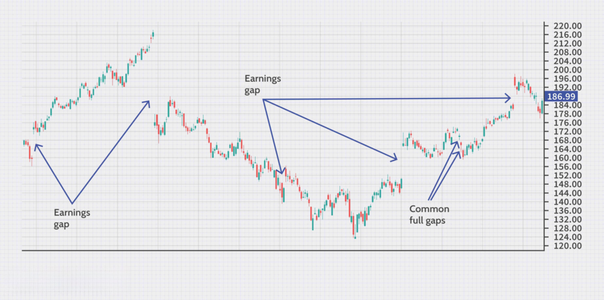

Gapping in financial markets is a phenomenon characterized by a significant price discrepancy between the closing price of one trading session and the opening price of the next. This volatility is frequently fueled by impactful news events, economic announcements, or shifts in investor sentiment, which occur outside of regular trading hours. For traders, understanding gapping is essential for developing strategies that effectively leverage these abrupt market shifts. Notably, the ability to predict and react to gaps can be the difference between profit and loss.

Gaps are commonly observed across various asset classes, including stocks, commodities, and foreign exchange markets. They may signal strong bullish or bearish momentum and can indicate potential trend reversals or continuations. Recognizing different types of gaps, such as common, breakaway, runaway, and exhaustion gaps, is crucial, as each has unique implications for market behavior.



Algorithmic trading strategies have become increasingly popular for capitalizing on gaps, necessitating the use of automated systems capable of executing trades with speed and precision. This development underscores the importance of technology in modern trading, enabling traders to respond swiftly to price movements that occur in gapping situations. Beyond algorithms, mastering gap-related trading strategies involves understanding the associated risks and psychological dynamics that can influence trading decisions.

This article will examine the mechanics of gapping, different gap types, trading strategies designed to exploit gaps, and the importance of risk management and psychological preparedness in gap trading. By exploring these facets, traders can better navigate the complexities of gapping in financial markets and potentially enhance their trading performance.

## Table of Contents

## Understanding Gapping in Financial Markets

Gapping is a prevalent occurrence in financial markets, marked by the opening price of a trading session being notably different from the preceding session's closing price. This price discrepancy creates visible gaps on price charts, which can be analyzed for potential trading advantages.

Gaps are common across various financial markets, including stocks, commodities, and the foreign exchange ([forex](/wiki/forex-system)) markets. These gaps frequently result from impactful market-moving events such as unexpected economic news, geopolitical developments, or major announcements from corporations that can sway investor sentiment drastically. For instance, a positive earnings report released after market close can result in a gap up when the market opens, reflecting heightened investor optimism.

The appearance of a gap often introduces strong bullish or bearish [momentum](/wiki/momentum). Investors and traders can interpret these gaps as signals of potential trend reversals or continuations. For example, if a stock gaps lower after a series of declining prices, it might suggest a possible continuation of the bearish trend. Conversely, a gap up after a downtrend might indicate an upcoming reversal or a switch in momentum.

Despite the opportunities gaps present, they also highlight market inefficiencies and warrant a nuanced approach. Analyzing gaps necessitates an understanding of the underlying triggers and the market context. For instance, a weekend geopolitical event affecting commodity exports can cause gap openings in the commodities market that might not align with the technical indicators followed by traders.

Various types of gaps, each with distinct characteristics and market implications, require tailored analysis:

1. **Common Gaps**: These occur without significant news-driving events and often close quickly, bearing minimal influence on long-term trend directions.
2. **Breakaway Gaps**: Arise at pivotal market points as prices break out from consolidation zones, often indicating the onset of a new trend.
3. **Runaway (Continuation) Gaps**: Reflect significant momentum in an ongoing trend, typically manifesting midway through the trend’s progression.
4. **Exhaustion Gaps**: Occur near the end of a substantial price move, potentially signaling a trend reversal. These gaps can be strategic entry points for contrarian traders.

Understanding these types of gaps and their implications is crucial for traders aiming to exploit the opportunities they present while navigating the inherent risks. Effective gap analysis can enhance strategic decision-making, enabling traders to harness the potential rewards of gapping while minimizing exposure to market inefficiencies.

## Types of Gaps and Their Significance

Gaps in financial markets represent significant price discrepancies that occur between the closing price of one trading session and the opening price of the next. Each type of gap carries unique characteristics and implications, which can offer trading opportunities or present challenges. Understanding these various types of gaps is crucial for developing effective trading strategies.

**Common Gaps** are typically seen in markets with regular volatility and are often the least impactful in terms of predicting future price movements. They occur without any significant news or events to drive the price and are frequently "filled," meaning the price returns to pre-gap levels. These gaps usually arise in relatively stable markets and are characterized by a lack of trend change indications. Traders often leverage this predictability by employing strategies that anticipate a quick reversion to close the gap.

**Breakaway Gaps** are associated with strong moves out of established trading ranges or consolidation patterns. They signify the start of a new trend, as they occur when the price breaks through critical support or resistance levels. Breakaway gaps are often supported by high trading volumes and indicate a shift in market sentiment. Measures such as the below Python snippet can assist in identifying breakaway gaps:

```python
def find_breakaway_gap(prices, volume, threshold=0.05):
    gaps = []
    for i in range(1, len(prices)):
        gap_size = abs(prices[i]['open'] - prices[i-1]['close']) / prices[i-1]['close']
        if gap_size > threshold and volume[i] > volume[i-1]:
            gaps.append((i, gap_size))
    return gaps
```

**Runaway (Continuation) Gaps** occur amid strong trending markets and signal an acceleration of an existing trend. These gaps happen as a result of significant buying or selling pressure and usually occur midway along the trend. Runaway gaps are less likely to be filled quickly, as they reflect ongoing momentum. Traders can exploit these gaps by aligning with the prevailing trend, adjusting their strategies to capture continued movement.

**Exhaustion Gaps** appear near the end of a significant price move and suggest a reversal may be imminent. They occur when the final buy or sell orders flood the market, appearing just before a trend cements its termination. Exhaustion gaps indicate that the current trend may have run its course, offering contrarian trading opportunities. Accurate identification can involve monitoring for decreasing volume post-gap and price retracements signaling the potential reversal.

Each gap type requires specific analysis techniques and presents different trading scenarios:

- **Common Gaps**: Utilize short-term reversion strategies given their tendency to close quickly.
- **Breakaway Gaps**: Identify as potential trend initiators, confirmed by volume and support/resistance breakouts.
- **Runaway Gaps**: Trade in the direction of the trend, recognizing the continuation implied by the gap.
- **Exhaustion Gaps**: Plan contrarian trades, cautioning on reversals indicated by patterns like reduced volume or opposing candlestick formations.

Successful gap trading relies on understanding these gap types and deploying strategies appropriate to their dynamics, supported by tools and analysis that align with the trader's objectives and risk tolerance.

## Algorithmic Trading Strategies for Gapping Markets

Algorithmic trading employs automated systems to execute trading strategies based on set criteria, allowing traders to swiftly capitalize on market gaps. Such strategies provide a competitive edge in gapping markets, where speed and accuracy are paramount.

**Gap and Go Strategy**: This strategy focuses on the gap direction, leveraging the assumption that the gap reflects continuing momentum. Traders use technical indicators like moving averages or Relative Strength Index (RSI) for validation of momentum persistence. An algorithm executing the 'Gap and Go' strategy might automatically buy a stock if it opens above a significant resistance level, with confirmation from an increased RSI.

**Fade the Gap Strategy**: In contrast, the 'Fade the Gap' strategy is contrarian, capitalizing on the expectation that prices will revert to fill the gap. This strategy is primarily applicable for common gaps, which often arise from temporary price discrepancies. An algorithm following 'Fade the Gap' might short a stock at the market open if it identifies an overextension beyond its usual trading range, targeting a closure of the price gap.

Algorithms excel in these conditions due to their speed and precision in execution. A typical Python implementation for a gap trading algorithm might involve the use of libraries such as `pandas` for data handling and `TA-Lib` for technical analysis. Below is a simple conceptual framework for a 'Gap and Go' strategy:

```python
import pandas as pd
import talib

# Sample stock data
data = pd.DataFrame({
    'open': [...],  # list of opening prices
    'close': [...],  # list of closing prices
    # other necessary data columns
})

# Calculate technical indicators
# Example: Simple Moving Average (SMA)
data['SMA'] = talib.SMA(data['close'], timeperiod=20)

# Define trading signals based on gap and indicator
# e.g., mark true if the stock opens above previous close plus a percentage and the SMA
data['Signal'] = (data['open'] > data['close'].shift(1) * 1.02) & (data['open'] > data['SMA'])

# Execute trades based on signals
def execute_trades(data):
    for index, row in data.iterrows():
        if row['Signal']:
            # Place a buy order
            print(f"Buying stock at {row['open']} on {index}")

execute_trades(data)
```

**Conclusion**: The efficacy of algorithmic trading in gap markets underscores the importance of technological tools in modern trading landscapes. Automated systems not only rapidly identify opportunities as gaps form but also adjust strategies seamlessly. The strategic application of algorithms like 'Gap and Go' or 'Fade the Gap' offers traders a structured approach to exploit the dynamic nature of gap phenomena, balancing opportunities with precise risk management.

## Tools and Resources for Trading Gaps

Effective gap trading requires access to sophisticated trading platforms and charting software. These tools are crucial for traders to analyze market patterns, execute trades efficiently, and stay informed about events that might cause market gaps. Here, we discuss some of the primary tools and resources that are essential for effective gap trading.

### Trading Platforms

1. **Thinkorswim**:
   - Developed by TD Ameritrade, Thinkorswim is a robust trading platform offering a comprehensive suite of tools, including real-time data, technical analysis indicators, and pre-market insights. Its customizable interface allows traders to tailor the platform to their unique needs, providing a significant advantage in quickly identifying and capitalizing on gap opportunities.

2. **MetaTrader**:
   - MetaTrader, particularly its MT4 and MT5 versions, is widely used among forex and stock traders for its powerful trading capabilities and extensive charting options. MetaTrader supports automated trading through Expert Advisors (EAs), allowing traders to implement algorithmic strategies, such as 'Gap and Go' or 'Fade the Gap', to exploit market gaps effectively.

3. **Interactive Brokers**:
   - Known for its expansive range of global markets and low-cost trading, Interactive Brokers offers traders access to essential tools like API integration and a highly efficient trading platform. The platform provides real-time streaming of market data and customizable alerts, keeping traders informed of gap opportunities as they arise.

### Charting Tools

1. **TradingView**:
   - TradingView is a popular choice among traders for its robust charting capabilities and user-friendly interface. With a comprehensive range of technical indicators and drawing tools, it enables traders to identify patterns and plan strategic trades effectively. TradingView's social community also allows traders to share insights and strategies, facilitating a collaborative approach to gap trading.

2. **StockCharts**:
   - StockCharts offers a range of sophisticated charting tools designed to help traders recognize and analyze price patterns, including gaps. Its extensive library of technical indicators and custom scans enable traders to filter for stocks exhibiting gap characteristics, aiding in quick decision-making and strategy formulation.

### News Services and Economic Calendars

Staying informed about news events and economic announcements that might cause market gaps is crucial for traders. Reliable news services and economic calendars provide timely updates, allowing traders to anticipate and react to market-moving events. Services like Bloomberg, Reuters, and CNBC are invaluable for quick access to global financial news.

### Integrating Tools for Strategic Decisions

Combining trading platforms, charting tools, and news services allows traders not only to identify gaps but also to react swiftly with informed, strategic decisions. By leveraging these resources, traders can enhance their ability to execute gap trading strategies effectively, managing both potential opportunities and risks.

Overall, the integration of sophisticated tools and resources facilitates a more structured and informed approach to gap trading, empowering traders to optimize their strategies and outcomes in the financial markets.

## Risk Management in Gap Trading

Gap trading involves significant risks due to the unpredictable nature of price movements between trading sessions. Implementing robust risk management strategies is essential to mitigate potential losses and capitalize on market opportunities.

One primary risk management tool in gap trading is the use of stop-loss orders. These orders automatically close a position when the price reaches a predetermined level, protecting traders from further losses if a trade goes against them. For example, if a trader buys a stock anticipating a gap up but the price starts to fall, a stop-loss order set below the purchasing price can limit the loss.

Position sizing is another critical component of managing risk in gap trading. By calculating the amount to invest based on the size of the account and the risk percentage per trade, traders can ensure that no single trade compromises their overall capital. A common rule is not to risk more than 1-2% of the total account on any single trade, which helps in maintaining a balanced risk-reward ratio.

Portfolio diversification also plays a key role in risk management by spreading investments across various assets or sectors. This approach reduces the overall risk exposure since an adverse event affecting one asset class is less likely to impact the entire portfolio.

Traders must be particularly cognizant of gap risk, especially during overnight or weekend periods when markets are closed. This risk arises from the potential for significant news or events impacting prices before markets reopen. To manage this, traders can adjust their strategies to account for news schedules or use instruments like options, which can provide hedging against unexpected movements. For example, purchasing a put option can offer protection against downside risk if holding a long position through a potential gap down.

Advanced strategies involving options can enhance risk management further. Options allow traders to establish predefined risk levels, creating opportunities to benefit from price movements without excessive exposure. For instance, using protective puts or call options can limit potential losses while maintaining the ability to profit from favorable price movements.

Developing a comprehensive risk management plan is crucial for traders seeking to engage in gap trading. It involves the strategic use of financial instruments, vigilant market monitoring, and disciplined execution of trade plans to navigate the uncertainties associated with gaps effectively. This approach not only safeguards capital but also positions traders to capitalize on the unique opportunities that gap trading presents.

## Psychological Aspects and Conclusion

Trading gaps evoke strong emotional reactions due to the rapid and sometimes unpredictable shifts they introduce to financial markets. For traders, maintaining disciplined decision-making amidst such [volatility](/wiki/volatility-trading-strategies) is crucial. Emotional control is paramount; without it, traders risk making impulsive decisions that could lead to significant losses. Adherence to a pre-established trading plan helps in mitigating the emotional stress associated with unexpected price movements. By sticking to a well-thought-out strategy, traders can make informed decisions based on analysis rather than instinct.

An objective view of the market is also essential. This perspective allows traders to focus on data and trends rather than succumb to psychological biases. One way to maintain objectivity is by using data-driven analysis and the right set of tools. This involves leveraging charting software and trading platforms equipped with technical indicators that track market trends and potential gaps effectively.

A comprehensive understanding of gap phenomena helps traders adapt quickly to market conditions. Recognizing the various types of gaps—common, breakaway, runaway, and exhaustion—and their implications ensures that traders are not caught off guard by sudden price movements. Effective tools and strategies form the backbone of a successful gap trading approach, allowing traders to capitalize on opportunities while effectively managing associated risks.

Engaging in gap trading presents an opportunity not only for experienced traders but also for those relatively new to the field. Mastery of gap trading strategies can enhance overall market success, providing a structured approach to tackling market inefficiencies. By continually developing their understanding of gaps and refining their trading strategies, both novice and seasoned traders can improve their performance and achieve better outcomes.

In conclusion, successful gap trading hinges not just on financial acumen but also on managing the psychological challenges posed by swift market changes. Embracing data-driven strategies, maintaining emotional discipline, and cultivating an objective market view are key to leveraging the unique opportunities presented by gaps, ultimately fostering a more robust trading approach.

## References & Further Reading

[1]: ["Advances in Financial Machine Learning"](https://www.amazon.com/Advances-Financial-Machine-Learning-Marcos/dp/1119482089) by Marcos Lopez de Prado

[2]: ["Evidence-Based Technical Analysis: Applying the Scientific Method and Statistical Inference to Trading Signals"](https://www.amazon.com/Evidence-Based-Technical-Analysis-Scientific-Statistical/dp/0470008741) by David Aronson

[3]: ["Machine Learning for Algorithmic Trading"](https://github.com/stefan-jansen/machine-learning-for-trading) by Stefan Jansen

[4]: ["Quantitative Trading: How to Build Your Own Algorithmic Trading Business"](https://www.amazon.com/Quantitative-Trading-Build-Algorithmic-Business/dp/1119800064) by Ernest P. Chan