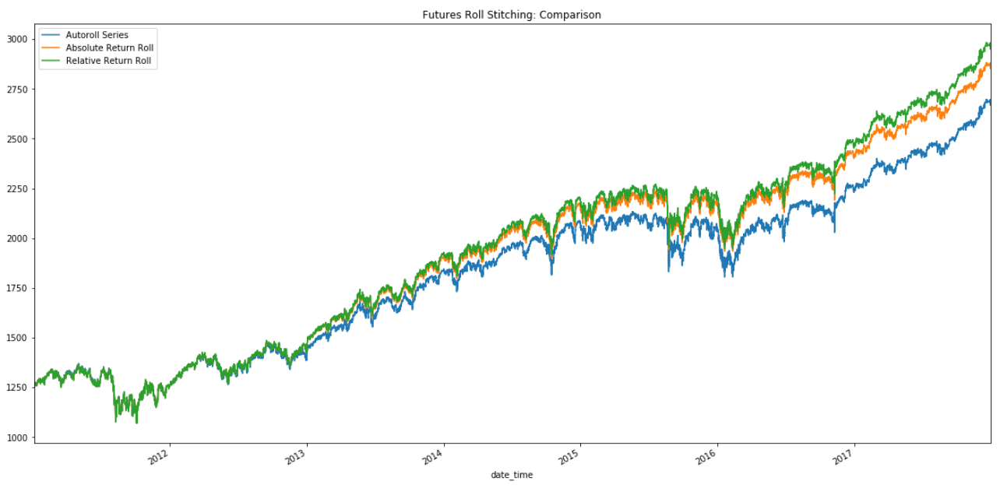

## Table of Contents

## What is the Gaps series in the context of futures trading?

The Gaps series is a set of futures contracts that are used to manage risk and speculate on price movements in different markets. These contracts are designed to cover gaps in the trading calendar, which means they help traders and investors to have continuous exposure to the market even during times when regular futures contracts are not available. The Gaps series is particularly useful for commodities, currencies, and indices, where trading might be affected by holidays or other market closures.

These contracts are typically offered by futures exchanges and can be traded just like regular futures contracts. They are important because they allow traders to maintain their positions and strategies without interruption. For example, if a trader wants to keep a position open over a long holiday weekend, they can use a Gaps series contract to do so. This helps in maintaining a smooth trading experience and can be crucial for those who need to manage their exposure to the market continuously.

## How does the single future roll method work?

The single future roll method is a way to keep trading in futures without stopping. When a futures contract is about to end, you switch to a new one that starts later. This is called "rolling over" the contract. You do this by selling the old contract and buying the new one at the same time. This way, you keep your position in the market going without any breaks.

Rolling over can be done at any time, but it's usually done close to when the old contract ends. The price difference between the old and new contract can affect how much money you make or lose. If the new contract is more expensive, you might lose a bit of money when you roll over. But if it's cheaper, you might make a little extra. It's important to watch these price differences and choose the right time to roll over to manage your trading well.

## What are the basic steps to implement the Gaps series in the single future roll method?

To implement the Gaps series in the single future roll method, you first need to understand when the gaps in the trading calendar occur. These gaps are times when regular futures contracts are not available, often due to holidays or other market closures. Once you know when these gaps happen, you can plan to use Gaps series contracts to keep your position open during those times. You'll need to keep an eye on the calendar and be ready to switch to a Gaps series contract before the regular contract expires.

When it's time to roll over, you'll sell your current futures contract and buy a Gaps series contract that covers the gap period. This should be done close to when the regular contract ends to avoid any disruption in your trading strategy. The key is to watch the price difference between the expiring contract and the Gaps series contract. If the Gaps series contract is more expensive, you might lose a bit of money during the roll. But if it's cheaper, you could gain a little. By carefully timing your roll and choosing the right Gaps series contract, you can smoothly maintain your market exposure through any gaps in the trading calendar.

## What are the common gaps identified in futures trading?

In futures trading, common gaps happen when there are breaks in the trading calendar. These breaks can be because of holidays, weekends, or other times when the market is closed. For example, if a futures contract is set to expire on a Friday but the market is closed for a long weekend, there's a gap. Traders need to plan for these gaps to keep their positions open without interruption.

To handle these gaps, traders use special contracts called Gaps series contracts. These contracts are designed to cover the times when regular futures contracts are not available. By using Gaps series contracts, traders can roll over their positions smoothly from one contract to another, even during market closures. This helps them stay in the market and manage their trading strategies without any breaks.

## How can the Gaps series be used to identify trading opportunities?

The Gaps series can help traders find good times to buy or sell futures. When there's a gap in the trading calendar, like a holiday, the price of the Gaps series contract might be different from the regular contract. Traders can look at these price differences to see if there's a chance to make money. If the Gaps series contract is cheaper, a trader might buy it and then sell it when the price goes up after the gap. If it's more expensive, they might sell it and buy it back cheaper later.

By watching the Gaps series, traders can also see how the market might move after a gap. If many traders are buying Gaps series contracts before a holiday, it might mean they think the price will go up after the gap. This can give other traders a hint about what might happen next. So, the Gaps series not only helps keep positions open but also gives clues about where the market might be heading.

## What are the advantages of using the Gaps series in the single future roll method?

Using the Gaps series in the single future roll method helps traders keep their positions open without any breaks. When regular futures contracts end, especially during holidays or weekends, traders can switch to Gaps series contracts. This means they don't have to close their positions and miss out on market movements. It's like having a way to keep trading smoothly even when the market is closed.

Another advantage is that traders can look for good trading opportunities with the Gaps series. The price difference between the regular contract and the Gaps series contract can show traders where they might make money. If the Gaps series contract is cheaper, they might buy it and sell it later for a profit. If it's more expensive, they could sell it and buy it back cheaper. This way, the Gaps series not only helps keep positions open but also gives traders clues about where the market might go next.

## What are the potential risks and limitations of this approach?

Using the Gaps series in the single future roll method can be risky. One big risk is the price difference between the regular contract and the Gaps series contract. If the Gaps series contract is a lot more expensive, you might lose money when you switch to it. Also, the market can be unpredictable, and what you think will happen after a gap might not happen. This means you could make the wrong choice and lose money.

Another limitation is that not all markets have Gaps series contracts available. If you're trading in a market that doesn't offer these, you won't be able to use this method. Plus, rolling over contracts can be tricky and needs careful timing. If you don't do it right, you might miss out on good trading chances or face more costs. So, while the Gaps series can help keep your trading going smoothly, it comes with its own set of challenges and risks.

## How does the Gaps series affect the timing of future roll decisions?

The Gaps series affects the timing of future roll decisions because it helps traders keep their positions open during times when the market is closed, like holidays or weekends. When a regular futures contract is about to end near a gap in the trading calendar, traders need to switch to a Gaps series contract before the regular one expires. This means they have to plan their roll carefully, making sure they roll over just before the gap starts so they don't miss any market movements.

Choosing the right time to roll over using the Gaps series is important because the price difference between the expiring contract and the Gaps series contract can affect how much money you make or lose. If the Gaps series contract is more expensive, you might lose a bit of money when you roll over. But if it's cheaper, you could gain a little. So, traders need to watch the prices closely and decide when to roll over to manage their trading well and take advantage of any price differences.

## Can you explain the impact of market volatility on the Gaps series in single future roll?

Market [volatility](/wiki/volatility-trading-strategies) can make using the Gaps series in the single future roll method more tricky. When the market is moving a lot, the price difference between the regular futures contract and the Gaps series contract can be bigger. This means that when you roll over to the Gaps series contract, you might lose more money if the new contract is a lot more expensive. Or, if you're lucky, you might make more money if the new contract is cheaper. So, traders need to be extra careful and watch the market closely to decide the best time to roll over.

Also, when the market is very volatile, it's harder to predict what will happen after a gap in the trading calendar. If the market is moving a lot before a holiday, it might keep moving a lot after the holiday too. This can make it tough to know if you should buy or sell the Gaps series contract. Traders need to think about how the market might change and be ready to change their plans if things don't go the way they expected. So, market volatility adds more risk and uncertainty to using the Gaps series in the single future roll method.

## How can advanced traders optimize the Gaps series strategy for better performance?

Advanced traders can optimize the Gaps series strategy by carefully watching the price differences between the regular futures contract and the Gaps series contract. They need to time their roll over just right, especially when the market is moving a lot. If they see that the Gaps series contract is cheaper before a gap, they might buy it and then sell it for a profit after the gap. If it's more expensive, they could sell it and buy it back cheaper later. By doing this, they can make the most of the price changes and reduce their losses.

Another way to optimize is by using market analysis tools to predict what might happen after a gap. Advanced traders can look at past data to see how the market has moved after similar gaps. They can also use technical indicators to guess where the market might go next. By understanding these patterns, they can make smarter choices about when to roll over and whether to buy or sell the Gaps series contract. This helps them stay ahead of the market and improve their trading performance.

## What software tools or platforms support the analysis of Gaps series in futures trading?

Traders can use different software tools and platforms to analyze the Gaps series in futures trading. One popular tool is the Bloomberg Terminal, which gives traders a lot of data and charts to look at. They can see the price differences between regular futures contracts and Gaps series contracts, and use this information to decide when to roll over. Another tool is the Thinkorswim platform by TD Ameritrade, which has good charting tools and lets traders set up alerts for when it's time to roll over.

Other platforms like MetaTrader 4 and 5 are also useful. These platforms let traders write their own scripts to analyze the market and find the best times to use the Gaps series. They can use these scripts to look at past data and see how the market has moved after gaps. This helps them make better decisions about when to buy or sell the Gaps series contracts. By using these tools, traders can keep a close eye on the market and make smart choices to improve their trading.

## How do expert traders combine the Gaps series with other technical indicators for more robust trading strategies?

Expert traders often use the Gaps series along with other technical indicators to make their trading strategies stronger. They might use moving averages to see the overall trend of the market. If the market is going up, they might buy the Gaps series contract before a gap, hoping the price will keep going up after the gap. If the market is going down, they might sell the Gaps series contract, expecting the price to drop more after the gap. By looking at these trends, traders can make better guesses about what will happen after a gap and decide when to roll over their contracts.

Another way expert traders use technical indicators is by looking at the Relative Strength Index (RSI) or the Bollinger Bands. These tools help them see if the market is overbought or oversold. If the RSI shows the market is overbought before a gap, traders might think the price will go down after the gap and sell the Gaps series contract. If it's oversold, they might buy it, hoping for a price increase. Bollinger Bands can show how much the market is moving, and traders can use this to decide if the price difference between the regular and Gaps series contract is a good chance to make money. By combining these indicators with the Gaps series, traders can make smarter choices and improve their trading performance.

## What are the techniques for handling roll adjustments?

Several methodologies are available for handling roll adjustments in futures contracts, each with its own implications for price continuity and accuracy in historical data. The primary methods include unadjusted, difference-adjusted, and ratio-adjusted approaches.

The **unadjusted method** is the most straightforward, where expiring contracts are simply concatenated with new contracts without any form of adjustment. While this approach keeps the process simple, it inherently includes fictitious gaps. These gaps are the price discrepancies between the expiring and new contracts, leading to distorted price changes that do not accurately reflect market dynamics. This distortion occurs because the price continuity is directly disrupted whenever a roll occurs without adjustment.

In contrast, **difference-adjusted methods** aim to preserve the integrity of price changes in terms of points or dollars. This method involves calculating the difference between the closing price of the expiring contract and the opening price of the new contract at the time of the roll. This difference is then used to adjust historical prices, ensuring that the price series reflects the true price changes over time. Mathematically, if $P_{\text{old}}$ is the price from the prior contract and $\Delta P$ is the calculated difference at roll time, the adjusted price becomes:

$$
P_{\text{adjusted}} = P_{\text{old}} + \Delta P
$$

By applying this adjustment retroactively across the historical series, traders can maintain continuity in price movement expressed in absolute terms, which is crucial for analyses that rely on specific price levels.

The **ratio-adjusted method** focuses on maintaining the consistency of percentage changes rather than absolute values. This is particularly beneficial for traders who are more concerned about returns or relative performance than precise price movements. In this method, a ratio is applied instead of a simple difference, aligning the percentage change between the last price of the old contract and the first price of the new one. If $R$ is the calculated ratio based on these prices, the adjusted historical price becomes:

$$
P_{\text{adjusted}} = P_{\text{old}} \times R
$$

This adjustment ensures that the series reflects percentage changes consistently across the transition, which is vital for many quantitative models that compare price changes on a relative basis.

Selecting the appropriate roll adjustment method depends on the specific needs of the trading strategy and the nature of the analysis to be performed. Each method offers a different perspective on historical price data, and understanding their implications is crucial for maintaining the fidelity of trading signals and strategy effectiveness.

## References & Further Reading

[1]: Black, F., & Scholes, M. (1973). ["The Pricing of Options and Corporate Liabilities."](https://www.cs.princeton.edu/courses/archive/fall09/cos323/papers/black_scholes73.pdf) Journal of Political Economy, 81(3), 637-654.

[2]: Hull, J. C. (2014). ["Options, Futures, and Other Derivatives."](https://www-2.rotman.utoronto.ca/~hull/ofod/index.html) Pearson Education.

[3]: ["Advances in Financial Machine Learning"](https://www.amazon.com/Advances-Financial-Machine-Learning-Marcos/dp/1119482089) by Marcos Lopez de Prado

[4]: Fabozzi, F. J., & Focardi, S. M. (2004). ["The Mathematics of Financial Modeling and Investment Management."](https://archive.org/details/mathematicsoffin0000foca) Wiley.

[5]: ["Evidence-Based Technical Analysis: Applying the Scientific Method and Statistical Inference to Trading Signals"](https://www.amazon.com/Evidence-Based-Technical-Analysis-Scientific-Statistical/dp/0470008741) by David Aronson

[6]: Jaeckel, P. (2002). ["Monte Carlo Methods in Finance."](https://www.wiley.com/en-us/Monte+Carlo+Methods+in+Finance-p-9780471497417) Wiley.

[7]: ["Quantitative Trading: How to Build Your Own Algorithmic Trading Business"](https://books.google.com/books/about/Quantitative_Trading.html?id=j70yEAAAQBAJ) by Ernest P. Chan