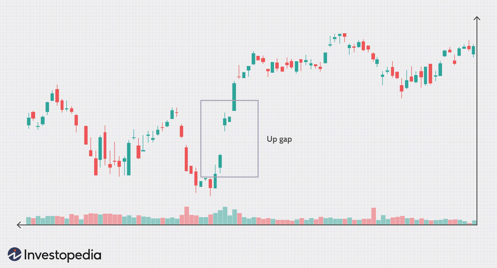

Algorithmic trading heavily relies on the use of futures contracts, which are essential financial instruments for speculating on the price movements of assets. A futures contract is an agreement to buy or sell an asset at a predetermined price and date in the future. However, these contracts are not perpetual and come with an expiration date. To maintain a continuous time series and ensure seamless trading strategies, traders must execute a "roll" to the next contract before expiry. This involves closing the expiring contract and opening a new position in the subsequent contract.

The single futures roll method is designed to address the challenges associated with this transition. One of the most significant challenges is the presence of gaps, which are discrepancies in price levels between the old and new contracts during the roll process. These gaps can introduce artificial volatility, impacting backtesting accuracy and leading to potential false trading signals. The concept of a gaps series is integral to this method as it represents the cumulative roll adjustments necessary to create a coherent historical price series.



Understanding roll techniques, such as the ETF (Exchange-Traded Fund) trick, is crucial for traders. These techniques are designed to mitigate the artificial spikes and dips that can occur during contract transitions. Such spikes can mislead algorithmic models by suggesting erroneous market conditions, which can result in misleading trading signals.

The article will detail how appropriate roll management, including the use of strategies like the ETF trick, can enhance data integrity. By ensuring accurate reflection of historical prices and minimizing discrepancies caused by roll adjustments, traders can achieve more reliable backtesting. Accurate backtesting is fundamental for developing robust trading strategies, and the single futures roll method provides a structured approach to managing these adjustments, ultimately resulting in more informed decision-making and improved market insights.

## Table of Contents

## Understanding Futures Contracts and Rolls

Futures contracts are standardized agreements to buy or sell an underlying asset at a specified future date for a predetermined price. These financial instruments are traded on futures exchanges and are commonly used for hedging or speculative purposes. Each futures contract is designated for a specific delivery month, leading to variations in pricing due to factors such as carrying costs, interest rates, and demand dynamics. The differences in these elements result in each contract having a unique price, even when they cover the same underlying asset.

As futures contracts approach their expiration date, traders face the necessity of maintaining their positions. This process, known as "rolling," involves closing out a position in an expiring contract and simultaneously opening a position in a contract with a later expiration date. The primary goal of rolling is to extend the exposure to the futures market without taking or making delivery of the underlying asset.

If the rolling process is not executed with precision, it can introduce artificial price gaps between the expiring contract and the subsequent contract. Such gaps can distort the continuity of historical price charts, misleading both traders and algorithmic systems. When these gaps are overlooked, they create non-representative spikes or dips in the price data that do not reflect underlying market conditions. Recognizing and adjusting for these discrepancies is essential for generating an accurate continuous time series of prices that reflects true market behavior across contract expirations.

## The Gap Series and Its Importance

Gaps occur due to the transition between expiring and new futures contracts, resulting in price differences that can distort historical data. These discontinuities pose the risk of misinterpreting market trends, as the artificial gaps may introduce [volatility](/wiki/volatility-trading-strategies) not present in actual trading conditions. The gap series refers to the aggregation of these discrepancies over consecutive contract rolls, enabling a coherent view of market movements by addressing the cumulative effects of rolling contracts.

To correct for these gaps, traders calculate the necessary adjustments to align the pricing data seamlessly. This process involves accurately determining the price difference between the final settlement of the expiring contract and the initial price of the new one during the roll. By integrating these adjustments across the dataset, the price series more accurately reflects true market dynamics, eliminating the noise from artificial spikes.

In practical terms, addressing the gap requires an understanding of both the absolute differences and the context within which they occur. For instance, if a futures contract of an asset expired at $100 and the new contract opened at $102, the gap to be adjusted is $2. This adjustment is vital to prevent erroneous signals and to maintain the integrity of the data upon which trading decisions are based.

Ultimately, by systematically correcting these gaps, traders ensure the robustness of algorithmic models and improve the reliability of backtests, thereby achieving a realistic portrayal of market conditions devoid of distortions introduced by contractual transitions.

## Techniques for Handling Roll Adjustments

Several methodologies are available for handling roll adjustments in futures contracts, each with its own implications for price continuity and accuracy in historical data. The primary methods include unadjusted, difference-adjusted, and ratio-adjusted approaches.

The **unadjusted method** is the most straightforward, where expiring contracts are simply concatenated with new contracts without any form of adjustment. While this approach keeps the process simple, it inherently includes fictitious gaps. These gaps are the price discrepancies between the expiring and new contracts, leading to distorted price changes that do not accurately reflect market dynamics. This distortion occurs because the price continuity is directly disrupted whenever a roll occurs without adjustment.

In contrast, **difference-adjusted methods** aim to preserve the integrity of price changes in terms of points or dollars. This method involves calculating the difference between the closing price of the expiring contract and the opening price of the new contract at the time of the roll. This difference is then used to adjust historical prices, ensuring that the price series reflects the true price changes over time. Mathematically, if $P_{\text{old}}$ is the price from the prior contract and $\Delta P$ is the calculated difference at roll time, the adjusted price becomes:

$$
P_{\text{adjusted}} = P_{\text{old}} + \Delta P
$$

By applying this adjustment retroactively across the historical series, traders can maintain continuity in price movement expressed in absolute terms, which is crucial for analyses that rely on specific price levels.

The **ratio-adjusted method** focuses on maintaining the consistency of percentage changes rather than absolute values. This is particularly beneficial for traders who are more concerned about returns or relative performance than precise price movements. In this method, a ratio is applied instead of a simple difference, aligning the percentage change between the last price of the old contract and the first price of the new one. If $R$ is the calculated ratio based on these prices, the adjusted historical price becomes:

$$
P_{\text{adjusted}} = P_{\text{old}} \times R
$$

This adjustment ensures that the series reflects percentage changes consistently across the transition, which is vital for many quantitative models that compare price changes on a relative basis.

Selecting the appropriate roll adjustment method depends on the specific needs of the trading strategy and the nature of the analysis to be performed. Each method offers a different perspective on historical price data, and understanding their implications is crucial for maintaining the fidelity of trading signals and strategy effectiveness.

## Implementing the Single Futures Roll Method

Implementing the Single Futures Roll Method effectively requires precise handling of roll gaps arising during the transition between futures contracts. These gaps can be understood in terms of absolute and relative values, where the absolute gap is the simple difference in price between the expiring and new contracts, and the relative gap is the percentage difference. Accurate calculation of these gaps is crucial in ensuring that the historical price series remains devoid of artificial influences that can lead to misleading conclusions.

To maintain clean data, traders should focus on filtering the price information exclusively from the nearest-to-expiry contract. This approach reduces noise that may affect the pricing information received from contracts with expiration dates further into the future. By zeroing in on the nearest contracts, traders can better evaluate real-time market conditions.

Adjustment factors play a significant role in this method. These factors are used to realign historical prices to smooth out transitions between consecutive contracts, thereby mitigating the potential for false trading signals. The application of these adjustments is crucial in the continuity of the futures price time series, thus allowing traders to leverage a consistent dataset for analysis and strategy development.

Below is a concise Python code illustration highlighting the practical application of the Single Futures Roll Method using S&P500 E-mini futures contracts:

```python
import pandas as pd

def calculate_roll_adjustment(near_contract, far_contract):
    # Assuming near_contract and far_contract are pandas Series with DateTime index and 'Close' prices
    absolute_gap = far_contract['Close'] - near_contract['Close']
    return absolute_gap

def apply_roll_adjustment(price_series, roll_adjustment):
    adjusted_series = price_series + roll_adjustment.cumsum()
    return adjusted_series

# Sample data for nearest and farthest contract prices
near_contract_data = {'Close': pd.Series([3200, 3225, 3250], index=pd.to_datetime(['2023-01-01', '2023-01-02', '2023-01-03']))}
far_contract_data = {'Close': pd.Series([3210, 3230, 3260], index=pd.to_datetime(['2023-01-01', '2023-01-02', '2023-01-03']))}

near_contract = pd.DataFrame(near_contract_data)
far_contract = pd.DataFrame(far_contract_data)

# Calculate and apply roll adjustments
roll_adjustment = calculate_roll_adjustment(near_contract, far_contract)
adjusted_prices = apply_roll_adjustment(near_contract['Close'], roll_adjustment)

print(adjusted_prices)
```

The code snippet demonstrates the crucial steps of calculating roll adjustments based on the closing prices of the nearest and the next contract in line. The calculated adjustments are subsequently applied to the historical price series to ensure all price points reflect a continuous market reality. Implementing such strategies within [algorithmic trading](/wiki/algorithmic-trading) frameworks provides traders with a cleaner data series for [backtesting](/wiki/backtesting) and operational execution, ultimately leading to more informed trading decisions and strategies.

## Benefits of Accurate Roll Management

Proper roll management is vital in ensuring reliable backtesting, which is crucial for developing effective trading strategies. By addressing the issue of gaps when rolling futures contracts, traders can ensure that historical data reflects actual trading conditions, thus enhancing the accuracy of backtesting processes. Accurate roll management minimizes the occurrence of artificial price fluctuations that could lead to false buy or sell signals in algorithmic trading models. 

A well-managed roll strategy avoids misleading market interpretations by smoothing out discrepancies in the continuous futures price series. This ensures that algorithms focus on authentic market trends rather than being skewed by errors introduced during the roll process. For instance, by using difference-adjusted or ratio-adjusted roll methods, traders can maintain the integrity of the data's percentage or point-based changes. This method allows for more precise computation of returns and risk, as algorithms are less susceptible to noise from incorrect data representations.

Additionally, effective roll techniques aid in maintaining a stable data environment, fostering informed decision-making. When historical data aligns more closely with actual market behavior post-roll adjustments, traders are equipped to develop and test strategies that are resilient to market dynamics. Moreover, this alignment reduces the likelihood of strategies breaking down under live trading conditions due to unforeseen market anomalies.

In summary, managing futures contract rolls accurately is more than just an administrative task; it is a critical component that strengthens the foundation of algorithmic trading strategies. It not only facilitates sound strategy development through reliable backtesting but also enhances the robustness and reliability of these strategies in real-world trading environments.

## Conclusion

Understanding and applying the single futures roll method is essential for maintaining data integrity in futures trading. Proper management of roll adjustments is crucial as it eliminates deceptive market patterns, providing traders and analysts with a more accurate representation of historical trends. This accuracy ensures that the data used in analyzing market behaviors and developing trading strategies is reliable, thus reducing the likelihood of generating false buy or sell signals that could mislead trading decisions.

Moreover, it is important for traders and system developers to align their strategies with appropriate roll methodologies. This alignment ensures consistent performance across various market conditions, allowing for the development of robust trading algorithms. By accurately factoring in roll adjustments, traders can avoid the pitfalls of artificial volatility, which often distort market data and lead to erroneous interpretations of price movements.

Incorporating these practices strengthens algorithmic trading strategies, enhancing the depth of market insight available to traders. By prioritizing accurate roll management, market participants can achieve a deeper understanding of historical market behaviors, ultimately leading to more informed and strategic trading decisions. As a result, mastering the single futures roll method not only bolsters data integrity but also significantly improves the efficacy of algorithmic trading models.

## References & Further Reading

[1]: Black, F., & Scholes, M. (1973). ["The Pricing of Options and Corporate Liabilities."](https://www.cs.princeton.edu/courses/archive/fall09/cos323/papers/black_scholes73.pdf) Journal of Political Economy, 81(3), 637-654.

[2]: Hull, J. C. (2014). ["Options, Futures, and Other Derivatives."](https://www-2.rotman.utoronto.ca/~hull/ofod/index.html) Pearson Education.

[3]: ["Advances in Financial Machine Learning"](https://www.amazon.com/Advances-Financial-Machine-Learning-Marcos/dp/1119482089) by Marcos Lopez de Prado

[4]: Fabozzi, F. J., & Focardi, S. M. (2004). ["The Mathematics of Financial Modeling and Investment Management."](https://archive.org/details/mathematicsoffin0000foca) Wiley.

[5]: ["Evidence-Based Technical Analysis: Applying the Scientific Method and Statistical Inference to Trading Signals"](https://www.amazon.com/Evidence-Based-Technical-Analysis-Scientific-Statistical/dp/0470008741) by David Aronson

[6]: Jaeckel, P. (2002). ["Monte Carlo Methods in Finance."](https://www.wiley.com/en-us/Monte+Carlo+Methods+in+Finance-p-9780471497417) Wiley.

[7]: ["Quantitative Trading: How to Build Your Own Algorithmic Trading Business"](https://books.google.com/books/about/Quantitative_Trading.html?id=j70yEAAAQBAJ) by Ernest P. Chan