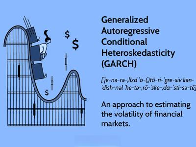

## Table of Contents

## What is a GARCH model?

A GARCH model, which stands for Generalized Autoregressive Conditional Heteroskedasticity, is a statistical model used to predict the volatility of financial returns. It's like a tool that helps us understand how much the price of a stock or other financial asset might swing around in the future. The model looks at past data to see how much prices have changed and uses that information to make guesses about future changes. It's especially useful because it can handle situations where the ups and downs in prices aren't constant over time, which is common in financial markets.

The GARCH model works by combining two main ideas: autoregression and moving averages. Autoregression means the model looks at past volatility to predict future volatility. Moving averages help smooth out the data over time. By putting these together, the GARCH model can better capture the way volatility tends to cluster – meaning big changes in prices often follow other big changes, and small changes follow small changes. This makes the GARCH model a popular choice for financial analysts and traders who need to manage risk and make informed decisions.

## How does a GARCH model differ from an ARCH model?

An ARCH model, or Autoregressive Conditional Heteroskedasticity, is a simpler version of the GARCH model. It looks at past data to predict how much prices might change in the future, focusing on how the size of past price changes can help predict future changes. The key idea is that if prices have been swinging a lot recently, they might keep swinging a lot. But, the ARCH model only uses past squared returns to predict future volatility, which can be limiting because it doesn't account for longer-term patterns or trends in volatility.

The GARCH model, on the other hand, is an extension of the ARCH model that adds more flexibility. It not only looks at past squared returns like the ARCH model but also considers the past predictions of volatility. This means the GARCH model can capture both short-term and longer-term patterns in how prices change. By doing this, the GARCH model can better handle situations where volatility tends to cluster over time, making it more useful for predicting how much prices might move in the future.

In simple terms, while the ARCH model is good at using recent data to predict volatility, the GARCH model goes a step further by also considering the model's own past predictions. This makes the GARCH model more adaptable and better at capturing the ups and downs in financial markets over different time periods.

## What are the basic components of a GARCH model?

A GARCH model has two main parts that help it predict how much prices might change in the future. The first part is called the "mean equation," which looks at the average or expected return of the asset. This part helps the model understand what the price might do on average, without considering the ups and downs. The second part is the "variance equation," which is where the GARCH model really shines. This part focuses on predicting the volatility, or how much the price might swing around. It does this by looking at past data and the model's own past predictions of volatility.

The variance equation in a GARCH model has two key pieces: the ARCH part and the GARCH part. The ARCH part looks at past squared returns, which means it considers how much prices have changed recently. If prices have been moving a lot, the ARCH part will predict that they might keep moving a lot. The GARCH part, on the other hand, looks at the model's past predictions of volatility. This helps the model capture longer-term patterns in how prices change. By combining these two pieces, the GARCH model can better predict how much prices might swing around in the future, making it a useful tool for financial analysts and traders.

## How is a GARCH model typically estimated?

A GARCH model is usually estimated using a method called maximum likelihood estimation. This method tries to find the best values for the model's parameters by looking at how well the model fits the data. Imagine you're trying to guess the right size of a shoe by trying different sizes until you find the one that fits best. In the same way, the computer tries different values for the GARCH model's parameters until it finds the ones that make the model's predictions match the real data as closely as possible.

The process starts with choosing starting values for the parameters. Then, the computer calculates how likely it is that the data came from a model with those parameters. If the fit isn't good, the computer adjusts the parameters a little bit and tries again. It keeps doing this over and over, getting closer and closer to the best fit each time. This method is good because it can handle the complex nature of financial data, where the ups and downs in prices aren't always the same over time.

## What are the common applications of GARCH models in finance?

GARCH models are really helpful in finance because they help people predict how much prices might change in the future. This is important for people who trade stocks, bonds, or other financial things. They use GARCH models to figure out how risky their investments might be. For example, if a stock's price has been moving a lot lately, a GARCH model can help traders guess if it will keep moving a lot. This helps them decide if they should buy or sell the stock, or maybe use other strategies to protect their money.

Another way GARCH models are used is in managing risk. Big companies and banks use these models to understand how much their investments might go up or down. This helps them make better decisions about how to spread out their money to avoid losing too much. For example, if a bank sees that the prices of certain assets are likely to be very volatile, they might decide to invest less in those assets or use special financial tools to protect themselves. By using GARCH models, they can make smarter choices and keep their money safer.

## Can you explain the process of forecasting volatility using a GARCH model?

Forecasting volatility using a GARCH model starts with looking at past data. The model takes the recent ups and downs in prices and uses them to guess how much prices might swing around in the future. It does this by figuring out how much the recent changes matter and how much the model's own past guesses matter. The GARCH model combines these two things to make a prediction about future volatility. It's like trying to predict the weather by looking at both what's happening now and what the weather has been like before.

Once the GARCH model has all the past data and its own past predictions, it uses a special method called maximum likelihood estimation to find the best way to predict future volatility. This method tries out different guesses for the model's settings until it finds the one that fits the past data the best. After the model is set up, it can then be used to make forecasts about how much prices might change in the future. This helps traders and investors make better decisions about their money, because they can see how risky their investments might be.

## What are the limitations of GARCH models?

GARCH models are really helpful for predicting how much prices might change, but they have some limits. One big problem is that they assume the ups and downs in prices follow a normal pattern, which isn't always true in real life. In the financial world, big changes in prices can happen more often than a normal pattern would predict. This means GARCH models might not be as good at predicting those big swings, which can be a problem for people trying to manage risk.

Another issue with GARCH models is that they can be tricky to set up and use. You need to pick the right settings for the model, and if you get them wrong, your predictions might not be very good. Also, GARCH models look at past data to make guesses about the future, but the past doesn't always tell us everything we need to know. Sometimes, new things happen that the model didn't expect, and it can't predict those surprises. So, while GARCH models are useful, they're not perfect and need to be used carefully.

## How can GARCH models be extended or modified for more complex scenarios?

GARCH models can be made more useful for tricky situations by adding extra parts to them. One way to do this is by using something called EGARCH, which stands for Exponential GARCH. This version of the model can handle times when prices go up and down in different ways. For example, it can tell if prices are more likely to swing a lot when they go down than when they go up. Another way to make GARCH models better is by using GJR-GARCH, which pays more attention to big drops in prices. This is helpful because big drops can be more important for people trying to manage risk than big jumps.

Another way to improve GARCH models is by using something called Multivariate GARCH, or MGARCH. This type of model looks at more than one price at the same time, which is helpful if you want to understand how different stocks or assets move together. It can show you if one stock's price going up or down might affect another stock's price. This is really useful for people who have a lot of different investments and want to see how they might all change together. By adding these extra parts, GARCH models can be made to work better in more complicated situations.

## What are some advanced GARCH model variants and their specific uses?

One advanced GARCH model variant is the EGARCH, or Exponential GARCH. This model is good at handling situations where the ups and downs in prices aren't the same. For example, it can tell if prices are more likely to swing a lot when they go down than when they go up. This is helpful for people who want to understand how prices might change in different situations. EGARCH is often used by traders and investors who need to manage risk, especially when they're worried about big drops in prices.

Another useful variant is the GJR-GARCH, which stands for Glosten-Jagannathan-Runkle GARCH. This model pays special attention to big drops in prices, which can be more important for managing risk than big jumps. It's like having a tool that helps you see when prices might fall a lot, so you can be ready for it. GJR-GARCH is often used by people who want to protect their money from big losses, like investors and risk managers.

A third advanced variant is the Multivariate GARCH, or MGARCH. This model looks at more than one price at the same time, which is helpful if you want to understand how different stocks or assets move together. It can show you if one stock's price going up or down might affect another stock's price. This is really useful for people who have a lot of different investments and want to see how they might all change together. MGARCH is often used by portfolio managers and financial analysts who need to understand the relationships between different assets.

## How do GARCH models handle non-normality in financial returns?

GARCH models usually assume that the ups and downs in prices follow a normal pattern, but in real life, financial returns often don't behave that way. Big changes in prices can happen more often than a normal pattern would predict. This means that if you only use a basic GARCH model, it might not be very good at predicting those big swings. To handle this, people have come up with ways to change the GARCH model so it can deal with these unusual patterns better.

One way to make GARCH models better at handling non-normal patterns is by using something called the Student's t-distribution instead of the normal distribution. The Student's t-distribution can handle big changes in prices better because it allows for more extreme ups and downs. Another way is to use a model called GARCH with skewed distributions, which can handle situations where prices are more likely to go up or down in a certain way. By using these changes, GARCH models can be made to work better in the real world, where prices don't always follow a normal pattern.

## What are the statistical tests used to validate a GARCH model?

To check if a GARCH model is doing a good job, people use a few different tests. One common test is the Ljung-Box test, which looks at the model's predictions to see if there are any patterns left that the model didn't catch. If the test finds patterns, it means the model might not be doing a good job at predicting how much prices will change. Another test is the ARCH-LM test, which checks if the model is missing any big changes in prices that it should have predicted. If the test finds big changes that the model missed, it means the model needs to be improved.

Another useful test is the Jarque-Bera test, which checks if the ups and downs in prices follow a normal pattern. If the test shows that the prices don't follow a normal pattern, it means the model might need to be changed to handle the unusual patterns better. By using these tests, people can see if their GARCH model is working well or if it needs to be fixed to make better predictions about how much prices might change in the future.

## How have GARCH models evolved in response to financial crises and market anomalies?

GARCH models have changed a lot over time, especially after big financial crises like the one in 2008. People saw that prices could swing a lot more than the models predicted, so they started making the models better at handling those big changes. They added new parts to the models, like the EGARCH and GJR-GARCH, which can pay more attention to big drops in prices. These changes help the models predict how much prices might change during tough times, making them more useful for people trying to manage risk.

Another way GARCH models have gotten better is by dealing with unusual patterns in the market. During financial crises, prices can behave in ways that are hard to predict. To handle this, people started using different kinds of math in the models, like the Student's t-distribution, which can handle big swings better than the normal pattern. They also started looking at more than one price at the same time with Multivariate GARCH models. This helps them understand how different stocks or assets might move together, which is really important during times when the market is acting strangely.

## What is the GARCH Model and how can it be understood?

The GARCH (Generalized Autoregressive Conditional Heteroskedasticity) model is a significant enhancement to the ARCH (Autoregressive Conditional Heteroskedasticity) model introduced by Robert Engle in 1982. Tim Bollerslev developed the GARCH model in 1986 to address some limitations of the original ARCH model by incorporating the notion that volatility is not only influenced by past squared returns but also by past forecasted variances. This dual consideration allows GARCH to better capture volatility dynamics in financial time series data, making it a valuable tool for analysts and traders.

The primary advantage of the GARCH model over the ARCH model is its ability to model and predict volatility in time series data more accurately. ARCH models exclusively use past squared returns, represented mathematically as follows:

$$
\sigma_t^2 = \alpha_0 + \alpha_1 \epsilon_{t-1}^2
$$

where $\sigma_t^2$ denotes the conditional variance at time $t$, $\alpha_0$ is a constant, $\alpha_1$ is the parameter for past squared returns, and $\epsilon_{t-1}^2$ represents past squared residuals.

On the other hand, GARCH models extend this approach by incorporating past forecast variances, following the form:

$$
\sigma_t^2 = \alpha_0 + \alpha_1 \epsilon_{t-1}^2 + \beta_1 \sigma_{t-1}^2
$$

Here, $\beta_1$ is the parameter for the lagged forecast variance, which allows the model to account for the persistence in [volatility](/wiki/volatility-trading-strategies) observed in many financial time series. This ability to reflect autocorrelation in volatility is particularly useful for data that exhibit volatility clustering—a prevalent phenomenon in financial markets where periods of high volatility are typically followed by periods of low volatility.

GARCH's enhanced modeling capability makes it a popular choice among financial analysts and traders for volatility forecasting. Its application ranges from risk management and options pricing to [algorithmic trading](/wiki/algorithmic-trading) strategies. The model's adaptability allows it to be extended into more complex forms, such as EGARCH (Exponential GARCH) and TGARCH (Threshold GARCH), which can further capture asymmetric volatility effects and different volatility shocks, enhancing its utility in various trading scenarios.

## What is the Statistical Foundation of GARCH?

GARCH models are grounded in the principle that the variance of the error terms in a time series is not constant over time, a property known as heteroskedasticity. This characteristic acknowledges that financial returns often display periods of fluctuating volatility, rather than a steady variance.

In a GARCH model, the variance of the current error term is influenced by past data points, conforming to a moving average process. The simplest form of this model, GARCH(1,1), mathematically encapsulates this by incorporating three principal components: a constant term, the lag of squared residuals (the ARCH term), and the lag of the previous forecast variance (the GARCH term). The GARCH(1,1) model can be expressed as:

$$
\sigma_t^2 = \alpha_0 + \alpha_1 \epsilon_{t-1}^2 + \beta_1 \sigma_{t-1}^2
$$

Where:
- $\sigma_t^2$ is the current period's variance.
- $\alpha_0$ is the constant term.
- $\epsilon_{t-1}^2$ is the lagged squared residual from the mean equation.
- $\sigma_{t-1}^2$ is the lagged variance.
- $\alpha_1$ and $\beta_1$ are coefficients that must satisfy certain positivity and stationarity conditions: $\alpha_0 > 0$, $\alpha_1 \geq 0$, $\beta_1 \geq 0$, and $\alpha_1 + \beta_1 < 1$.

This framework allows the model to dynamically adjust to the evolving nature of financial markets by conditioning volatility forecasts on past information, making it highly adaptable to observed volatility clustering—a situation where high-volatility events tend to group together.

GARCH's core framework can be expanded to suit more nuanced financial situations. For instance, the Exponential GARCH (EGARCH) model addresses asymmetric volatility, capturing the phenomena where negative returns may have different volatility impacts than positive ones. Meanwhile, the Threshold GARCH (TGARCH) model introduces mechanisms to express different reactions based on the threshold effect, allowing different dynamics to influence volatility based on whether past returns exceed particular thresholds. These extensions enhance GARCH's flexibility, enabling more precise modeling that mirrors the real-world behavior of financial markets.

## What are the Implementation and Results?

To implement GARCH models in financial trading, a robust computational platform is essential, with Python being a popular choice due to its extensive suite of finance-specific libraries that streamline data handling, model fitting, and strategy evaluation. Libraries such as `pandas` for data manipulation, `statsmodels` for statistical computations, and `arch` for volatility modeling provide a comprehensive toolkit for practitioners. The process begins with obtaining historical market data, which can be sourced from various financial data platforms like Bloomberg, Yahoo Finance, or Quandl. This data typically includes asset prices, returns, and other relevant economic indicators.

Once the data is acquired, the GARCH model is fitted to the time series of asset returns. The `arch` library in Python provides a straightforward implementation of various GARCH models, allowing users to specify orders for both ARCH and GARCH terms. A typical fitting sequence involves specifying the model, performing diagnostics to ensure adequacy, then estimating the parameters through maximum likelihood estimation. The GARCH(1,1) model, one of the simplest and most commonly used versions, is expressed as:

$$
\sigma^2_t = \alpha_0 + \alpha_1 \varepsilon^2_{t-1} + \beta_1 \sigma^2_{t-1}
$$

where $\sigma^2_t$ is the conditional variance at time $t$, $\varepsilon^2_{t-1}$ is the squared residual from the mean equation at time $t-1$, $\alpha_0$, $\alpha_1$, and $\beta_1$ are model parameters with non-negative constraints.

The next stage is [backtesting](/wiki/backtesting) the strategy to assess its profitability. Backtesting involves simulating trades on historical data with the GARCH model’s volatility forecasts integrated into a trading algorithm. This step is vital for evaluating the model’s performance, particularly during volatile market periods when asset prices are most unpredictable. Strategies derived from GARCH models often outperform static 'buy and hold' approaches, demonstrating significant potential for enhanced returns in volatile regimes by allowing dynamic risk management and position sizing.

Despite its advantages, the GARCH model's performance is sensitive to changes in market conditions, necessitating regular recalibration. The recalibration ensures that the model parameters remain optimized, catering to new market data and dynamics. Furthermore, the statistical characteristics of the financial data, such as fat tails or volatility clustering, can impact the model’s effectiveness, requiring adaptations like switching to an EGARCH or TGARCH model when necessary.

In summary, when adeptly implemented, GARCH models can significantly enhance trading strategies by providing insightful volatility forecasts, which are crucial for adjusting risk management practices and improving profit outcomes. However, consistent performance demands continual monitoring and adaptation of the model to reflect current market conditions and ensure its relevance in varying economic environments.

## References & Further Reading

[1]: Black, F., & Scholes, M. (1973). ["The Pricing of Options and Corporate Liabilities."](https://www.cs.princeton.edu/courses/archive/fall09/cos323/papers/black_scholes73.pdf) Journal of Political Economy, 81(3), 637-654.

[2]: Bollerslev, T. (1986). ["Generalized Autoregressive Conditional Heteroskedasticity."](https://www.sciencedirect.com/science/article/pii/0304407686900631) Journal of Econometrics, 31(3), 307-327.

[3]: Engle, R. F. (1982). ["Autoregressive Conditional Heteroskedasticity with Estimates of the Variance of United Kingdom Inflation."](https://www.semanticscholar.org/paper/Autoregressive-conditional-heteroscedasticity-with-Engle/2ee6cb87fc81ecd78d161c4a92c9dfce00c8961c) Econometrica, 50(4), 987-1007.

[4]: Tsay, R. S. (2010). ["Analysis of Financial Time Series"](https://onlinelibrary.wiley.com/doi/book/10.1002/9780470644560) (Third Edition). Wiley.

[5]: Alexander, C. (2008). ["Market Risk Analysis, Volume II: Practical Financial Econometrics"](https://www.wiley.com/en-us/Market+Risk+Analysis%2C+Volume+II%2C+Practical+Financial+Econometrics-p-9780470998014) John Wiley & Sons.

[6]: Ruppert, D. (2004). ["Statistics and Data Analysis for Financial Engineering with R Applications"](https://link.springer.com/book/10.1007/978-1-4939-2614-5) Springer.