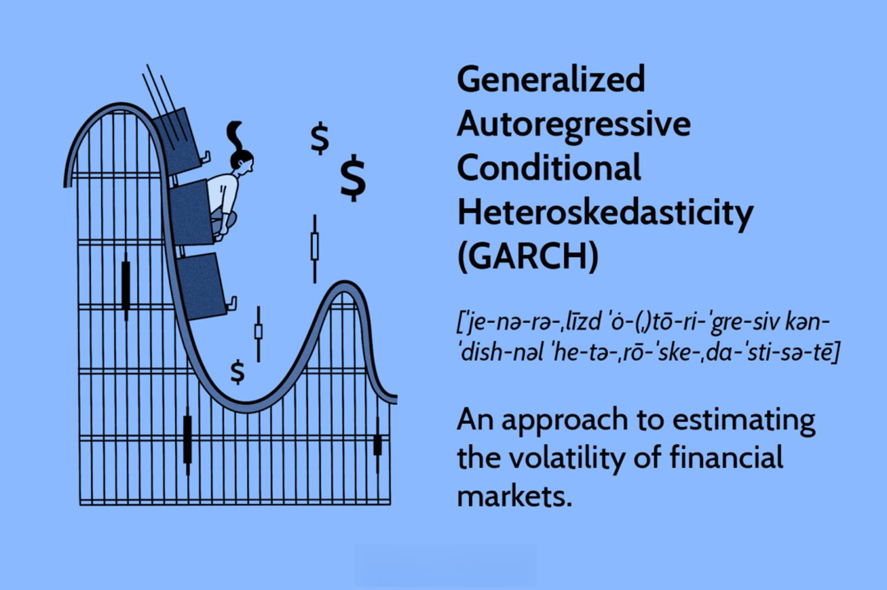

## Table of Contents

## What is a GARCH process?

A GARCH process, which stands for Generalized Autoregressive Conditional Heteroskedasticity, is a statistical model used to analyze time series data, particularly financial data. It helps in understanding how the volatility of a time series changes over time. Volatility refers to how much the values in the series fluctuate. The key idea behind GARCH is that it allows the variance of the current error term (the difference between the actual and predicted value) to be dependent on the variances of the previous error terms.

In simpler terms, GARCH models help predict how much a stock price or other financial indicators might swing in the future based on how much they have swung in the past. For example, if a stock has been very volatile recently, a GARCH model might predict that it will continue to be volatile. This makes GARCH models very useful for risk management and forecasting in finance, as they can provide insights into the potential ups and downs of financial markets.

To use a GARCH model, you need to estimate its parameters from historical data. This involves complex math, but the basic idea is to find the best fit for how past volatility influences future volatility. Once these parameters are set, the model can be used to make predictions about future volatility, helping investors and financial analysts make more informed decisions.

## How does a GARCH model differ from an ARCH model?

An ARCH model, or Autoregressive Conditional Heteroskedasticity, is a simpler version of a GARCH model. In an ARCH model, the variance of the current error term depends only on the squares of the previous error terms. This means that if a stock price was very volatile last week, an ARCH model would predict that it might be volatile this week too, but it only looks at past errors to make this prediction.

A GARCH model, on the other hand, is more flexible and powerful. It not only considers the squares of the previous error terms like an ARCH model but also includes the past variances in its calculations. This means a GARCH model can capture more complex patterns in volatility. For example, if a stock has been consistently volatile over several weeks, a GARCH model can better predict that this trend might continue, making it more useful for long-term forecasting and risk management.

In summary, while both models help predict future volatility based on past data, a GARCH model is an extension of the ARCH model. It adds an extra layer of information by considering both past errors and past variances, making it more accurate and versatile for analyzing financial time series data.

## What are the basic components of a GARCH model?

A GARCH model has two main parts: the mean equation and the variance equation. The mean equation is like a simple prediction of what the next value in the time series might be, often using past values to make this guess. For example, if you're looking at stock prices, the mean equation might predict tomorrow's price based on today's price and other factors. The variance equation, on the other hand, focuses on how much the actual values might differ from these predictions. It's all about understanding the ups and downs, or volatility, of the series.

The variance equation in a GARCH model is where things get interesting. It uses two types of information to predict future volatility: past errors and past variances. Past errors are the differences between what was predicted and what actually happened. If these errors were big in the past, the model might predict big swings in the future. Past variances are the volatility levels from previous periods. By considering both, the GARCH model can better understand and predict how much a stock price or other financial indicator might fluctuate in the future.

## Can you explain the mathematical formulation of a GARCH(1,1) model?

A GARCH(1,1) model is a specific type of GARCH model where the variance equation looks at just one past error and one past variance to predict future volatility. The model can be written as two equations: the mean equation and the variance equation. The mean equation is usually something simple, like predicting tomorrow's stock price based on today's price. But the real magic happens in the variance equation, which is written as: σ_t^2 = ω + α * ε_(t-1)^2 + β * σ_(t-1)^2. Here, σ_t^2 is the predicted variance for the current period, ω is a constant term, α is how much the model cares about the past error (ε_(t-1)^2), and β is how much it cares about the past variance (σ_(t-1)^2).

In this equation, ε_(t-1) is the error from the last period, which is the difference between the actual value and the predicted value from the mean equation. If this error was big, it means the stock price swung a lot last time, so α * ε_(t-1)^2 adds a bit of that past swing to the current prediction. The term β * σ_(t-1)^2 looks at the past variance, which is the overall level of volatility from the last period. If the stock was very volatile last time, this term helps predict that it might be volatile again. The constant ω is like a base level of volatility that's always there, even if the past error and variance are zero. By combining these three parts, the GARCH(1,1) model gives a more accurate prediction of future volatility.

## What are the common applications of GARCH models in finance?

GARCH models are very helpful in finance because they can predict how much stock prices or other financial indicators might move around in the future. This is important for people who invest money because they want to know how risky their investments are. For example, if a GARCH model predicts that a stock will be very volatile, an investor might decide to sell it or not buy it at all because it's too risky. On the other hand, if the model shows that a stock will be stable, the investor might feel more comfortable holding onto it or even buying more.

Another big use of GARCH models is in risk management. Banks and other financial institutions use these models to figure out how much money they might lose on their investments. By understanding the volatility of their assets, they can set aside enough money to cover potential losses. This is called Value at Risk (VaR), and GARCH models help make these calculations more accurate. So, GARCH models help make the financial world safer by giving better predictions about how much things might change in the future.

## How can GARCH models be used for risk management?

GARCH models help with risk management by predicting how much stock prices or other financial indicators might move around in the future. This is important because it helps banks and investors understand how risky their investments are. For example, if a GARCH model predicts that a stock will be very volatile, a bank might decide to sell it or not buy it at all because it's too risky. On the other hand, if the model shows that a stock will be stable, the bank might feel more comfortable holding onto it or even buying more.

Another way GARCH models are used in risk management is for calculating Value at Risk (VaR). VaR is a way to estimate how much money a bank or investor might lose on their investments over a certain period. By using GARCH models, they can make these estimates more accurate because the models take into account how much the investments have moved around in the past. This helps them set aside enough money to cover potential losses, making the financial system safer and more stable.

## What are the steps to estimate a GARCH model?

To estimate a GARCH model, you first need to gather historical data on the time series you want to analyze, like stock prices. Then, you need to decide on the order of the GARCH model, which means choosing how many past errors and variances you want to include in your predictions. For a GARCH(1,1) model, you would use just one past error and one past variance. Next, you use a computer program to find the best values for the parameters in the GARCH model's equations. These parameters are like knobs that you turn to make the model fit the data as closely as possible. The computer does this by trying different values and seeing which ones make the model's predictions match the actual data the best.

Once you have the best values for the parameters, you can use the GARCH model to make predictions about future volatility. You start by using the mean equation to predict the next value in the time series, and then you use the variance equation to predict how much that value might swing around. The variance equation takes into account the past errors and variances, using the parameters you found to weigh their importance. By doing this, the GARCH model gives you a good idea of how much the stock price or other financial indicator might move in the future, which is very helpful for making decisions about investments and managing risk.

## What are the challenges in fitting a GARCH model to data?

Fitting a GARCH model to data can be tricky because it involves finding the right values for the model's parameters. These parameters are like knobs that you adjust to make the model's predictions match the actual data as closely as possible. The computer has to try a lot of different values, which can take a long time, especially if you're working with a lot of data. Sometimes, the computer might not find the best values at all, which means the model's predictions won't be very accurate.

Another challenge is choosing the right order for the GARCH model. The order tells the model how many past errors and variances to look at when making predictions. If you choose the wrong order, the model might miss important patterns in the data or include too much noise, making the predictions less useful. Figuring out the best order often requires trying different options and seeing which one fits the data the best, which can be a lot of work.

## How do you select the order of a GARCH model?

Selecting the order of a GARCH model means deciding how many past errors and variances the model should look at when making predictions. This is important because if you choose the wrong order, the model might miss important patterns in the data or include too much noise, making the predictions less useful. To pick the right order, you usually start by trying different options and seeing which one fits the data the best. For example, you might start with a GARCH(1,1) model, which looks at one past error and one past variance, and then try other orders like GARCH(2,1) or GARCH(1,2) to see if they work better.

To figure out which order is best, you can use different ways to measure how well the model fits the data. One common way is to use something called the Akaike Information Criterion (AIC) or the Bayesian Information Criterion (BIC). These are like scores that tell you how good the model is at predicting the data, with lower scores meaning better fits. By trying different orders and comparing their AIC or BIC scores, you can find the order that gives the best predictions. This process can take some time and effort, but it's important for making sure your GARCH model is as accurate as possible.

## What are some advanced variants of the GARCH model and their uses?

There are some advanced versions of the GARCH model that can do even better at predicting how much things might change in the future. One of these is the EGARCH model, which stands for Exponential GARCH. This model is good because it can handle situations where the ups and downs are not the same size. For example, if a stock price goes up a lot more than it goes down, the EGARCH model can take that into account. Another advanced version is the GJR-GARCH model, which is useful for times when bad news affects the market more than good news. This model helps predict how much the market might swing around after something bad happens.

Another advanced GARCH model is the TGARCH model, which stands for Threshold GARCH. This model is also good at dealing with times when bad news has a bigger effect than good news. It does this by using a special rule that makes the model pay more attention to big drops in the market. All these advanced models are used in finance to help people make better decisions about their investments. By understanding how much the market might move around, investors can figure out how risky their investments are and plan accordingly.

## How can GARCH models be integrated with other time series models?

GARCH models can be combined with other time series models to make even better predictions about the future. One common way to do this is by using an ARIMA model, which stands for Autoregressive Integrated Moving Average. An ARIMA model is good at predicting the next value in a time series, like tomorrow's stock price, based on past values. By adding a GARCH model to an ARIMA model, you can also predict how much that stock price might swing around. This combination, called an ARIMA-GARCH model, helps investors understand both the expected value and the risk of their investments.

Another way to integrate GARCH models is with machine learning techniques. For example, you can use a neural network to predict the next value in a time series and then use a GARCH model to predict the volatility of that prediction. This can be especially useful when the data is very complex and hard to predict with traditional models. By combining the strengths of both approaches, you can get more accurate predictions about how much things might change in the future, which is very helpful for making smart investment decisions.

## What are the current research trends and future directions in GARCH modeling?

Current research in GARCH modeling is focusing on making these models even better at predicting how much things might change in the future. One big trend is using machine learning to help GARCH models. Machine learning can handle a lot of data and find patterns that are hard to see with traditional models. Researchers are trying to combine GARCH models with machine learning techniques to make predictions more accurate. Another trend is looking at how GARCH models can be used in new areas, like predicting how much electricity prices or even weather patterns might change. This shows that GARCH models are not just for finance anymore, but can be useful in many different fields.

Future directions in GARCH modeling might involve making the models easier to use and understand. Right now, GARCH models can be hard to set up and need a lot of math to work with. Researchers are working on ways to simplify the process so that more people can use these models without needing to be experts in statistics. Another direction is exploring how GARCH models can be combined with other types of models to get even better predictions. For example, using GARCH models with models that look at long-term trends could help predict both short-term swings and long-term changes in things like stock prices or climate patterns. This could make GARCH models even more useful for planning and decision-making in the future.

## What is the GARCH Process and how can it be understood?

The GARCH (Generalized Autoregressive Conditional Heteroskedasticity) model is an extension of the ARCH (Autoregressive Conditional Heteroskedasticity) model, enabling the modeling of time-varying volatility in financial time series data. Developed by Tim Bollerslev in 1986, the GARCH model is particularly adept at capturing volatility clustering—an essential feature of financial data where periods of high volatility are followed by periods of low volatility, and vice-versa.

The fundamental concept behind both models is that financial returns exhibit time-varying volatility, a departure from traditional models assuming constant variance. The ARCH model, introduced by Robert F. Engle in 1982, accommodated this feature by modeling the variance of current returns as a function of past squared returns:

$$
\sigma_t^2 = \alpha_0 + \alpha_1 \epsilon_{t-1}^2 + \cdots + \alpha_q \epsilon_{t-q}^2
$$

where $\sigma_t^2$ is the conditional variance, $\epsilon_{t-1}^2, \ldots, \epsilon_{t-q}^2$ are past squared innovations or residuals (actual returns minus expected returns), and $\alpha_0, \alpha_1, \ldots, \alpha_q$ are parameters.

While the ARCH model captures [volatility](/wiki/volatility-trading-strategies) clustering to some extent, it relies solely on past squared returns, potentially leading to models that require high order lags to be effective. The GARCH model improves on this by introducing an additional component: the past conditional variances. The GARCH(1,1) model can be represented as:

$$
\sigma_t^2 = \alpha_0 + \alpha_1 \epsilon_{t-1}^2 + \beta_1 \sigma_{t-1}^2
$$

In this formulation, $\beta_1 \sigma_{t-1}^2$ represents the lagged forecast variance, integrating not just past shocks to volatility but also the persistence of volatility over time. This dual consideration—utilizing both past squared residuals and past variances—makes the GARCH model particularly effective for capturing the dynamic nature of financial volatility over time and providing more comprehensive predictions than the ARCH model.

The adaptability and improved forecasting capability of the GARCH model have made it a cornerstone in financial time series analysis, essential for risk management and derivative pricing. Moreover, its ability to model volatility clustering helps in understanding asset returns' behavior over time, enabling traders and risk managers to make more informed decisions.

## What is the Statistical Foundation of GARCH?

GARCH models are pivotal in addressing the issue of heteroskedasticity in financial time series, a condition where the variance of returns varies over time rather than remaining constant. This variability is often observed in financial markets, where periods of high volatility tend to cluster together, leading to the phenomenon known as volatility clustering. GARCH, an extension of the ARCH (Autoregressive Conditional Heteroskedasticity) model, provides a robust framework for modeling these fluctuations accurately.

The GARCH(1,1) model, one of the most commonly used variants, is characterized by its utilization of three primary components: a constant term, lagged squared residuals, and the lagged forecast variance. The model can be mathematically expressed as follows:

$$
\sigma_t^2 = \omega + \alpha \epsilon_{t-1}^2 + \beta \sigma_{t-1}^2
$$

where:
- $\sigma_t^2$ denotes the conditional variance at time $t$,
- $\omega$ is the constant term,
- $\alpha$ represents the coefficient associated with the lagged squared residuals $\epsilon_{t-1}^2$ (the ARCH term),
- $\beta$ refers to the coefficient of the lagged forecast variance $\sigma_{t-1}^2$ (the GARCH term).

In this setup, the past squared residuals quantify the impact of prior shocks on current volatility, while the lagged variance captures the persistence of volatility over time. The sum $\alpha + \beta$ indicates the degree of persistence in volatility, with values close to one suggesting long-lasting volatility effects.

The GARCH(1,1) model’s ability to effectively capture volatility dynamics makes it invaluable for estimating and forecasting variances of asset returns, especially in markets where volatility plays a critical role in investment decision-making and risk management strategies. Its flexibility and adaptability have cemented its place as a cornerstone technique in the toolkit of financial analysts and quantitative researchers.

## References & Further Reading

- Engle, R. F. (1982). "Autoregressive Conditional Heteroskedasticity with Estimates of the Variance of United Kingdom Inflation." This seminal paper introduces the ARCH model, laying the foundation for subsequent developments in volatility modeling [Engle, 1982].

- Bollerslev, T. (1986). "Generalized Autoregressive Conditional Heteroskedasticity." Building on Engle’s work, Bollerslev extends the ARCH model to GARCH, providing a more flexible and robust framework for volatility estimation [Bollerslev, 1986].

- Hamilton, J. D. (1994). "Time Series Analysis." This comprehensive book covers various methods essential for financial time series analysis, including ARCH and GARCH models, and is an invaluable resource for understanding the statistical underpinnings of these techniques [Hamilton, 1994].

- Tsay, R. S. (2010). "Analysis of Financial Time Series." Tsay provides detailed insights into the application of time series models in finance, including the integration of GARCH models in risk management and forecasting [Tsay, 2010].

- Ruppert, D., & Matteson, D. S. (2015). "Statistics and Data Analysis for Financial Engineering." This text offers practical guidance on implementing statistical models like GARCH in financial engineering and algorithmic trading, using modern computational tools [Ruppert & Matteson, 2015].

- Angelidis, T., & Degiannakis, S. (2008). "Volatility forecasting: The role of asymmetric models." This work explores various GARCH model extensions that better capture market asymmetries and enhance forecasting accuracy, such as EGARCH and TGARCH models [Angelidis & Degiannakis, 2008].

- McNeil, A. J., Frey, R., & Embrechts, P. (2005). "Quantitative Risk Management: Concepts, Techniques, and Tools." This book presents advanced risk management techniques, discussing the application of GARCH models in calculating risk measures like Value at Risk (VaR) and Expected Shortfall [McNeil, Frey, & Embrechts, 2005].

For practitioners interested in implementing GARCH models in their work, Python libraries such as 'arch' and 'statsmodels' are recommended due to their comprehensive set of tools for modeling and forecasting financial time series:

```python
import arch
from arch import arch_model

# Define a GARCH(1,1) model
model = arch_model(data, vol='Garch', p=1, q=1)
garch_fit = model.fit()
print(garch_fit.summary())
```

These references and resources provide a solid foundation for those looking to understand or implement GARCH models in financial modeling.

