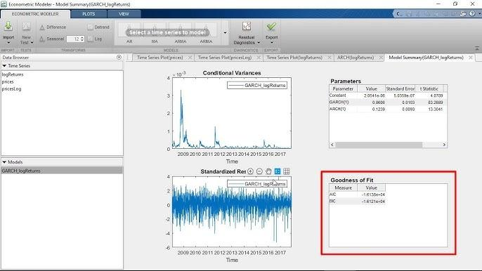

## Table of Contents

## What is a GARCH model and why is it used in finance?

A GARCH model, which stands for Generalized Autoregressive Conditional Heteroskedasticity, is a statistical tool used to analyze and predict the volatility of financial markets. It helps in understanding how the variability of returns on an asset, like stocks or commodities, changes over time. The model takes into account past volatility and the size of past errors in predictions to forecast future volatility. This makes it useful for anyone who needs to estimate how risky an investment might be at any given time.

In finance, GARCH models are widely used because they help investors and financial analysts better manage risk. For example, if a stock has been very volatile recently, a GARCH model can help predict if that volatility is likely to continue or decrease. This information is crucial for making decisions about buying or selling assets, setting prices for financial products, and managing portfolios. By providing a more accurate picture of potential risks, GARCH models help financial professionals make more informed decisions and potentially improve their investment strategies.

## What are the basic components of a GARCH model?

A GARCH model has two main parts that work together to predict how much a financial asset's price might swing around in the future. The first part is called the "conditional mean equation." This part looks at past prices to guess what the average price might be next. It's like trying to find a middle ground for where the price could go, based on what it has done before.

The second part is the "conditional variance equation," which is the heart of the GARCH model. This part figures out how much the price might jump up or down from that middle ground. It uses past price swings and past prediction mistakes to guess how big those jumps might be in the future. By combining these two parts, a GARCH model gives a full picture of both where the price might be headed and how much it might change along the way.

## How does a GARCH model differ from an ARCH model?

An ARCH model, which stands for Autoregressive Conditional Heteroskedasticity, is like a simpler version of a GARCH model. It looks at past price swings to guess how much prices might change in the future. But, it only uses past price swings to make its guesses. So, if prices were jumping around a lot last week, an ARCH model would think they might keep jumping around this week too.

A GARCH model, on the other hand, is a bit smarter. It not only looks at past price swings like an ARCH model does, but it also pays attention to how well it guessed prices in the past. If it made big mistakes before, it uses that information to make better guesses about future price changes. This makes GARCH models better at predicting how much prices might move around, especially when things get really unpredictable.

So, the main difference is that a GARCH model uses both past price swings and past prediction errors to make its forecasts, while an ARCH model only uses past price swings. This makes GARCH models more flexible and often more accurate, especially in the wild world of finance where things can change quickly.

## What are the steps to implement a basic GARCH(1,1) model?

To implement a basic GARCH(1,1) model, you first need to gather your data, which is usually a series of returns from a financial asset like a stock or a commodity. You'll need to calculate these returns from the price data, typically using the log return formula. Once you have your data ready, you can start by estimating the conditional mean equation, which is often just the mean of the returns or could be a simple autoregressive model if the returns show some dependence on past values. This step helps set the baseline for where the returns are expected to be.

Next, you move on to the core of the GARCH(1,1) model, which is the conditional variance equation. In a GARCH(1,1) model, this equation depends on three things: the long-run average variance, the variance from the previous period, and the squared error from the previous period's prediction. You'll need to estimate the parameters for these components, often using a method like maximum likelihood estimation. This involves trying different values for the parameters and seeing which ones make the model fit the data the best. Once you have these parameters, you can use them to predict future volatility based on past data.

After estimating the parameters, you can use the GARCH(1,1) model to forecast future volatility. You'll plug the past data into your equations to get a prediction for the next period's variance. This prediction can then be used in financial decision-making, like assessing risk or setting prices for financial products. Keep in mind that you'll need to update your model regularly with new data to keep your predictions accurate, as financial markets can change quickly.

## How can GARCH models be used to forecast volatility?

GARCH models help forecast how much a financial asset's price might swing around in the future. They do this by looking at how much the price has been jumping around in the past and how well the model guessed those jumps before. For example, if a stock's price has been going up and down a lot lately, a GARCH model might predict that it will keep doing that. It uses a special equation that takes into account the long-run average of those jumps, the size of the last jump, and how far off the last guess was. By putting all this together, the model can give a good guess about how much the price might move in the future.

To use a GARCH model for forecasting, you start by gathering data on the asset's past returns. You then use this data to estimate the model's parameters, which tell you how much weight to give to past jumps and past prediction errors. Once you have these parameters, you can plug in the latest data to predict the next period's volatility. This prediction can help investors and financial analysts make better decisions, like figuring out how risky an investment might be or setting prices for financial products. It's important to keep updating the model with new data, though, because financial markets can change quickly.

## What are some common extensions of the basic GARCH model?

There are several ways people have improved the basic GARCH model to make it work better for different situations. One popular extension is the EGARCH model, which stands for Exponential GARCH. This model is good at handling situations where the price jumps can be very different if they go up or down. Another extension is the GJR-GARCH model, which pays extra attention to big price drops, because those can be more important for investors to know about. These models help give a more accurate picture of how risky an investment might be, especially when things get really unpredictable.

Another common extension is the IGARCH model, which stands for Integrated GARCH. This model is useful when the effects of past price jumps don't go away quickly, which can happen in some markets. There's also the TGARCH model, or Threshold GARCH, which changes how it works based on whether the price is going up or down. These extensions help make the GARCH model more flexible and better at predicting future price changes in different kinds of financial situations.

## How do you estimate parameters in a GARCH model?

To estimate parameters in a GARCH model, you need to use a method called maximum likelihood estimation. This means you try different values for the parameters and see which ones make the model fit the data the best. Imagine you're trying to guess how much a ball will bounce. You watch how it bounces a few times, then try different guesses for how high it will bounce next. You keep adjusting your guess until it matches what you see the ball doing. In the same way, you adjust the GARCH model's parameters until they make the model's predictions match the real data as closely as possible.

Once you've found the best values for the parameters, you can use them to predict future volatility. This involves plugging the past data into the GARCH equations to get a forecast for the next period's variance. It's like using the best guess for the ball's bounce to predict how high it will go next time. By doing this, you can help investors and financial analysts make better decisions about how risky an investment might be or how to set prices for financial products.

## What are the diagnostic tests for a GARCH model?

After you've set up a GARCH model, you need to check if it's doing a good job. One way to do this is by looking at the residuals, which are the differences between the model's predictions and the actual data. If the model is working well, these residuals should look like random noise, meaning they shouldn't follow any patterns. You can use tests like the Ljung-Box test to see if there are any patterns in the residuals. If the test shows there are patterns, it means your model might need some tweaking.

Another important check is to see if the model is capturing all the volatility in the data. You can do this by looking at the squared residuals. If the model is doing its job right, the squared residuals should also look random and not have any patterns. The same Ljung-Box test can be used here too. If you find patterns in the squared residuals, it means your model isn't fully explaining the changes in volatility, and you might need to adjust it or try a different type of GARCH model. By running these checks, you can make sure your GARCH model is as accurate as possible for predicting future volatility.

## How can one use a GARCH model to manage risk in a financial portfolio?

A GARCH model helps manage risk in a financial portfolio by predicting how much the prices of the assets might swing around in the future. It looks at how much the prices have been jumping in the past and how well it guessed those jumps before. By doing this, the model can give a good guess about how risky an investment might be. For example, if a stock has been very volatile recently, the GARCH model might predict that it will keep being volatile. This information is really useful for investors because it helps them understand how much risk they are taking on with their investments.

With this information, investors can make smarter decisions about their portfolios. If the GARCH model predicts high volatility for a certain stock, an investor might decide to sell some of that stock to reduce risk. Or, if the model predicts low volatility, the investor might feel more comfortable holding onto the stock or even buying more. By using the GARCH model's predictions, investors can adjust their portfolios to balance risk and potential reward, helping them to protect their investments and possibly make more money.

## What are the limitations and criticisms of GARCH models?

GARCH models are really helpful for guessing how much prices might jump around in the future, but they have some problems too. One big issue is that they assume the past can tell us a lot about the future. But in the real world, things can change suddenly and in ways that are hard to predict. For example, a big news event can make prices go wild in a way that a GARCH model might not see coming. Also, GARCH models can be tricky to set up right. You need to pick the right type of GARCH model and the right numbers for its parts, which can be hard and might not always work out the best.

Another criticism is that GARCH models can be too simple for some situations. They might not catch all the different things that can affect how prices move, like how people feel about the market or big changes in the economy. Some people also think that GARCH models can make things look more predictable than they really are. This can make investors feel too safe and maybe take on more risk than they should. So, while GARCH models are useful, it's important to remember they're not perfect and to use them carefully along with other ways of looking at risk.

## How can GARCH models be integrated into trading strategies?

GARCH models can help traders make smarter decisions by predicting how much prices might move around in the future. Traders can use these predictions to decide when to buy or sell assets. For example, if a GARCH model predicts that a stock will be very volatile soon, a trader might decide to sell that stock to avoid big losses. On the other hand, if the model predicts low volatility, a trader might feel more confident in holding onto the stock or even buying more of it. By using GARCH models, traders can adjust their strategies to balance risk and potential rewards better.

Another way GARCH models can be integrated into trading strategies is by helping to set stop-loss and take-profit levels. If a GARCH model predicts high volatility, a trader might set a wider stop-loss to avoid getting stopped out by normal price swings. Conversely, if the model predicts low volatility, a trader might set a tighter stop-loss, knowing that prices are less likely to move suddenly. This can help traders protect their investments and potentially make more money by making more informed decisions based on the model's predictions.

## What are advanced techniques for optimizing GARCH model performance?

To make a GARCH model work better, you can use a few advanced tricks. One trick is to try different types of GARCH models, like EGARCH or GJR-GARCH, to see which one fits your data the best. These models can handle different situations better, like when prices go up or down in different ways. Another trick is to use more data to train your model. The more data you have, the better your model can guess how prices will move. You can also use something called a rolling window, where you keep updating your model with the newest data to make sure it stays accurate as things change.

Another way to improve a GARCH model is by using other methods to help it out. For example, you can use machine learning to find patterns in the data that the GARCH model might miss. This can make your predictions even better. Also, you can use something called Bayesian methods to estimate the model's parameters. These methods can be more flexible and might give you a better fit for your data. By combining these advanced techniques, you can make your GARCH model more accurate and useful for predicting how much prices might jump around in the future.

## What is the GARCH Model and how can it be understood?

The Generalized Autoregressive Conditional Heteroskedasticity (GARCH) model provides a robust statistical framework for understanding and predicting [volatility](/wiki/volatility-trading-strategies) in financial markets. Volatility, indicative of the degree of variation in trading prices, plays a crucial role in finance, influencing portfolio management, risk assessment, and trading strategies. 

GARCH models are particularly adept at capturing the dynamic nature of financial asset volatility. This dynamic nature is characterized by periods of high and low volatility—a phenomenon known as volatility clustering. In financial markets, volatility clustering implies that large changes in asset prices are often followed by large changes, and small by small, suggesting a time-varying volatility that models such as GARCH can effectively represent.

The GARCH model encompasses two primary components: the autoregressive (AR) term and the moving average (MA) term. Each of these components contributes to modeling volatility by incorporating both recent and historical variance information. Mathematically, a GARCH(p, q) model can be defined as follows:

$$
\sigma_t^2 = \alpha_0 + \sum_{i=1}^{p} \alpha_i \cdot \epsilon_{t-i}^2 + \sum_{j=1}^{q} \beta_j \cdot \sigma_{t-j}^2 
$$

Here, $\sigma_t^2$ represents the conditional variance at time t, $\epsilon_{t-i}^2$ denotes the past squared returns (innovations), and $\sigma_{t-j}^2$ represents lagged conditional variances. The parameters $\alpha_0$, $\alpha_i$, and $\beta_j$ need to be estimated through maximum likelihood estimation. The autoregressive term $\sum_{i=1}^{p} \alpha_i \cdot \epsilon_{t-i}^2$ accounts for the impact of past shock on current volatility, while the moving average term $\sum_{j=1}^{q} \beta_j \cdot \sigma_{t-j}^2$ captures the effect of past volatilities.

The GARCH model's design enables it to predict future volatility based on historical data, making it a powerful tool for financial analysts and traders focused on volatility risks. By modeling the time-dependent structure of volatility, GARCH provides deeper insight into the stability and fluctuations of financial markets.

## What are the applications in algorithmic trading?

In [algorithmic trading](/wiki/algorithmic-trading), GARCH models are instrumental in the development of strategies that capitalize on volatility predictions. These strategies are designed to generate actionable buy and sell signals, based on anticipated future volatility. This is crucial because volatility, often viewed as an indicator of uncertainty, can signal impending price movements. By predicting when volatility is likely to increase or decrease, traders can better time their market entries and exits, improving overall trading performance.

The use of GARCH in algorithmic trading enhances risk management frameworks by anticipating market upheavals, allowing traders to adjust their positions accordingly. For example, a predicted spike in volatility might prompt a trader to reduce exposure to certain risky assets, thereby safeguarding against potential losses. Conversely, a predicted drop in volatility might encourage traders to increase their positions, betting on a stable and predictable market environment.

Integrating GARCH models within trading algorithms involves harnessing real-time market data, which improves trading agility and response times. These models use historical data to estimate volatility parameters which are then applied to real-time data streams. Once volatility forecasts are generated, trading algorithms can execute pre-defined strategies automatically, responding to market changes within milliseconds. This ability to react quickly to new information is a significant advantage in the fast-paced world of financial markets.

For practical implementation, the GARCH model's parameters can be defined in terms of an autoregressive (AR) term and a moving average (MA) term, capturing recent and historical volatility:

$$
\sigma_t^2 = \alpha_0 + \sum_{i=1}^{p} \alpha_i \epsilon_{t-i}^2 + \sum_{j=1}^{q} \beta_j \sigma_{t-j}^2
$$

where $\sigma_t^2$ represents the conditional variance (volatility forecast) at time $t$, $\epsilon_{t-i}^2$ are lagged squared residuals, and $\sigma_{t-j}^2$ are lagged variances.

A sample Python implementation might start with importing essential libraries and fetching data:

```python
import numpy as np
import pandas as pd
from arch import arch_model
import ccxt

# Fetching historical market data using ccxt
exchange = ccxt.binance()
ohlcv_data = exchange.fetch_ohlcv('BTC/USDT', timeframe='1d')

# Converting to a DataFrame
data = pd.DataFrame(ohlcv_data, columns=['timestamp', 'open', 'high', 'low', 'close', 'volume'])
data['returns'] = np.log(data['close'] / data['close'].shift(1))

# Fitting a GARCH model
model = arch_model(data['returns'].dropna(), vol='Garch', p=1, q=1)
model_fit = model.fit()

# Predicting future volatility
forecast = model_fit.forecast(horizon=1)
print(forecast.variance[-1:])
```

By continuously monitoring and adjusting these predictions, algorithmic trading systems employing GARCH models can maintain a dynamic approach, adapting to changing market conditions with precision and speed. This proactive stance on volatility management is key to executing successful trading strategies, ultimately contributing to the trader's competitive edge.

## References & Further Reading

[1]: Bollerslev, T. (1986). ["Generalized Autoregressive Conditional Heteroskedasticity."](https://www.sciencedirect.com/science/article/pii/0304407686900631) Journal of Econometrics, 31(3), 307-327.

[2]: Engle, R. F. (1982). ["Autoregressive Conditional Heteroskedasticity with Estimates of the Variance of United Kingdom Inflation."](https://www.econometricsociety.org/publications/econometrica/1982/07/01/autoregressive-conditional-heteroscedasticity-estimates) Econometrica, 50(4), 987-1007.

[3]: Alexander, C. (2008). ["Market Risk Analysis, Volume II: Practical Financial Econometrics."](https://www.wiley.com/en-us/Market+Risk+Analysis%2C+Volume+II%2C+Practical+Financial+Econometrics-p-9780470998014) John Wiley & Sons.

[4]: Hull, J. C. (2015). ["Options, Futures, and Other Derivatives."](https://books.google.com/books/about/Options_Futures_and_Other_Derivatives_Gl.html?id=sdg2EAAAQBAJ) Pearson Education.

[5]: Ruey S. Tsay (2010). ["Analysis of Financial Time Series."](https://onlinelibrary.wiley.com/doi/book/10.1002/9780470644560) Wiley Series in Probability and Statistics.

[6]: Jorion, P. (2001). ["Value at Risk: The New Benchmark for Managing Financial Risk."](https://books.google.com/books/about/Value_at_Risk.html?id=S2SsFblvUdMC) McGraw-Hill.