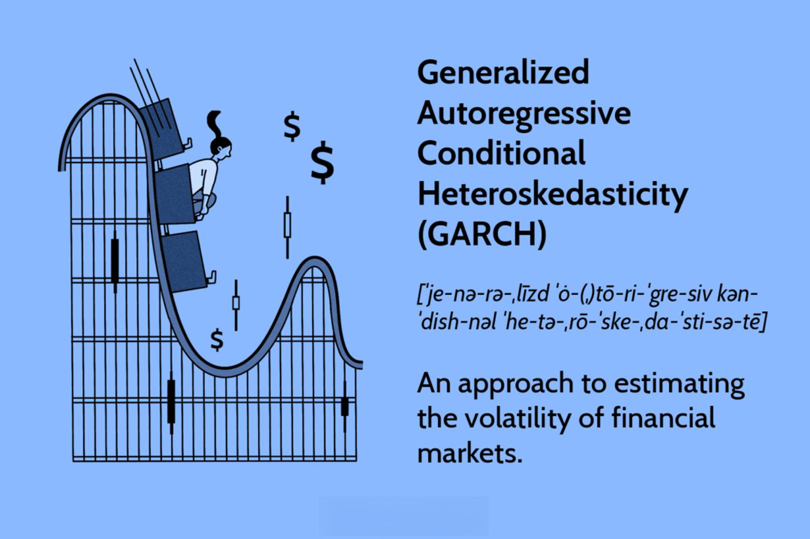

Algorithmic trading employs various tools and strategies to enhance decision-making and manage trading risks effectively. Among these tools, the Generalized Autoregressive Conditional Heteroskedasticity (GARCH) model stands out for its widespread use in financial markets, primarily for forecasting volatility. Understanding and predicting market volatility is integral to the success of traders, as it directly influences risk management, portfolio optimization, and the timing of trades. Volatility can be described as the rate at which the price of a security increases or decreases for a given set of returns, and it is often characterized by periods of rapid movements followed by relatively calmer phases—a phenomenon known as volatility clustering.

Forecasting volatility not only assists traders in anticipating fluctuations but also helps in adjusting their trading methods to mitigate risks efficiently. The ability to predict when markets might experience significant changes is invaluable; it enables traders to position themselves advantageously, safeguarding their portfolios against potential losses and capitalizing on opportunities for profit during turbulent periods.



The GARCH model is instrumental in providing these insights. By analyzing historical data, the GARCH model helps in identifying patterns and trends in volatility, offering a probabilistic estimate of future changes. This article will focus on the innovative applications of the GARCH toolbox within algorithmic trading, emphasizing how it enhances the modeling of market dynamics, leading to improved trading performance and predictive accuracy.

## Table of Contents

## Understanding the GARCH Model

The Generalized Autoregressive Conditional Heteroskedasticity (GARCH) model provides a robust statistical framework for understanding and predicting [volatility](/wiki/volatility-trading-strategies) in financial markets. Volatility, indicative of the degree of variation in trading prices, plays a crucial role in finance, influencing portfolio management, risk assessment, and trading strategies. 

GARCH models are particularly adept at capturing the dynamic nature of financial asset volatility. This dynamic nature is characterized by periods of high and low volatility—a phenomenon known as volatility clustering. In financial markets, volatility clustering implies that large changes in asset prices are often followed by large changes, and small by small, suggesting a time-varying volatility that models such as GARCH can effectively represent.

The GARCH model encompasses two primary components: the autoregressive (AR) term and the moving average (MA) term. Each of these components contributes to modeling volatility by incorporating both recent and historical variance information. Mathematically, a GARCH(p, q) model can be defined as follows:

$$
\sigma_t^2 = \alpha_0 + \sum_{i=1}^{p} \alpha_i \cdot \epsilon_{t-i}^2 + \sum_{j=1}^{q} \beta_j \cdot \sigma_{t-j}^2 
$$

Here, $\sigma_t^2$ represents the conditional variance at time t, $\epsilon_{t-i}^2$ denotes the past squared returns (innovations), and $\sigma_{t-j}^2$ represents lagged conditional variances. The parameters $\alpha_0$, $\alpha_i$, and $\beta_j$ need to be estimated through maximum likelihood estimation. The autoregressive term $\sum_{i=1}^{p} \alpha_i \cdot \epsilon_{t-i}^2$ accounts for the impact of past shock on current volatility, while the moving average term $\sum_{j=1}^{q} \beta_j \cdot \sigma_{t-j}^2$ captures the effect of past volatilities.

The GARCH model's design enables it to predict future volatility based on historical data, making it a powerful tool for financial analysts and traders focused on volatility risks. By modeling the time-dependent structure of volatility, GARCH provides deeper insight into the stability and fluctuations of financial markets.

## Applications in Algorithmic Trading

In [algorithmic trading](/wiki/algorithmic-trading), GARCH models are instrumental in the development of strategies that capitalize on volatility predictions. These strategies are designed to generate actionable buy and sell signals, based on anticipated future volatility. This is crucial because volatility, often viewed as an indicator of uncertainty, can signal impending price movements. By predicting when volatility is likely to increase or decrease, traders can better time their market entries and exits, improving overall trading performance.

The use of GARCH in algorithmic trading enhances risk management frameworks by anticipating market upheavals, allowing traders to adjust their positions accordingly. For example, a predicted spike in volatility might prompt a trader to reduce exposure to certain risky assets, thereby safeguarding against potential losses. Conversely, a predicted drop in volatility might encourage traders to increase their positions, betting on a stable and predictable market environment.

Integrating GARCH models within trading algorithms involves harnessing real-time market data, which improves trading agility and response times. These models use historical data to estimate volatility parameters which are then applied to real-time data streams. Once volatility forecasts are generated, trading algorithms can execute pre-defined strategies automatically, responding to market changes within milliseconds. This ability to react quickly to new information is a significant advantage in the fast-paced world of financial markets.

For practical implementation, the GARCH model's parameters can be defined in terms of an autoregressive (AR) term and a moving average (MA) term, capturing recent and historical volatility:

$$
\sigma_t^2 = \alpha_0 + \sum_{i=1}^{p} \alpha_i \epsilon_{t-i}^2 + \sum_{j=1}^{q} \beta_j \sigma_{t-j}^2
$$

where $\sigma_t^2$ represents the conditional variance (volatility forecast) at time $t$, $\epsilon_{t-i}^2$ are lagged squared residuals, and $\sigma_{t-j}^2$ are lagged variances.

A sample Python implementation might start with importing essential libraries and fetching data:

```python
import numpy as np
import pandas as pd
from arch import arch_model
import ccxt

# Fetching historical market data using ccxt
exchange = ccxt.binance()
ohlcv_data = exchange.fetch_ohlcv('BTC/USDT', timeframe='1d')

# Converting to a DataFrame
data = pd.DataFrame(ohlcv_data, columns=['timestamp', 'open', 'high', 'low', 'close', 'volume'])
data['returns'] = np.log(data['close'] / data['close'].shift(1))

# Fitting a GARCH model
model = arch_model(data['returns'].dropna(), vol='Garch', p=1, q=1)
model_fit = model.fit()

# Predicting future volatility
forecast = model_fit.forecast(horizon=1)
print(forecast.variance[-1:])
```

By continuously monitoring and adjusting these predictions, algorithmic trading systems employing GARCH models can maintain a dynamic approach, adapting to changing market conditions with precision and speed. This proactive stance on volatility management is key to executing successful trading strategies, ultimately contributing to the trader's competitive edge.

## Implementing GARCH Models

Implementing a GARCH model in algorithmic trading begins with setting up an appropriate technical environment. This involves using specific Python libraries to facilitate data manipulation, calculation, and model fitting. Key libraries include 'arch', which provides functions specifically for estimating autoregressive conditional heteroskedasticity models, 'numpy' for numerical computations, 'pandas' for data manipulation and analysis, and 'ccxt' for accessing [cryptocurrency](/wiki/cryptocurrency) exchange market data.

To start, a trader needs to gather historical market data, typically in the form of OHLCV (Open, High, Low, Close, Volume) data. This data can be obtained from exchanges like Binance through the 'ccxt' library, which provides a uniform way to access exchange APIs. The collected data is then processed to calculate returns, which are essential for volatility modeling. In a simplified Python code snippet, this process might look like:

```python
import ccxt
import pandas as pd
import numpy as np

# Initialize exchange and fetch OHLCV data
exchange = ccxt.binance()
symbol = 'BTC/USDT'
timeframe = '1h'
ohlcv = exchange.fetch_ohlcv(symbol, timeframe)

# Create a DataFrame
df = pd.DataFrame(ohlcv, columns=['timestamp', 'open', 'high', 'low', 'close', 'volume'])

# Calculate returns
df['returns'] = df['close'].pct_change().dropna()
```

Once the return series is prepared, the next step is to fit a GARCH model to this data. A GARCH(p, q) model comprises two main parameters: p, the number of lagged volatility terms, and q, the number of lagged squared returns terms. Selecting the right p and q is crucial as they determine the model's ability to capture volatility patterns effectively. This fitting can be conducted using the 'arch' library:

```python
from arch import arch_model

# Fit a GARCH(p, q) model
p, q = 1, 1
model = arch_model(df['returns'].dropna(), vol='Garch', p=p, q=q)
model_fit = model.fit(disp='off')

# Output the model summary
print(model_fit.summary())
```

The choice of p and q should be guided by the specific characteristics of the data and the financial instrument being analyzed. This may involve experimenting with different parameter combinations and evaluating the model's performance using criteria such as the Akaike Information Criterion (AIC) or the Bayesian Information Criterion (BIC).

Critically, optimizing these parameters allows the model to adapt to the chosen timeframe and asset class. For example, a higher frequency of data might require a different parameter configuration than lower-frequency datasets. Similarly, different asset classes might display unique volatility patterns that necessitate tailored GARCH configurations. By fitting the model correctly, traders can extract meaningful insights from past market behaviors, providing a foundation for developing predictive trading strategies.

## Strategies and Signal Generation

With a fitted GARCH model, traders can simulate trading strategies by generating buy and sell signals based on predicted volatility. The process begins by defining conditional statements that correlate with specific volatility thresholds. For instance, if the predicted volatility surpasses a particular upper limit, this could trigger a sell signal anticipating potential downturns. Conversely, if the predicted volatility falls below a certain lower threshold, it might signal a buying opportunity, suggesting a stable or upward-trending market.

Visualizing these trades against current market data is a crucial step. This visualization involves plotting the generated signals on historical price charts to understand how the GARCH model's predictions align with actual market movements. This comparison can reveal the model's effectiveness, highlighting areas where the model successfully anticipates market shifts and areas needing refinement. For instance, using libraries like `matplotlib` in Python allows for clear graphical representation:

```python
import matplotlib.pyplot as plt

# Assume 'market_data' is a DataFrame with historical prices
# 'signals' is a DataFrame with buy/sell signals generated from the GARCH model

plt.figure(figsize=(14, 7))
plt.plot(market_data['price'], label='Market Price')
plt.plot(signals['buy_signals'], '^', markersize=10, color='g', label='Buy Signal', alpha=0.7)
plt.plot(signals['sell_signals'], 'v', markersize=10, color='r', label='Sell Signal', alpha=0.7)
plt.title('GARCH Model Buy/Sell Signals')
plt.legend()
plt.show()
```

To ensure robustness, these strategies require consistent [backtesting](/wiki/backtesting) and adjustments across various market conditions. Backtesting involves running the GARCH-based trading strategies on historical data to evaluate their potential performance in real markets. This testing helps identify the strategy's strengths and weaknesses, guiding parameter adjustments for optimal results. Backtesting can be implemented using environments such as `[backtrader](/wiki/backtrader)` in Python, allowing traders to simulate trading conditions retrospectively.

Given the dynamic nature of financial markets, continuous adjustment is essential. This iterative process helps adapt the strategies to new data patterns and shifting market volatility profiles, ensuring the GARCH model remains a reliable tool for generating actionable signals. As market dynamics evolve, traders can recalibrate their models, fine-tuning parameters like the order of the GARCH(p, q) to best match observed data, thus maintaining a strategic edge.

## Conclusion

The GARCH toolbox stands as a vital tool for algorithmic traders, specifically tailored for managing and projecting market volatility. Volatility, often a precursor to abrupt market movements, can be a double-edged sword. By leveraging the predictive capabilities of GARCH models, traders can anticipate periods of financial instability, thereby gaining crucial insights required for strategic decision-making under volatile conditions. These models capture the persistent and clustering nature of volatility, aiding traders in constructing more resilient trading strategies through informed risk management.

Integrating GARCH models within algorithmic systems not only enhances the precision of volatility forecasts but also translates into more robust risk management frameworks. The capacity of these models to predict periods of heightened volatility allows traders to adjust their positions promptly, thus mitigating potential losses or capitalizing on prospective gains. Traders equipped with such foresight are better positioned to time market entries and exits, optimize portfolios, and safeguard against adverse market conditions.

The dynamic nature of financial markets necessitates the continual refinement of models and strategies. As markets evolve, so too must the application and adaptation of GARCH models. Regular updates and recalibration of model parameters ensure their relevance and efficacy across varying market environments. This ongoing adaptation is imperative for maintaining a competitive edge, allowing traders to stay ahead in the swiftly changing landscape of algorithmic trading.

## References & Further Reading

[1]: Bollerslev, T. (1986). ["Generalized Autoregressive Conditional Heteroskedasticity."](https://www.sciencedirect.com/science/article/pii/0304407686900631) Journal of Econometrics, 31(3), 307-327.

[2]: Engle, R. F. (1982). ["Autoregressive Conditional Heteroskedasticity with Estimates of the Variance of United Kingdom Inflation."](https://www.econometricsociety.org/publications/econometrica/1982/07/01/autoregressive-conditional-heteroscedasticity-estimates) Econometrica, 50(4), 987-1007.

[3]: Alexander, C. (2008). ["Market Risk Analysis, Volume II: Practical Financial Econometrics."](https://www.wiley.com/en-us/Market+Risk+Analysis%2C+Volume+II%2C+Practical+Financial+Econometrics-p-9780470998014) John Wiley & Sons.

[4]: Hull, J. C. (2015). ["Options, Futures, and Other Derivatives."](https://books.google.com/books/about/Options_Futures_and_Other_Derivatives_Gl.html?id=sdg2EAAAQBAJ) Pearson Education.

[5]: Ruey S. Tsay (2010). ["Analysis of Financial Time Series."](https://onlinelibrary.wiley.com/doi/book/10.1002/9780470644560) Wiley Series in Probability and Statistics.

[6]: Jorion, P. (2001). ["Value at Risk: The New Benchmark for Managing Financial Risk."](https://books.google.com/books/about/Value_at_Risk.html?id=S2SsFblvUdMC) McGraw-Hill.