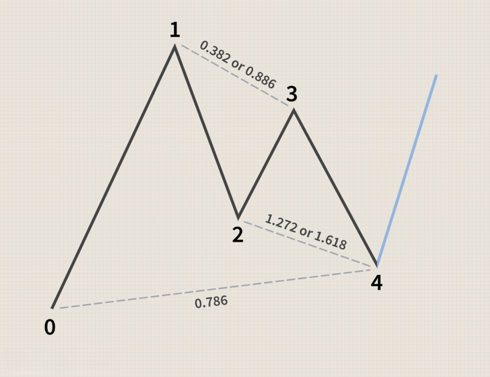

The Gartley pattern is a recognized harmonic pattern within the trading community, introduced by H.M. Gartley in 1935. This pattern is distinguished by its basis in Fibonacci numbers, which are integral to its structure. It's employed primarily to predict market retracements and continuation patterns, providing a framework for anticipating potential price reversals or trend continuations. The complex nature of the Gartley pattern involves a specific configuration of price movements, making it both a challenging and rewarding chart pattern to identify accurately.

In algorithmic trading, the Gartley pattern holds significant value. By automating the recognition of this pattern through algorithmic strategies, traders can gain insights into possible reversals in the market, thereby enhancing their decision-making processes. The pattern's precise geometric formation, grounded in Fibonacci ratios, enables traders to refine entry and exit points with greater accuracy and consistency.



For traders focused on integrating harmonic patterns into their algorithmic trading strategies, understanding the intricacies of the Gartley pattern is crucial. Mastery of this pattern can provide a strategic advantage, as it offers a methodical approach to predicting market movements, crucial for optimizing algorithmic trading systems. The effective use of the Gartley pattern requires a comprehensive understanding of harmonic trading principles and the ability to integrate these insights into algorithmic models.

## Table of Contents

## Understanding the Gartley Pattern

The Gartley pattern is a sophisticated harmonic chart configuration that traders frequently utilize in anticipation of potential market reversals. It consists of five pivotal points labeled X, A, B, C, and D, which together form a quintessential XABCD formation. This pattern is anchored in the concept of price action symmetry and is closely tied to Fibonacci ratios, a critical component for its identification and confirmation.

The formation of the Gartley pattern begins with an initial impulse wave, denoted as XA. This establishes the primary trend in the pattern's development. Following XA, the pattern undergoes a correction phase, represented by the retracement AB. This retracement typically aligns with a Fibonacci ratio, often hovering around the 61.8% level of the XA leg, though variations can occur.

Subsequent to the AB retracement, the pattern undergoes another corrective phase, identified as BC. This leg adds complexity to the pattern, as its length and form variability depend on market conditions, with common Fibonacci retracements being either 38.2% or 88.6% of the AB move. Finally, the pattern completes with the impulse wave CD, which travels towards what is known as the potential reversal zone (PRZ). This zone is critical for traders as they anticipate a shift in market direction upon the pattern's completion. CD is expected to be 127.2% or sometimes 161.8% of the BC leg. The point D is crucial, as it marks the pattern's culmination and sets the stage for the expected reversal. It is a zone rather than a precise point, emphasizing the necessity for traders to combine the pattern identification with additional technical analysis tools for confirmation.

The rigor in confirming the Gartley pattern's validity relies heavily on these Fibonacci ratios, rendering it a meticulous and challenging pattern to decipher. Accurately plotting these points and accurately gauging the Fibonacci levels are essential for leveraging this pattern's predictive potential. Understanding the intricate nature of these harmonic movements and carefully identifying the corresponding Fibonacci retracements are imperative for traders looking to capitalize on this technical analysis strategy.

## Algorithmic Trading and the Gartley Pattern

Algorithmic trading leverages computational algorithms to execute trades with high speed, efficiency, and precision. Within this landscape, the Gartley pattern emerges as an effective tool for traders looking to automate trading decisions based on harmonic patterns. The integration of the Gartley pattern into [algorithmic trading](/wiki/algorithmic-trading) systems enables the automatic detection and execution of trades, driven by the pattern's reliance on specific Fibonacci ratios.

A key strength of using the Gartley pattern in algorithmic trading is its ability to incorporate precise Fibonacci ratios for determining trade entry and [exit](/wiki/exit-strategy) points. These Fibonacci levels, inherent to the pattern, allow for meticulous targeting of potential price reversals. For instance, the pattern identifies critical points such as the 61.8% retracement of the XA wave and crucial levels in the CD extension, which are critical in setting up trades. Algorithmic systems can be programmed to recognize these Fibonacci-based criteria consistently, ensuring that trading decisions adhere strictly to the defined parameters.

Python, a prevalent language in algorithmic trading, can be employed to code algorithms that detect Gartley patterns based on these Fibonacci ratios. Here is a simple Python code snippet illustrating how to identify potential Gartley patterns in historical market data:

```python
import numpy as np
import pandas as pd

def identify_gartley_pattern(data):
    points = ['X', 'A', 'B', 'C', 'D']
    fibonacci_ratios = {'AB': 0.618, 'BC': [0.382, 0.886], 'CD': [1.272, 1.618]}
    patterns = []

    for index in range(len(data) - 4):
        XA = data[index + 1] - data[index]
        AB = data[index + 2] - data[index + 1]
        BC = data[index + 3] - data[index + 2]
        CD = data[index + 4] - data[index + 3]

        if (np.isclose(AB / XA, fibonacci_ratios['AB'], atol=0.01) and
            any(np.isclose(BC / AB, ratio, atol=0.01) for ratio in fibonacci_ratios['BC']) and
            any(np.isclose(CD / BC, ratio, atol=0.01) for ratio in fibonacci_ratios['CD'])):
            patterns.append((index, index + 4))

    return patterns

# Example usage
prices = np.array([1.0, 1.618, 0.618, 0.382, 1.272])
patterns = identify_gartley_pattern(prices)
print("Potential Gartley Patterns found at indices:", patterns)
```

Backtesting is another critical component within the algorithmic framework, crucial for refining trading strategies that incorporate the Gartley pattern. By testing the pattern against historical data, traders can evaluate its effectiveness and adjust the algorithm to enhance its robustness under varying market conditions. This iterative process of [backtesting](/wiki/backtesting) and optimization ensures that the algorithm not only recognizes valid Gartley patterns but also aligns these patterns with profitable trading outcomes.

In conclusion, the integration of the Gartley pattern into algorithmic trading systems offers numerous benefits, including precision in trade execution and enhanced efficiency. By leveraging Fibonacci ratios and employing backtesting methodologies, traders can optimize their strategies and improve the reliability of their trading algorithms.

## Trading the Gartley Pattern: Rules and Strategies

The Gartley pattern stands out among harmonic patterns for its precision and the detailed analysis required for its identification and successful trading. At the core of trading the Gartley pattern lies the necessity of correct Fibonacci retracement and extension levels, which serve as the foundation for pattern identification and completion.

**Fibonacci Ratios and Pattern Formation**

The Gartley pattern involves specific Fibonacci ratios, which are critical for validating the pattern:

1. **AB Leg:** This retracement should be around 61.8% of the XA movement. This calculate precisely using the Fibonacci retracement tool is essential for identifying the pattern.

2. **BC Leg:** This leg offers two potential retracement levels at either 38.2% or 88.6% of the AB movement. Traders should monitor price action at these levels to determine BC's stability.

3. **CD Leg:** This is the final leg and plays a crucial role in the Gartley pattern's definition. CD is typically an extension of 127.2% or 161.8% of the BC leg. Correct calculation of these Fibonacci extensions helps confirm the pattern's endpoint and potential reversal zone.

With the understanding of these ratios, traders can better anticipate potential reversal zones and prepare for strategic market entry.

**Execution Strategy at Potential Reversal Zone (PRZ)**

Once the Gartley pattern is identified, traders must await completion. The PRZ is the area where the CD leg finalizes its extension, and market reversal is anticipated. It is pivotal that traders look for additional confirmation signals, such as candlestick patterns, [volume](/wiki/volume-trading-strategy) spikes, or [momentum](/wiki/momentum) divergences, before entering trades. This practice enhances the probability of a successful trade.

**Risk Management**

Proper risk management is a critical component of any trading strategy, especially when trading complex patterns like the Gartley. Traders should place stop-loss orders beyond the X point, which signifies a logical level of risk based on the pattern's complete invalidation. This strategic placement protects against unforeseen price movements and limits potential losses.

**Profit Targets**

Profit targets can be strategically set at various Fibonacci levels upon successful entry at the PRZ. Common practice involves setting targets at the 38.2% and 61.8% retracement levels of the AD movement from point D. Such targets enable traders to lock in profits progressively, adjusting positions dynamically as the market unfolds.

Overall, trading the Gartley pattern involves a disciplined approach, hinging on precise calculations of Fibonacci ratios, awaited confirmations at the PRZ, and robust risk management strategies. Applying these rules and strategies judiciously can optimize trading performance and lead to more consistent results in financial markets.

## Bullish and Bearish Gartley Examples

The Gartley pattern, a pivotal component in harmonic trading, can signify both bullish and bearish market reversals depending on its configuration in historical price charts. 

A bullish Gartley pattern appears during a broader bullish trend and forecasts a potential reversal upwards at point D. This pattern suggests that, even though the price might have experienced temporary declines, the overarching market direction remains upward. Traders observing this pattern can anticipate a price increase, positioning themselves to take advantage of the expected upward movement.

Conversely, a bearish Gartley pattern emerges above a bearish trend. This configuration signals a potential downward market reversal at point D. It indicates that despite any recent price rallies, the broader market trend is downward. Traders can leverage this information to prepare for a decline, positioning themselves accordingly to capitalize on the expected downtrend.

Visualization through historical charts aids in solidifying these interpretations. By analyzing past occurrences of Gartley patterns in different market conditions, traders can better understand their formation and implications. These charts highlight the essential point D where reversal potential is highest, guiding traders in making informed decisions. 

The symmetry and precision required for a valid Gartley pattern emphasize its utility yet highlight the complexity involved in its identification and application. Mathematical ratios derived from Fibonacci sequences are integral to this pattern, and incorporating these precise calculations into algorithmic models can further enhance detection accuracy. Here is a simple Python function to check the formation of a Gartley pattern:

```python
def check_gartley_pattern(x, a, b, c, d):
    ab_ratio = (b - a) / (x - a)
    bc_ratio = (c - b) / (a - x)
    cd_ratio = (d - c) / (b - c)

    if 0.618 * 0.95 <= ab_ratio <= 0.618 * 1.05 and \
       0.382 * 0.95 <= bc_ratio <= 0.886 * 1.05 and \
       1.272 * 0.95 <= cd_ratio <= 1.618 * 1.05:
        if c < a and d > x:
            return "Potential Bullish Gartley"
        elif c > a and d < x:
            return "Potential Bearish Gartley"
    return "No valid Gartley pattern"
```

This function checks ratios between points X, A, B, C, and D to identify a valid bullish or bearish Gartley pattern, aligning with the Fibonacci constraints. Implementing such functions in trading systems can automate the detection process, making it an efficient part of algorithmic trading strategies.

## Advantages and Disadvantages in Algo Trading

In algorithmic trading, the Gartley pattern offers several advantages that stem from its structured use of Fibonacci ratios and pattern recognition. Its ability to provide precise trade entries and exits is a significant advantage. Fibonacci ratios, such as those in the Gartley pattern, enable algorithmic systems to define entry and exit points with precision, minimizing ambiguity in trading decisions. This precise identification of trade levels enhances the efficiency and effectiveness of trading strategies by reducing the subjective interpretation often found in manual trading.

Risk management is another benefit of integrating the Gartley pattern within algorithmic trading systems. By programming predefined rules and parameters into the algorithm, traders can effectively manage risks. For instance, stop-loss orders can be automatically set beyond the X point, ensuring that potential losses are limited in case the pattern fails. The consistency offered by algorithmic trading ensures that these risk management strategies are applied uniformly across trades, thereby maintaining discipline and reducing emotional decision-making.

However, the application of the Gartley pattern in algorithmic trading is not without drawbacks. One of the primary challenges is the pattern's dependence on specific market conditions. The Gartley pattern requires certain Fibonacci ratios to appear in sequence, which may not always occur in all market environments. This reliance can restrict the frequency and applicability of the pattern, potentially limiting trading opportunities.

Moreover, the subjective nature of identifying patterns can create difficulties in algorithmic systems. While algorithms are designed to be precise, the interpretation of chart patterns may vary slightly depending on the data source and charting methods. This subjectivity can lead to inconsistencies, which might require additional programming to adjust the algorithm's sensitivity to pattern recognition.

To mitigate these challenges, algorithmic systems must incorporate adaptive mechanisms and calibration techniques. For instance, incorporating [machine learning](/wiki/machine-learning) algorithms could help in dynamically adjusting pattern recognition criteria based on evolving market conditions. By continuously analyzing historical data alongside real-time information, the algorithm can better account for variations in market conditions, thereby enhancing the reliability of trading decisions. 

In Python, a simple example of combining the Gartley pattern with algorithmic trading might involve the use of libraries like `pandas` for data manipulation and `TA-Lib` for technical analysis, allowing for backtesting and optimization of the strategy:
```python
import pandas as pd
import talib as ta

# Example function to identify Gartley pattern (simplified logic)
def identify_gartley(data):
    # Calculate Fibonacci ratios
    data['XA'] = data['High'] - data['Low'].shift()
    data['AB'] = (data['Close'] - data['Open'].shift())/data['XA']
    # Additional calculations for BC and CD
    ...

    # Confirm Gartley pattern based on calculated ratios
    gartley_patterns = data[(data['AB'] == some_ratio) & (other_conditions)]
    return gartley_patterns

# Apply this function to a trading dataset
data = pd.read_csv('market_data.csv')
gartley_patterns = identify_gartley(data)

# Further integration with trading execution strategies can be added.
```

This script outlines the process of incorporating pattern recognition into an algorithmic framework, illustrating how predefined rules and strategic adjustments can optimize trading performance using the Gartley pattern.

## Conclusion

The Gartley pattern remains a valuable tool for harmonic traders, especially in algorithmic trading. This pattern's ability to predict potential market reversals offers a significant advantage when integrated into automated trading systems. By leveraging precise Fibonacci ratios, traders can achieve enhanced trading efficiency and precision. 

To effectively implement the Gartley pattern through algorithmic systems, a combination of technical analysis, backtesting data, and robust risk management is essential. Technical analysis provides the framework for identifying and confirming the presence of the pattern, while backtesting offers insights into historical performance and helps refine trading algorithms to improve future outcomes. Incorporating rigorous risk management strategies ensures that potential losses are minimized, safeguarding trading capital.

Algorithmic trading systems that incorporate the Gartley pattern can automate the detection and execution of trades, thus increasing consistency and removing emotional decision-making from the trading process. Traders can program these systems to monitor markets continuously, executing trades only when the pattern is accurately identified and confirmed. This automation allows for high-speed trading decisions that human traders might miss due to the fast-paced nature of financial markets.

In conclusion, the successful application of the Gartley pattern in algorithmic trading requires a harmonious integration of technology, analysis, and discipline. This integration can substantially enhance trading outcomes, making the Gartley pattern a cornerstone of modern harmonic trading strategies.

## Frequently Asked Questions (FAQ)

### What are the key characteristics of the Gartley pattern?

The Gartley pattern is a distinctive harmonic chart pattern characterized by its XABCD structure. The formation involves:

1. **Initial Impulse Wave (XA):** This is the first movement in the pattern, setting the foundation for the retracement phases.
2. **Retracement (AB):** The price retraces from the initial impulse and typically aligns with 61.8% of the XA movement, adhering to Fibonacci levels.
3. **Retracement (BC):** The second retracement, which can range between 38.2% and 88.6% of the AB leg.
4. **Impulse Wave (CD):** The final leg in the pattern, typically extending 127.2% or 161.8% of the BC retracement.
5. **Potential Reversal Zone (PRZ):** The D point, which marks a potential reversal area, is crucial for confirming the pattern's significance. 

These elements, along with the precise Fibonacci interactions, make the Gartley pattern a challenging but valuable tool for traders.

### How is the Gartley pattern traded in algorithmic systems?

In algorithmic trading, the Gartley pattern can be integrated into trading systems to automate trade detection and execution. This involves:

- **Pattern Recognition:** Algorithms scan for the XABCD structure and validate using pre-defined Fibonacci ratios.
- **Trade Execution:** Once the pattern is complete at the PRZ, the system executes trades. Entry points and stop-loss levels are specified based on Fibonacci retracement principles.
- **Optimization:** Backtesting allows traders to refine their algorithms by assessing historical data to adjust strategies for the best possible outcomes.

Here's a simplified Python code example illustrating basic pattern recognition and trade execution:

```python
def detect_gartley(xa, ab, bc, cd):
    return (ab >= 0.618 * xa and ab <= 0.618 * xa + 0.02 * xa and
            bc >= 0.382 * ab and bc <= 0.886 * ab and
            (cd == 1.272 * bc or cd == 1.618 * bc))

def execute_trade(pattern, current_price):
    if pattern:
        # Enter trade logic, e.g., calculate entry price based on Fibonacci levels
        entry = current_price
        stop_loss = xa_point * 1.05  # 5% beyond xa as stop-loss
        take_profit = current_price * 1.1  # Set take profit 10% higher
        print(f"Enter trade at {entry}, Stop Loss at {stop_loss}, Take Profit at {take_profit}")
```

### What are the pros and cons of using the Gartley pattern in algo trading?

**Pros:**
- **Precision:** The use of Fibonacci ratios offers precise entry and exit points, enhancing potential profitability.
- **Consistency:** Automated systems provide consistent execution, removing emotional and psychological factors.
- **Risk Management:** Predefined rules facilitate effective risk management through elements like stop-loss orders.

**Cons:**
- **Market Condition Sensitivity:** The pattern requires specific market conditions, which may not always be present.
- **Subjectivity:** Identifying the pattern can be subjective, leading to discrepancies in pattern recognition.
- **Complexity:** The intricate nature of harmonic patterns necessitates sophisticated algorithms, which may be complex to develop and maintain.

Overall, while effective, the integration of Gartley patterns in algorithmic trading demands comprehensive analysis and optimization to navigate challenges and harness its trading potential fully.

## References & Further Reading

[1]: Gartley, H. M. (1935). *Profits in the Stock Market*. Lambert-Gann Publishing.

[2]: Carney, S. (1999). *The Harmonic Trader*. HarmonicTrader.com.

[3]: Bulkowski, T. N. (2005). *Encyclopedia of Chart Patterns*. John Wiley & Sons.

[4]: Pesavento, L., & Jouflas, S. (2007). *Fibonacci Ratios with Pattern Recognition.* Fibonacci Trader Inc.

[5]: Brown, Constance (1999). *Technical Analysis for the Trading Professional: Strategies and Techniques for Today’s Turbulent Global Financial Markets*. McGraw-Hill Education.