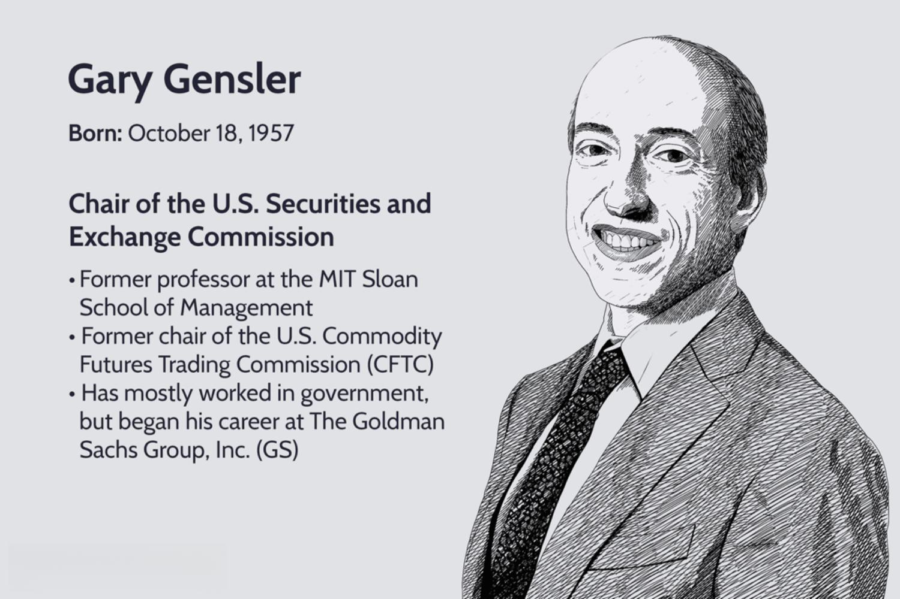

Gary Gensler is a prominent figure in the financial world, currently serving as the Chair of the U.S. Securities and Exchange Commission (SEC). His extensive career has had significant implications for the realm of algorithmic trading and financial market regulation. This article explores Gary Gensler's biography with an emphasis on his career achievements and influence in algorithmic trading. As an advocate for transparency and regulation in financial markets, Gensler's role is pivotal in shaping modern trading practices, ensuring fairness and protecting investors.

Gensler's journey spans academia, government, and industry. He brings a wealth of knowledge and experience that informs his perspectives on financial market operations. From his academic pursuits to his pivotal regulatory roles, Gensler has continually championed a transformation in trading practices that aligns with technological advancements while ensuring market stability. He has emphasized the importance of transparency in trading, particularly in the context of algorithmic trading, which uses technology to execute trades at high speeds with complex algorithms.

Understanding Gensler's career provides valuable insights into the current and future landscape of financial trading regulations. His focus on regulatory frameworks that balance innovation with oversight is crucial at a time when technology is rapidly changing financial markets. Our examination begins by exploring his early life and career, laying the foundation for his impactful contributions to the SEC and beyond. Gensler's work not only influences current financial trading practices but also sets the stage for future regulatory developments.

## Table of Contents

## Early Life and Education

Gary Gensler was born on October 18, 1957, in Baltimore, Maryland. His early life experiences and upbringing played a significant role in shaping his career trajectory toward financial regulation and public service. From a young age, Gensler exhibited a keen interest in the mechanisms that underpin financial systems, an interest that would later define his career path.

Gensler attended the University of Pennsylvania, where he embarked on an educational journey that would lay the groundwork for his future successes. He earned a Bachelor of Science degree in Economics from the Wharton School, an institution renowned for producing leaders in finance and business. His pursuit of knowledge did not stop there, as he continued to refine his expertise by obtaining a Master of Business Administration (MBA) from the same university.

This strong academic foundation equipped Gensler with a profound understanding of complex financial systems and trading mechanisms. His studies at the University of Pennsylvania covered a broad array of subjects, including economic theory, quantitative analysis, and financial management. These disciplines were crucial in helping him develop a comprehensive view of how financial markets operate and the challenges they present.

Gensler's academic achievements positioned him as a thought leader and visionary in the fields of finance and economics. The education he received, combined with his innate curiosity and analytical skills, provided him with the tools necessary to navigate and ultimately influence the intricate world of financial trading. This foundation foreshadowed a career marked by significant contributions to the reform and regulation of financial trading practices. Gensler's time in academia not only prepared him for his professional endeavors but also solidified his role as a key figure in the evolution of modern financial systems.

## Professional Career Path

Gary Gensler's professional journey commenced at Goldman Sachs, a leading global investment bank, where he dedicated 18 years of service. During his tenure, he attained the rank of partner, reflecting his significant contributions and expertise within the firm. Gensler's role at Goldman Sachs equipped him with substantial experience in trading and finance, which profoundly influenced his views on market regulation. This period of his career provided him with a unique perspective on the complexities of financial systems and the necessity for effective oversight.

Following his departure from Goldman Sachs, Gensler's regulatory acumen led to his appointment in 2009 as the Chairman of the Commodity Futures Trading Commission (CFTC). The timing of his appointment was critical, as it coincided with the aftermath of the 2008 financial crisis. This global economic downturn highlighted the need for comprehensive financial reforms, particularly in derivative markets, which had played a significant role in the crisis.

At the CFTC, Gensler was at the forefront of implementing the Dodd-Frank Wall Street Reform and Consumer Protection Act, which aimed to increase transparency and reduce systemic risk within the financial sector. His leadership was instrumental in crafting regulations that enhanced transparency in trading platforms, especially concerning the oversight of derivatives markets. These efforts were crucial in fostering accountability and establishing a robust regulatory framework to prevent future economic disruptions.

Gensler's tenure at the CFTC underscored his commitment to creating a more transparent and accountable financial environment. His focus on reforming trading practices and establishing comprehensive regulatory standards laid the groundwork for his later initiatives at the U.S. Securities and Exchange Commission (SEC). Through his work, Gensler has consistently advocated for a balanced approach to regulation that promotes both innovation and market stability.

## Role and Influence in Algorithmic Trading

Algorithmic trading has become a pivotal aspect of modern financial markets, enabling transactions to occur at high speeds using complex algorithms. This technological advancement has brought significant efficiency but also introduced new regulatory challenges. Gary Gensler, with his extensive background in finance and regulation, has been influential in shaping the oversight of [algorithmic trading](/wiki/algorithmic-trading) methodologies.

Gensler's leadership at the Securities and Exchange Commission (SEC) involves a strategic focus on ensuring fairness within algorithmic trading practices. The SEC under Gensler aims to address the potential risks posed by these high-speed trading strategies, such as market manipulation and systemic risks. His regulatory approach advocates for robust oversight to mitigate these risks while fostering an environment where technological innovations in trading can thrive responsibly.

Central to Gensler's strategy is the balance between embracing technological advancements and maintaining market stability and investor protection. The use of algorithmic trading platforms introduces complexities in monitoring and ensuring transparency. Gensler's policies target these challenges by implementing regulations that demand accountability from trading platforms and financial institutions utilizing these technologies. For example, measures such as requiring extensive record-keeping and reporting of trading activities help in tracking and mitigating abusive practices.

Additionally, Gensler's regulatory stance emphasizes the protection of investors through measures designed to prevent market distortions. By promoting transparency and aligning market operations with equitable practices, these policies aim to ensure that all market participants can benefit from the efficiencies introduced by algorithmic trading. This involves a continuous dialogue with technology developers and market participants to adapt regulations that reflect the rapid pace of innovation in trading strategies.

In summary, Gensler's influence in algorithmic trading focuses on reducing risks associated with high-frequency trading while ensuring that the financial markets operate transparently and equitably. His approach seeks to provide a framework where technological advancements contribute positively to market stability and investor confidence, without stifling innovation in the financial sector.

## Challenges and Criticisms

Gary Gensler has been a pivotal figure in regulatory circles, primarily as the Chair of the U.S. Securities and Exchange Commission (SEC). However, his tenure has not been without its challenges and criticisms, particularly concerning his approach to regulating algorithmic trading and financial markets. 

Industry participants and stakeholders often voice concerns that stringent regulations could undermine the innovative spirit driving algorithmic trading. The core of these criticisms lies in the fear of creating barriers that could deter advancements in trading technologies. Algorithmic trading, which relies on sophisticated algorithms to execute trades at high velocities, requires a regulatory framework that both encourages innovation and ensures market stability. Striking this balance is a cornerstone of Gensler’s philosophy in market oversight.

Despite the concerns, Gensler is a proponent of a balanced approach that fosters innovation while maintaining market integrity. He argues that regulatory oversight is essential to prevent systemic risks and protect investors from market manipulations. This approach requires constant adaptation to new technologies and methodologies emerging within financial markets. His regulatory stance is not to stifle the growth but to create a structured environment where innovation does not compromise investor protection or market fairness.

During his time as SEC Chair, Gensler has been at the heart of debates surrounding the level of oversight and intervention appropriate in financial markets. One of the significant issues is the potential for high-frequency trading, a subset of algorithmic trading, to create unfair market advantages or lead to flash crashes. Balancing these technological advances with protective measures is a critical component of his regulatory focus.

To address these multifaceted challenges, Gensler emphasizes the importance of dialogue and collaboration with industry experts and policymakers. He maintains that engaging with stakeholders is crucial to crafting policies that are not only effective but also considerate of the evolving landscape of financial technology. This collaborative approach seeks to integrate insights from various sectors, promoting a regulatory environment that is flexible yet robust enough to handle the complexities of modern trading practices.

Gary Gensler's leadership exemplifies a commitment to ensuring that the financial benefits of technologically advanced trading systems are accessible to all market participants while safeguarding market integrity and investor interests. His tenure, marked by navigating the criticisms and challenges inherent in regulatory roles, is a testament to his dedication to fair and transparent market practices.

## Conclusion

Gary Gensler's distinguished career demonstrates a steadfast commitment to reshaping financial markets through effective regulation. His role, particularly in algorithmic trading, has been influential in the development and implementation of policies that address the complexities of modern financial markets. By advocating for transparency and fairness, Gensler aims to create a trading environment that is both safe and efficient for all participants. As the financial industry continues to evolve, his contributions will be crucial in addressing upcoming challenges, ensuring market stability, and protecting investor interests.

Gensler's strategies emphasize a balanced approach that encourages the benefits of technological advancements while maintaining rigorous oversight. This approach seeks to distribute the advantages of advanced trading technologies equitably among market participants, promoting innovation without compromising market integrity. Through ongoing dialogue with industry experts and policymakers, Gensler remains dedicated to navigating the intricate landscape of financial regulations, thereby securing a responsible framework that supports the dynamic nature of contemporary trading practices.

## References & Further Reading

[1]: ["The Big Short: Inside the Doomsday Machine"](https://en.wikipedia.org/wiki/The_Big_Short) by Michael Lewis

[2]: Gensler, Gary. (2013). ["A New Paradigm for Swaps: Implementing Title VII of the Dodd-Frank Act."](https://www.wilmerhale.com/-/media/files/shared_content/editorial/publications/documents/2023-02-06-sec_implementation_of_security-based_swap_regulations.pdf) CFTC.

[3]: ["In FED We Trust: Ben Bernanke's War on the Great Panic"](https://www.amazon.com/FED-We-Trust-Bernankes-Great/dp/0307459691) by David Wessel

[4]: Kirilenko, Andrei A., & Lo, Andrew W. (2013). ["Moore's Law vs. Murphy's Law: Algorithmic Trading and Its Discontents."](https://www.aeaweb.org/articles?id=10.1257/jep.27.2.51) National Bureau of Economic Research.

[5]: Gensler, Gary. (2018). ["The SEC as a Cop on the Wall Street Beat."](https://www.npr.org/2021/12/19/1063573184/wall-streets-sec-gary-gensler-cryptocurrencies-bitcoin-spac) SEC Testimony.