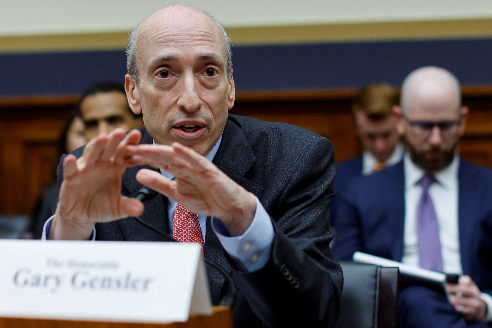

## Table of Contents

## Who is Gary Gensler?

Gary Gensler is the head of the U.S. Securities and Exchange Commission (SEC). He started this job in April 2021. The SEC is a government group that makes sure companies and people follow rules about buying and selling stocks and other investments. Before leading the SEC, Gensler worked in the government during the time when Barack Obama was President. He also taught at MIT, a famous school.

Gensler is known for being very strict about rules. He wants to make sure that the stock market is fair and safe for everyone. He has worked on new rules to stop people from cheating in the market. Some people think his rules are too tough, but others believe they are needed to keep the market honest.

## What is Gary Gensler's educational background?

Gary Gensler went to college at the University of Pennsylvania. He studied economics there and got his bachelor's degree. After that, he decided to go to law school at the same university. He worked hard and got his law degree too.

After finishing law school, Gensler wanted to learn even more. He went to the John F. Kennedy School of Government at Harvard University. There, he studied for a Master's degree in public administration. This helped him understand how to work in government and make good policies.

## What positions did Gary Gensler hold before becoming the SEC Chairman?

Before becoming the SEC Chairman, Gary Gensler had many important jobs. He worked in the government during President Bill Clinton's time. He was the Assistant Secretary of the Treasury for Financial Markets. In this job, he helped make rules about money and markets. After that, he worked for President Barack Obama. He was the head of the Commodity Futures Trading Commission (CFTC). This group makes sure that trading in things like oil and wheat is fair.

After his government jobs, Gensler went to teach at MIT. He was a professor there and taught people about finance and technology. He also worked in the private sector. He was a partner at Goldman Sachs, a big bank. There, he helped companies with their money and investments. These experiences helped him understand both the government and business sides of finance.

## When was Gary Gensler appointed as the Chairman of the U.S. Securities and Exchange Commission?

Gary Gensler was appointed as the Chairman of the U.S. Securities and Exchange Commission in April 2021. Before this, he had a lot of experience in government and finance. He worked in the government during the times of Presidents Bill Clinton and Barack Obama. He also taught at MIT and worked at Goldman Sachs.

As the SEC Chairman, Gensler is in charge of making sure that the stock market is fair and safe. He wants to stop people from cheating and make new rules to protect investors. Some people think his rules are too strict, but others believe they are necessary to keep the market honest.

## What are the main responsibilities of the SEC Chairman?

The main job of the SEC Chairman is to lead the U.S. Securities and Exchange Commission. This group makes sure that the stock market is fair and safe for everyone. The Chairman helps make new rules and decides how to enforce them. They also work with other government groups to protect people who invest their money in stocks and other things.

Another big part of the job is to keep an eye on the market and stop people from cheating. The Chairman has to make sure that companies tell the truth about their business and money. If someone breaks the rules, the Chairman can start investigations and take them to court. This helps keep the market honest and makes people trust it more.

## What major policy initiatives has Gary Gensler pursued as SEC Chairman?

As SEC Chairman, Gary Gensler has worked on many important policy ideas. One big thing he has done is try to make rules about how companies tell people about their business. He wants companies to be more honest and clear about what they do and how much money they make. This helps people who want to invest their money know if a company is a good choice. Gensler also wants to make sure that the stock market is fair for everyone. He has worked on rules to stop people from cheating in the market, like using secret information to make money.

Another big thing Gensler has done is focus on new technology in the market. He has looked at how people use things like cryptocurrencies and wants to make rules to keep them safe. He thinks these new technologies can be good, but they also need to be watched to stop bad things from happening. Gensler also wants to make sure that the rules are the same for everyone, no matter how big or small a company is. This helps keep the market fair and stops big companies from having too much power.

## How has Gary Gensler's leadership impacted the cryptocurrency industry?

Gary Gensler, as the head of the SEC, has had a big effect on the [cryptocurrency](/wiki/cryptocurrency) world. He thinks that cryptocurrencies need to follow the same rules as other investments to keep them safe and fair. He has said that many cryptocurrencies might be seen as securities, which means they have to follow strict rules. This has made people in the crypto industry worried because it could mean more rules and checks on what they do.

Gensler has also pushed for more rules about how crypto companies tell people about their business. He wants them to be clear about what they do and how they make money. This is to protect people who want to invest in cryptocurrencies. Some people in the crypto world think Gensler's rules are too tough, but others believe they are needed to stop cheating and make the market safer for everyone.

## What are Gary Gensler's views on financial regulation and investor protection?

Gary Gensler believes strongly in having strict rules to make sure the financial markets are fair and safe. He thinks that rules are important to stop people from cheating and to protect people who invest their money. Gensler wants companies to be honest and clear about their business and money. He thinks this helps people make better choices about where to invest their money. He also wants to make sure that the rules are the same for everyone, no matter how big or small a company is. This helps keep the market fair and stops big companies from having too much power.

Gensler is also focused on new technology in the market, like cryptocurrencies. He thinks these new technologies can be good, but they need to follow the same rules as other investments to keep them safe. He wants to make sure that people who invest in cryptocurrencies are protected and that the market is fair. Some people in the crypto world think Gensler's rules are too tough, but he believes they are needed to stop cheating and make the market safer for everyone.

## How does Gary Gensler's approach to regulation differ from his predecessors?

Gary Gensler's approach to regulation is seen as more strict than many of his predecessors. He believes strongly in making rules to stop cheating and protect people who invest their money. He wants companies to be very clear about their business and how much money they make. This is different from some past SEC leaders who might have been less strict about making new rules or enforcing them. Gensler also focuses a lot on new technology, like cryptocurrencies, and wants to make sure they follow the same rules as other investments.

Another way Gensler's approach differs is in his focus on making the market fair for everyone. He wants to make sure that the rules are the same for big and small companies. This is different from some past leaders who might have let big companies have more power. Gensler also works hard to stop people from using secret information to make money in the market. His strict rules and focus on fairness have made some people in the financial world unhappy, but he believes they are needed to keep the market safe and honest.

## What challenges has Gary Gensler faced during his tenure as SEC Chairman?

Gary Gensler has faced many challenges as the SEC Chairman. One big challenge is dealing with new technology like cryptocurrencies. Many people in the crypto world think his rules are too tough. They worry that strict rules could slow down the growth of cryptocurrencies. Gensler wants to make sure that these new technologies are safe and fair for everyone, but it's hard to find the right balance between rules and letting new ideas grow.

Another challenge is making sure that the rules are the same for all companies, no matter how big or small they are. Some big companies don't like Gensler's strict rules because they think it limits their power. They might try to fight against these rules. Gensler also has to deal with people who want to use secret information to make money in the market. He works hard to stop this kind of cheating, but it's a big job to keep the market fair and honest for everyone.

## How has Gary Gensler's background in finance and academia influenced his regulatory strategies?

Gary Gensler's background in finance and academia has greatly shaped his approach to regulating the financial markets. His time at Goldman Sachs gave him a deep understanding of how big banks and financial companies work. This experience helps him see the tricks that big companies might use to bend the rules. Because of this, Gensler wants to make sure that the rules are strict and the same for everyone, no matter the size of the company. He believes that this is the only way to keep the market fair and stop big companies from having too much power.

His time teaching at MIT also plays a big role in his strategies. As a professor, Gensler learned how to think about big ideas and new technologies. This has made him very interested in things like cryptocurrencies and how they can change the financial world. He wants to make rules that keep these new technologies safe but also let them grow. His academic background helps him see the big picture and make rules that protect investors while still allowing for innovation in the market.

## What are the future goals and directions that Gary Gensler has set for the SEC?

Gary Gensler has set some big goals for the SEC. He wants to make sure that the stock market is fair and safe for everyone. He believes in making strict rules to stop people from cheating and to protect people who invest their money. Gensler also wants companies to be very clear about their business and how much money they make. This helps people make better choices about where to put their money. He thinks that the rules should be the same for all companies, no matter how big or small they are. This way, big companies can't have too much power over the market.

Another important direction for Gensler is to keep up with new technology. He is very interested in things like cryptocurrencies and wants to make sure they follow the same rules as other investments. This is to keep them safe and fair for everyone. Gensler also wants to make sure that the SEC can change and grow with the market. He believes that by staying ahead of new ideas and technologies, the SEC can better protect investors and keep the market honest.

## References & Further Reading

[1]: ["The Great Reversal: How America Gave Up on Free Markets"](https://www.amazon.com/Great-Reversal-America-Gave-Markets/dp/0674237544) by Thomas Philippon

[2]: Liebau, Johann. ["Regulating High Frequency Trading: An Examination of European, U.S. and Asian Approaches."](https://egrove.olemiss.edu/cgi/viewcontent.cgi?article=1967&context=hon_thesis)  Springer Gabler, 2018.

[3]: ["Dark Pools: The Rise of the Machine Traders and the Rigging of the U.S. Stock Market"](https://www.amazon.com/Dark-Pools-Machine-Traders-Rigging/dp/0307887189) by Scott Patterson

[4]: ["Flash Boys: A Wall Street Revolt"](https://en.wikipedia.org/wiki/Flash_Boys) by Michael Lewis

[5]: Easley, D., Lopez de Prado, M. M., & O'Hara, M. ["The Microstructure of the 'Flash Crash': Flow Toxicity, Liquidity Crashes and the Probability of Informed Trading."](https://www.jstor.org/stable/41485533)  Review of Financial Studies, 2012.