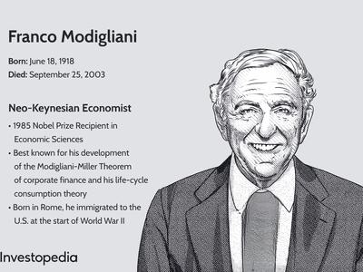

Gary S. Becker stands out as a pivotal figure in the field of economics, renowned for broadening the scope of economic analysis by applying economic theories to a variety of social issues. His groundbreaking work reshaped traditional economic boundaries, bringing economic insights to domains such as crime, family dynamics, education, and discrimination. By emphasizing the economic approach to understanding human behavior, Becker expanded the perception of what economics can address, thereby influencing both theoretical approaches and practical policy making globally.

One of Becker's most notable contributions is his development of the concept of human capital. By treating education and training as investments that can yield economic returns, Becker provided valuable insights into the role of personal skills and knowledge in fostering economic growth and personal income. His work on the economics of discrimination also offered influential analyses on how prejudice affects economic outcomes, thus enhancing the understanding of labor market dynamics and inequalities.



The relevance of Becker's theories extends to modern technologies and methodologies, including algorithmic trading, which relies on models of rational choice and economic behavior—central themes in Becker's work. Algorithmic trading, the process of using computer algorithms to execute trades automatically based on pre-designed criteria, benefits from understanding the fundamental economic principles of rationality, incentives, and market behavior as articulated by Becker.

This article will explore Becker's life and legacy, tracing his journey from his formative years and education to his illustrious career and contributions to economics. It will also discuss the recognition and awards he received, evidence of his substantial influence on the field. Furthermore, the article will examine the connections between Becker's economic theories and modern financial practices, particularly algorithmic trading, highlighting the ongoing relevance of his insights in addressing new economic challenges. Ultimately, the aim is to underscore the enduring impact of Gary S. Becker's monumental contributions to the field of economics and their application in contemporary financial markets.

## Table of Contents

## Early Life and Education

Gary S. Becker, an influential economist known for his unconventional application of economic theories to various social issues, was born on December 2, 1930, in Pottsville, Pennsylvania, USA. His early life was marked by a strong academic inclination and a supportive family environment that encouraged intellectual pursuits. His parents, of Jewish descent, emphasized the value of education, which played a crucial role in shaping his early aspirations.

Becker's interest in economics was sparked during his undergraduate years at Princeton University, where he initially intended to major in mathematics. However, inspired by a lecture given by economist Jacob Viner in an introductory economics [course](/wiki/best-algorithmic-trading-courses), Becker decided to shift his focus to economics. He graduated summa cum laude from Princeton in 1951 with a Bachelor of Arts degree in Economics.

Becker furthered his academic journey at the University of Chicago, one of the most prestigious institutions for economics. Here, he completed his Ph.D. in Economics in 1955 under the mentorship of Milton Friedman and Gregg Lewis. His doctoral dissertation, which laid the groundwork for his later work on the economics of discrimination, introduced innovative analytical techniques that applied economic reasoning to social and behavioral issues. This work marked the beginning of Becker's pioneering approach to economic analysis, challenging traditional boundaries and influencing future research across various disciplines.

Throughout his academic career, Becker's formative education at these distinguished institutions provided a robust foundation for his theoretical and empirical explorations. His experiences at Princeton and Chicago, combined with the intellectual stimulation provided by influential economists such as Friedman, crafted a career that expanded the scope of economic inquiry to encompass areas like human capital, crime, family behavior, and addiction. These contributions have left an indelible mark on economic thought, demonstrating the profound impact of Becker's early educational experiences on his groundbreaking work.

## Career and Contributions to Economics

Gary S. Becker was a transformative figure in economics, fundamentally changing how the field interprets human behavior and social issues. His work transcended traditional economic boundaries, applying economic analysis to areas previously considered the domain of sociology and anthropology.

One of Becker's seminal contributions was his theory of human capital. He posited that investments in education, training, and health could enhance the productivity of individuals much like capital investments in machinery boost a factory's output. This idea, outlined in his groundbreaking 1964 book, "Human Capital," provided a framework for understanding the economic returns on education and skill acquisition. Through this lens, Becker illustrated that the accumulation of knowledge and skills is analogous to investing in physical capital, enhancing individual economic value and contributing to broader economic growth.

Another cornerstone of Becker’s work was his analysis of discrimination from an economic perspective. In his 1957 book, "The Economics of Discrimination," Becker explored how discrimination impacts the allocation of resources in labor markets. He applied economic theory to understand how prejudice and preference differentials create inefficiencies and affect wages and employment opportunities. By modeling these behaviors, Becker illustrated that discrimination imposes costs not only on those discriminated against but also on employers and the economy as a whole by leading to suboptimal resource allocation.

Becker's approach was unconventional in that he extended economic theory to analyze a wide range of social problems. His work on the family, crime, addiction, and even the decision-making processes behind altruism and marriage, transformed these subjects into objects of rigorous economic inquiry. For instance, in "A Treatise on the Family," Becker employed economic principles to study family dynamics, asserting that family structure and behavior can be understood as a series of rational choices aimed at maximizing utility under constraints. 

His analysis of crime demonstrated how economic principles could be used to model criminal behavior and inform public policy. Becker proposed that crime could be interpreted as a rational choice where individuals weigh the benefits against the costs (including the probability of apprehension and punishment). This model not only provided insight into criminal behavior but also influenced law enforcement and policy-making studies.

Becker’s pioneering expansions of economic theory into these non-market domains showcased his belief in the universality of economic principles. By using economics as a tool for understanding diverse aspects of human behavior and social interactions, he broke down barriers between disciplines, cultivating new fields of study such as the economics of education, crime, and family life. His work has enabled economists to apply analytical precision to complex societal issues, broadening the scope and impact of the discipline.

## Recognition and Awards

Gary S. Becker has been recognized with numerous prestigious awards and honors for his groundbreaking work in economics. A culminating point in his career was being awarded the Nobel Memorial Prize in Economic Sciences in 1992. The Nobel Committee recognized Becker for his extensive research which enlarged the scope of microeconomic analysis to a wide range of human behavior and interaction, including those previously considered marginal within economics, such as the family, human capital, and discrimination. This recognition highlighted the transformative nature of his work, which challenged and expanded traditional economic perspectives.

In addition to the Nobel Prize, Becker received several other accolades that underscore his pivotal role in the discipline. For instance, he was awarded the John Bates Clark Medal in 1967, one of the most prestigious awards given by the American Economic Association to promising economists under the age of 40. This award acknowledged Becker's influential research and potential for future contributions.

Becker's achievements have garnered recognition far beyond the field of economics. In 2000, he was presented with the National Medal of Science, the highest scientific honor in the United States, further underscoring the interdisciplinary impact and broad acceptance of his innovative work across various fields of study and practice.

Globally, Becker's ideas and theories have left an indelible mark on the evolution of economic thought. His unconventional application of economic reasoning to social issues has encouraged economists and policymakers worldwide to adopt more comprehensive approaches when analyzing human behavior. This broader application of economic principles has catalyzed the development of fields such as behavioral economics and has substantially influenced policy-making and research methods.

Becker's award-winning work continues to resonate today, demonstrating the enduring impact of his contributions. His recognition by global entities highlights the significance of his theories in transcending traditional economic boundaries and directly influencing both academic and practical applications across numerous disciplines.

## Gary S. Becker's Legacy and Influence

Gary S. Becker's work in economics has left a profound and lasting legacy that extends beyond traditional economic theory, influencing contemporary thought, policy, and applications in various fields. His approach of integrating economic principles with social sciences has reshaped the way economic phenomena are understood, leading to a more comprehensive analysis of human behavior and social structures.

Becker's pioneering work on human capital set a new standard for considering education, training, and health as critical components of an individual's economic potential. This concept has become fundamental in labor economics and has informed numerous policy decisions worldwide. Governments and organizations utilize these insights to develop strategies that maximize educational and skill-based returns, aiming to improve labor productivity and economic growth. The use of human capital theory is evident in policies focusing on education reform, training programs, and even health care, which are viewed as investments in the workforce rather than mere expenditures.

Moreover, Becker's analysis of the economics of discrimination provided a structured approach to understanding how biases and prejudices can perpetuate inefficient market outcomes. His framework has been instrumental in shaping policies aimed at reducing discrimination in labor markets and beyond, highlighting the economic losses borne from unequal treatment. This perspective continues to inform anti-discrimination laws and policies by demonstrating the tangible economic benefits of diversity and inclusion.

Becker’s extension of economic analysis to areas traditionally considered outside the purview of economics, such as crime, family, and addiction, has significantly broadened the scope of economic research and its applicability to real-world issues. His application of rational choice theory to understand crime and individual deviance, for example, offers insights into the cost-benefit calculations that individuals might make when engaging in illegal activities. This approach has influenced both criminology and public policy, providing a basis for policies like tougher law enforcement and crime prevention strategies that consider economic incentives.

In academia, Becker's legacy is marked by a generation of economists who have built upon his theories, extending economic analysis to diverse domains, thus establishing new research fields. His theoretical models have inspired a plethora of empirical studies that employ rigorous testing of economic hypotheses, enhancing the discipline's empirical foundation.

Becker’s influence is also evident in the development of behavioral economics, which blends his theories with psychological insights to better understand how real-world decisions diverge from those predicted by classical economic theory. This has propelled forward-thinking models that account for irrational behaviors, improving the predictive power of economic models used in various sectors, including finance and policy-making.

In summary, Gary S. Becker's legacy endures through the pervasive application of his theories in contemporary economic thought and policy. His holistic view of economic behavior, encompassing both monetary and non-monetary factors, continues to guide economic theory's evolution, with significant implications for the formulation and implementation of policies across the globe.

## Algorithmic Trading and Economic Theories

Algorithmic trading uses complex mathematical models and high-speed data processing to execute financial transactions. It represents a significant transformation in financial markets, allowing for the automation of trading strategies that respond to changes in market conditions almost instantaneously. The primary role of [algorithmic trading](/wiki/algorithmic-trading) is to leverage computational tools to enhance trading efficiency, reduce transactional costs, and improve market [liquidity](/wiki/liquidity-risk-premium).

Economic theories play a crucial role in shaping algorithmic trading strategies. Among these theories, the Efficient Market Hypothesis (EMH), which posits that asset prices reflect all available information, fundamentally influences algorithmic models. Algorithms are often designed to exploit perceived inefficiencies or temporary price anomalies, aligning with the notion that rational behavior drives market equilibria.

Gary S. Becker’s contributions to economic theory provide valuable insights applicable to algorithmic trading. His work on rational choice theory, which examines how individuals make decisions that maximize utility, offers foundational principles for developing trading algorithms. At the core of algorithmic trading is the assumption of rational behavior, as algorithms are programmed to make optimal decisions based on available data and predetermined criteria.

Becker's focus on economic behavior extends to considerations of incentives and market dynamics—core aspects that algorithms must account for when assessing market movements and potential trades. For example, algorithms might incorporate predictive modeling based on rational choice, evaluating how new information might influence the decisions of market participants and thus, future price movements.

In summary, while algorithmic trading is deeply rooted in technological advancements, its strategic structure owes much to foundational economic theories. By integrating principles of rational choice and market behavior, embodied in Becker's work, these algorithms strive to predict and react to market shifts in a methodical, efficient manner.

## Connecting Becker's Theories to Modern Financial Practices

Gary S. Becker’s pioneering work in economics, particularly his exploration of rational behavior, incentives, and markets, has relevance in the context of modern financial practices, such as algorithmic trading. Becker's approach to economic theory, which frequently involved applying the principles of individual optimization and rational choice theory to social issues, serves as a foundational framework for understanding economic decision-making—a key component of algorithmic trading strategies.

At its core, algorithmic trading relies on the premise that financial markets reflect rational behavior and that participants react to incentives in predictable ways. This aligns closely with Becker's theories. Traders use algorithms to automate the decision-making process in buying and selling financial assets, employing economic principles to anticipate market movements. For instance, Becker's emphasis on rational choice underscores the importance of designing algorithms that are efficient and logical in processing vast amounts of data to predict asset price movements. These algorithms are crafted by understanding how individuals, or market participants, respond to changing incentives, such as price shifts or [interest rate](/wiki/interest-rate-trading-strategies) changes.

Moreover, Becker’s analysis of market efficiencies suggests that markets operate efficiently when participants optimize their decisions based on available information. This idea is directly applied in algorithmic trading, where algorithms exploit temporary inefficiencies in the market to make profitable trades. The algorithms are designed to recognize and adapt to patterns created by economic incentives and rational choices, occasionally predicting shifts faster than human traders could.

Economic behavior under uncertainty, another area where Becker’s theories apply, is intrinsic to financial markets and algorithmic decision-making. When creating algorithms, developers account for the uncertainty and behavioral responses to risk. This involves crafting models that simulate various market scenarios and stress-testing algorithms to predict their performance under different market conditions. The algorithms leverage statistical and [machine learning](/wiki/machine-learning) models to assess the probability of market movements and make decisions based on calculated risk and expected returns, reflecting Becker’s approach to rational economic behavior.

In practical terms, this connection to Becker's theories might manifest in the following simple Python algorithmic strategy, leveraging basic economic principles:

```python
import numpy as np

def trading_signal(price_data, moving_average_period):
    """
    Generates a buy/sell signal based on moving average strategy.

    Parameters:
    - price_data: list of historical price points
    - moving_average_period: integer representing the period of moving average

    Returns:
    - 'buy', 'sell', or 'hold' as a trading signal
    """
    moving_average = np.mean(price_data[-moving_average_period:])

    if price_data[-1] > moving_average:
        return 'buy'
    elif price_data[-1] < moving_average:
        return 'sell'
    else:
        return 'hold'

# Example usage
historical_prices = [100, 102, 105, 110, 108, 107, 111, 115]
signal = trading_signal(historical_prices, 5)
print(f"Trading Signal: {signal}")
```

In this simplified example, the algorithm analyzes past price data to generate a buy or sell signal based on moving averages, reflecting a fundamental economic principle of identifying trends and capitalizing on expected movements—a concept deeply rooted in Becker’s rational choice theory.

The implications of Gary S. Becker's work in modern financial practices underscore the integration of economic theory with technical advances, enabling the development of sophisticated algorithms. These utilize fundamental economic principles to navigate the complexities of financial markets, continuing Becker's legacy of applying economic theory to diverse real-world challenges.

## Conclusion

Gary S. Becker has indelibly shaped the landscape of contemporary economics by broadening its scope to encompass diverse social issues. His groundbreaking work challenged traditional boundaries and established economics as a tool for analyzing a wide array of human behaviors and societal problems. Central to his legacy is the development of theories concerning human capital and the economic dimensions of family dynamics and discrimination, which have continued to influence economic thought and policy.

A significant link between Becker's theories and modern algorithmic trading lies in their shared foundation on rational choice and economic behavior analysis. Becker's work emphasized how individuals respond to incentives—a principle that stands at the core of economic modeling and strategy design used in algorithmic trading systems. Algorithmic trading relies on sophisticated models that aim to predict market movements and optimize trades, emulating rational decision-making processes. By applying theories of human behavior and market incentives, algorithmic trading systems can be designed to anticipate market trends and respond appropriately, thereby realizing enhanced financial performance.

Becker's focus on rational behavior and incentives provides a foundation for algorithms that aim to forecast and capitalize on market dynamics. This connection underscores the modern relevance and application of his economic insights, which continue to guide the way we approach complex decision-making in financial markets.

In summary, Gary S. Becker's contributions to economic theory have had a lasting impact on both academic study and practical applications in economics. His work offers a rich framework that continues to inform not only economic policy but also innovative financial technologies such as algorithmic trading. His ability to apply economic reasoning to social issues has provided invaluable insights and tools that remain pertinent in addressing the complexities of modern economies. As such, his legacy endures in both theoretical advancements and practical implementations, affirming the profound impact of his work in shaping economic discourse and practice.

## References

1. Becker, G. S. (1964). *Human Capital: A Theoretical and Empirical Analysis, with Special Reference to Education*. University of Chicago Press. This seminal work laid the foundation for the area of human capital, exploring the economic value of investing in education and training.

2. Becker, G. S. (1971). *The Economics of Discrimination*. University of Chicago Press. An influential study that extended economic analysis to social issues, examining the impacts of discrimination on markets and individuals.

3. Becker, G. S. (1993). *Nobel Lecture: The Economic Way of Looking at Behavior*. Journal of Political Economy, 101(3), 385-409. This lecture encapsulates Becker's approach to economics, emphasizing the application of economic theory to a wide array of societal behaviors.

4. Lucas, R. E. (Development Editor), & Phelps, E. S. (Development Editor) (1976). *Studies in Labor Markets*. University of Chicago Press. This collection includes important contributions to labor market theory, influenced by Becker's work on human capital.

5. Friedman, M & Friedman, R. D. (1998). *Two Lucky People: Memoirs*. University of Chicago Press. A memoir that provides context on the intellectual environment at the University of Chicago, where Becker made many of his influential contributions.

6. Hasbrouck, J. (2007). *Empirical Market Microstructure: The Institutions, Economics, and Econometrics of Securities Trading*. Oxford University Press. Explores the economic theories underpinning market microstructure and how they relate to algorithmic trading.

7. Aldridge, I. (2009). *High-Frequency Trading: A Practical Guide to Algorithmic Strategies and Trading Systems*. Wiley. A comprehensive guide on algorithmic trading, providing insights into the practical applications of economic theories in trading algorithms.

8. Agrawal, D. S., & Jha, N. K. (2009). *Design and Optimization of Reliable and Efficient Networks on Chips*. Springer. While peripheral, this resource discusses the algorithms that can be indirectly informed by economic principles, including areas like optimization and efficiency.

9. LeBaron, B. (2001). *Empirical Regularities from Interacting Long- and Short-Memory Investors in an Agent-Based Stock Market*. IEEE Transactions on Evolutionary Computation, 5(5), 442-455. Discusses algorithmic trading models, linking economic behavior to market dynamics.

10. Simon, H. A. (1955). *A Behavioral Model of Rational Choice*. The Quarterly Journal of Economics, 69(1), 99-118. Provides foundational insight into rational choice theory, relevant to the development of algorithms aligned with economic rationale.

These references cover a range of topics integral to Becker's work and its broader implications in economic theory, highlighting connections to modern practices like algorithmic trading.

## References & Further Reading

[1]: Becker, G. S. (1964). ["Human Capital: A Theoretical and Empirical Analysis, with Special Reference to Education"](https://papers.ssrn.com/sol3/papers.cfm?abstract_id=1496221). University of Chicago Press.

[2]: Becker, G. S. (1971). ["The Economics of Discrimination"](https://press.uchicago.edu/ucp/books/book/chicago/E/bo22415931.html). University of Chicago Press.

[3]: Becker, G. S. (1993). ["Nobel Lecture: The Economic Way of Looking at Behavior"](https://www.jstor.org/stable/2138769). Journal of Political Economy, 101(3), 385-409.

[4]: Hasbrouck, J. (2007). ["Empirical Market Microstructure: The Institutions, Economics, and Econometrics of Securities Trading"](https://academic.oup.com/book/52241). Oxford University Press.

[5]: Aldridge, I. (2009). ["High-Frequency Trading: A Practical Guide to Algorithmic Strategies and Trading Systems"](https://www.ahmetbeyefendi.com/wp-content/uploads/2020/07/High-Frequency-Trading-Irene-Aldridge.pdf). Wiley.

[6]: Simon, H. A. (1955). ["A Behavioral Model of Rational Choice"](https://www.jstor.org/stable/1884852). The Quarterly Journal of Economics, 69(1), 99-118.