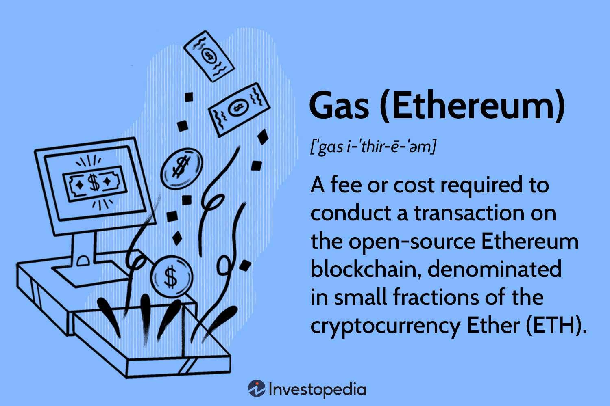

The Ethereum blockchain stands as a pivotal platform in the expansion of decentralized finance (DeFi) and applications, providing a foundation for innovative financial ecosystems. However, a notable challenge that users frequently encounter is the management of transaction costs, referred to as gas fees. These fees are essential for conducting transactions and executing smart contracts on the Ethereum network but can fluctuate significantly due to varying demand and network congestion.

To address these challenges, automated trading, or algorithmic trading, is being increasingly utilized. Algorithmic trading involves the use of automated software to execute trades based on pre-defined criteria, allowing for precise and strategic decision-making. This approach offers innovative methods to manage and optimize Ethereum gas fees, potentially reducing costs and enhancing transaction efficiency. By executing transactions at optimal times, algorithmic trading can minimize exposure to high gas fees, thus allowing traders to operate more effectively within the financial structure of Ethereum.



This article will examine the relationship between Ethereum's gas fees and algorithmic trading, providing insights into how this combination can lead to more cost-effective transactions. Through understanding the mechanics of gas fees and leveraging algorithmic techniques, traders and developers can potentially mitigate costs, optimizing their engagement with Ethereum's dynamic landscape.

## Table of Contents

## Understanding Ethereum Gas Fees

Gas fees are crucial components of the Ethereum network, functioning as transaction costs that users must pay to execute transactions and smart contracts. These fees act as incentives for miners—now validators following Ethereum's transition to Proof of Stake—to process and validate transactions. Gas fees are essential to secure the network and have a profound impact on the efficiency and cost-effectiveness of executing trades on the Ethereum blockchain.

The primary factors influencing gas fees include supply and demand dynamics, as well as overall network conditions. When network activity is high, the demand for transaction processing increases, leading to higher gas prices. Conversely, during periods of low activity, gas prices tend to decrease. This variability can significantly affect the cost structure of decentralized applications and transactions, making gas fees a key consideration for users and developers.

Gas fees are denominated in gwei, a subunit of ether (ETH), Ethereum's native [cryptocurrency](/wiki/cryptocurrency). Specifically, one ether equals one billion gwei (1 ETH = 1,000,000,000 gwei). This standard allows for gas fees to be expressed in smaller, more manageable numbers, easing calculations and making transaction costs more comprehensible to users.

The calculation of transaction costs on Ethereum involves multiplying the gas limit, which represents the maximum amount of computational effort the user is willing to pay for, by the gas price, which is how much the user is willing to pay per unit of gas in gwei. Mathematically, this is expressed as:

$$
\text{Transaction Cost} = \text{Gas Limit} \times \text{Gas Price}
$$

The complexity of Ethereum transactions requires careful management of gas fees to ensure cost-efficiency. Traders, developers, and end-users often need to consider the trade-off between speed and cost, as paying a higher gas price typically results in faster transaction processing.

Understanding the dynamics of gas fees on the Ethereum network is fundamental for participants in the blockchain ecosystem. It allows for more strategic decisions in transaction execution, optimizing for both cost and performance. As Ethereum continues to evolve, so too does the landscape of its transaction costs, mandating constant adaptation and awareness from network users.

## The Role of Algorithmic Trading

Algorithmic trading employs sophisticated automated software systems to execute trades based on predefined rules and algorithms. This automation allows for trades to be carried out at optimal times and prices by analyzing various market conditions, such as price levels, [volatility](/wiki/volatility-trading-strategies), and trading volumes. In the Ethereum network, these systems can be particularly advantageous for managing gas fees.

Ethereum, as a decentralized platform, experiences variable network traffic, leading to fluctuating gas prices. Algorithmic trading can effectively minimize gas fees by scheduling transactions during periods of lower network congestion. For instance, gas fees tend to be higher during times of high demand when many users are trying to execute transactions and run smart contracts. By identifying patterns in network traffic, algorithmic systems can optimize the timing of transactions, thus reducing cost overhead.

The implementation of such strategies is facilitated by continuously monitoring gas prices, which are expressed in gwei. By using data analytics to predict times of lower gas prices, algorithms can strategically place transactions in less busy periods. This can be compared to a simple Python script utilizing the `web3.py` library to fetch and analyze current and historical gas data to determine optimal transaction windows:

```python
from web3 import Web3
import time

def check_gas_price():
    # Connect to an Ethereum node
    infura_url = 'https://mainnet.infura.io/v3/YOUR_INFURA_PROJECT_ID'
    web3 = Web3(Web3.HTTPProvider(infura_url))

    # Fetch current gas price
    current_gas_price = web3.eth.gas_price
    return current_gas_price

def execute_trade():
    # Simulate a trade execution
    print("Executing trade at optimal gas price")

def main():
    while True:
        gas_price = check_gas_price()
        # Assume 20 gwei is the threshold for a cost-effective trade
        if gas_price <= Web3.toWei(20, 'gwei'):
            execute_trade()
        else:
            print(f"Current gas price is {Web3.fromWei(gas_price, 'gwei')} gwei, not optimal.")

        # Check every 15 seconds
        time.sleep(15)

if __name__ == "__main__":
    main()
```

The use of [algorithmic trading](/wiki/algorithmic-trading) aims not only to reduce costs but also to enhance overall trading efficiency. By ensuring transactions are executed at the most favorable times, traders can improve their operational margins. This is crucial for high-frequency trading strategies where even minor savings on operational costs can translate to significant profit.

Moreover, algorithmic trading systems can adjust strategies based on real-time data, adapting to evolving market conditions and fee structures. For businesses and individual traders alike, utilizing algorithmic trading to manage Ethereum transactions can lead to more robust trading strategies and reduced vulnerability to volatile fee environments. This technological advancement represents a significant step forward in achieving cost-effective trading on decentralized platforms.

## Impact of Ethereum Upgrades on Gas Fees

Ethereum's evolution via network upgrades has significantly impacted its gas fee structure, seeking to address issues such as scalability and network congestion. The transition from Proof of Work (PoW) to Proof of Stake (PoS) marks a pivotal upgrade that aims to enhance the efficiency and environmental sustainability of the Ethereum network. By reducing the competition among miners and eliminating the energy-intensive mining process, PoS is expected to decrease network congestion, thereby influencing gas fee dynamics. However, its effect on actual fee reduction remains a subject of ongoing evaluation, as it primarily focuses on network scalability and security.

One of the most noteworthy upgrades, Ethereum Improvement Proposal 1559 (EIP-1559), introduced a new transaction pricing mechanism known as the base fee model. This model fundamentally shifts how gas fees are determined by incorporating a variable base fee that adjusts according to network demand. Each transaction includes this base fee, which is burned, and an optional priority fee (or "tip") that incentivizes miners. The base fee increases when the network is congested and decreases when it is underutilized. This approach enhances the predictability of fees, allowing users to estimate transaction costs more accurately. Nonetheless, it does not inherently lower the overall transaction fees, as fluctuations in base fees are tied directly to network demand.

These upgrades necessitate that algorithmic trading strategies adapt to the evolving fee structures. Traders utilizing automated systems must account for the dynamic nature of gas fees introduced by mechanisms such as EIP-1559. For instance, algorithmic strategies might integrate real-time analysis of network conditions to optimize transaction timing, thereby reducing costs. Moreover, adjusting trade algorithms to accommodate the base fee fluctuations can help maintain trading profitability amidst unpredictable network activity.

The adaptation to these new structures represents a crucial consideration for algorithmic traders, who must continuously refine their strategies to align with the underlying changes in Ethereum's protocol. By staying updated with network upgrades and incorporating these insights into their algorithms, traders can enhance their operational efficiency and mitigate the impact of gas fee volatility on their cost structures.

## Strategies for Gas Fee Optimization

Timing trades to coincide with off-peak network hours can significantly reduce Ethereum gas costs. Algorithmic trading systems are particularly well-suited to leverage these price fluctuations by automatically identifying and executing trades during periods of lower network congestion. During times of high network activity, gas prices often spike; conversely, executing trades during quieter periods can result in substantial cost savings. Leveraging algorithms to track and predict traffic patterns helps ensure that transactions are processed when fees are at their lowest.

Layer 2 solutions, such as Arbitrum and Optimism, present another effective method for optimizing gas fees. These platforms work by conducting transactions off the main Ethereum blockchain while preserving the underlying network's security and decentralization. Moving some transactions away from the Ethereum mainnet alleviates congestion and reduces individual transaction fees. Arbitrum and Optimism utilize rollups, a scaling solution that batches multiple transactions together, executing them in a single batch rather than individually. This process not only speeds up transaction times but also dramatically cuts costs.

Another powerful strategy for gas fee optimization involves maximizing transaction efficiency through batching and using optimal fee estimation tools. Batching refers to the aggregation of multiple transactions into a single operation. By doing so, users minimize the total gas fees necessary for processing separate transactions. This aggregation approach is especially useful for platforms handling numerous micro-transactions.

Optimal fee estimation tools are indispensable for setting precise gas fees tailored to current network conditions. These tools analyze the real-time state of the network to suggest the most cost-effective fees that ensure timely and economical transaction execution. Python scripts, for example, can interface with Ethereum analytics platforms to fetch live data and estimate appropriate gas fees. Here is an example of a simplified script using the `web3.py` library to estimate gas costs:

```python
from web3 import Web3
import requests

def estimate_gas_fee():
    # Initialize a Web3 provider
    infura_url = 'https://mainnet.infura.io/v3/YOUR_INFURA_PROJECT_ID'
    w3 = Web3(Web3.HTTPProvider(infura_url))

    # Fetch current gas price data
    eth_gas_station_url = 'https://ethgasstation.info/api/ethgasAPI.json'
    response = requests.get(eth_gas_station_url)
    gas_data = response.json()

    # Recommended safe low gas price in gwei (convert to wei)
    safe_low_price_gwei = gas_data['safeLow'] / 10
    safe_low_price_wei = Web3.toWei(safe_low_price_gwei, 'gwei')

    return safe_low_price_wei

estimated_gas_fee = estimate_gas_fee()
print(f"Estimated safe low gas fee: {estimated_gas_fee} wei")
```

By timing trades judiciously, employing Layer 2 solutions, and leveraging sophisticated fee estimation and batching techniques, traders can substantially reduce Ethereum gas fees, increasing both transactional efficiency and cost-effectiveness.

## Future Trends in Gas Fee Management

Developments in Ethereum's infrastructure and algorithmic trading are paving the way for more efficient gas fee management. One of the emerging trends is the advancement in account abstraction and paymaster services, which promise significant reductions in fee burdens. Account abstraction simplifies transaction processes by allowing the customization of transaction logic beyond the standard constraints of the Ethereum network. This means that smart contracts can perform the payment of gas fees, potentially facilitating sponsored transactions where third parties cover the costs. Such mechanisms could drastically reduce barriers to entry for users, enhancing the overall accessibility of decentralized platforms.

Another trend involves the implementation of hedging strategies to stabilize gas fees. Given the volatile nature of the Ethereum network, where gas prices fluctuate based on network demand and other factors, hedging strategies can provide users with more predictable fee structures. These strategies often involve locking in gas prices through financial derivatives or products that provide a fixed cost regardless of market shifts. By utilizing such hedging tools, traders can better manage their operational expenses and maintain consistent cost structures, aiding in long-term financial planning.

The relentless pace of innovation in blockchain technology and algorithmic trading continues to bolster these advancements. For instance, the integration of [machine learning](/wiki/machine-learning) algorithms into trading strategies allows for dynamic and adaptive approaches to gas fee management. These algorithms can analyze patterns in network congestion and predict optimal transaction times, thereby reducing costs. Additionally, as Layer 2 solutions and other scalability improvements become more prevalent, they offer alternative routes for transactions, which are generally quicker and cheaper than those processed on the main Ethereum chain.

In conclusion, the evolution of gas fee management is closely tied to advancements in Ethereum's technologies and the sophistication of trading strategies. As these areas progress, they offer promising avenues for reducing transaction costs and improving the overall efficiency of conducting trades on the Ethereum network. The simultaneous development of new blockchain infrastructure and algorithmic techniques heralds a future where gas fee management becomes increasingly streamlined and effective.

## Conclusion

Managing Ethereum gas fees effectively is crucial for traders engaged in algorithmic trading on the platform. Gas fees, serving as the transaction costs within the Ethereum network, can significantly impact the profitability of trading activities. For traders leveraging automated systems, being adept at managing these fees can translate into enhanced cost efficiency and greater financial gains.

Timing plays an essential role in reducing gas fees. By strategically scheduling transactions during periods of lower network congestion, algorithmic traders can take advantage of reduced costs. Technological advancements, such as Ethereum's recent network upgrades and the implementation of Layer 2 solutions, further enhance opportunities to decrease gas expenses. These advancements not only help streamline transaction processes but also enable traders to execute more cost-effective trades.

Strategic planning is another pivotal element. Implementing algorithms that anticipate and react to network conditions allows traders to optimize fees effectively. This proactive approach mitigates the unpredictability of gas prices, offering a more stable trading environment. Tools designed for fee estimation also contribute to achieving lower transaction costs by providing real-time insights into optimal gas pricing.

The evolving landscape of Ethereum and algorithmic trading offers exciting opportunities for those who are prepared to adapt and innovate. As Ethereum progresses, with enhancements aimed at improving scalability and reducing congestion, traders who employ these advancements will likely see substantial improvements in their trading efficiencies. Future innovations in blockchain technology are likely to present further avenues for optimizing gas fee management. Embracing these changes proactively can give traders a competitive edge, making the complex world of Ethereum trading more navigable and cost-effective.

## References & Further Reading

[1]: Wood, G. (2014). ["Ethereum: A Secure Decentralised Generalised Transaction Ledger."](https://ethereum.github.io/yellowpaper/paper.pdf) Ethereum Project Yellow Paper.

[2]: Buterin, V. (2019). ["EIP-1559: Fee market change for ETH 1.0 chain."](https://eips.ethereum.org/EIPS/eip-1559) Ethereum Improvement Proposals.

[3]: Lopez de Prado, M. (2018). ["Advances in Financial Machine Learning."](https://www.amazon.com/Advances-Financial-Machine-Learning-Marcos/dp/1119482089) John Wiley & Sons.

[4]: Harris, L. (2003). ["Trading and Exchanges: Market Microstructure for Practitioners."](https://academic.oup.com/book/52292) Oxford University Press.

[5]: Chan, E.P. (2009). ["Quantitative Trading: How to Build Your Own Algorithmic Trading Business."](https://github.com/ftvision/quant_trading_echan_book) John Wiley & Sons.

[6]: Jansen, S. (2020). ["Machine Learning for Algorithmic Trading."](https://github.com/stefan-jansen/machine-learning-for-trading) Packt Publishing.