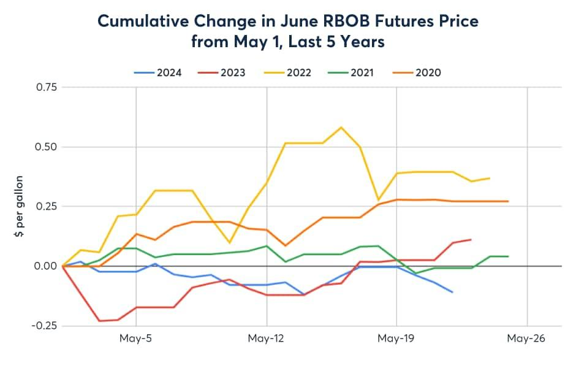

## Table of Contents

## What are gasoline futures?

Gasoline futures are contracts that allow people to buy or sell gasoline at a set price for delivery at a future date. They are traded on exchanges like the New York Mercantile Exchange (NYMEX). People use these futures to protect themselves from big changes in gasoline prices. For example, an airline might buy gasoline futures to make sure they can get fuel at a predictable price, even if the market price goes up.

These contracts are standardized, meaning everyone agrees on the amount of gasoline and the delivery date. The price of gasoline futures can change a lot because they are affected by things like oil prices, how much gasoline people are using, and what's happening in the world. Traders and companies watch these factors closely to decide when to buy or sell futures. By using gasoline futures, businesses can plan better and avoid big surprises in their costs.

## How do seasonal patterns affect gasoline futures?

Seasonal patterns can really change how gasoline futures prices move. In the summer, more people drive because of holidays and good weather, so they use more gasoline. This higher demand can push up the prices of gasoline futures. But in the winter, people usually drive less because of cold weather and fewer holidays, so the demand for gasoline goes down. This can make the prices of gasoline futures drop.

Another thing to think about is how refineries work. In the fall, refineries often do maintenance and switch to making winter blends of gasoline. This can make less gasoline available for a while, which might push up futures prices. On the other hand, in the spring, refineries start making summer blends again, and if they do this well, there might be more gasoline around, which can bring futures prices down. So, understanding these seasonal changes can help people make better choices about buying or selling gasoline futures.

## What are the key months for trading gasoline futures?

The key months for trading gasoline futures are mainly during the transition periods between seasons. From late winter to early spring, around February and March, trading can get busy. This is when refineries start to switch from making winter blends of gasoline to summer blends. The change can affect how much gasoline is available, which might make prices go up or down. People who trade futures watch this time closely to see if they can buy or sell at good prices.

Another important time is in the fall, around September and October. This is when refineries often do maintenance and switch back to making winter blends. During these months, there might be less gasoline around, which can push prices up. Traders pay attention to these months because the changes can create good chances to make money from the price movements. So, February, March, September, and October are big months for trading gasoline futures.

## How can beginners start trading gasoline futures?

To start trading gasoline futures, beginners should first learn about how these markets work. Gasoline futures are contracts you can buy or sell that let you get gasoline at a set price later on. They are traded on places like the New York Mercantile Exchange. You need to understand things like what affects gasoline prices, like how much people are using it, the time of year, and what's happening in the world. It's a good idea to read [books](/wiki/algo-trading-books), take online courses, or even talk to people who already trade to get a good grip on things.

Once you feel ready, you can start trading by opening an account with a futures broker. Make sure to pick a broker that is trusted and has good tools for trading. You'll need to put some money into your account to start trading, which is called margin. Start small, because trading futures can be risky. It's smart to practice first with a demo account where you can trade without using real money. As you get better, you can slowly start trading with real money, but always be careful and keep learning because the market can change a lot.

## What are the risks associated with trading gasoline futures?

Trading gasoline futures can be risky because prices can change a lot. Gasoline prices can go up or down quickly because of things like how much people are using it, the time of year, and big events in the world. If you guess wrong about which way the price will go, you could lose money. Also, trading futures uses something called margin, which means you only need to put down a small amount of money to trade a big contract. This can make your wins bigger, but it can also make your losses bigger if the price moves against you.

Another risk is that you might not know enough about the market. Gasoline futures can be hard to understand because there are a lot of things that affect the price. If you don't keep learning and watching the market, you might make bad choices. It's also important to have a plan for managing your risks, like setting limits on how much you're willing to lose. Without these, you could end up losing more money than you planned. So, it's really important to learn as much as you can and be careful when you start trading gasoline futures.

## How do supply and demand influence gasoline futures prices?

Supply and demand are big reasons why gasoline futures prices change. When there's more demand for gasoline, like in the summer when people drive more, the price of futures can go up. This happens because everyone wants to buy gasoline, so sellers can charge more. On the other hand, if there's less demand, like in the winter when people drive less, the price can go down because sellers have to lower their prices to sell their gasoline.

Supply also plays a big part. If something happens that makes it harder to get gasoline, like a problem at a refinery or a big storm, the supply goes down. This can make the price of gasoline futures go up because there's less gasoline to go around. But if there's a lot of gasoline available, maybe because refineries are working well or there's less demand, the price can go down. So, keeping an eye on both supply and demand helps people guess what might happen to gasoline futures prices.

## What are some common strategies for trading gasoline futures seasonally?

One common strategy for trading gasoline futures seasonally is to buy futures in the late winter or early spring, around February or March. This is when refineries start making summer blends of gasoline, and there might be less gasoline available for a while. If you think the price will go up because of this, you can buy futures at a lower price and sell them later when the price is higher. This strategy works if you guess right about the price going up because of the switch to summer blends.

Another strategy is to sell futures in the fall, around September or October. This is when refineries often do maintenance and switch to making winter blends. During this time, there might be less gasoline around, which can push prices up. If you think the price will go down after this peak, you can sell futures at a high price and buy them back later at a lower price. This strategy can make money if you're right about the price dropping after the peak in the fall.

Both of these strategies depend a lot on understanding how the time of year affects gasoline supply and demand. It's important to keep an eye on what's happening in the market and be ready to change your plan if things don't go the way you thought they would. Trading seasonally can be a good way to make money, but it also comes with risks, so it's smart to start small and learn as you go.

## How does weather impact gasoline futures trading?

Weather can really change how much people use gasoline and how much is available, which affects gasoline futures prices. In the summer, when it's warm and sunny, more people drive around for holidays and trips. This makes the demand for gasoline go up, which can push the price of gasoline futures higher. But if there's a big storm or hurricane, it can mess up refineries and make it harder to get gasoline. This can make the supply go down and push the price of futures up even more.

In the winter, cold weather can make people drive less because it's too cold or snowy. This means less demand for gasoline, which can make the price of gasoline futures go down. But if there's a big snowstorm or cold snap, it might cause problems at refineries or make it hard to move gasoline around. This can make the supply go down and push the price of futures up, even in the winter when people usually use less gasoline. So, watching the weather can help traders guess what might happen to gasoline futures prices.

## What role do geopolitical events play in gasoline futures markets?

Geopolitical events can have a big impact on gasoline futures markets. When there's trouble in places that make a lot of oil, like the Middle East, it can mess up how much oil gets to refineries. Since gasoline comes from oil, if there's less oil around, there'll be less gasoline too. This can make the price of gasoline futures go up because everyone wants to buy them to make sure they can get gasoline later. Big events like wars, sanctions, or even just talks about them can make people worried and change how they trade.

Also, when big countries make new rules or laws about oil and gasoline, it can change the market too. For example, if a country decides to use less oil because they want to help the environment, it can make less people want gasoline. This can make the price of gasoline futures go down. On the other hand, if a country starts using more oil because they need it for their economy, it can make the demand for gasoline go up and push the price of futures higher. So, keeping an eye on what's happening around the world is important for people who trade gasoline futures.

## How can advanced traders use technical analysis in gasoline futures trading?

Advanced traders use technical analysis to help them make better guesses about where gasoline futures prices might go next. They look at charts and use different tools to find patterns in how the prices have moved in the past. For example, they might use moving averages to see if the price is going up or down over time. If the short-term moving average crosses above the long-term one, it might mean the price will keep going up. They also use things like support and resistance levels, which are prices where the futures often stop going down or up. If the price gets close to these levels, traders watch to see if it will bounce back or break through.

Another way traders use technical analysis is by looking at indicators like the Relative Strength Index (RSI) or the Moving Average Convergence Divergence (MACD). These tools help them see if the price is moving too fast in one direction and might be ready to change. For instance, if the RSI shows that the price is overbought, it might mean the price will soon go down. Traders also use chart patterns, like head and shoulders or triangles, to predict what might happen next. By combining all these tools, advanced traders can make smarter choices about when to buy or sell gasoline futures, but they always need to remember that the market can still surprise them.

## What are the differences between trading gasoline futures and other energy futures?

Trading gasoline futures is different from trading other energy futures like [crude oil](/wiki/crude-oil) or natural gas because gasoline is what people put in their cars. Gasoline futures prices can change a lot because of things like how much people are driving, the time of year, and even the weather. For example, in the summer, more people drive, so the demand for gasoline goes up and the price can go up too. On the other hand, crude oil futures are more about the raw stuff that gets turned into gasoline and other things. Big events in places that make a lot of oil, like the Middle East, can change the price of crude oil futures a lot.

Natural gas futures are different because natural gas is used more for heating homes and making electricity. The price of natural gas futures can go up in the winter when it's cold and people use more gas to stay warm. Also, natural gas is stored in big underground spots, so how much is stored can change the price. Trading gasoline futures needs you to know about how refineries work and how much people are driving, while trading crude oil or natural gas futures might need you to know more about what's happening in the world or how much gas is stored. Each type of energy future has its own things to watch and its own risks.

## How do regulatory changes affect the trading of gasoline futures?

Regulatory changes can have a big impact on trading gasoline futures. When governments make new rules about how much gasoline can be made or how it can be sold, it can change how much gasoline is around. For example, if a country decides to use less oil because they want to help the environment, it might make less people want gasoline. This can make the price of gasoline futures go down because there's less demand. On the other hand, if a new rule makes it harder to get oil, like putting sanctions on a country that makes a lot of oil, it can make less gasoline available. This can push the price of gasoline futures up because there's less supply.

Traders need to keep an eye on these regulatory changes because they can change the market a lot. If a new rule is going to make it harder to make or sell gasoline, traders might buy futures before the rule starts to make sure they can get gasoline at a good price later. Or if a new rule is going to make more people want gasoline, traders might sell futures now and buy them back later at a lower price. So, understanding what the government might do next is important for people who trade gasoline futures.

## References & Further Reading

[1]: ["Advances in Financial Machine Learning"](https://www.amazon.com/Advances-Financial-Machine-Learning-Marcos/dp/1119482089) by Marcos Lopez de Prado

[2]: ["Evidence-Based Technical Analysis: Applying the Scientific Method and Statistical Inference to Trading Signals"](https://www.amazon.com/Evidence-Based-Technical-Analysis-Scientific-Statistical/dp/0470008741) by David Aronson

[3]: ["Machine Learning for Algorithmic Trading"](https://github.com/PacktPublishing/Machine-Learning-for-Algorithmic-Trading-Second-Edition) by Stefan Jansen

[4]: ["Quantitative Trading: How to Build Your Own Algorithmic Trading Business"](https://www.amazon.com/Quantitative-Trading-Build-Algorithmic-Business/dp/1119800064) by Ernest P. Chan

[5]: Bergstra, J., Bardenet, R., Bengio, Y., & Kégl, B. (2011). ["Algorithms for Hyper-Parameter Optimization."](https://proceedings.neurips.cc/paper/2011/file/86e8f7ab32cfd12577bc2619bc635690-Paper.pdf) Advances in Neural Information Processing Systems 24.