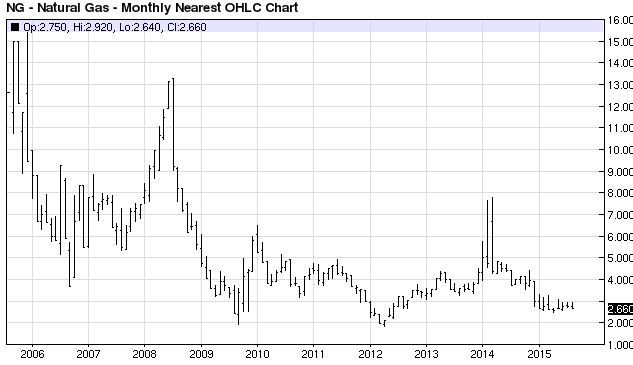

Gasoline futures play a crucial role in the commodities market, serving as key instruments for industries aiming to manage pricing strategies and mitigate risks associated with volatile fuel costs. As financial contracts, gasoline futures obligate the buyer to purchase gasoline at a specific price on a future date, thereby providing a means to hedge against price fluctuations. A prominent example in the United States is the RBOB (Reformulated Gasoline Blendstock for Oxygenate Blending) futures contract.

The dynamics of gasoline futures have evolved with the rise of algorithmic trading (algo trading), a practice that leverages complex data-driven strategies to enhance trading efficiency. Algo trading employs computer algorithms to automate trades, allowing for high-speed transactions that human traders could not achieve alone. This technology utilizes historical data, market patterns, and predictive analytics to optimize trading decisions, minimizing human emotion and maximizing objectivity.



A significant factor in gasoline futures trading is seasonality, which refers to predictable price variations recurring at specific times of the year. Seasonal trends in gasoline prices emerge from factors such as shifts in demand due to travel patterns, refinery maintenance cycles, and weather events. The challenge and opportunity lie in accurately analyzing historical price data to forecast future movements and capitalize on these predictable cycles.

This article examines the intersection of seasonal trends in gasoline futures with the technological advances in algorithmic trading. By understanding the mechanics of gasoline futures and the impact of seasonality, traders can adapt traditional trading methods into more refined and strategic executions. The goal is to illuminate how technology is fundamentally transforming trading practices, offering insights and tools for traders aiming to navigate the complexities of the commodities market with precision and foresight.

## Table of Contents

## Understanding Gasoline Futures

Gasoline futures are derivative financial instruments that represent an agreement between two parties to buy or sell a specified quantity of gasoline at a predetermined price on a set future date. These contracts are crucial for managing price risk in the gasoline market, which can be volatile due to factors such as geopolitical events, natural disasters, and changes in supply and demand dynamics.

The use of futures contracts allows market participants, like refiners, distributors, and traders, to hedge against potential adverse price movements. Hedging with gasoline futures ensures that the buyer or seller can lock in prices to stabilize costs or revenues, mitigating the financial impact of market [volatility](/wiki/volatility-trading-strategies). 

A prominent gasoline futures contract in the United States is the RBOB futures contract, which stands for Reformulated Gasoline Blendstock for Oxygenate Blending. This contract is actively traded on commodities exchanges such as the New York Mercantile Exchange (NYMEX) and provides a benchmark for gasoline prices across the country. RBOB is particularly significant due to its formulation, which is required to meet environmental regulations by reducing pollutants from gasoline.

Understanding the underlying factors that influence gasoline prices and the futures market is essential for effective trading. Key drivers include [crude oil](/wiki/crude-oil) prices, refining capacities, seasonal demand variations, and regulatory changes. These elements interact to influence supply and demand, ultimately affecting futures prices.

Moreover, traders and companies involved in gasoline futures must stay informed about market dynamics and leverage analytical tools and data to make informed decisions. This requires not only a grasp of market fundamentals but also the ability to interpret technical indicators and price trends. Comprehensive market knowledge enables participants to anticipate movements and adjust their positions to optimize financial outcomes.

## Seasonality in Gasoline Futures

Seasonality refers to the predictable and recurring fluctuations in commodity prices due to specific times of the year. In the gasoline futures market, these seasonal patterns are prominently influenced by variations in demand during different seasons, refinery maintenance schedules, and weather-related factors.

During the summer months, gasoline demand typically increases due to higher travel activity. This phenomenon, often referred to as the "driving season," leads to a rise in gasoline consumption, pushing prices up. Conversely, during the winter months, demand usually wanes as travel decreases, often resulting in lower prices. These demand fluctuations are crucial in identifying seasonal trends in gasoline futures.

Another [factor](/wiki/factor-investing) contributing to seasonality is refinery maintenance. Refineries often schedule maintenance activities during periods of lower demand, such as the fall and spring, to minimize their impact on supply. These maintenance schedules can lead to reduced gasoline supply, which in turn may cause price volatility depending on the extent and duration of the outages.

Weather conditions also play a significant role in gasoline seasonality. For instance, hurricanes and other extreme weather events can disrupt production and supply chains, leading to temporary price spikes. Understanding these patterns and external influences enables traders to anticipate price movements more effectively.

To capitalize on seasonal trends in gasoline futures, traders analyze historical price data to identify recurring patterns of price fluctuations. By examining such data, traders can recognize when prices are likely to rise or fall, optimizing their trading strategies and timing. Techniques like time-series analysis and pattern recognition are often employed to craft models that predict future price movements with greater accuracy.

Mathematically, one might approach the analysis of seasonality using models such as Seasonal Autoregressive Integrated Moving Average (SARIMA), which accounts for seasonality, trends, and cycle components in time-series data. Here’s a basic example of a Python code snippet used to fit a SARIMA model to gasoline price data:

```python
import pandas as pd
from statsmodels.tsa.statespace.sarimax import SARIMAX

# Assume 'data' is a pandas DataFrame with a DateTime index and a 'Price' column
data = pd.read_csv('gasoline_prices.csv', parse_dates=['Date'], index_col='Date')

# Fit a SARIMA model
model = SARIMAX(data['Price'], order=(1, 1, 1), seasonal_order=(1, 1, 1, 12))
results = model.fit()

# Print the summary of the model
print(results.summary())
```

Traders using this kind of technical analysis can better anticipate when to enter or [exit](/wiki/exit-strategy) the market based on seasonal trends, thus optimizing their strategy to maximize returns while minimizing risk.

## Algorithmic Trading and Its Benefits

Algorithmic trading leverages computer programs to execute trading decisions automatically, relying on a predefined set of rules and parameters. This automation allows traders to operate at a speed and frequency unattainable by human traders, fundamentally transforming trading practices. By processing vast amounts of data in real-time, algorithms identify market trends and predict future price movements with considerable accuracy, enabling trades to be executed at optimal moments without human intervention.

The benefits of [algorithmic trading](/wiki/algorithmic-trading) are manifold. Firstly, it drastically reduces the impact of human emotions and psychological biases on trading decisions. By removing emotional elements such as fear and greed, algorithmic trading fosters objective and consistent strategies, potentially increasing the likelihood of successful outcomes. For instance, algorithms can be configured to follow strict risk management protocols and maintain discipline in adhering to predefined criteria.

Moreover, algorithmic trading enhances efficiency by executing large volumes of trades across multiple markets simultaneously. This high-frequency trading capability ensures improved [liquidity](/wiki/liquidity-risk-premium) and reduced transaction costs. Traders can capitalize on microsecond-level market movements, a significant advantage in competitive and fast-paced markets like gasoline futures.

Algorithmic trading also facilitates [backtesting](/wiki/backtesting), a critical aspect of strategy development. By testing trading strategies on historical data, traders can evaluate the effectiveness and robustness of algorithms before deploying them in live markets. This process helps in fine-tuning strategies for better performance and mitigates potential risks.

Incorporating advanced techniques such as [machine learning](/wiki/machine-learning) can further enhance algorithm performance. Machine learning algorithms can adapt and evolve based on new data inputs, refining their predictive capabilities over time. This adaptability allows traders to respond to changing market dynamics more swiftly and accurately.

In summary, algorithmic trading offers enhanced precision, speed, and objectivity in trading practices. It minimizes human error, reduces emotional interference, and provides an edge in analyzing complex market data, making it an invaluable tool for modern traders.

## Incorporating Seasonality into Algo Trading

Incorporating seasonality into algorithmic trading entails embedding historical pricing trends into trading algorithms, enabling predictions of future price movements with greater accuracy. A systematic approach is necessary for this integration, starting with the identification of relevant seasonal patterns. Historical data analysis is crucial for determining seasonal trends that have consistently influenced gasoline futures, such as increased demand during summer months or diminished consumption in winter. By assimilating these patterns into algorithms, traders can enhance their trading strategies, making them more responsive to expected price shifts.

Algorithms are programmed to recognize these cyclical patterns and adjust trading strategies accordingly. For instance, if historical data indicates a rise in gasoline prices each June due to increased travel in the United States, an algorithm could be designed to initiate purchase orders ahead of the anticipated price increase. Here's a simple conceptual structure illustrating how a basic seasonal trend filter might work:

```python
import numpy as np
import pandas as pd

# Assume 'prices' is a pandas Series with datetime index
prices = pd.Series(...) 

# Define a moving average to smooth the series
moving_average = prices.rolling(window=30).mean()

# Calculate a seasonal index
seasonal_index = prices / moving_average

# Identify seasonal patterns
seasonal_trend = seasonal_index.groupby(seasonal_index.index.month).mean()

# Implementing a trading signal
def trade_signal(daily_price, month):
    if seasonal_trend[month] > 1.05:  # Threshold for 'seasonal increase'
        return "BUY"
    elif seasonal_trend[month] < 0.95:  # Threshold for 'seasonal decrease'
        return "SELL"
    else:
        return "HOLD"

# Example usage
for date in prices.index:
    signal = trade_signal(prices.at[date], date.month)
    print(f"Date: {date}, Signal: {signal}")
```

Trader tools like Supercharts provide critical assistance in visualizing these seasonal trends and embedding them into trading algorithms with precision. With Supercharts, users can construct and backtest seasonality-focused strategies, thereby gaining a competitive advantage. Such tools allow for efficient identification of trends and adjustment of trading strategies in real-time, ensuring that algorithms remain aligned with evolving market conditions.

To achieve successful integration, a deep understanding of both the trading algorithms and seasonal factors affecting gasoline futures is required. The trader needs to continuously monitor these factors and refine the algorithm's parameters, ensuring the strategy remains relevant. This process involves not just the quantitative analysis of data but also qualitative assessments of market conditions, including potential disruptions that could influence seasonal patterns. Mastering this integration results in a sophisticated trading approach that combines historical insight with advanced technology, aiming for higher efficacy in gasoline futures trading.

## Challenges and Considerations

Market unpredictability and economic events can significantly disrupt the anticipated seasonal patterns in gasoline futures, presenting considerable risks to algorithmic trading strategies. Such disruptions, often stemming from geopolitical tensions, unexpected policy shifts, or sudden macroeconomic changes, necessitate the continuous updating of trading algorithms to manage potential volatility effectively. 

To mitigate these risks, traders must incorporate robust risk management strategies into their trading systems. This might include employing stop-loss orders, diversifying investments across various assets, and actively monitoring economic indicators that could signal impending market shifts. By doing so, traders can safeguard their portfolios against unforeseen price swings.

Technical challenges also pose a significant hurdle in maintaining effective algorithmic trading systems. Ensuring data accuracy is paramount, as algorithms rely heavily on historical and real-time data to make informed decisions. Any inaccuracies or gaps in data can lead to erroneous predictions and trading moves. Therefore, systems must be equipped to verify data integrity continually and correct any discrepancies.

Latency, the delay between receiving market data and executing a trade, is another critical factor. In high-frequency trading, where algorithms compete to capitalize on minute price movements, even milliseconds can determine success or failure. Implementing low-latency infrastructure and optimizing code for speed are essential to minimize these delays.

Algorithmic adjustments are necessary to adapt to evolving market dynamics. Traders should regularly backtest their algorithms against historical data and update them based on recent performance outcomes and market conditions. This iterative process helps in refining trading strategies and adapting to structural changes in the gasoline futures market.

Moreover, navigating the regulatory landscape is crucial for algorithmic traders. Market regulations are evolving to keep pace with advancements in trading technologies, and compliance is necessary to avoid legal repercussions. Traders must stay informed about regulations affecting algorithmic trading, such as requirements for algorithm testing and audit trails, and ethical obligations around market manipulation and fairness.

These challenges highlight the complexities involved in leveraging algorithmic trading for gasoline futures. Continuous adaptation, strategic risk management, and adherence to regulatory standards are key to maintaining a competitive edge in this technologically advanced trading environment.

## Conclusion

Gasoline futures trading, when enhanced with insights from seasonality and executed through algorithmic trading, offers traders opportunities for increased efficiency and precision. The integration of seasonality data into algorithmic trading frameworks allows for the anticipation of predictable patterns in gasoline price fluctuations. While traders must navigate challenges such as market unpredictability and technical obstacles, the potential benefits are considerable. Exploiting the natural ebb and flow of gasoline prices through well-designed algorithms can significantly optimize trading outcomes.

Traders who are adept at leveraging technology, data analytics, and comprehensive market insights stand to gain substantial advantages. Technology facilitates rapid execution and the capacity to process vast datasets, while analytics provide clarity on market patterns and anomalies. Traders must ensure their algorithms are responsive to both predicted seasonal variations and unexpected market conditions.

To remain competitive in the commodity futures market, continuous learning and adaptation are essential. The dynamic nature of the market requires traders to keep abreast of technological advancements, regulatory changes, and global economic shifts. This ongoing education supports the refinement of trading strategies and the continuous improvement of algorithmic models.

Successfully navigating the fast-paced world of gasoline futures trading necessitates a strategic balance between leveraging historical data and preparing for future trends. By combining seasonality insights, sophisticated tools, and adaptive trading strategies, traders can effectively manage risks and enhance their trading performance.

## References & Further Reading

[1]: ["Advances in Financial Machine Learning"](https://www.amazon.com/Advances-Financial-Machine-Learning-Marcos/dp/1119482089) by Marcos Lopez de Prado

[2]: ["Evidence-Based Technical Analysis: Applying the Scientific Method and Statistical Inference to Trading Signals"](https://www.amazon.com/Evidence-Based-Technical-Analysis-Scientific-Statistical/dp/0470008741) by David Aronson

[3]: ["Machine Learning for Algorithmic Trading"](https://github.com/PacktPublishing/Machine-Learning-for-Algorithmic-Trading-Second-Edition) by Stefan Jansen

[4]: ["Quantitative Trading: How to Build Your Own Algorithmic Trading Business"](https://www.amazon.com/Quantitative-Trading-Build-Algorithmic-Business/dp/1119800064) by Ernest P. Chan

[5]: Bergstra, J., Bardenet, R., Bengio, Y., & Kégl, B. (2011). ["Algorithms for Hyper-Parameter Optimization."](https://proceedings.neurips.cc/paper/2011/file/86e8f7ab32cfd12577bc2619bc635690-Paper.pdf) Advances in Neural Information Processing Systems 24.