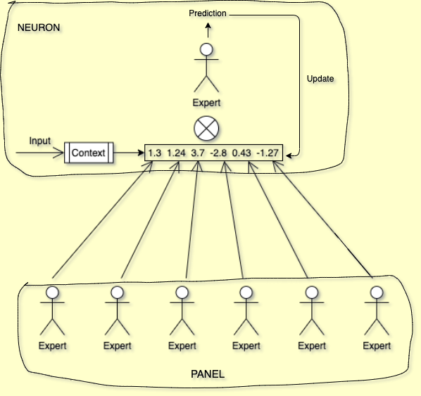

## Table of Contents

## What are Gated Linear Networks (GLNs) and what problem do they solve in machine learning?

Gated Linear Networks (GLNs) are a type of neural network architecture that help improve the way machines learn and process information. They are designed to address some of the limitations found in traditional neural networks, such as vanishing gradients and difficulty in capturing long-range dependencies. GLNs use a gating mechanism, which is a way to control the flow of information through the network. This gating helps the network focus on important features and ignore less relevant ones, making the learning process more efficient and effective.

The main problem that GLNs solve in machine learning is the issue of model interpretability and performance. Traditional neural networks can be very complex and hard to understand, making it difficult to know why they make certain predictions. GLNs, on the other hand, are built in a way that makes them easier to interpret. They use a series of linear functions and gates, which can be visualized and understood more easily. This not only helps in understanding how the model works but also often leads to better performance because the model can be fine-tuned more effectively.

## How do GLNs differ from traditional neural networks?

Gated Linear Networks (GLNs) and traditional neural networks differ in how they process and learn from data. Traditional neural networks use layers of interconnected nodes, or neurons, that apply non-linear activation functions to the input data. These networks can become very deep and complex, making it hard to understand how they make decisions. On the other hand, GLNs use a simpler structure with linear functions and gates. The gates in GLNs help control the flow of information, allowing the network to focus on important features and ignore less relevant ones. This makes GLNs easier to interpret and often leads to better performance.

Another key difference is how GLNs handle the problem of vanishing gradients, which can occur in traditional neural networks, especially in deep architectures. Vanishing gradients happen when the gradients used to update the network's weights become very small as they are backpropagated through the layers, making it hard for the network to learn effectively. GLNs address this issue by using a gating mechanism that helps maintain the flow of gradients, ensuring that the network can learn from long-range dependencies in the data. This makes GLNs more effective at capturing complex patterns and relationships in the data compared to traditional neural networks.

## What is the basic structure of a GLN neuron?

A GLN neuron is made up of two main parts: a linear function and a gate. The linear function takes in the input data and multiplies it by a set of weights. This is similar to what happens in traditional neural networks, but without the non-linear activation function. The gate, on the other hand, is like a switch that decides how much of the output from the linear function should be passed on to the next layer. The gate uses a sigmoid function, which gives a value between 0 and 1, to control this flow. If the gate's output is close to 1, most of the linear function's output is passed on. If it's close to 0, very little is passed on.

The basic structure of a GLN neuron can be described with a simple formula. If we let $$x$$ be the input, $$w$$ be the weights, and $$g$$ be the gate's output, the output $$y$$ of a GLN neuron can be written as $$y = g \cdot (w \cdot x)$$. The gate's output $$g$$ is calculated using a sigmoid function, often based on a separate set of weights and inputs. This structure allows the GLN to focus on important features of the data by controlling which information gets through to the next layer. By using linear functions and gates, GLNs can be easier to understand and often perform better than traditional neural networks.

## Can you explain the concept of gating in GLNs?

Gating in Gated Linear Networks (GLNs) is like a control switch that decides how much information should move forward in the network. Imagine you're sorting through a pile of papers, and you only want to keep the important ones. The gate in a GLN does something similar. It looks at the input and decides if it's important enough to pass on to the next part of the network. This helps the network focus on what really matters and ignore the rest.

The gate in a GLN uses a special function called a sigmoid function to make its decision. The sigmoid function gives a number between 0 and 1. If the gate's output is close to 1, it means the information is important and should be passed on. If it's close to 0, the information is not that important and should be mostly ignored. The output of the gate is then multiplied by the output of a linear function, which is just the input multiplied by some weights. So, the final output of a GLN neuron can be written as $$y = g \cdot (w \cdot x)$$, where $$x$$ is the input, $$w$$ is the weights, $$g$$ is the gate's output, and $$y$$ is the final output.

## How does a G-GLN neuron function and what are its components?

A G-GLN neuron, which stands for Gated Gated Linear Network neuron, works by combining two gates to control the flow of information. The first gate, called the outer gate, decides how much of the overall output should be passed on. The second gate, called the inner gate, decides how much of the linear function's output should be used. Both gates use a sigmoid function to give a value between 0 and 1. If the gate's value is close to 1, it means the information is important and should be passed on. If it's close to 0, the information is not that important and should be mostly ignored.

The components of a G-GLN neuron include the input, weights, linear function, and the two gates. The input is multiplied by weights to create the linear function's output. This output is then controlled by the inner gate. The final output of the neuron is the result of the linear function's output, controlled by the inner gate, and then further controlled by the outer gate. The formula for the output of a G-GLN neuron can be written as $$y = g_{\text{outer}} \cdot (g_{\text{inner}} \cdot (w \cdot x))$$, where $$x$$ is the input, $$w$$ is the weights, $$g_{\text{inner}}$$ is the inner gate's output, $$g_{\text{outer}}$$ is the outer gate's output, and $$y$$ is the final output. This structure helps the network focus on the most important information and ignore the rest, making it more effective at learning and processing data.

## What are the advantages of using GLNs over other types of neural networks?

Gated Linear Networks (GLNs) offer several advantages over traditional neural networks. One big advantage is that GLNs are easier to understand. Traditional neural networks can be very complex, making it hard to know why they make certain decisions. GLNs use simple linear functions and gates to control the flow of information. This makes it easier to see what the network is doing and why. For example, the output of a GLN neuron can be described by the formula $$y = g \cdot (w \cdot x)$$, where $$x$$ is the input, $$w$$ is the weights, $$g$$ is the gate's output, and $$y$$ is the final output. This simplicity helps people understand and trust the network more.

Another advantage of GLNs is that they can perform better than traditional neural networks. GLNs use gates to focus on important information and ignore the rest. This helps the network learn more effectively. Traditional neural networks can have problems with vanishing gradients, where the network struggles to learn from data that is far away in the layers. GLNs solve this problem by using gates to keep the gradients flowing, making it easier for the network to learn from long-range dependencies in the data. This means GLNs can often do a better job at tasks like recognizing patterns and making predictions.

## What types of tasks are GLNs particularly well-suited for?

GLNs are really good at tasks where understanding long sequences of data is important. For example, they work well in natural language processing, where they can help understand and generate text by looking at long sentences or paragraphs. GLNs use gates to focus on the important parts of the text and ignore the less important parts. This helps them understand the context and meaning better than some other types of neural networks. The output of a GLN neuron can be described by the formula $$y = g \cdot (w \cdot x)$$, where $$x$$ is the input, $$w$$ is the weights, $$g$$ is the gate's output, and $$y$$ is the final output. This simple structure helps GLNs process and learn from long sequences effectively.

Another area where GLNs shine is in time series prediction. Time series data, like stock prices or weather patterns, can have long-term dependencies that traditional neural networks might miss. GLNs, with their ability to keep gradients flowing through the network, can capture these long-term patterns and make more accurate predictions. This makes them useful for forecasting and other tasks where understanding trends over time is key. By using gates to control the flow of information, GLNs can focus on the most relevant data points and ignore noise, leading to better performance in these kinds of tasks.

## How is training conducted in GLNs, and what are the key differences from training other neural networks?

Training a Gated Linear Network (GLN) involves using a process called backpropagation, just like with other neural networks. In GLNs, the network looks at the input data and tries to predict the right output. If the prediction is wrong, the network adjusts the weights and the gates to make the prediction better next time. The gates in GLNs help control which information is important and should be passed on, making the learning process more focused. The output of a GLN neuron can be described by the formula $$y = g \cdot (w \cdot x)$$, where $$x$$ is the input, $$w$$ is the weights, $$g$$ is the gate's output, and $$y$$ is the final output. By adjusting the weights and gates, the network learns to make better predictions over time.

The key difference between training GLNs and other neural networks is how GLNs handle the flow of information and gradients. Traditional neural networks can have trouble with vanishing gradients, where the network struggles to learn from data that is far away in the layers. GLNs use gates to keep the gradients flowing, which helps them learn from long-range dependencies in the data. This makes GLNs better at tasks like understanding long sentences or predicting time series data. Also, GLNs are easier to understand because they use simple linear functions and gates, which makes it easier to see what the network is doing and why.

## What are some practical applications of GLNs in various industries?

Gated Linear Networks (GLNs) are used in many industries because they are good at understanding long sequences of data. In healthcare, GLNs help doctors by looking at long medical records to find patterns and predict diseases. For example, they can look at a patient's history over many years to see if they might get a certain illness. This helps doctors make better decisions about treatment. In finance, GLNs are used to predict stock prices or other financial data. They can look at how stock prices have changed over time and use that information to guess what might happen next. This helps investors make smarter choices about where to put their money.

GLNs are also used in the tech industry for things like understanding and generating text. They can read long documents or listen to long speeches and understand what they mean. This is helpful for making better voice assistants or chatbots that can have more natural conversations with people. In the energy sector, GLNs help predict how much energy will be needed in the future. They can look at past energy usage and weather patterns to make these predictions. This helps energy companies plan better and make sure there's enough power for everyone. The simple structure of GLNs, where the output of a neuron is $$y = g \cdot (w \cdot x)$$, makes them easier to understand and use in these real-world applications.

## Can you discuss any limitations or challenges faced when implementing GLNs?

One challenge with using Gated Linear Networks (GLNs) is that they can be tricky to set up right. You need to choose the right number of gates and layers to make sure the network works well for your specific task. If you don't set it up correctly, the network might not learn as well as it could. This can take a lot of time and effort to figure out. The output of a GLN neuron is described by the formula $$y = g \cdot (w \cdot x)$$, where $$x$$ is the input, $$w$$ is the weights, $$g$$ is the gate's output, and $$y$$ is the final output. Getting all these parts to work together smoothly can be a challenge.

Another limitation of GLNs is that they might not be as good at some tasks as other types of neural networks. For example, if you're working with images, a different kind of network like a Convolutional Neural Network (CNN) might be better. GLNs are really good at understanding long sequences of data, but they might not be the best choice for every kind of problem. It's important to think about what you're trying to do and pick the right tool for the job. Even though GLNs are easier to understand and can perform well in many cases, they still have their limits and might not always be the best choice.

## How do GLNs handle complex data patterns compared to other deep learning models?

Gated Linear Networks (GLNs) handle complex data patterns by using gates to focus on important information and ignore the rest. The gates in GLNs help the network understand long sequences of data, like long sentences or time series data. This is different from other [deep learning](/wiki/deep-learning) models that might struggle with long-range dependencies because of vanishing gradients. GLNs use a simple formula for their neurons: $$y = g \cdot (w \cdot x)$$, where $$x$$ is the input, $$w$$ is the weights, $$g$$ is the gate's output, and $$y$$ is the final output. This structure helps GLNs capture complex patterns in data more effectively than some other models.

Compared to other deep learning models, GLNs are easier to understand and interpret. Traditional neural networks can be very complex and hard to figure out, but GLNs use simple linear functions and gates. This makes it easier to see what the network is doing and why. However, GLNs might not be the best choice for every type of task. For example, if you're working with images, a Convolutional Neural Network (CNN) might be better. Still, for tasks that involve understanding long sequences of data, GLNs can handle complex patterns very well.

## What recent advancements have been made in the field of GLNs and what does the future hold for this technology?

Recent advancements in Gated Linear Networks (GLNs) include improvements in how they handle long sequences of data. Researchers have found new ways to set up the gates and layers to make GLNs even better at understanding complex patterns. For example, they've developed G-GLNs, which use two gates instead of one. The output of a G-GLN neuron can be described by the formula $$y = g_{\text{outer}} \cdot (g_{\text{inner}} \cdot (w \cdot x))$$, where $$x$$ is the input, $$w$$ is the weights, $$g_{\text{inner}}$$ is the inner gate's output, and $$g_{\text{outer}}$$ is the outer gate's output. This double gating helps the network focus even more on what's important, making it more effective at tasks like natural language processing and time series prediction.

The future of GLNs looks promising. As more people learn about how GLNs work and what they're good at, we might see them used in more industries and for more types of tasks. Researchers are also working on making GLNs easier to set up and use, so that even people who aren't experts in [machine learning](/wiki/machine-learning) can use them. With these advancements, GLNs could become a powerful tool for understanding and predicting complex data patterns, helping in areas like healthcare, finance, and technology.