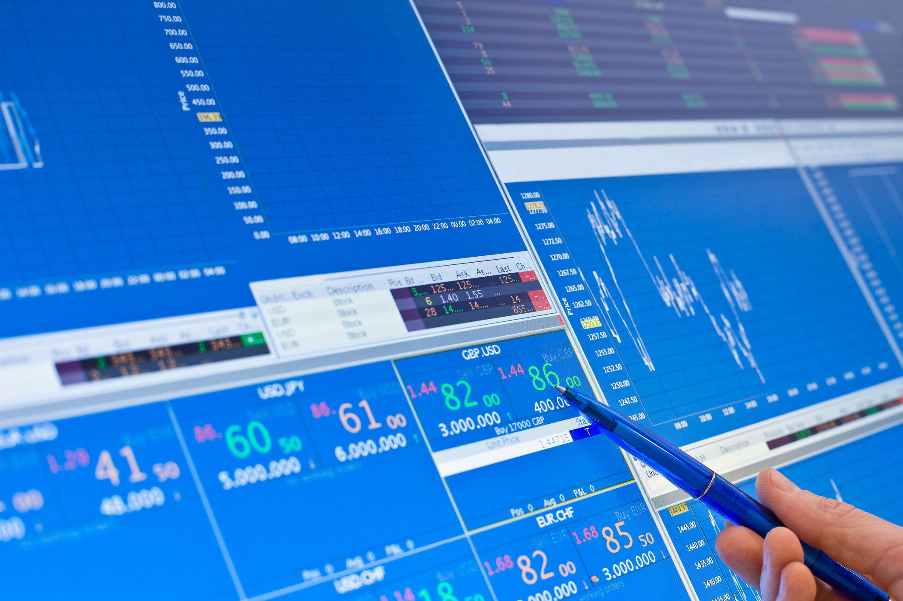

In the fast-paced world of financial markets, algorithmic trading has become a dominant force due to its ability to execute large volumes of trades swiftly and efficiently based on predefined criteria. This technological advancement has transformed traditional trading methods, allowing for rapid decision-making and high-frequency trading. However, alongside the advantages of speed and efficiency, algorithmic systems face disruptions from certain trading techniques designed to exploit their vulnerabilities. One such technique is known as "Gather In The Stops."

The "Gather In The Stops" method capitalizes on triggering stop-loss orders, which are set by traders to limit potential losses by selling securities when they reach a certain price. By intentionally driving stock prices down to reach these stop-loss points, this strategy causes stop orders to turn into market orders, exerting additional downward pressure on the price. This can lead to a snowball effect, where the rapid accumulation of market orders further exacerbates the price decline.



This article explores how the "Gather In The Stops" technique functions and its impact on algorithmic trading strategies. Understanding the mechanics and implications of this approach is essential for traders and market participants seeking to navigate modern financial markets' complexities and challenges.

## Table of Contents

## What is Algorithmic Trading?

Algorithmic trading involves the use of computer programs to execute trades automatically based on predefined criteria. This sophisticated practice leverages advanced technological tools and mathematical algorithms to trade large volumes of stocks or assets at speeds and frequencies far beyond human capability. By automating the trading process, these algorithms capitalize on opportunities created by the constant fluctuations in financial markets.

A typical algorithmic trading system is designed to analyze vast datasets encompassing market conditions, pricing models, and historical data. This analysis helps in identifying trading opportunities with precision. The algorithms implement strategies such as statistical arbitrage, market making, or trend following, and they are often back-tested against historical data to assess their effectiveness before deployment in live markets.

The core advantage of algorithmic trading lies in its speed and efficiency. Algorithms can execute buy or sell orders in microseconds, significantly reducing the risk of market movements altering the desired trade outcome. This capability is particularly beneficial in high-frequency trading environments, where the rapid execution of a large volume of orders can provide a competitive edge and improve liquidity in the market.

Furthermore, [algorithmic trading](/wiki/algorithmic-trading) minimizes human error and emotional bias, which can impact trading decisions. By functioning under a set of predefined rules, these systems ensure consistency and accuracy in executing trades. Another feature of algorithmic systems is their ability to operate continuously, scanning markets for potential trades without the need for breaks, thereby capitalizing on profit-making opportunities as they arise at any time of day.

The typical workflow of an algorithmic trading system involves the following steps: data collection, decision making, order execution, and post-trade analysis. During data collection, real-time market data and other relevant information are gathered. The decision-making process uses this data to identify trading signals based on the underlying algorithm. Once a trade signal is generated, the system automatically triggers an order execution. Finally, the post-trade analysis assesses the performance of the executed trades to refine and optimize the algorithm for future operations.

In conclusion, algorithmic trading is transforming the landscape of financial markets by enabling rapid, data-driven decisions. As technology continues to advance, the role of algorithms in trading is expected to expand, offering further enhancements in market efficiency and trader profitability.

## Understanding Gather In The Stops Technique

The 'Gather In The Stops' strategy is a market manipulation technique primarily aimed at influencing stock prices downward by triggering stop orders. A stop order is an order to buy or sell a stock once the price reaches a specified level, known as the stop price. When the stop price is reached, the stop order becomes a market order, which is executed at the best available price.

Traders employing the 'Gather In The Stops' strategy target the stop orders placed by other market participants, typically located just beneath significant support levels or technical barriers. By initiating a selling pressure that moves prices to these stop levels, traders effectively convert numerous stop orders into market orders. This conversion creates a domino effect or a cascading pressure that pushes the price further down, due to the increased [volume](/wiki/volume-trading-strategy) of market orders hitting the [order book](/wiki/order-book-trading-strategies).

The process can be visualized through a simple scenario: 

1. Assume Stock A currently trades at $100, and significant stop orders are clustered at $98.
2. A trader aiming to trigger these stops might start selling Stock A aggressively, causing the price to drop.
3. Once the price hits $98, the stop orders get activated, turning into market orders.
4. The sudden influx of sell orders at the market price drives the stock price even lower, often in a rapid manner—an occurrence known as the "snowball effect."

This artificially induced price movement can create opportunities for traders who have short positions or intend to buy back the stock at a cheaper rate after the price plummets. However, for those caught off-guard by the strategy, the result is often unexpected losses, reinforcing the volatile nature of automated and manual trading interactions. Regulatory frameworks continue to scrutinize these practices to maintain market integrity and protect investors from potential abuses.

## Impact on Algorithmic Trading Systems

Algorithmic trading systems depend heavily on the stability and predictability of financial markets to function optimally. These systems are designed to execute trades based on a set of predefined rules and indicators. When market conditions become volatile or unpredictable, these systems face significant challenges.

The 'Gather In The Stops' technique, which involves triggering stop orders to convert them into market orders, has the potential to create a surge in [volatility](/wiki/volatility-trading-strategies). This manipulation can lead to erratic price movements as numerous stop orders are activated in quick succession, often mimicking a snowball effect. Such artificially induced volatility creates an unpredictable trading environment, which is especially detrimental to algorithmic systems relying on stability.

Algorithmic trading systems operate based on algorithms that identify trading opportunities by analyzing historical data and current market conditions. These algorithms execute trades without human intervention at high speeds and frequency. When faced with unexpected volatility from strategies like 'Gather In The Stops', the algorithms may struggle to adapt quickly, leading to unintended consequences.

One challenge is executing unintended trades, where the algorithm engages in trades not aligned with its primary strategy due to fluctuating conditions. For example, suppose an algorithm determines a buy decision based on a key support level. However, if the 'Gather In The Stops' strategy artificially drives the price below the support, it could trigger additional orders that were not part of the original trading plan. This can lead to an increase in trading costs and potential financial losses.

Moreover, rapid price declines can trigger automatic stop-loss mechanisms embedded within algorithms. These are designed to minimize losses by closing a position when a certain price threshold is met. However, if a price drop results from manipulation, it might cause algorithms to sell off positions unnecessarily, compounding losses during a simulated market crash.

The reliance on mathematical models to predict market behavior is another [factor](/wiki/factor-investing) that exacerbates the impact. When strategies like 'Gather In The Stops' increase unpredictability, the assumptions upon which these models are based may no longer hold true, resulting in deviations from expected outcomes. Such deviations might disrupt the logic of the algorithm, leading to incorrect or inefficient trading decisions.

To illustrate this in a simple Python code, consider a scenario where an algorithm is intended to buy or sell based on a moving average crossover:

```python
# Simple moving average crossover algorithm
def moving_average_cross(signal_prices, short_window=50, long_window=200):
    signals = pd.DataFrame(index=signal_prices.index)
    signals['Signal'] = 0.0
    signals['Short_Moving_Avg'] = signal_prices.rolling(window=short_window, min_periods=1, center=False).mean()
    signals['Long_Moving_Avg'] = signal_prices.rolling(window=long_window, min_periods=1, center=False).mean()

    # Buy (+1) when short window is above long window, Sell (-1) when below
    signals['Signal'][short_window:] = np.where(
        signals['Short_Moving_Avg'][short_window:] > signals['Long_Moving_Avg'][short_window:], 1.0, -1.0)

    # Shift forward for positions
    signals['Position'] = signals['Signal'].shift()

    return signals

# Execute a hypothetical trading scenario
prices = pd.Series([/* Example price data */])
signals = moving_average_cross(prices)
```

In this scenario, erratic price movements introduced by 'Gather In The Stops' might lead to a series of false signals, thus undermining the effectiveness of these trading strategies.

Thus, it becomes essential for algorithmic traders to develop adaptive measures and robust risk management strategies to counteract manipulative practices that disrupt market equilibrium.

## Regulatory Measures and Market Reactions

Exchanges have implemented numerous regulatory measures to maintain market stability and curb the effects of trading techniques like 'Gather In The Stops'. One of the primary mechanisms employed by exchanges is market suspensions or trading halts. These occur when the price of a security moves beyond predefined limits, allowing time for investors to assess new information and stabilize order flows. By imposing temporary pauses, exchanges aim to prevent the escalation of artificial price movements that can arise from aggressive trading strategies.

Another crucial measure is the implementation of circuit breakers, which are designed to temporarily halt trading across the entire market if a drastic price move occurs. These are triggered either by a significant drop, generally calculated as a percentage loss in a major index, or across several securities. Circuit breakers work by creating a cooling-off period, giving participants the opportunity to reassess their positions and market data, reducing the risk of panic-driven decisions.

Despite these interventions, the 'Gather In The Stops' strategy often remains within legal boundaries, as it exploits standard market mechanisms such as stop orders, rather than engaging in outright fraudulent activities. This presents a regulatory dilemma: while regulators aspire to maintain fair and orderly markets, overly restrictive measures could impede legitimate trading practices and stifle market [liquidity](/wiki/liquidity-risk-premium).

Regulatory authorities, such as the U.S. Securities and Exchange Commission (SEC) and the European Securities and Markets Authority (ESMA), continuously assess the impact of such trading strategies. They are tasked with the challenge of balancing the need for robust market protections with the freedom necessary for market innovation. Regulatory actions may include adjusting circuit breaker thresholds or refining the rules surrounding stop orders to mitigate potential misuse.

Overall, adapting regulatory frameworks to address the challenges posed by strategies like 'Gather In The Stops' is a vital, ongoing process. It requires collaboration between regulatory bodies, exchanges, and market participants to ensure a resilient market structure that supports both innovation and stability.

## Conclusion: Balancing Innovation and Stability

While 'Gather In The Stops' poses a distinct challenge to algorithmic trading, it simultaneously underscores the necessity for adaptive strategies within the financial markets. This technique acts as a reminder that market dynamics are ever-evolving, and both traders and trading algorithms must be resilient and flexible to mitigate unforeseen impacts. 

For traders, understanding the intricacies of strategies like 'Gather In The Stops' is crucial. This knowledge allows them to anticipate potential market manipulations and adjust their strategies accordingly. By recognizing the signs of such techniques being employed, traders can take preemptive actions to safeguard their positions. Additionally, enhancing awareness and competence in detecting and responding to these strategies can improve risk management and trading outcomes.

On the regulatory front, collaboration between traders and regulatory bodies is essential in maintaining a balanced market environment. Regulators are tasked with the challenge of crafting policies that foster innovation while mitigating the risks of market manipulation. Policies could involve enhancing transparency in trading activities and implementing robust surveillance systems that can swiftly detect irregularities. Moreover, regulators might consider encouraging the development and deployment of advanced technologies that can adapt to and counteract disruptive trading strategies effectively.

In conclusion, 'Gather In The Stops' accentuates the fundamental balance between innovation and market stability. While it presents hurdles for algorithmic trading, it also illuminates the crucial role of vigilance, adaptability, and cooperation among market participants and regulators. By integrating comprehensive understanding and proactive measures, traders and regulators can navigate and thrive in the complex landscape of modern financial markets.

## Further Reading and Resources

For those interested in expanding their knowledge of trading strategies, Investopedia provides a wealth of information, including in-depth articles, tutorials, and market analysis that cater to both beginners and experienced traders. Financial courses, both online and in-person, offer structured learning paths on a wide range of topics, including algorithmic trading. Platforms like Coursera, edX, and specialized institutions present courses designed to deepen understanding of financial markets and trading algorithms.

Staying informed about market dynamics is crucial for any trader. Financial news sources such as Bloomberg, Reuters, and The Financial Times deliver up-to-date reporting on market trends, economic indicators, and significant global events that influence market movements. Subscribing to these sources can enhance a trader's ability to anticipate and react to market changes.

Advanced training and certification programs offer another avenue for traders seeking to refine their skills. Programs such as the Chartered Financial Analyst (CFA) or the Financial Risk Manager (FRM) provide comprehensive education in financial analysis, risk management, and investment strategies. Additionally, specialized certifications in algorithmic trading are available through institutions like the International Federation of Technical Analysts or AlgoTrader, enabling participants to master the technical and strategic aspects of automated trading systems.

Engaging with these resources equips traders with the necessary tools to effectively interpret and respond to the complexities of modern financial markets.

## References & Further Reading

[1]: Aldridge, I. (2009). ["High-Frequency Trading: A Practical Guide to Algorithmic Strategies and Trading Systems"](https://www.amazon.com/High-Frequency-Trading-Practical-Algorithmic-Strategies/dp/1118343506) Wiley.

[2]: Narang, R. (2013). ["Inside the Black Box: A Simple Guide to Quantitative and High-Frequency Trading, 2nd Edition"](https://onlinelibrary.wiley.com/doi/book/10.1002/9781118662717) Wiley.

[3]: Lopez de Prado, M. (2018). ["Advances in Financial Machine Learning"](https://www.amazon.com/Advances-Financial-Machine-Learning-Marcos/dp/1119482089) Wiley.

[4]: Chan, E. P. (2008). ["Quantitative Trading: How to Build Your Own Algorithmic Trading Business"](https://github.com/egorpe/EPChan-QuantitativeTrading/blob/master/example7_6.m) Wiley.

[5]: Aronson, D. R. (2007). ["Evidence-Based Technical Analysis: Applying the Scientific Method and Statistical Inference to Trading Signals"](https://onlinelibrary.wiley.com/doi/book/10.1002/9781118268315) Wiley.