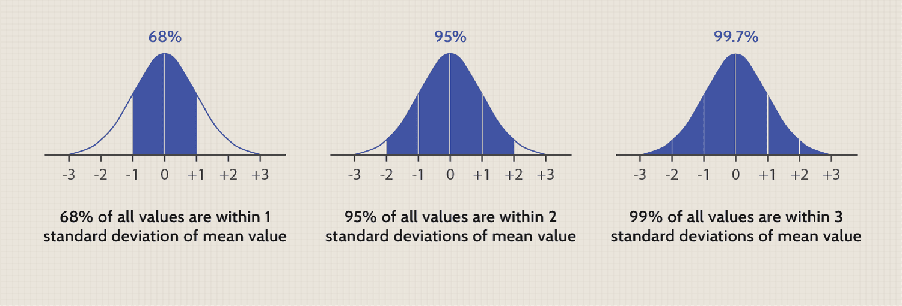

## Table of Contents

## What is the Gaussian distribution and why is it important in finance?

The Gaussian distribution, also known as the normal distribution or bell curve, is a type of statistical distribution that shows how data is spread out. Imagine you have a lot of data, like the heights of people in a city. If you plot this data on a graph, it might look like a bell shape. The middle of the bell is where most of the data is, and as you move away from the middle, the data gets less common. This distribution is important because it helps us predict how likely certain outcomes are, based on where they fall on the bell curve.

In finance, the Gaussian distribution is very important because it helps people understand and predict things like stock prices, interest rates, and returns on investments. For example, if you want to know how likely it is for a stock to go up or down by a certain amount, you can use the normal distribution to make an educated guess. This is useful for managing risk and making investment decisions. However, it's worth noting that while the Gaussian distribution is a helpful tool, real financial data can sometimes behave differently, so it's not perfect but still very useful.

## How is the Gaussian distribution used to model financial returns?

The Gaussian distribution is used to model financial returns because it helps us understand how likely different returns are. Imagine you're looking at the daily returns of a stock. If you plot these returns on a graph, they might look like a bell curve. The middle of the bell, or the peak, shows the most common return, which is usually close to zero. As you move away from the middle, the returns become less common. This helps investors see what kind of returns they can expect most of the time and how often big gains or losses might happen.

However, using the Gaussian distribution for financial returns isn't perfect. Real financial data can sometimes have more extreme ups and downs than the bell curve predicts. This means that big gains or losses might happen more often than the model suggests. Despite this, the Gaussian distribution is still very useful because it gives a good starting point for understanding and managing risk in investments. It helps investors make better decisions by showing them what to expect, even if they need to be ready for surprises.

## What are the key parameters of a Gaussian distribution and how are they interpreted in a financial context?

The Gaussian distribution has two main parameters: the mean and the standard deviation. The mean is like the middle of the bell curve. In a financial context, the mean represents the average return you might expect from an investment. For example, if the mean return of a stock is 5%, it means that over time, you can expect to get around 5% back on your investment.

The standard deviation tells you how spread out the data is. In finance, it's a measure of risk. A small standard deviation means the returns are usually close to the mean, so the investment is less risky. A large standard deviation means the returns can be all over the place, so the investment is riskier. For instance, if a stock has a standard deviation of 2%, the returns are pretty consistent, but if it's 10%, the returns can vary a lot, making it a riskier investment.

These two parameters help investors understand what to expect from their investments. The mean gives them an idea of the potential reward, while the standard deviation helps them gauge the risk. By looking at both, investors can make better decisions about where to put their money, balancing the potential for gains against the risk of losses.

## Can you explain the concept of standard deviation in the context of financial assets?

Standard deviation is a way to measure how much the returns of a financial asset, like a stock or a bond, can vary from the average return. Imagine you're looking at the daily returns of a stock over a year. The average return might be 5%, but some days the stock might go up by 10% and other days it might go down by 3%. The standard deviation tells you how spread out these daily returns are. If the standard deviation is small, it means the returns are usually close to the average, so the stock is less risky. If the standard deviation is large, it means the returns can be all over the place, making the stock riskier.

In simple terms, standard deviation helps investors understand the risk of an investment. A stock with a high standard deviation means its price can jump around a lot, which might be exciting but also scary because you could lose money quickly. On the other hand, a stock with a low standard deviation is more predictable, so you might feel safer investing in it, but the potential for big gains might be smaller. By looking at the standard deviation, investors can decide if they're comfortable with the level of risk and if it matches their investment goals.

## How does the Central Limit Theorem relate to the use of Gaussian distribution in finance?

The Central Limit Theorem is a big idea in statistics that helps explain why the Gaussian distribution, or bell curve, is so useful in finance. The theorem says that if you take a bunch of samples from any kind of data and look at their averages, those averages will start to look like a bell curve, no matter what the original data looked like. In finance, this means that even if stock prices or returns don't follow a perfect bell curve on their own, if you look at the average returns over time, they will start to look more like a bell curve. This makes it easier for investors to predict what might happen next because the bell curve gives a good guess about the likelihood of different outcomes.

This is really helpful for financial analysts because it means they can use the Gaussian distribution to make sense of complex financial data. Even though individual stock returns might be unpredictable and not follow a bell curve, when you look at the returns over a longer period or across many different stocks, the Central Limit Theorem kicks in, and the data starts to fit the bell curve. This allows analysts to estimate the risk and potential returns of investments more accurately, helping them make better decisions about where to put their money.

## What are the limitations of using Gaussian distribution to model financial data?

Using the Gaussian distribution to model financial data has some limitations. One big problem is that real financial data can have more extreme ups and downs than the bell curve predicts. This means big gains or losses might happen more often than the model suggests. For example, during a financial crisis, stock prices can drop a lot more than the Gaussian distribution would predict. This is because the bell curve assumes that extreme events are very rare, but in finance, these events can happen more often than expected.

Another limitation is that the Gaussian distribution assumes that the returns are symmetric around the mean. In reality, financial returns can be skewed, meaning they might have more big gains or more big losses than the model predicts. This can lead to underestimating the risk of an investment. For instance, if a stock has more big losses than big gains, the Gaussian model might not show this clearly, making the investment seem less risky than it really is. So, while the Gaussian distribution is a helpful tool, it's important for investors to be aware of these limitations and use other models or methods to get a fuller picture of the risks involved.

## How can the Gaussian distribution be applied in risk management and portfolio optimization?

In risk management, the Gaussian distribution helps investors understand how likely different outcomes are for their investments. By looking at the average return (mean) and how much the returns can vary (standard deviation), investors can get a sense of the risk involved. For example, if a stock has a high standard deviation, it means the returns can be all over the place, so it's riskier. By using the Gaussian distribution, investors can set up risk limits and decide how much they're willing to lose. This helps them make smarter choices about which investments to keep and which to avoid, based on how much risk they're comfortable with.

In portfolio optimization, the Gaussian distribution is used to find the best mix of investments that gives the highest return for the least amount of risk. Investors use the mean and standard deviation of different assets to figure out how they move together. If two stocks tend to go up and down at the same time, they might not be the best to put together in a portfolio because they won't balance each other out. But if one stock goes up when another goes down, they can help reduce the overall risk of the portfolio. By using the Gaussian distribution, investors can calculate the expected return and risk of different combinations of assets, helping them build a portfolio that fits their goals and risk tolerance.

## What is Value at Risk (VaR) and how is it calculated using the Gaussian distribution?

Value at Risk, or VaR, is a way to measure how much money you might lose on an investment over a certain time period. It's like a guess about the worst-case scenario, but not the absolute worst. For example, if your VaR is $10,000 at a 95% confidence level over one day, it means there's a 5% chance you could lose more than $10,000 in one day. VaR helps investors understand the risk of their investments and decide if they're okay with that level of risk.

To calculate VaR using the Gaussian distribution, you need to know the average return (mean) and how much the returns can vary (standard deviation) of your investment. Imagine you're looking at the returns of a stock. You can use the Gaussian distribution to figure out how likely different returns are. To find the VaR, you pick a confidence level, like 95%, and then use the standard deviation to find the return that's at the edge of that 5% chance of a bigger loss. This return, when turned into a dollar amount, is your VaR. It's a way to use the bell curve to make a smart guess about how much you might lose, helping you manage your investments better.

## How do financial models adjust for the non-normality of returns when using Gaussian distribution?

Financial models often use the Gaussian distribution to understand how likely different returns are, but real financial data can be different from the bell curve. To deal with this, financial experts use something called "fat tails" adjustments. This means they change the model to account for the fact that big gains or losses happen more often than the bell curve says. They do this by using different math formulas that make the tails of the distribution fatter, showing that extreme events are more common in finance.

Another way to adjust for non-normality is by using other types of distributions that fit financial data better. For example, the Student's t-distribution or the lognormal distribution can handle the big ups and downs in stock prices better than the Gaussian distribution. These other distributions can be used to make more accurate guesses about the risk of investments. By using these adjustments, financial models can give a better picture of what might happen, helping investors make smarter choices.

## What are some alternative distributions to the Gaussian distribution used in finance, and when might they be more appropriate?

In finance, when the Gaussian distribution doesn't fit the data well, people often use other types of distributions. One popular alternative is the Student's t-distribution. This distribution is good at handling big ups and downs in stock prices because it has "fat tails," meaning it shows that extreme events, like big gains or losses, happen more often than the bell curve predicts. The Student's t-distribution is useful when you're looking at data that has more surprises than usual, like during a financial crisis when stock prices can drop a lot more than expected.

Another alternative is the lognormal distribution, which is great for modeling things like stock prices that can't go below zero. The lognormal distribution is skewed, meaning it shows more big gains than big losses, which can be more realistic for some financial data. It's often used when you want to understand how much a stock might grow over time, especially if you're looking at long-term investments. Both of these distributions can give a better picture of the risks and potential returns of investments when the Gaussian distribution isn't quite right.

## How can one test if financial data follows a Gaussian distribution, and what statistical tools are used for this purpose?

To check if financial data follows a Gaussian distribution, you can use something called a normality test. One common test is the Shapiro-Wilk test. This test looks at your data and gives you a number called a p-value. If the p-value is small (usually less than 0.05), it means your data probably doesn't follow a Gaussian distribution. If the p-value is big, it means your data might be close enough to a Gaussian distribution. Another way to check is by making a graph called a Q-Q plot (Quantile-Quantile plot). If the points on the Q-Q plot line up in a straight line, it suggests your data is close to a Gaussian distribution. If the points are all over the place, it means your data is different from a Gaussian distribution.

Another tool you can use is the Kolmogorov-Smirnov test. This test compares your data to what a perfect Gaussian distribution would look like and tells you if they're different. Like the Shapiro-Wilk test, it gives you a p-value. If the p-value is small, it means your data is likely not Gaussian. If it's big, it means your data might be Gaussian. These tests help you understand if the Gaussian distribution is a good fit for your financial data, which is important for making accurate predictions and managing risk.

## What are the implications of assuming Gaussian distribution in financial modeling, particularly during extreme market events?

Assuming a Gaussian distribution in financial modeling can be helpful because it gives a good starting point for understanding how likely different returns are. The bell curve shows that most of the time, returns will be close to the average, and big gains or losses are rare. This can help investors make decisions about their investments, like figuring out how much risk they're okay with and what kind of returns they might expect. But the problem is, real financial data doesn't always fit neatly into a bell curve, especially during extreme market events.

During times like a financial crisis, stock prices can drop a lot more than the Gaussian distribution predicts. The bell curve says big ups and downs are very rare, but in real life, these extreme events can happen more often than expected. If investors only use the Gaussian distribution, they might not be ready for these big surprises. They could think their investments are safer than they really are, leading to bigger losses when the market takes a sudden turn. That's why it's important to use other tools and models that can handle these big ups and downs better, especially when things get crazy in the market.

## What is the understanding of Gaussian Distribution?

The Gaussian distribution, commonly referred to as the normal distribution, is one of the most fundamental concepts in statistics, widely recognized by its symmetric bell-shaped curve. It is defined by its mean ($\mu$) and standard deviation ($\sigma$), which together describe the distribution's center and spread. The probability density function (PDF) of a Gaussian distribution is given by:

$$
f(x|\mu,\sigma^2) = \frac{1}{\sqrt{2\pi\sigma^2}} e^{-\frac{(x-\mu)^2}{2\sigma^2}}
$$

In a perfect Gaussian distribution, the mean, median, and mode all converge to the same value, giving rise to its symmetric appearance around the central peak. This characteristic makes it a valuable tool in various fields, including finance, where understanding price movements' probabilistic nature is crucial.

The concept of standard deviation is particularly significant in finance, as it quantifies the amount of variation or [dispersion](/wiki/dispersion-trading) of a set of values. In terms of asset prices, a higher standard deviation corresponds to greater [volatility](/wiki/volatility-trading-strategies), which is a critical measure for traders evaluating risk.

In [algorithmic trading](/wiki/algorithmic-trading), Gaussian distributions offer a robust framework for modeling asset prices and market dynamics. Asset prices often exhibit random fluctuations, and under certain conditions, these can be approximated using Gaussian models. This approximation is critical for analyzing price movements and understanding market behaviors.

Understanding these statistical principles is essential for employing Gaussian distributions effectively in trading algorithms. For instance, the assumption of normally distributed returns allows traders to apply statistical methods for calculating Value at Risk (VaR) and other risk metrics. Furthermore, the clarity offered by the Gaussian model helps traders to interpret and predict price trends, although real market data may deviate from this ideal model due to skewness and kurtosis.

Thus, expertise in Gaussian distribution not only aids in the comprehension of fundamental market characteristics but also enhances the precision and reliability of trading strategies designed around it.

## What are the practical applications of Gaussian Distribution in trading?

Gaussian distribution has significant applications in trading, particularly through its use in Gaussian channels. These channels are derivatives of the Gaussian distribution and play a pivotal role in technical analysis. They are designed to help traders visualize price movements and identify conditions that suggest assets are either overbought or oversold. This visualization emerges from plotting confidence intervals calculated from historical price data, creating upper and lower bounds (or channels) around a moving average line.

To create Gaussian channels, a trader generally selects a period and calculates the moving average of asset prices for that period. Then, using the standard deviation of these prices, the trader calculates the upper and lower bounds of the channel. For instance, if the daily closing prices of a stock form a time series $(X_1, X_2, ..., X_n)$, the moving average (MA) of this series over a specified period $(n)$ is given by:

$$

MA = \frac{1}{n} \sum_{i=1}^{n} X_i 
$$

The standard deviation ($\sigma$) is computed as:

$$
\sigma = \sqrt{\frac{1}{n} \sum_{i=1}^{n} (X_i - MA)^2 }
$$

The upper and lower channels can then be defined typically as:

$$

\text{Upper Channel} = MA + k \times \sigma 
$$
$$

\text{Lower Channel} = MA - k \times \sigma 
$$

where $k$ is a constant that determines the width of the channel based on the desired confidence level. Commonly, $k$ is set to 2, corresponding to approximately 95% confidence if assuming a normal distribution.

Integrating Gaussian distribution with other technical analysis tools further enhances trading strategies. For example, using indicators like the Relative Strength Index (RSI) or Moving Average Convergence Divergence (MACD) alongside Gaussian channels can provide a finer insight into market conditions, presenting a robust methodology for decision-making.

Practical application involves the use of historical price data to make future price trend predictions using the Gaussian model. Traders regularly adjust these models to reflect current market dynamics, ensuring continued relevance and accuracy. This iterative approach is crucial as market conditions and data variations influence the applicability of Gaussian models.

Python, with its extensive libraries like NumPy and pandas, offers traders a powerful toolkit for implementing Gaussian channels:

```python
import numpy as np
import pandas as pd

def gaussian_channels(prices, period=20, k=2):
    # Calculate moving average
    ma = prices.rolling(window=period).mean()

    # Calculate standard deviation
    std_dev = prices.rolling(window=period).std()

    # Calculate upper and lower channels
    upper_channel = ma + (k * std_dev)
    lower_channel = ma - (k * std_dev)

    return ma, upper_channel, lower_channel

# Example usage:
# prices = pd.Series(...  # Your series of asset prices
# ma, upper, lower = gaussian_channels(prices)
```

Regular model adjustments and in-depth analysis are integral to account for the fluid nature of financial markets, ensuring that Gaussian channels remain pertinent in identifying advantageous trading conditions. This approach underscores the necessity for adaptability in employing Gaussian models, as traders strive to align their tools with the ever-evolving market landscape.

## What are the benefits of using Gaussian distribution in algorithmic trading?

The Gaussian distribution is a cornerstone in algorithmic trading due to its structured approach in quantifying risk and volatility. This statistical model aids traders by predicting asset price trends, thereby enabling more informed decision-making and strategy optimization. The centricity of the Gaussian distribution lies in its ability to summarize the expected return through its mean and volatility through its standard deviation. This dual representation offers traders a clear picture of potential price fluctuations, which is crucial for managing risk.

One of the primary benefits of employing the Gaussian distribution is its role in efficiently managing portfolios with varying risk profiles. By understanding the dispersion of returns, traders can tailor their strategies to either capitalize on high volatility or seek stability, depending on their risk appetite. This characteristic is particularly beneficial for developing hedge strategies and diversifying investments to mitigate losses during adverse market movements.

Gaussian models enhance the precision of predictions concerning asset price dynamics. When incorporated into sophisticated trading algorithms, these models can process large datasets quickly, ensuring timely market analysis and execution. The formula for the Gaussian distribution, commonly expressed as:

$$
f(x) = \frac{1}{\sqrt{2\pi\sigma^2}} e^{-\frac{(x-\mu)^2}{2\sigma^2}}
$$

where $\mu$ is the mean and $\sigma^2$ is the variance, helps in delineating the probability of various outcomes based on historical data. This probabilistic framework is instrumental in setting stop-loss orders and determining entry and exit points in trades.

The integration of Gaussian distributions into algorithmic processes fosters a more systematic approach to trading. By creating models that consistently evaluate risk and potential returns, traders can maintain clarity and precision in their strategy execution. It also facilitates the development of predictive analytics tools that automatically adapt to market changes, thus maintaining their efficacy over time. This systematic approach underpins a robust trading methodology, offering a competitive advantage in the fast-paced financial markets.

In essence, while the Gaussian distribution is not without limitations, its ability to provide a structural methodology in assessing and responding to market variables makes it an invaluable asset in algorithmic trading. It helps transform data into actionable insights, enhancing overall trading strategy effectiveness.

## References & Further Reading

[1]: ["Advances in Financial Machine Learning"](https://www.amazon.com/Advances-Financial-Machine-Learning-Marcos/dp/1119482089) by Marcos Lopez de Prado

[2]: ["Evidence-Based Technical Analysis: Applying the Scientific Method and Statistical Inference to Trading Signals"](https://www.amazon.com/Evidence-Based-Technical-Analysis-Scientific-Statistical/dp/0470008741) by David Aronson

[3]: ["Machine Learning for Algorithmic Trading"](https://github.com/PacktPublishing/Machine-Learning-for-Algorithmic-Trading-Second-Edition) by Stefan Jansen

[4]: ["Quantitative Trading: How to Build Your Own Algorithmic Trading Business"](https://www.amazon.com/Quantitative-Trading-Build-Algorithmic-Business/dp/1119800064) by Ernest P. Chan

[5]: Cont, R. (2001). ["Empirical properties of asset returns: Stylized facts and statistical issues."](https://www.tandfonline.com/doi/abs/10.1080/713665670) Quantitative Finance, 1(2), 223-236.

[6]: Tsay, R. S. (2010). ["Analysis of Financial Time Series."](https://onlinelibrary.wiley.com/doi/book/10.1002/9780470644560) Wiley Series in Probability and Statistics.