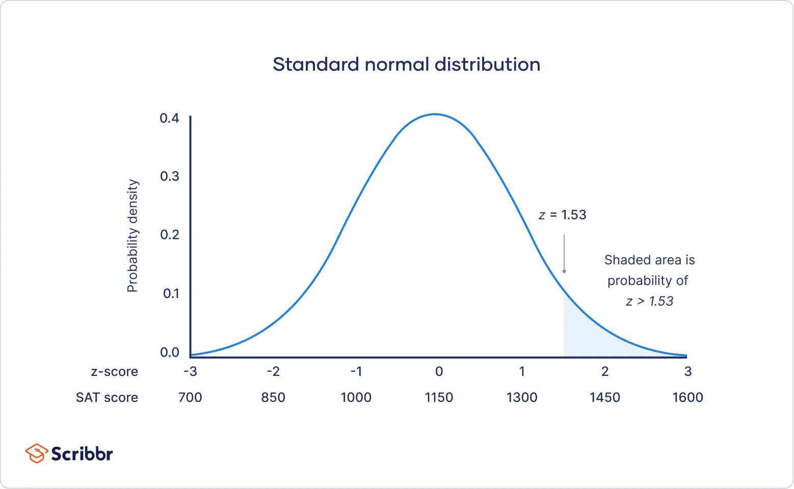

## Table of Contents

## What is a Gaussian probability distribution?

A Gaussian probability distribution, also known as a normal distribution or bell curve, is a type of continuous probability distribution that is widely used in statistics and various fields of science. It is called "Gaussian" after the mathematician Carl Friedrich Gauss, who developed it. The distribution is characterized by its bell-shaped curve, where the data is symmetrically distributed around the mean, with most of the data clustering around the center and gradually decreasing as you move away from the mean.

The Gaussian distribution is defined by two parameters: the mean (μ) and the standard deviation (σ). The mean represents the center of the distribution, while the standard deviation measures the spread of the data. A smaller standard deviation means the data is tightly clustered around the mean, resulting in a narrower bell curve, whereas a larger standard deviation means the data is more spread out, resulting in a wider bell curve. This distribution is important because many natural phenomena, such as heights, weights, and test scores, tend to follow a Gaussian distribution, making it a useful tool for modeling and analyzing data.

## How is a Gaussian distribution represented mathematically?

A Gaussian distribution is represented by a specific mathematical formula called the probability density function (PDF). The formula for the Gaussian distribution is f(x) = (1 / (σ√(2π))) * e^(-(x-μ)^2 / (2σ^2)). Here, 'x' is the value you're looking at, 'μ' is the mean, 'σ' is the standard deviation, 'e' is the base of the natural logarithm (about 2.718), and 'π' is about 3.14. This formula tells you the probability of getting any particular value 'x' from the distribution.

The formula might look complicated, but it's actually quite simple once you understand what each part does. The term (1 / (σ√(2π))) makes sure that the total area under the curve equals 1, which is important for a probability distribution. The part e^(-(x-μ)^2 / (2σ^2)) shapes the bell curve. It makes the probability highest at the mean 'μ' and decreases as you move away from the mean. The standard deviation 'σ' controls how wide or narrow the bell curve is. A smaller 'σ' makes the curve narrower, and a larger 'σ' makes it wider.

## What are the key parameters of a Gaussian distribution?

The key parameters of a Gaussian distribution are the mean and the standard deviation. The mean, often written as 'μ', is the center of the distribution. It's the average value where the peak of the bell curve sits. If you think of the distribution as a pile of data, the mean is where the pile is highest. It tells you where the middle of your data is.

The standard deviation, written as 'σ', measures how spread out the data is. A small standard deviation means the data is tightly packed around the mean, making the bell curve narrow. A large standard deviation means the data is more spread out, making the bell curve wider. The standard deviation helps you understand how much the data varies from the mean. Together, these two parameters shape the entire Gaussian distribution and tell you everything you need to know about where your data is centered and how it's spread out.

## How do you calculate the mean and standard deviation of a Gaussian distribution?

To calculate the mean of a Gaussian distribution, you add up all the values in your data set and then divide by the number of values. This gives you the average, which is the center of your bell curve. For example, if you have the numbers 2, 4, 6, 8, and 10, you add them up to get 30, and then divide by 5 (the number of values) to get a mean of 6. The mean tells you where the middle of your data is, and it's where the peak of the bell curve will be.

To calculate the standard deviation, you first find out how far each value is from the mean. You do this by subtracting the mean from each value, then squaring the result. Next, you find the average of these squared differences. This average is called the variance. To get the standard deviation, you take the square root of the variance. The standard deviation tells you how spread out your data is. A small standard deviation means your data is close to the mean, making the bell curve narrow. A large standard deviation means your data is more spread out, making the bell curve wider.

## What is the significance of the bell-shaped curve in Gaussian distributions?

The bell-shaped curve in Gaussian distributions is important because it shows how data is spread out around the average. Imagine you have a bunch of test scores. If you draw a picture of how many people got each score, you might see a bell shape. This shape tells you that most people got scores close to the average, and fewer people got really high or really low scores. The middle of the bell, where it's highest, is the average score. The bell shape helps us understand that most things in nature, like heights or weights, tend to cluster around a middle value.

The bell curve also helps us predict things. If we know the average and how spread out the data is, we can guess how likely it is to get a certain score or measurement. For example, if the average height of people in a group is 5 feet 7 inches, and we know how much heights vary, we can predict how many people might be taller or shorter than that. This is useful in many areas, like science, business, and even everyday life, because it helps us make better decisions based on what we expect to happen.

## How does the 68-95-99.7 rule apply to Gaussian distributions?

The 68-95-99.7 rule is a simple way to understand how data spreads out in a Gaussian distribution. It tells us that in a bell-shaped curve, about 68% of the data falls within one standard deviation of the mean. This means if you draw a line one standard deviation above and below the average, most of the data, about two-thirds, will be between those lines. It's like saying if you measure the heights of a bunch of people, about 68% of them will be within a certain range around the average height.

The rule also says that about 95% of the data falls within two standard deviations of the mean. So, if you go two standard deviations above and below the average, almost all the data, about 19 out of 20 pieces, will be in that bigger range. Finally, the rule tells us that about 99.7% of the data falls within three standard deviations of the mean. This means if you go three standard deviations out from the average in both directions, nearly all the data, about 997 out of 1000 pieces, will be inside that very wide range. This rule helps us quickly understand where most of the data lies in a Gaussian distribution.

## What are some real-world applications of Gaussian distributions?

Gaussian distributions are used in many real-world situations because they help us understand and predict things. For example, in finance, stock prices often follow a Gaussian distribution. This helps investors figure out how likely it is for a stock to go up or down by a certain amount. It's like guessing the chances of winning or losing money. In quality control, factories use Gaussian distributions to check if their products are made correctly. If the sizes of the products are too far from the average, it might mean something is wrong with the machines, and they need to fix it.

Another place where Gaussian distributions are useful is in medicine. Doctors use them to understand things like blood pressure or cholesterol levels in a group of people. If someone's blood pressure is way outside the normal range, it might mean they need treatment. In education, test scores often follow a Gaussian distribution. Teachers can use this to see if a test was too hard or too easy, and to help students who might need extra help. It's like a tool that helps us make sense of numbers and make better decisions.

## How can you determine if a dataset follows a Gaussian distribution?

To find out if a dataset follows a Gaussian distribution, you can start by making a picture called a histogram. A histogram shows how many times each value in your data appears. If the histogram looks like a bell shape, with most of the data in the middle and less on the sides, it might be a Gaussian distribution. You can also use a special graph called a Q-Q plot, which compares your data to what a perfect Gaussian distribution would look like. If the points on the Q-Q plot line up in a straight line, it's a good sign that your data follows a Gaussian distribution.

Another way to check is by using math tests like the Shapiro-Wilk test or the Kolmogorov-Smirnov test. These tests give you a number that tells you how likely it is that your data follows a Gaussian distribution. If the number is high, it means your data probably does follow a Gaussian distribution. But remember, no real data is perfect, so even if your data is close to a Gaussian distribution, it might still have some small differences. These methods help you decide if it's okay to use Gaussian distribution math to understand your data better.

## What are the differences between a Gaussian distribution and other types of distributions?

A Gaussian distribution, also known as a normal distribution, is special because it looks like a bell shape. The middle of the bell is the average of the data, and most of the data is close to this average. The data spreads out evenly on both sides, making the shape symmetric. Other types of distributions might not look like a bell. For example, a uniform distribution has all values equally likely, so it looks like a flat line instead of a bell. A skewed distribution leans to one side, with data bunched up more on one side of the average than the other. This can happen if, say, most people in a group earn low incomes, but a few earn very high incomes, making the data lean to the right.

Another difference is how we use these distributions. Gaussian distributions are very useful because many things in nature, like heights or test scores, follow this pattern. This makes it easier to predict things and make decisions based on what we expect to happen. Other distributions, like the Poisson distribution, are used for counting things that happen randomly over time, like the number of cars passing a point on a road. The exponential distribution is used for how long you wait for something to happen, like the time between phone calls at a call center. Each type of distribution helps us understand and work with different kinds of data in the best way possible.

## How do you transform a non-Gaussian distribution to a Gaussian one?

If your data doesn't look like a bell shape and you need it to, you can use something called a transformation to make it more like a Gaussian distribution. One common way to do this is by using a logarithm transformation. This means you take the log of each number in your dataset. For example, if you have numbers like 1, 10, 100, and 1000, taking the log turns them into 0, 1, 2, and 3. This can help spread out numbers that are bunched up on one side, making the data look more like a bell shape. Another way is to use a square root transformation, where you take the square root of each number. This can also help make the data more even and bell-shaped.

Sometimes, you might need to try different transformations to see what works best. Besides logs and square roots, you could use other math tricks like the Box-Cox transformation, which is a bit more complicated but can be very powerful. The idea is to find a way to make your data look more like a bell shape so you can use the tools and math that work well with Gaussian distributions. It's like trying on different pairs of glasses until you find the one that makes things clear. Once you find the right transformation, you can use it to make your data easier to understand and work with.

## What are the limitations and assumptions of using Gaussian distributions in statistical modeling?

When you use Gaussian distributions in statistical modeling, you're making some big assumptions. The biggest one is that your data looks like a bell shape, with most of the data in the middle and less on the sides. But not all data fits this pattern. For example, if you're looking at how much money people make, you might find that most people earn a little, but a few earn a lot, making the data lean to one side. This is called a skewed distribution, and it doesn't fit the bell shape of a Gaussian distribution. Another assumption is that the data spreads out evenly on both sides of the middle. If your data doesn't follow these rules, using a Gaussian distribution might lead to wrong predictions or decisions.

There are also some limitations to using Gaussian distributions. One big one is that they can't handle data that has clear limits, like percentages that can't go above 100 or below 0. Gaussian distributions can go on forever in both directions, which doesn't make sense for this kind of data. Another limitation is that they might not work well for small datasets. With only a few numbers, it's hard to tell if the data really follows a bell shape. Also, if your data has a lot of unusual values, called outliers, a Gaussian distribution might not be the best choice because it assumes most of the data is close to the middle. Knowing these assumptions and limitations helps you decide if a Gaussian distribution is the right tool for your data.

## How do multivariate Gaussian distributions extend the concept of univariate Gaussian distributions?

A multivariate Gaussian distribution is like a regular Gaussian distribution, but it works with more than one thing at the same time. Imagine you're looking at people's heights and weights. A univariate Gaussian distribution would look at just heights or just weights, but a multivariate one looks at both together. It helps you understand how heights and weights are related to each other. Just like a regular Gaussian distribution, a multivariate one has a center, called the mean, but now it's a point in space where all the things you're looking at come together. It also has a way to measure how spread out the data is, but now it's more complicated because it has to show how each thing spreads out and how they spread out together.

The main difference is that a multivariate Gaussian distribution can show how different things are connected. For example, if taller people tend to be heavier, the distribution will show this connection. It does this using something called a covariance matrix, which is a bit like a standard deviation but for more than one thing. This matrix tells you how much each thing changes together with the others. If you draw a picture of a multivariate Gaussian distribution, it won't be a simple bell shape anymore. Instead, it might look like an oval or even a more complex shape, depending on how the things you're looking at are related. This makes it a powerful tool for understanding and working with data that has many parts.

## What are Gaussian Models in Algo Trading?

Algorithmic traders utilize Gaussian models as foundational tools to evaluate the probabilities of future market movements. The normal distribution's characteristic bell curve facilitates a statistical understanding of financial data, primarily through the calculation of means and standard deviations. Standard deviation, a measure of the amount of variation or [dispersion](/wiki/dispersion-trading) in a set of values, is crucial in these models as it quantifies the [volatility](/wiki/volatility-trading-strategies) or risk associated with specific financial assets. High standard deviations imply greater volatility and, thus, a higher risk, while low standard deviations suggest stability and, presumably, lower risk.

Traders leverage these statistical insights by analyzing the deviation of closing prices from the mean. This analysis allows them to anticipate market volatility and make informed decisions. The mathematical formula for the standard deviation ($\sigma$) in a sample data set is:

$$
\sigma = \sqrt{\frac{1}{N}\sum_{i=1}^{N}(x_i - \mu)^2}
$$

where $N$ is the number of observations, $x_i$ are the individual data points, and $\mu$ is the mean of the data set.

Among the practical applications of Gaussian models in trading are technical analysis tools like Bollinger Bands. Developed by John Bollinger, these bands consist of a middle band, which is a moving average, and two outer bands, calculated as the standard deviation away from the moving average. The formula for Bollinger Bands can be expressed as:

$$
\text{Upper Band} = \text{MA} + k \times \sigma
$$
$$
\text{Lower Band} = \text{MA} - k \times \sigma
$$

where $\text{MA}$ is the moving average, $\sigma$ is the standard deviation, and $k$ is typically set to 2. Bollinger Bands help traders recognize potential price oscillations by showing moments when assets are overbought or oversold.

In summary, Gaussian models enable traders to quantify and interpret market volatility, providing strategic insights and predictive capabilities essential for [algorithmic trading](/wiki/algorithmic-trading). By incorporating these statistical models, traders can better position themselves to respond to market dynamics and optimize their investment strategies.

## How do volatility and risk management relate to each other?

Gaussian distributions play a critical role in assessing volatility and managing risk in algorithmic trading. Volatility, a measure of the degree of variation in trading prices, is intrinsically linked to the standard deviation in a Gaussian distribution. A high standard deviation indicates significant price fluctuations, suggesting higher risk levels. Conversely, a lower standard deviation reflects smaller price changes, denoting less volatility and, hence, potentially lower risk.

Mathematically, standard deviation ($\sigma$) is defined as the square root of the variance ($\sigma^2$), where variance is the average of the squared differences from the mean ($\mu$):

$$
\sigma^2 = \frac{1}{N}\sum_{i=1}^{N}(X_i - \mu)^2
$$

$$
\sigma = \sqrt{\sigma^2}
$$

In financial markets, understanding these variations helps traders adjust their strategies to suit different risk profiles. For example, high volatility might prompt a trader to execute short-term trades to capitalize on swift price changes, while low volatility might encourage long-term investments.

Mean reversion is another crucial concept aided by Gaussian distributions in algorithmic trading. Mean reversion assumes that asset prices and returns eventually revert to their long-term mean or average level. Traders can use this insight as a signal for potential buying or selling. If a security's price deviates significantly from its historical mean, it might be considered overbought or oversold, suggesting possible market corrections.

Utilizing these statistical principles, traders develop algorithms to initiate trades based on these conditions. Risk management strategies thus become more robust by incorporating Gaussian distribution principles, allowing for informed decisions that align with individual risk tolerances and market conditions.

## References & Further Reading

[1]: Fama, E. F. (1970). ["Efficient Capital Markets: A Review of Theory and Empirical Work."](https://www.jstor.org/stable/2325486) Journal of Finance, 25(2), 383-417.

[2]: Mandelbrot, B., & Hudson, R. L. (2004). ["The (Mis)Behavior of Markets: A Fractal View of Risk, Ruin, and Reward."](https://www.semanticscholar.org/paper/The-Misbehavior-of-Markets:-A-Fractal-View-of-Risk,-Mandelbrot-Hudson/2f82413d3e42b846175e560deabbb454ac015886) Basic Books.

[3]: Bollinger, J. (1992). ["Bollinger on Bollinger Bands."](https://books.google.com/books/about/Bollinger_on_Bollinger_Bands.html?id=MVrJdo8VOnIC) McGraw-Hill.

[4]: Taleb, N. N. (2007). ["The Black Swan: The Impact of the Highly Improbable."](https://en.wikipedia.org/wiki/The_Black_Swan:_The_Impact_of_the_Highly_Improbable) Random House.

[5]: Jorion, P. (2007). ["Value at Risk: The New Benchmark for Managing Financial Risk."](https://link.springer.com/article/10.1007/s11408-007-0057-3) McGraw-Hill.

[6]: Cont, R. (2001). ["Empirical Properties of Asset Returns: Stylized Facts and Statistical Issues."](https://www.tandfonline.com/doi/abs/10.1080/713665670) Quantitative Finance, 1(2), 223-236.

[7]: Hull, J. C. (2015). ["Options, Futures, and Other Derivatives."](https://www.semanticscholar.org/paper/Options%2C-Futures%2C-and-Other-Derivatives-Hull/89bdee500c8623864fc9eb7a471546aa713acc44) Pearson Education.

[8]: Wilmott, P. (2006). ["Paul Wilmott Introduces Quantitative Finance."](https://www.wiley.com/en-us/Paul+Wilmott+Introduces+Quantitative+Finance,+2nd+Edition-p-9781118836798) Wiley.