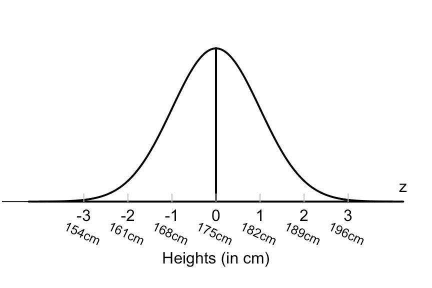

Understanding statistical models is crucial for algorithmic trading success. One of the most significant statistical tools used in financial markets is the Gaussian probability distribution, also known as the normal distribution. Characterized by its symmetric bell curve, the Gaussian distribution is foundational in representing real-world continuous data, such as asset returns and price variations, within the scope of financial systems. The prevalence of this distribution arises from the Central Limit Theorem, which states that the sum of a large number of independent and identically distributed random variables approximates a normal distribution, regardless of the original distribution's shape.

The implementation of Gaussian distributions in algorithmic trading permits a more structured approach to analyzing market trends and behaviors. This statistical model aids traders in risk management by providing insights into the volatility and stability of assets, crucial for crafting a resilient trading strategy. Tools based on the Gaussian model, such as Bollinger Bands, exploit the properties of normal distribution to delineate price oscillations and anticipate market movements.



However, while the Gaussian model provides substantial advantages, it also comes with certain limitations. Market data often deviates from a perfect normal distribution due to anomalies and unexpected events, which can lead to miscalculations of risk and volatility. As such, traders must exercise caution by complementing Gaussian-based models with other statistical tools and analyses to account for outliers and skewness.

By understanding the intricacies of Gaussian probability distributions, traders are equipped with a powerful analytical tool for making informed decisions. Leveraging this statistical approach helps to navigate the volatile nature of financial markets, ultimately leading to enhanced trading outcomes.

## Table of Contents

## What is a Gaussian Probability Distribution?

A Gaussian distribution, often referred to as a normal distribution, is a statistical model that describes how values of a variable are distributed. Its graph is characterized by a symmetrical bell-shaped curve, where most data points cluster around the central peak, known as the mean. This distribution is defined by two parameters: the mean (μ) and the standard deviation (σ).

The mean (μ) serves as the central value of the distribution, acting as the point where the highest number of observations are concentrated. In an ideal Gaussian distribution, the mean, median, and mode are identical, illustrating a perfect symmetry. This symmetry implies that 50% of the values lie below the mean and 50% above it.

The standard deviation (σ) is a measure that quantifies the amount of variation or [dispersion](/wiki/dispersion-trading) present within a dataset. A smaller standard deviation indicates that the data points tend to be close to the mean, while a larger standard deviation signifies that the data points are spread out over a wider range of values. Mathematically, the probability density function of a Gaussian distribution is expressed as:
$$

f(x \,|\, \mu, \sigma) = \frac{1}{\sigma \sqrt{2\pi}} \exp\left( -\frac{1}{2} \left(\frac{x - \mu}{\sigma}\right)^2 \right) 
$$
where $x$ represents the variable of interest, $\mu$ is the mean, and $\sigma$ is the standard deviation.

In financial markets, the normal distribution is frequently used to model the returns of assets and price movements. This application stems from the assumption that over the long run, the returns of financial instruments tend to hover around a normal distribution due to numerous small, independent factors influencing price changes. Although financial data often deviate from perfect normality, especially with the occurrence of extreme events, the Gaussian distribution remains a foundational tool for statistical modeling in finance. By applying this model, traders and analysts can make probabilistic assessments of asset behavior, aiding in risk evaluation and decision-making processes.

## Gaussian Models in Algo Trading

Algorithmic traders utilize Gaussian models as foundational tools to evaluate the probabilities of future market movements. The normal distribution's characteristic bell curve facilitates a statistical understanding of financial data, primarily through the calculation of means and standard deviations. Standard deviation, a measure of the amount of variation or dispersion in a set of values, is crucial in these models as it quantifies the [volatility](/wiki/volatility-trading-strategies) or risk associated with specific financial assets. High standard deviations imply greater volatility and, thus, a higher risk, while low standard deviations suggest stability and, presumably, lower risk.

Traders leverage these statistical insights by analyzing the deviation of closing prices from the mean. This analysis allows them to anticipate market volatility and make informed decisions. The mathematical formula for the standard deviation ($\sigma$) in a sample data set is:

$$
\sigma = \sqrt{\frac{1}{N}\sum_{i=1}^{N}(x_i - \mu)^2}
$$

where $N$ is the number of observations, $x_i$ are the individual data points, and $\mu$ is the mean of the data set.

Among the practical applications of Gaussian models in trading are technical analysis tools like Bollinger Bands. Developed by John Bollinger, these bands consist of a middle band, which is a moving average, and two outer bands, calculated as the standard deviation away from the moving average. The formula for Bollinger Bands can be expressed as:

$$
\text{Upper Band} = \text{MA} + k \times \sigma
$$
$$
\text{Lower Band} = \text{MA} - k \times \sigma
$$

where $\text{MA}$ is the moving average, $\sigma$ is the standard deviation, and $k$ is typically set to 2. Bollinger Bands help traders recognize potential price oscillations by showing moments when assets are overbought or oversold.

In summary, Gaussian models enable traders to quantify and interpret market volatility, providing strategic insights and predictive capabilities essential for [algorithmic trading](/wiki/algorithmic-trading). By incorporating these statistical models, traders can better position themselves to respond to market dynamics and optimize their investment strategies.

## Volatility and Risk Management

Gaussian distributions play a critical role in assessing volatility and managing risk in algorithmic trading. Volatility, a measure of the degree of variation in trading prices, is intrinsically linked to the standard deviation in a Gaussian distribution. A high standard deviation indicates significant price fluctuations, suggesting higher risk levels. Conversely, a lower standard deviation reflects smaller price changes, denoting less volatility and, hence, potentially lower risk.

Mathematically, standard deviation ($\sigma$) is defined as the square root of the variance ($\sigma^2$), where variance is the average of the squared differences from the mean ($\mu$):

$$
\sigma^2 = \frac{1}{N}\sum_{i=1}^{N}(X_i - \mu)^2
$$

$$
\sigma = \sqrt{\sigma^2}
$$

In financial markets, understanding these variations helps traders adjust their strategies to suit different risk profiles. For example, high volatility might prompt a trader to execute short-term trades to capitalize on swift price changes, while low volatility might encourage long-term investments.

Mean reversion is another crucial concept aided by Gaussian distributions in algorithmic trading. Mean reversion assumes that asset prices and returns eventually revert to their long-term mean or average level. Traders can use this insight as a signal for potential buying or selling. If a security's price deviates significantly from its historical mean, it might be considered overbought or oversold, suggesting possible market corrections.

Utilizing these statistical principles, traders develop algorithms to initiate trades based on these conditions. Risk management strategies thus become more robust by incorporating Gaussian distribution principles, allowing for informed decisions that align with individual risk tolerances and market conditions.

## Limitations of Gaussian Distributions

Real-world market data often present significant challenges to the idealized Gaussian distributions due to the presence of anomalies and outliers. Although Gaussian distributions are central to statistical modeling, assuming that financial data strictly adhere to such distributions can lead to inaccuracies in trading models. Market returns and prices frequently exhibit heavy tails and skewness, which are not captured by a normal distribution's symmetrical bell curve.

Skewness and kurtosis are statistical measures utilized to evaluate deviations from normality. Skewness indicates the degree of asymmetry in a distribution, while kurtosis measures the distribution's tail's heaviness compared to a Gaussian distribution. In financial markets, data might possess a positive skewness, indicating a longer right tail, or a negative skewness for a longer left tail. Similarly, high kurtosis signifies heavy tails, indicating a probability of extreme values that is higher than what would be predicted by a normal distribution. As such, a Gaussian model might underestimate the risk of extreme price movements, leading to potential misjudgments in risk management.

To accurately predict market behavior, traders often incorporate skewness and kurtosis into their models. This could involve using more complex distributions, such as the skew-normal distribution or the generalized hyperbolic distribution, which can better accommodate the skewed and heavy-tailed nature of financial data. Additionally, simulation techniques like Monte Carlo methods can be implemented to model market movements under varying assumptions of distributional forms.

In Python, for example, traders can use libraries like `scipy.stats` to analyze skewness and kurtosis:

```python
import numpy as np
from scipy.stats import skew, kurtosis

data = np.random.normal(0, 1, 1000)  # Sample data

skewness = skew(data)
kurt = kurtosis(data)

print(f"Skewness: {skewness}")
print(f"Kurtosis: {kurt}")
```

This code snippet demonstrates how to calculate skewness and kurtosis, offering insights into whether the data align with a Gaussian distribution or if adjustments must be made. Incorporating these measures ensures that trading strategies consider deviations from normality, allowing for more accurate risk assessments and market predictions.

## Applications Beyond Trading

Gaussian probability distributions extend beyond algorithmic trading to other areas in finance, such as fixed income securities, stock portfolios, and currency trading. The versatility of the Gaussian distribution is rooted in its theoretical foundation, providing a statistical model to quantify risk, expected returns, and price fluctuations across these financial instruments.

In fixed income securities, Gaussian distributions help in assessing the [interest rate](/wiki/interest-rate-trading-strategies) risk and bond price volatility. The yield changes of bonds can be modeled using normal distributions, facilitating the prediction of future price movements and interest rate scenarios. Traders can employ these models to inform duration and convexity analyses, enabling more informed decisions for bond portfolio management.

For stock portfolios, the normal distribution plays a pivotal role in portfolio optimization, specifically through the use of the Capital Asset Pricing Model (CAPM) and mean-variance optimization. Portfolio returns are often assumed to follow a normal distribution, allowing traders to calculate expected returns and standard deviations to optimize risk-return profiles. This approach underpins the Modern Portfolio Theory (MPT), where diversification across normally distributed assets can potentially reduce unsystematic risk in a portfolio.

Currency trading, or [forex](/wiki/forex-system), similarly benefits from Gaussian models by analyzing exchange rate movements. Short-term fluctuations in currency pairs are often modeled using normal distributions, giving traders insight into volatility measures and potential [arbitrage](/wiki/arbitrage) opportunities. The Efficient Market Hypothesis (EMH), which assumes that financial markets are informationally efficient partly due to normally distributed returns, is also applied in currency markets, aiding traders in strategy formulation.

The application of Gaussian distributions across these sectors exemplifies their utility in enhancing risk assessment and strategic diversification. Understanding and utilizing these statistical models empower traders to implement robust strategies across various financial instruments, optimizing their approaches to achieve desired outcomes while managing inherent risks.

## Conclusion

Mastering Gaussian probability distributions equips traders with a robust analytical framework for algorithmic trading. These distributions, with their idealized bell-shaped curves, offer valuable insights into the dynamics of price movements and market volatility. By leveraging the properties of Gaussian distributions, traders can make data-driven decisions, optimize trading strategies, and better anticipate market behavior.

However, it is crucial for traders to remain vigilant about the limitations of Gaussian models when applied to real-world financial data. Markets are influenced by a multitude of factors, leading to anomalies and outliers that do not conform to the assumptions of a normal distribution. Events such as financial crises, unexpected market news, or geopolitical incidents can induce skewness and kurtosis in data, deviating from the Gaussian ideal.

To mitigate these limitations, integrating a broader spectrum of statistical analysis tools is essential. Advanced models incorporating non-Gaussian distributions, such as skewed normal or Student's t-distributions, can accommodate the heavy tails and asymmetry often observed in financial returns. Additionally, incorporating [machine learning](/wiki/machine-learning) techniques, such as neural networks and decision trees, can further refine predictive capabilities.

Traders who balance the strategic use of Gaussian distributions with awareness of their potential pitfalls are well-positioned to enhance market predictions. By doing so, they can improve their decision-making processes, potentially increasing profitability and managing risk more effectively in algorithmic trading.

## References & Further Reading

[1]: Fama, E. F. (1970). ["Efficient Capital Markets: A Review of Theory and Empirical Work."](https://www.jstor.org/stable/2325486) Journal of Finance, 25(2), 383-417.

[2]: Mandelbrot, B., & Hudson, R. L. (2004). ["The (Mis)Behavior of Markets: A Fractal View of Risk, Ruin, and Reward."](https://www.semanticscholar.org/paper/The-Misbehavior-of-Markets:-A-Fractal-View-of-Risk,-Mandelbrot-Hudson/2f82413d3e42b846175e560deabbb454ac015886) Basic Books.

[3]: Bollinger, J. (1992). ["Bollinger on Bollinger Bands."](https://books.google.com/books/about/Bollinger_on_Bollinger_Bands.html?id=MVrJdo8VOnIC) McGraw-Hill.

[4]: Taleb, N. N. (2007). ["The Black Swan: The Impact of the Highly Improbable."](https://en.wikipedia.org/wiki/The_Black_Swan:_The_Impact_of_the_Highly_Improbable) Random House.

[5]: Jorion, P. (2007). ["Value at Risk: The New Benchmark for Managing Financial Risk."](https://link.springer.com/article/10.1007/s11408-007-0057-3) McGraw-Hill.

[6]: Cont, R. (2001). ["Empirical Properties of Asset Returns: Stylized Facts and Statistical Issues."](https://www.tandfonline.com/doi/abs/10.1080/713665670) Quantitative Finance, 1(2), 223-236.

[7]: Hull, J. C. (2015). ["Options, Futures, and Other Derivatives."](https://www.semanticscholar.org/paper/Options%2C-Futures%2C-and-Other-Derivatives-Hull/89bdee500c8623864fc9eb7a471546aa713acc44) Pearson Education.

[8]: Wilmott, P. (2006). ["Paul Wilmott Introduces Quantitative Finance."](https://www.wiley.com/en-us/Paul+Wilmott+Introduces+Quantitative+Finance,+2nd+Edition-p-9781118836798) Wiley.