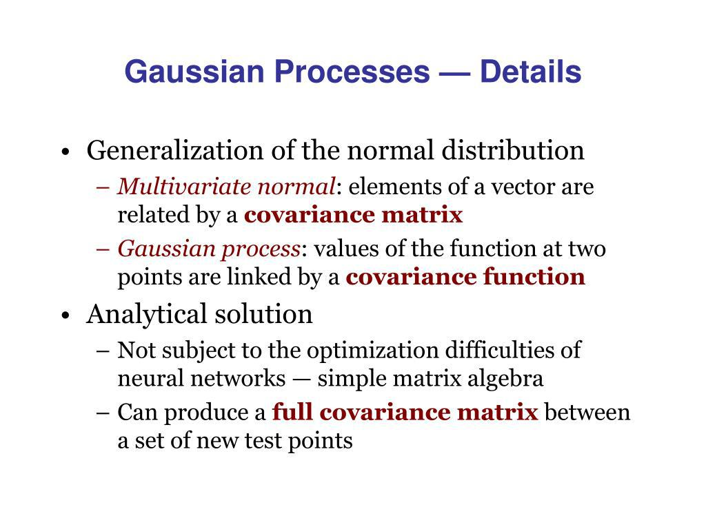

In algorithmic trading, mathematical models play a vital role in enabling traders to make informed decisions by systematically analyzing market data. Gaussian processes, a non-parametric and probabilistic modeling approach, have gained prominence as a powerful tool in this domain. They are particularly effective for modeling complex financial data, providing an ability to quantify uncertainties and improve prediction accuracy.

This article provides a detailed examination of the application and advantages of Gaussian processes in algorithmic trading. By offering a probabilistic perspective, Gaussian processes allow for more nuanced predictions of market movements, accommodating the inherent uncertainties in financial markets. This approach is in contrast to traditional parametric models, which may not capture all the intricacies of financial data.



Traders who comprehend and implement Gaussian processes within their trading strategies are positioned to gain a competitive edge. The flexibility and probabilistic nature of these processes enable the creation of more adaptive and responsive trading algorithms. This article will discuss fundamental concepts, elucidating how Gaussian processes can enhance trading strategies. By the conclusion, readers will possess a clear understanding of the benefits and practical applications of Gaussian processes in the context of algorithmic trading, preparing them to leverage this sophisticated tool for strategic advantage.

## Table of Contents

## What are Gaussian Processes?

Gaussian processes represent a non-parametric approach in statistics, deployed for prediction tasks based on probability distributions. Unlike parametric models that assume a fixed number of parameters, Gaussian processes do not require a predetermined functional form to begin with, enabling them to model complex and unknown functions with inherent uncertainties. This characteristic makes them particularly useful for uncertainty quantification, which is vital in trading landscapes where volatility and unpredictable events are common.

At the core of Gaussian processes is the idea of predicting a continuous spectrum of potential outcomes rather than a singular prediction. This probabilistic outcome is advantageous when dealing with financial market predictions, where multiple scenarios must be considered. In essence, a Gaussian process can be defined as a collection of random variables, any finite number of which have joint Gaussian distributions. This characteristic allows Gaussian processes to provide a full distribution over possible functions that fit a given set of data points.

The primary components of Gaussian processes are the mean function, denoted as $m(x)$, and the covariance function, also known as the kernel, represented by $k(x, x')$. These functions encapsulate the properties of the data:

- The mean function $m(x)$ typically represents the expected value of the function at any point $x$, and it is often set to zero if there is no strong prior belief about the function's mean.

- The covariance function $k(x, x')$ describes the relationship between different points in the input space, capturing the notions of smoothness, periodicity, linearity, or any other assumed structure in the data. For instance, the squared exponential (or radial basis function) kernel, frequently used due to its smoothness properties, is given by:
$$
  k(x, x') = \sigma^2_f \exp\left(-\frac{(x - x')^2}{2l^2}\right)

$$

  where $\sigma^2_f$ is the variance and $l$ is the length-scale parameter.

Understanding and appropriately selecting or customizing these functions is crucial for refining predictive models to align with specific trading scenarios. These functions fundamentally determine the behavior and flexibility of the Gaussian process in representing unknown functions, impacting the accuracy and reliability of predictions.

In Python, Gaussian processes can be implemented using libraries such as "scikit-learn" or "GPy". A basic implementation involves specifying the kernel and fitting it to training data to make predictions:

```python
from sklearn.gaussian_process import GaussianProcessRegressor
from sklearn.gaussian_process.kernels import RBF

# Define kernel with specific parameters
kernel = RBF(length_scale=1.0)

# Instantiate GaussianProcess with the defined kernel
gp = GaussianProcessRegressor(kernel=kernel)

# Fit the model to the data
gp.fit(X_train, y_train)

# Make predictions
y_pred, sigma = gp.predict(X_test, return_std=True)
```

Using such an implementation allows the derivation of predictive distributions, equipping traders with insights into different financial instruments and market trends, thus optimizing their strategies and decision-making processes.

## Benefits of Using Gaussian Processes in Trading

Gaussian processes offer a robust method to handle the complexities and uncertainties that characterize financial markets. Unlike traditional parametric models, Gaussian processes provide a flexible framework, allowing for a more accurate and adaptable approach to modeling.

The key advantage of Gaussian processes lies in their use of the covariance function. This function enables traders to understand the relationships and correlations between different financial instruments, which is crucial for dynamic portfolio management and risk assessment. The covariance function essentially acts as a guide, indicating how changes in one financial instrument might influence another.

One of the significant benefits of using Gaussian processes in trading is their ability to predict price movements along with an accompanying confidence interval. This probabilistic nature is particularly valuable for risk management, as it equips traders with a range of possible future scenarios rather than relying on a single-point estimate. By evaluating predictions with a confidence interval, traders can better manage risks and make informed decisions about when to enter or [exit](/wiki/exit-strategy) markets. For example, a trader might use the following Python code to estimate the expected price movement of a stock and its confidence interval:

```python
import numpy as np
from sklearn.gaussian_process import GaussianProcessRegressor
from sklearn.gaussian_process.kernels import RBF, ConstantKernel as C

# Sample data: X is the day index, y is the stock price
X = np.array([[1], [2], [3], [4]])
y = np.array([200, 210, 215, 222])

# Define kernel
kernel = C(1.0, (1e-3, 1e3)) * RBF(1.0, (1e-3, 1e3))

# Create and fit Gaussian Process model
gp = GaussianProcessRegressor(kernel=kernel, n_restarts_optimizer=10)
gp.fit(X, y)

# Predict the stock price and its confidence interval for the 5th day
X_pred = np.array([[5]])
y_pred, sigma = gp.predict(X_pred, return_std=True)

print(f"Predicted stock price: {y_pred[0]} with confidence interval: ±{sigma[0]}")
```

Furthermore, the probabilistic approach of Gaussian processes is invaluable for decision-making. Instead of relying on deterministic forecasts, traders are presented with a spectrum of potential outcomes, which enhances their ability to craft strategies that are resilient to different market conditions. This flexibility and predictive capability make Gaussian processes an essential tool for those looking to navigate the uncertainties of financial markets effectively.

## Applications of Gaussian Processes in Algorithmic Trading

Gaussian processes serve as a versatile tool in [algorithmic trading](/wiki/algorithmic-trading), particularly in time-series forecasting, which is essential for anticipating future market trends. These processes allow traders to construct models capable of predicting stock prices and returns with a level of precision and adaptability that surpasses traditional methods.

In a practical setting, Gaussian processes are utilized to refine the parameters of trading algorithms. The optimization of these parameters is critical for enhancing the overall performance of trading strategies. By employing Gaussian processes, traders can adjust their strategies in accordance with the probabilistic predictions these models offer, ensuring that the trading approach is better aligned with the dynamic nature of financial markets.

The flexibility of Gaussian processes also enables the development of trading strategies that are responsive to market signals and data anomalies. For instance, by leveraging the probabilistic predictions provided by Gaussian processes, traders can design adaptive strategies that not only respond to current market conditions but also anticipate potential shifts. This adaptability is crucial in a landscape characterized by [volatility](/wiki/volatility-trading-strategies) and rapid changes.

Moreover, Gaussian processes facilitate a proactive approach in trading strategies. They empower traders to preemptively respond to market anomalies by offering a comprehensive set of potential outcomes. This is achieved through the calculation of confidence intervals, which provide insights into the range of possible scenarios, thus aiding in better risk management and decision-making processes.

In summary, the integration of Gaussian processes in algorithmic trading systems enhances the prediction and optimization capabilities, ensuring that strategies are both robust and adaptable. This positions traders to gain a significant competitive advantage by allowing them to make informed decisions based on sophisticated, probabilistic models that accommodate the complexities of financial markets.

## Challenges of Implementing Gaussian Processes

Implementing Gaussian processes (GPs) within the domain of algorithmic trading presents several challenges that primarily stem from the intricate nature of financial data and the computational demands associated with advanced statistical modeling. One of the primary challenges is the computational intensity required due to the large dataset processing that GPs necessitate. The core of Gaussian process regression involves operations on matrices, including inversion and determinant calculations, which scale cubically with the number of data points. This can be represented mathematically as an operation cost of $O(n^3)$, where $n$ is the number of data points, thus becoming a bottleneck when handling large financial datasets.

Another significant hurdle is the tuning of model parameters to align with the constantly evolving dynamics of financial markets. Gaussian processes rely on hyperparameters within the covariance function, which dictate the nature of the predictions. Selecting an appropriate covariance function, or kernel, like the Radial Basis Function (RBF) or Matérn kernel, is crucial as it directly affects the model's accuracy. Expert knowledge is needed to fine-tune these hyperparameters, ensuring the model remains robust under different market conditions.

Scalability is also a pressing issue. The computational load of GPs makes them less suited for real-time trading applications, where decisions must be made swiftly to capitalize on rapid market movements. The real-time implementation of GPs can be hindered by the speed of computation lagging behind market changes, limiting their practicality in high-frequency trading scenarios where execution speed is vital.

Despite these challenges, GPs offer substantial potential benefits in terms of improved predictive accuracy, thanks to their probabilistic nature and flexibility. They can model uncertainties and provide confidence intervals for predictions, a significant advantage over traditional deterministic approaches. As such, while the computational and technical challenges are non-trivial, many traders find that the enhanced predictive capabilities justify the effort involved in implementing GPs, prompting ongoing research and development efforts aimed at overcoming these barriers.

## Conclusion

Gaussian processes provide a comprehensive and flexible framework for modeling and predicting financial markets through their probabilistic nature. By accounting for uncertainties inherent in market predictions, these processes empower traders to make more informed and strategic decisions. The probabilistic approach allows for the modeling of a range of possible market outcomes, equipping traders with a better understanding of the risks and opportunities that may arise in financial trading.

Despite computational and technical hurdles, such as high computational demands and challenges in parameter tuning, mastering Gaussian processes can result in a considerable competitive edge. The careful application of kernel functions and hyperparameter optimization within Gaussian processes can lead to improved predictive accuracy, ultimately enhancing trading performance.

Further research and development in Gaussian processes hold the promise of greater applicability and efficiency in algorithmic trading. Emerging methodologies in Gaussian processes, such as scalable approximations and advanced kernel designs, are poised to enhance their utility in real-time trading environments where rapid response to market changes is crucial.

Traders and financial analysts are encouraged to incorporate Gaussian processes into their analytical toolbox. By doing so, they can develop robust strategies that not only adapt to evolving market conditions but also leverage the probabilistic insights offered by Gaussian processes. This integration can be a powerful tool for those seeking to refine their algorithmic trading strategies and gain an upper hand in the financial markets.

## References & Further Reading

[1]: Rasmussen, C. E., & Williams, C. K. I. (2006). ["Gaussian Processes for Machine Learning."](https://direct.mit.edu/books/monograph/2320/Gaussian-Processes-for-Machine-Learning) MIT Press.

[2]: Murphy, K. P. (2012). ["Machine Learning: A Probabilistic Perspective."](https://www.cs.ubc.ca/~murphyk/MLbook/pml-toc-1may12.pdf) MIT Press.

[3]: MacKay, D. J. C. (1998). ["Introduction to Gaussian Processes."](https://typeset.io/papers/introduction-to-gaussian-processes-4vza7hprb6) In Bishop, C. M. (Ed.), Neural Networks and Machine Learning, Springer.

[4]: ["Gaussian Processes for Time-Series Forecasting"](https://juanitorduz.github.io/gp_ts_pymc3/) by Roberts, S. J., Osborne, M., Ebden, M., Reece, S., Gibson, N., & Aigrain, S. (2013), International Journal of Forecasting.

[5]: ["Probabilistic Machine Learning and Artificial Intelligence"](https://www.nature.com/articles/nature14541) by Kevin Murphy, 2022, Nature.

[6]: Williams, C. K. I. (1998). ["Computation with Infinite Networks."](https://proceedings.neurips.cc/paper/1197-computing-with-infinite-networks.pdf) Neural Computation.

[7]: ["Advances in Financial Machine Learning"](https://www.amazon.com/Advances-Financial-Machine-Learning-Marcos/dp/1119482089) by Marcos Lopez de Prado.

[8]: Rasmussen, C. E. (1996). ["Evaluation of Gaussian Processes and Other Methods for Non-Linear Regression"](https://mlg.eng.cam.ac.uk/pub/pdf/Ras96b.pdf) in Neural Information Processing Systems 9. 

[9]: ["Bayesian Reasoning and Machine Learning"](https://github.com/snowdj/CS228_PGM/blob/master/books/Bayesian%20Reasoning%20and%20Machine%20Learning%20by%20David%20Barber.pdf) by David Barber, Cambridge University Press, 2012.

[10]: Bishop, C. M. (2006). ["Pattern Recognition and Machine Learning."](https://link.springer.com/book/9780387310732) Springer.