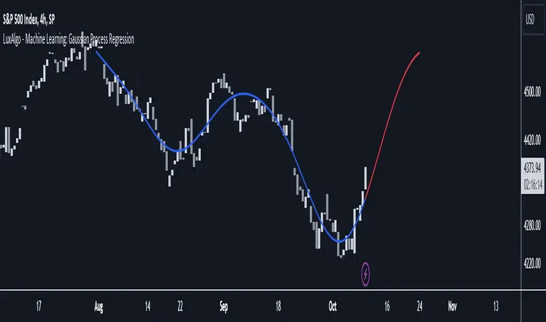

## Table of Contents

## What are Gaussian processes and how do they work?

Gaussian processes are a type of machine learning model used for regression and classification tasks. They are based on the idea of using a collection of random variables, which have a Gaussian (or normal) distribution. Imagine you have a bunch of data points, and you want to predict new points. Gaussian processes help by creating a smooth function that fits your data, and they do this by assuming that any set of points you pick from this function will follow a Gaussian distribution.

The way Gaussian processes work is by using something called a kernel function. This kernel function measures how similar two data points are to each other. When you want to make a prediction at a new point, the Gaussian process looks at how similar this new point is to all your existing data points. It then uses these similarities to create a weighted average of the known data points, which gives you the prediction. This process also gives you a measure of uncertainty, so you know how confident the prediction is. This makes Gaussian processes very useful in fields like engineering and environmental science, where understanding uncertainty is important.

## How can Gaussian processes be applied to financial markets?

Gaussian processes can be used in financial markets to predict things like stock prices or market trends. Imagine you have data on how a stock has moved in the past. You can use a Gaussian process to create a model that looks at this past data and tries to guess where the stock price might go next. The model does this by figuring out how similar today's situation is to past situations and using that information to make a prediction. This can help traders and investors make better decisions about when to buy or sell stocks.

Another way Gaussian processes can be helpful is in understanding the risk of different investments. Because Gaussian processes give you not just a prediction but also a measure of how certain that prediction is, they can help you see how risky an investment might be. For example, if the model says a stock might go up but is very uncertain about it, that might be a riskier investment than one where the model is more confident. This kind of information is really useful for managing a portfolio and making sure you're not taking on too much risk.

## What are the basic assumptions when using Gaussian processes in trading?

When using Gaussian processes in trading, one basic assumption is that the data you're looking at, like stock prices, follows a pattern that can be modeled with a Gaussian distribution. This means that the model expects the data to have a bell-shaped curve, where most of the time the stock prices will be close to the average, and it's less common for them to be really high or really low. This assumption helps the model make predictions about where the stock price might go next based on how it has moved in the past.

Another assumption is that the relationships between different data points, like how today's stock price relates to yesterday's, can be captured by a kernel function. This function measures how similar two points in time are to each other. The model uses these similarities to figure out how much weight to give to past data when making a prediction about the future. This helps the model create a smooth prediction that takes into account the whole history of the stock's movements.

## How do you select and optimize the kernel function for trading applications?

When you're using Gaussian processes for trading, [picking](/wiki/asset-class-picking) the right kernel function is really important. The kernel function is like a tool that helps the model figure out how similar two data points are. For trading, you might start with a simple kernel like the squared exponential kernel because it's good at capturing smooth patterns in stock prices. But if your data has more complex patterns, you might need a different kernel. You can try out different kernels like the Matérn kernel or the periodic kernel to see which one fits your data best. It's a bit like trying on different hats to see which one looks good on you.

Once you've picked a few kernels to try, you need to optimize them. This means adjusting the parameters of the kernel so that the model makes the best predictions possible. You can do this by using a method called cross-validation, where you split your data into parts, use some of it to train the model, and then see how well it predicts the rest. You keep tweaking the kernel's parameters until you find the settings that give you the best predictions. It's like tuning a guitar to make sure it sounds just right. By carefully choosing and optimizing your kernel, you can make your Gaussian process model better at predicting stock prices and helping with trading decisions.

## What are the advantages of using Gaussian processes over other machine learning methods in trading?

One big advantage of using Gaussian processes in trading is that they give you a prediction and also tell you how sure they are about it. This is really helpful in trading because knowing how risky a prediction is can help you make better decisions. For example, if the model says a stock might go up but it's not very sure, you might decide to wait and see before buying. Other [machine learning](/wiki/machine-learning) methods might just give you a prediction without telling you how confident they are, which can make it harder to manage risk.

Another advantage is that Gaussian processes are good at working with small amounts of data. In trading, you might not always have a lot of historical data to work with, especially for new stocks or markets. Gaussian processes can still make good predictions even when you don't have a lot of data, which is something that other methods like neural networks might struggle with. This makes Gaussian processes a flexible tool for traders who need to make quick decisions based on limited information.

## How can Gaussian processes help in predicting stock prices or market trends?

Gaussian processes can help predict stock prices or market trends by looking at past data and figuring out patterns. Imagine you have a bunch of data on how a stock has moved in the past. A Gaussian process model can use this data to guess where the stock price might go next. It does this by figuring out how similar today's situation is to past situations and using that information to make a prediction. This is like looking at a map of where you've been to guess where you might go next.

Another way Gaussian processes are helpful is that they tell you how sure they are about their predictions. This is really important in trading because it helps you understand how risky a prediction might be. If the model says a stock might go up but it's not very sure, you might decide to wait and see before buying. This extra information about uncertainty can help traders make better decisions and manage their risks more carefully.

## What are the common challenges and limitations when applying Gaussian processes in trading?

One big challenge when using Gaussian processes in trading is that they can be slow. If you have a lot of data, like many years of stock prices, it can take a long time for the model to make predictions. This can be a problem in trading where things move fast and you need quick decisions. Another challenge is that Gaussian processes assume that the data follows a normal distribution, which might not always be true for stock prices. Sometimes stock prices can jump around a lot more than a normal distribution would expect, which can make the model's predictions less accurate.

Another limitation is that Gaussian processes can struggle with really complex patterns. If the stock market is doing something unusual or if there are a lot of sudden changes, the model might have a hard time figuring it out. This means you might need to keep tweaking the model or trying different kernels to get better results. Also, while Gaussian processes are good at telling you how sure they are about their predictions, they still need a lot of careful work to make sure they're set up right. If you don't pick the right kernel or if you don't optimize it well, your predictions might not be very good.

## How do you handle non-stationarity in time series data using Gaussian processes?

When you're trying to predict stock prices or other things that change over time, you might run into a problem called non-stationarity. This means that the patterns in your data aren't staying the same over time. For example, a stock might start moving in a new way because of a big news event. Gaussian processes can struggle with this because they usually assume that the patterns they see will keep happening in the future. But don't worry, there are ways to handle this.

One way to deal with non-stationarity is by using something called a time-dependent kernel. This special kernel can change over time, so it can capture how the patterns in your data are also changing. It's like having a flexible ruler that can bend to fit the shape of your data. By using this kind of kernel, you can make your Gaussian process model better at predicting things even when the patterns are shifting. Another way is to break your data into smaller chunks and use a separate Gaussian process for each chunk. This way, each model can focus on a smaller piece of time where the patterns are more likely to stay the same. It's like solving a big puzzle by working on smaller pieces one at a time.

## Can you explain how to implement Gaussian processes for portfolio optimization?

Gaussian processes can be used for portfolio optimization by helping you predict how different investments might perform in the future. Imagine you have a bunch of stocks and you want to figure out the best way to mix them in your portfolio. You can use past data on how these stocks have moved to train a Gaussian process model. This model will then predict how each stock might move in the future, and it will also tell you how sure it is about those predictions. By looking at these predictions and their uncertainties, you can figure out which stocks to include in your portfolio and how much of each to buy. This helps you balance the potential rewards with the risks, so you can make a portfolio that fits your goals.

Another way Gaussian processes can help with portfolio optimization is by figuring out how different stocks move together. This is called correlation, and it's important because if all your stocks move in the same way, your portfolio might be riskier than you think. A Gaussian process can look at past data to see how stocks have moved together and predict how they might move together in the future. By understanding these correlations, you can pick stocks that don't all move the same way, which can help you spread out your risk. This makes your portfolio more stable and less likely to lose a lot of value all at once.

## What role do Gaussian processes play in risk management within trading strategies?

Gaussian processes play an important role in risk management within trading strategies by helping traders understand how certain their predictions are. When you're trading, it's not just about guessing where stock prices will go; it's also about knowing how risky those guesses are. Gaussian processes give you a prediction and also tell you how sure they are about it. This is really helpful because if the model says a stock might go up but it's not very sure, you might decide to wait and see before buying. This way, you can make better decisions about when to take risks and when to play it safe.

Another way Gaussian processes help with risk management is by figuring out how different stocks move together. This is called correlation, and it's important because if all your stocks move in the same way, your portfolio might be riskier than you think. A Gaussian process can look at past data to see how stocks have moved together and predict how they might move together in the future. By understanding these correlations, you can pick stocks that don't all move the same way, which can help you spread out your risk. This makes your portfolio more stable and less likely to lose a lot of value all at once.

## How can one integrate Gaussian processes with other quantitative trading techniques?

Gaussian processes can be combined with other [quantitative trading](/wiki/quantitative-trading) techniques to make better predictions and manage risk more effectively. For example, you might use Gaussian processes to predict stock prices and then use another method like a decision tree to decide when to buy or sell based on those predictions. The Gaussian process gives you a prediction and tells you how sure it is about that prediction, which can help the decision tree make smarter choices. This way, you're using the strengths of both methods: the Gaussian process for its good predictions and uncertainty estimates, and the decision tree for its ability to make clear decisions.

Another way to integrate Gaussian processes with other techniques is by using them alongside statistical [arbitrage](/wiki/arbitrage) strategies. In [statistical arbitrage](/wiki/statistical-arbitrage), you look for patterns in how different stocks move together and try to make money from those patterns. Gaussian processes can help by predicting how these stocks might move in the future and how sure they are about those predictions. You can then use this information to fine-tune your arbitrage strategy, making it more likely to succeed. By combining Gaussian processes with other methods, you can create a trading system that's more powerful and better at handling the ups and downs of the market.

## What are the latest research developments in using Gaussian processes for advanced trading strategies?

In recent years, researchers have been exploring new ways to use Gaussian processes to make trading strategies even better. One big development is using something called deep Gaussian processes. These are like regular Gaussian processes but with extra layers that help them understand really complex patterns in the data. Imagine you're trying to predict stock prices that are influenced by lots of different things, like news events or economic reports. Deep Gaussian processes can look at all these factors and figure out how they work together to affect the stock price. This can lead to more accurate predictions and help traders make better decisions.

Another exciting area of research is combining Gaussian processes with [reinforcement learning](/wiki/reinforcement-learning). Reinforcement learning is a way of teaching a computer to make decisions by trying different things and learning from the results. By using Gaussian processes to predict how the market might move and then using reinforcement learning to decide what to do next, researchers are creating trading systems that can adapt to new situations. This is really helpful in the fast-changing world of trading, where being able to quickly adjust to new information can make a big difference. These new approaches are helping traders stay ahead of the game by using the latest technology to make smarter and more flexible trading strategies.

## What are Gaussian Processes?

Gaussian processes represent a non-parametric approach in [statistics](/wiki/bayesian-statistics), deployed for prediction tasks based on probability distributions. Unlike parametric models that assume a fixed number of parameters, Gaussian processes do not require a predetermined functional form to begin with, enabling them to model complex and unknown functions with inherent uncertainties. This characteristic makes them particularly useful for uncertainty quantification, which is vital in trading landscapes where [volatility](/wiki/volatility-trading-strategies) and unpredictable events are common.

At the core of Gaussian processes is the idea of predicting a continuous spectrum of potential outcomes rather than a singular prediction. This probabilistic outcome is advantageous when dealing with financial market predictions, where multiple scenarios must be considered. In essence, a Gaussian process can be defined as a collection of random variables, any finite number of which have joint Gaussian distributions. This characteristic allows Gaussian processes to provide a full distribution over possible functions that fit a given set of data points.

The primary components of Gaussian processes are the mean function, denoted as $m(x)$, and the covariance function, also known as the kernel, represented by $k(x, x')$. These functions encapsulate the properties of the data:

- The mean function $m(x)$ typically represents the expected value of the function at any point $x$, and it is often set to zero if there is no strong prior belief about the function's mean.

- The covariance function $k(x, x')$ describes the relationship between different points in the input space, capturing the notions of smoothness, periodicity, linearity, or any other assumed structure in the data. For instance, the squared exponential (or radial basis function) kernel, frequently used due to its smoothness properties, is given by:
$$
  k(x, x') = \sigma^2_f \exp\left(-\frac{(x - x')^2}{2l^2}\right)

$$

  where $\sigma^2_f$ is the variance and $l$ is the length-scale parameter.

Understanding and appropriately selecting or customizing these functions is crucial for refining predictive models to align with specific trading scenarios. These functions fundamentally determine the behavior and flexibility of the Gaussian process in representing unknown functions, impacting the accuracy and reliability of predictions.

In Python, Gaussian processes can be implemented using libraries such as "scikit-learn" or "GPy". A basic implementation involves specifying the kernel and fitting it to training data to make predictions:

```python
from sklearn.gaussian_process import GaussianProcessRegressor
from sklearn.gaussian_process.kernels import RBF

# Define kernel with specific parameters
kernel = RBF(length_scale=1.0)

# Instantiate GaussianProcess with the defined kernel
gp = GaussianProcessRegressor(kernel=kernel)

# Fit the model to the data
gp.fit(X_train, y_train)

# Make predictions
y_pred, sigma = gp.predict(X_test, return_std=True)
```

Using such an implementation allows the derivation of predictive distributions, equipping traders with insights into different financial instruments and market trends, thus optimizing their strategies and decision-making processes.

## References & Further Reading

[1]: Rasmussen, C. E., & Williams, C. K. I. (2006). ["Gaussian Processes for Machine Learning."](https://direct.mit.edu/books/monograph/2320/Gaussian-Processes-for-Machine-Learning) MIT Press.

[2]: Murphy, K. P. (2012). ["Machine Learning: A Probabilistic Perspective."](https://www.cs.ubc.ca/~murphyk/MLbook/pml-toc-1may12.pdf) MIT Press.

[3]: MacKay, D. J. C. (1998). ["Introduction to Gaussian Processes."](https://typeset.io/papers/introduction-to-gaussian-processes-4vza7hprb6) In Bishop, C. M. (Ed.), Neural Networks and Machine Learning, Springer.

[4]: ["Gaussian Processes for Time-Series Forecasting"](https://juanitorduz.github.io/gp_ts_pymc3/) by Roberts, S. J., Osborne, M., Ebden, M., Reece, S., Gibson, N., & Aigrain, S. (2013), International Journal of Forecasting.

[5]: ["Probabilistic Machine Learning and Artificial Intelligence"](https://www.nature.com/articles/nature14541) by Kevin Murphy, 2022, Nature.

[6]: Williams, C. K. I. (1998). ["Computation with Infinite Networks."](https://proceedings.neurips.cc/paper/1197-computing-with-infinite-networks.pdf) Neural Computation.

[7]: ["Advances in Financial Machine Learning"](https://www.amazon.com/Advances-Financial-Machine-Learning-Marcos/dp/1119482089) by Marcos Lopez de Prado.

[8]: Rasmussen, C. E. (1996). ["Evaluation of Gaussian Processes and Other Methods for Non-Linear Regression"](https://mlg.eng.cam.ac.uk/pub/pdf/Ras96b.pdf) in Neural Information Processing Systems 9. 

[9]: ["Bayesian Reasoning and Machine Learning"](https://github.com/snowdj/CS228_PGM/blob/master/books/Bayesian%20Reasoning%20and%20Machine%20Learning%20by%20David%20Barber.pdf) by David Barber, Cambridge University Press, 2012.

[10]: Bishop, C. M. (2006). ["Pattern Recognition and Machine Learning."](https://link.springer.com/book/9780387310732) Springer.